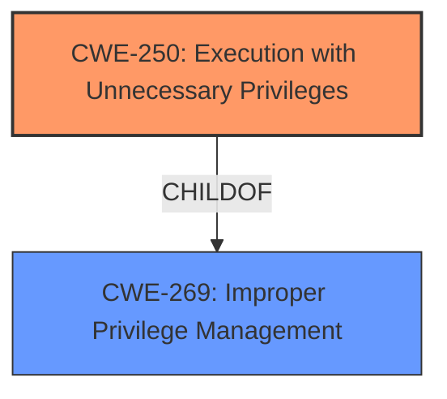

# Enhanced Analysis for CVE-2021-0255

# Summary
| CWE ID  | CWE Name                                                     | Confidence | CWE Abstraction Level | CWE Vulnerability Mapping Label | CWE-Vulnerability Mapping Notes |
| :-------- | :----------------------------------------------------------- | :--------- | :---------------------- | :------------------------------ | :------------------------------ |
| CWE-250   | Execution with Unnecessary Privileges                      | 0.9        | Base                    | Primary                         | Allowed                       |
| CWE-269   | Improper Privilege Management                                | 0.6        | Class                   | Secondary                       | Discouraged                    |

## Evidence and Confidence

*   **Confidence Score:** 0.8
*   **Evidence Strength:** MEDIUM

## Relationship Analysis
The primary relationship influencing the decision is the hierarchical relationship between CWE-269 (Improper Privilege Management) and its child CWE-250 (Execution with Unnecessary Privileges). CWE-250 is a more specific case of CWE-269, where the program runs with higher privileges than necessary.



## Vulnerability Chain
The vulnerability chain is relatively simple: The program `ethtraceroute` is setuid root, meaning it executes with elevated privileges. This **unnecessary privilege** allows a local user to **escalate their privileges** and write to the local filesystem as root.

## Summary of Analysis
Initially, both CWE-250 and CWE-269 were considered due to the **local privilege escalation** aspect of the vulnerability. However, CWE-250 (Execution with Unnecessary Privileges) is a more precise match because the `ethtraceroute` program is explicitly shipped with setuid permissions, granting it root privileges that are not always necessary for its operation. This directly aligns with the description of CWE-250: "The product performs an operation at a privilege level that is higher than the minimum level required." The evidence supporting this decision is "ethtraceroute is shipped with setuid permissions enabled and is owned by the root user, allowing local users to run ethtraceroute with root privileges." CWE-269 is a more general case of improper privilege management, while CWE-250 pinpoints the specific issue of unnecessary privileges.

CWE-269, while relevant, is discouraged for direct mapping when more specific CWEs are available. The retriever results also list CWE-250 with a higher score, further supporting its selection as the primary CWE. The "Mapping Guidance" for CWE-269 explicitly advises against its use when the root cause seems directly related to privileges and suggests examining children such as CWE-250.

Other CWEs considered (but not selected):

*   CWE-754 (Improper Check for Unusual or Exceptional Conditions): This is not the primary issue. The vulnerability is not directly related to checking for unusual conditions, but rather to the fact that the program is running with elevated privileges in the first place.
*   CWE-401 (Missing Release of Memory after Effective Lifetime): This is not related to memory management issues.
* CWE-770, CWE-789, CWE-606, CWE-1286, CWE-1285, CWE-400, CWE-390 are all related to resource management or input validation, which is not the root cause of this vulnerability.

Therefore, CWE-250 is the most appropriate and specific CWE for this vulnerability.

Relevant CWE Information:

# Enhanced Context (25 CWEs)

## CWE-250: Execution with Unnecessary Privileges
**Abstraction Level**: Base
**Similarity Score**: 5510.04
**Source**: sparse

**Description**:
The product performs an operation at a privilege level that is higher than the minimum level required, which creates new weaknesses or amplifies the consequences of other weaknesses.

**Mapping Guidance**:
- Usage: Allowed
- Rationale: This CWE entry is at the Base level of abstraction, which is a preferred level of abstraction for mapping to the root causes of vulnerabilities.


## CWE Relationship Analysis

Current CWEs represent these abstraction levels: .


### Vulnerability Chain Analysis

**Chain starting from CWE-754:**
- 754 (Improper Check for Unusual or Exceptional Conditions) - ROOT


**Chain starting from CWE-1286:**
- 1286 (Improper Validation of Syntactic Correctness of Input) - ROOT


### CWE Relationship Diagram

```mermaid
graph TD
    classDef primary fill:#f96,stroke:#333,stroke-width:2px
    classDef secondary fill:#69f,stroke:#333
    classDef tertiary fill:#9e9,stroke:#333
```