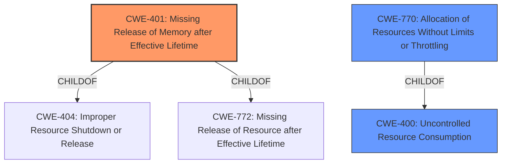

# Analysis for CVE-2021-0257

# Summary
| CWE ID | CWE Name | Confidence | CWE Abstraction Level | CWE Vulnerability Mapping Label | CWE-Vulnerability Mapping Notes |
|---|---|---|---|---|---|
| CWE-401 | Missing Release of Memory after Effective Lifetime | 0.9 | Variant | Allowed | Primary CWE |
| CWE-770 | Allocation of Resources Without Limits or Throttling | 0.6 | Base | Allowed | Secondary Candidate |
| CWE-400 | Uncontrolled Resource Consumption | 0.5 | Class | Discouraged | Secondary Candidate |

## Evidence and Confidence

*   **Confidence Score:** 0.9
*   **Evidence Strength:** HIGH

## Relationship Analysis
The primary CWE is CWE-401, a variant of CWE-404 (Improper Resource Shutdown or Release) and CWE-772 (Missing Release of Resource after Effective Lifetime). CWE-401 accurately reflects the **memory leak** issue. CWE-770 (Allocation of Resources Without Limits or Throttling) is a child of CWE-400 (Uncontrolled Resource Consumption), representing a broader class of resource management issues.

## Vulnerability Chain
The vulnerability chain starts with **Layer 2 network events at Customer Edge (CE) devices** which leads to **memory leaks in the MPC of Provider Edge (PE) devices (CWE-401)** resulting in an **out of memory condition** and **MPC restart** which causes **temporary traffic interruption**.

## Summary of Analysis
The primary weakness is a **memory leak**, triggered by specific network events, leading to resource exhaustion and service interruption. The analysis is strongly based on the provided evidence, particularly the "Vulnerability Description Key Phrases" section, which explicitly mentions the **memory leak**.

> **rootcause:** **Certain Layer 2 network events at Customer Edge (CE) devices may cause memory leaks in the MPC of Provider Edge (PE) devices.**
> **weakness:** **Memory leak in the MPC**

CWE-401 (Missing Release of Memory after Effective Lifetime) is the most specific and accurate representation of the vulnerability, classifying it as a Variant level weakness which is the preferred level of abstraction for root cause analysis.

Other CWEs Considered:

*   CWE-400 (Uncontrolled Resource Consumption): Considered but deemed too general. While the **memory leak** leads to resource exhaustion, CWE-401 more precisely captures the root cause. The mapping guidance for CWE-400 also discourages its use when more precise mappings are available.
*   CWE-770 (Allocation of Resources Without Limits or Throttling): Considered as a potential contributing factor, since the memory allocation might not have proper limits, but the primary issue is the **failure to release the memory**.
*   CWE-696 (Incorrect Behavior Order), CWE-754 (Improper Check for Unusual or Exceptional Conditions), CWE-250 (Execution with Unnecessary Privileges), CWE-476 (NULL Pointer Dereference), CWE-606 (Unchecked Input for Loop Condition), CWE-1285 (Improper Validation of Specified Index, Position, or Offset in Input), and CWE-1286 (Improper Validation of Syntactic Correctness of Input): These CWEs do not directly relate to the described vulnerability, which is primarily about a **memory leak** due to missing release of memory.
Relevant CWE Information:

# Enhanced Context (25 CWEs)
The following CWEs were identified as potentially relevant to this vulnerability:

## CWE-404: Improper Resource Shutdown or Release
**Abstraction Level**: Class
**Similarity Score**: 0.80
**Source**: dense

**Description**:
The product does not release or incorrectly releases a resource before it is made available for re-use.

**Mapping Guidance**:
- Usage: Allowed-with-Review
- Rationale: This CWE entry is a Class and might have Base-level children that would be more appropriate

## CWE-226: Sensitive Information in Resource Not Removed Before Reuse
**Abstraction Level**: Base
**Similarity Score**: 0.79
**Source**: dense

**Description**:
The product releases a resource such as memory or a file so that it can be made available for reuse, but it does not clear or "zeroize" the information contained in the resource before the product performs a critical state transition or makes the resource available for reuse by other entities.

**Mapping Guidance**:
- Usage: Allowed
- Rationale: This CWE entry is at the Base level of abstraction, which is a preferred level of abstraction for mapping to the root causes of vulnerabilities.

## CWE-754: Improper Check for Unusual or Exceptional Conditions
**Abstraction Level**: Class
**Similarity Score**: 0.78
**Source**: dense

**Description**:
The product does not check or incorrectly checks for unusual or exceptional conditions that are not expected to occur frequently during day to day operation of the product.

**Mapping Guidance**:
- Usage: Allowed-with-Review
- Rationale: This CWE entry is a Class and might have Base-level children that would be more appropriate

## CWE-664: Improper Control of a Resource Through its Lifetime
**Abstraction Level**: Pillar
**Similarity Score**: 0.78
**Source**: dense

**Description**:
The product does not maintain or incorrectly maintains control over a resource throughout its lifetime of creation, use, and release.

**Mapping Guidance**:
- Usage: Discouraged
- Rationale: This CWE entry is high-level when lower-level children are available.

## CWE-703: Improper Check or Handling of Exceptional Conditions
**Abstraction Level**: Pillar
**Similarity Score**: 0.78
**Source**: dense

**Description**:
The product does not properly anticipate or handle exceptional conditions that rarely occur during normal operation of the product.

**Mapping Guidance**:
- Usage: Discouraged
- Rationale: This CWE entry is extremely high-level, a Pillar.

## CWE-668: Exposure of Resource to Wrong Sphere
**Abstraction Level**: Class
**Similarity Score**: 0.77
**Source**: dense

**Description**:
The product exposes a resource to the wrong control sphere, providing unintended actors with inappropriate access to the resource.

**Mapping Guidance**:
- Usage: Discouraged
- Rationale: CWE-668 is high-level and is often misused as a catch-all when lower-level CWE IDs might be applicable. It is sometimes used for low-information vulnerability reports [REF-1287]. It is a level-1 Class (i.e., a child of a Pillar). It is not useful for trend analysis.

## CWE-667: Improper Locking
**Abstraction Level**: Class
**Similarity Score**: 0.77
**Source**: dense

**Description**:
The product does not properly acquire or release a lock on a resource, leading to unexpected resource state changes and behaviors.

**Mapping Guidance**:
- Usage: Allowed-with-Review
- Rationale: This CWE entry is a Class and might have Base-level children that would be more appropriate

## CWE-696: Incorrect Behavior Order
**Abstraction Level**: Class
**Similarity Score**: 0.77
**Source**: dense

**Description**:
The product performs multiple related behaviors, but the behaviors are performed in the wrong order in ways which may produce resultant weaknesses.

**Mapping Guidance**:
- Usage: Allowed-with-Review
- Rationale: This CWE entry is a Class and might have Base-level children that would be more appropriate

## CWE-401: Missing Release of Memory after Effective Lifetime
**Abstraction Level**: Variant
**Similarity Score**: 0.77
**Source**: dense

**Description**:
The product does not sufficiently track and release allocated memory after it has been used, which slowly consumes remaining memory.

**Mapping Guidance**:
- Usage: Allowed
- Rationale: This CWE entry is at the Variant level of abstraction, which is a preferred level of abstraction for mapping to the root causes of vulnerabilities.

## CWE-755: Improper Handling of Exceptional Conditions
**Abstraction Level**: Class
**Similarity Score**: 0.77
**Source**: dense

**Description**:
The product does not handle or incorrectly handles an exceptional condition.

**Mapping Guidance**:
- Usage: Discouraged