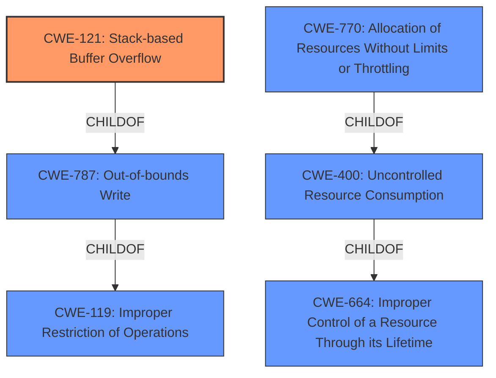

# Raw Analyzer Response for CVE-2021-0276

# Summary
| CWE ID | CWE Name | Confidence | CWE Abstraction Level | CWE Vulnerability Mapping Label | CWE-Vulnerability Mapping Notes |
|---|---|---|---|---|---|
| CWE-121 | Stack-based Buffer Overflow | 1 | Variant | Allowed | Primary CWE |
| CWE-400 | Uncontrolled Resource Consumption | 0.5 | Class | Discouraged | Secondary candidate |

## Evidence and Confidence

*   **Confidence Score:** 0.8
*   **Evidence Strength:** HIGH

## Relationship Analysis
The primary CWE is CWE-121, a **Variant** of CWE-787 (Out-of-bounds Write) and CWE-788. CWE-119 is a **Class** that represents improper restriction of operations within memory bounds and includes both out-of-bounds reads and writes. CWE-400 is a **Class** and a child of CWE-664, it includes CWE-770. The relationships influenced the decision to prioritize CWE-121 due to the explicit mention of a stack-based buffer overflow, making it a more specific and accurate representation of the vulnerability than its broader parents.

## Vulnerability Chain
The vulnerability chain starts with the **stack-based buffer overflow** (CWE-121). The attacker sends **specific packets** to trigger the overflow. This can lead to the **radius daemon** crashing, resulting in a **denial of service (DoS)**, and potentially leading to **remote code execution (RCE)**. Additionally, continuously sending these packets can repeatedly crash the daemon, causing a sustained DoS.

## Summary of Analysis
The initial assessment strongly points to CWE-121 (Stack-based Buffer Overflow) as the primary weakness because the **Vulnerability Description Key Phrases** include the phrase "**rootcause:** **stack-based buffer overflow**". The description clearly states that the vulnerability is a "stack-based Buffer Overflow" and that the attack vector is "specific packets" causing the "radius daemon to crash resulting with a Denial of Service (DoS) or leading to remote code execution (RCE)". The Retriever Results also list CWE-121 as a strong candidate.

CWE-400 (Uncontrolled Resource Consumption) was also considered because the vulnerability leads to a denial of service by crashing the radius daemon. However, the root cause is the buffer overflow, and the DoS is a consequence of the daemon crashing. CWE-400 is also a Class level CWE and is discouraged.

The selection of CWE-121 is at the optimal level of specificity because it directly addresses the root cause of the vulnerability as a **stack-based buffer overflow**. This is more specific than CWE-119 (Improper Restriction of Operations within the Bounds of a Memory Buffer), which is a more general **Class** encompassing various types of buffer errors.

Relevant CWE Information:

# Enhanced Context (25 CWEs)

## CWE-131: Incorrect Calculation of Buffer Size
**Abstraction Level**: Base
**Similarity Score**: 0.76
**Source**: dense

**Description**:
The product does not correctly calculate the size to be used when allocating a buffer, which could lead to a buffer overflow.
**Rationale for Exclusion**: While an incorrect calculation of buffer size can lead to a buffer overflow, the description doesn't explicitly state this. The root cause is the overflow itself, not necessarily an incorrect calculation.

## CWE-191: Integer Underflow (Wrap or Wraparound)
**Abstraction Level**: Base
**Similarity Score**: 0.76
**Source**: dense

**Description**:
The product subtracts one value from another, such that the result is less than the minimum allowable integer value, which produces a value that is not equal to the correct result.
**Rationale for Exclusion**: Integer underflow is not mentioned or implied in the vulnerability description.

## CWE-404: Improper Resource Shutdown or Release
**Abstraction Level**: Class
**Similarity Score**: 0.75
**Source**: dense

**Description**:
The product does not release or incorrectly releases a resource before it is made available for re-use.
**Rationale for Exclusion**: While the radius daemon crashing could be seen as an improper shutdown, the underlying cause is the buffer overflow, not a failure to release resources.

## CWE-1325: Improperly Controlled Sequential Memory Allocation
**Abstraction Level**: Base
**Similarity Score**: 0.75
**Source**: dense

**Description**:
The product manages a group of objects or resources and performs a separate memory allocation for each object, but it does not properly limit the total amount of memory that is consumed by all of the combined objects.
**Rationale for Exclusion**: The description doesn't mention anything about improper control of sequential memory allocation.

## CWE-789: Memory Allocation with Excessive Size Value
**Abstraction Level**: Variant
**Similarity Score**: 0.75
**Source**: dense

**Description**:
The product allocates memory based on an untrusted, large size value, but it does not ensure that the size is within expected limits, allowing arbitrary amounts of memory to be allocated.
**Rationale for Exclusion**: While excessive memory allocation *could* be a contributing factor, the explicit root cause is a stack-based buffer overflow, not necessarily allocating too much memory.

## CWE-805: Buffer Access with Incorrect Length Value
**Abstraction Level**: Base
**Similarity Score**: 0.75
**Source**: dense

**Description**:
The product uses a sequential operation to read or write a buffer, but it uses an incorrect length value that causes it to access memory that is outside of the bounds of the buffer.
**Rationale for Exclusion**: While related to buffer overflows, the vulnerability description focuses on the overflow itself, not necessarily an incorrect length value being used.

## CWE-226: Sensitive Information in Resource Not Removed Before Reuse
**Abstraction Level**: Base
**Similarity Score**: 0.75
**Source**: dense

**Description**:
The product releases a resource such as memory or a file so that it can be made available for reuse, but it does not clear or "zeroize" the information contained in the resource before the product performs a critical state transition or makes the resource available for reuse by other entities.
**Rationale for Exclusion**: Not relevant to the described vulnerability.

## CWE-664: Improper Control of a Resource Through its Lifetime
**Abstraction Level**: Pillar
**Similarity Score**: 0.75
**Source**: dense

**Description**:
The product does not maintain or incorrectly maintains control over a resource throughout its lifetime of creation, use, and release.
**Rationale for Exclusion**: Too abstract; CWE-121 is more specific.

## CWE-405: Asymmetric Resource Consumption (Amplification)
**Abstraction Level**: Class
**Similarity Score**: 0.75
**Source**: dense

**Description**:
The product does not properly control situations in which an adversary can cause the product to consume or produce excessive resources without requiring the adversary to invest equivalent work or otherwise prove authorization, i.e., the adversary's influence is "asymmetric."
**Rationale for Exclusion**: While the DoS aspect involves resource consumption, the root cause is the buffer overflow.

## CWE-1289: Improper Validation of Unsafe Equivalence in Input
**Abstraction Level**: Base
**Similarity Score**: 0.75
**Source**: dense

**Description**:
The product receives an input value that is used as a resource identifier or other type of reference, but it does not validate or incorrectly validates that the input is equivalent to a potentially-unsafe value.
**Rationale for Exclusion**: Not relevant to the described vulnerability.

## CWE-190: Integer Overflow or Wraparound
**Abstraction Level**: Base
**Similarity Score**: 7202.34
**Source**: sparse

**Description**:
The product performs a calculation that can
         produce an integer overflow or wraparound when the logic
         assumes that the resulting value will always be larger than
         the original value. This occurs when an integer value is
         incremented to a value that