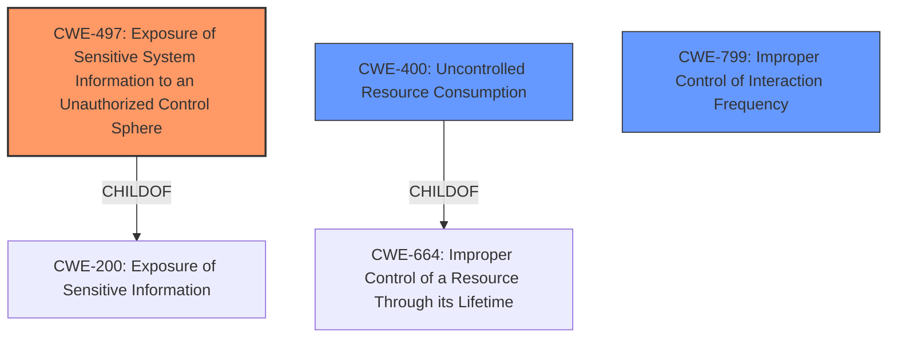

# Analysis for CVE-2021-0291

# Summary
| CWE ID | CWE Name | Confidence | CWE Abstraction Level | CWE Vulnerability Mapping Label | CWE-Vulnerability Mapping Notes |
|---|---|---|---|---|---|
| CWE-497 | Exposure of Sensitive System Information to an Unauthorized Control Sphere | 0.8 | Base | Allowed | Primary CWE. The product does not properly prevent sensitive system-level information from being accessed by unauthorized actors. |
| CWE-400 | Uncontrolled Resource Consumption | 0.6 | Class | Discouraged | Secondary CWE. The product does not properly control the allocation and maintenance of a limited resource. |
| CWE-799 | Improper Control of Interaction Frequency | 0.5 | Class | Allowed-with-Review | Secondary CWE. The product does not properly limit the number or frequency of interactions that it has with an actor. |

## Evidence and Confidence

*   **Confidence Score:** 0.7
*   **Evidence Strength:** MEDIUM

## Relationship Analysis
The primary CWE is CWE-497, which is a Base level CWE and a child of CWE-200. CWE-400 is a Class level CWE and a child of CWE-664. CWE-799 is a Class level CWE.

## Vulnerability Chain
The chain of root cause and weaknesses that followed for the Vulnerability Description:
  - The **weak protection of sensitive system-level resource** (CWE-497) leads to a partial Denial of Service (DoS) (CWE-400).

## Summary of Analysis
The initial analysis focused on the **weak protection of sensitive system-level resource**, leading to a partial Denial of Service (DoS). The retriever results suggested CWE-497 as the top candidate, which aligns with the description of a **sensitive system-level resource not being sufficiently protected**.

The vulnerability description states: "An Exposure of System Data vulnerability in Juniper Networks Junos OS and Junos OS Evolved, where a **sensitive system-level resource is not being sufficiently protected**, allows a network-based unauthenticated attacker to send specific traffic which partially reaches this resource. A high rate of specific traffic may lead to a partial Denial of Service (DoS) as the CPU utilization of the RE is significantly increased."

CWE-497 (Exposure of Sensitive System Information to an Unauthorized Control Sphere) is selected as the primary CWE because it directly addresses the root cause of the vulnerability: the **weak protection of the sensitive system-level resource**. The description of CWE-497 states: "The product does not properly prevent sensitive system-level information from being accessed by unauthorized actors who do not have the same level of access to the underlying system as the product does." This matches the vulnerability description.

CWE-400 (Uncontrolled Resource Consumption) is considered a secondary CWE because the **weak protection** allows an attacker to send traffic that leads to a partial Denial of Service (DoS), which is a form of resource exhaustion.

CWE-799 (Improper Control of Interaction Frequency) is considered because the vulnerability involves sending "specific traffic" at a "high rate," which implies a lack of proper limitation on the frequency of interactions.

Other CWEs Considered:

*   CWE-664 (Improper Control of a Resource Through its Lifetime): This is a high-level Pillar, making it less specific than CWE-497.
*   CWE-770 (Allocation of Resources Without Limits or Throttling): While resource allocation is involved, the primary issue is the **exposure** of the **sensitive resource** due to **weak protection**, not necessarily the allocation itself.
*   CWE-789 (Memory Allocation with Excessive Size Value): Not applicable as the vulnerability does not specifically relate to memory allocation sizes.
*   CWE-410 (Insufficient Resource Pool): Not applicable as the vulnerability does not specifically relate to an insufficient resource pool.
*   CWE-754 (Improper Check for Unusual or Exceptional Conditions): This is a class level CWE and is less specific than CWE-497.
*   CWE-755 (Improper Handling of Exceptional Conditions): This is a class level CWE and is less specific than CWE-497.

The selected CWEs are at the optimal level of specificity, with CWE-497 being a Base level CWE and directly addressing the root cause.