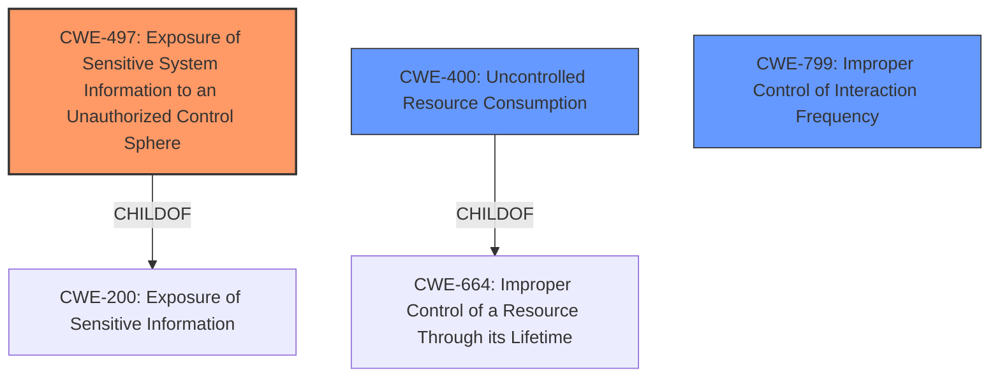

# Analysis for CVE-2021-0291

# Summary
| CWE ID | CWE Name | Confidence | CWE Abstraction Level | CWE Vulnerability Mapping Label | CWE-Vulnerability Mapping Notes |
|---|---|---|---|---|---|
| CWE-497 | Exposure of Sensitive System Information to an Unauthorized Control Sphere | 0.8 | Base | Allowed | Primary CWE. The product does not properly prevent sensitive system-level information from being accessed by unauthorized actors. |
| CWE-400 | Uncontrolled Resource Consumption | 0.6 | Class | Discouraged | Secondary CWE. The product does not properly control the allocation and maintenance of a limited resource. |
| CWE-799 | Improper Control of Interaction Frequency | 0.5 | Class | Allowed-with-Review | Secondary CWE. The product does not properly limit the number or frequency of interactions that it has with an actor. |

## Evidence and Confidence

*   **Confidence Score:** 0.7
*   **Evidence Strength:** MEDIUM

## Relationship Analysis
The primary CWE is CWE-497, which is a Base level CWE and a child of CWE-200. CWE-400 is a Class level CWE and a child of CWE-664. CWE-799 is a Class level CWE.

## Vulnerability Chain
The chain of root cause and weaknesses that followed for the Vulnerability Description:
  - The **weak protection of sensitive system-level resource** (CWE-497) leads to a partial Denial of Service (DoS) (CWE-400).

## Summary of Analysis
The initial analysis focused on the **weak protection of sensitive system-level resource**, leading to a partial Denial of Service (DoS). The retriever results suggested CWE-497 as the top candidate, which aligns with the description of a **sensitive system-level resource not being sufficiently protected**.

The vulnerability description states: "An Exposure of System Data vulnerability in Juniper Networks Junos OS and Junos OS Evolved, where a **sensitive system-level resource is not being sufficiently protected**, allows a network-based unauthenticated attacker to send specific traffic which partially reaches this resource. A high rate of specific traffic may lead to a partial Denial of Service (DoS) as the CPU utilization of the RE is significantly increased."

CWE-497 (Exposure of Sensitive System Information to an Unauthorized Control Sphere) is selected as the primary CWE because it directly addresses the root cause of the vulnerability: the **weak protection of the sensitive system-level resource**. The description of CWE-497 states: "The product does not properly prevent sensitive system-level information from being accessed by unauthorized actors who do not have the same level of access to the underlying system as the product does." This matches the vulnerability description.

CWE-400 (Uncontrolled Resource Consumption) is considered a secondary CWE because the **weak protection** allows an attacker to send traffic that leads to a partial Denial of Service (DoS), which is a form of resource exhaustion.

CWE-799 (Improper Control of Interaction Frequency) is considered because the vulnerability involves sending "specific traffic" at a "high rate," which implies a lack of proper limitation on the frequency of interactions.

Other CWEs Considered:

*   CWE-664 (Improper Control of a Resource Through its Lifetime): This is a high-level Pillar, making it less specific than CWE-497.
*   CWE-770 (Allocation of Resources Without Limits or Throttling): While resource allocation is involved, the primary issue is the **exposure** of the **sensitive resource** due to **weak protection**, not necessarily the allocation itself.
*   CWE-789 (Memory Allocation with Excessive Size Value): Not applicable as the vulnerability does not specifically relate to memory allocation sizes.
*   CWE-410 (Insufficient Resource Pool): Not applicable as the vulnerability does not specifically relate to an insufficient resource pool.
*   CWE-754 (Improper Check for Unusual or Exceptional Conditions): This is a class level CWE and is less specific than CWE-497.
*   CWE-755 (Improper Handling of Exceptional Conditions): This is a class level CWE and is less specific than CWE-497.

The selected CWEs are at the optimal level of specificity, with CWE-497 being a Base level CWE and directly addressing the root cause.

# Enhanced Query for CVE-2021-0291

## Vulnerability Description
An Exposure of System Data vulnerability in Juniper Networks Junos OS and Junos OS Evolved, where a sensitive system-level resource is not being sufficiently protected, allows a network-based unauthenticated attacker to send specific traffic which partially reaches this resource. A high rate of specific traffic may lead to a partial Denial of Service (DoS) as the CPU utilization of the RE is significantly increased. The SNMP Agent Extensibility (agentx) process should only be listening to TCP port 705 on the internal routing instance. External connections destined to port 705 should not be allowed. This issue affects Juniper Networks Junos OS 15.1 versions prior to 15.1R7-S9 17.3 versions prior to 17.3R3-S12 17.4 versions prior to 17.4R2-S13, 17.4R3-S5 18.3 versions prior to 18.3R3-S5 18.4 versions prior to 18.4R2-S8 19.1 versions prior to 19.1R3-S5 19.2 versions prior to 19.2R3-S2 19.3 versions prior to 19.3R2-S6, 19.3R3-S2 19.4 versions prior to 19.4R1-S4, 19.4R2-S4, 19.4R3 20.1 versions prior to 20.1R2 20.2 versions prior to 20.2R2 20.3 versions prior to 20.3R2. Juniper Networks Junos OS Evolved versions prior to 20.3R2-EVO. This issue does not affect Juniper Networks Junos OS versions prior to 13.2R1.

### Vulnerability Description Key Phrases
- **rootcause:** **weak protection of sensitive system-level resource**
- **impact:** partial Denial of Service (DoS)
- **vector:** specific traffic
- **attacker:** network-based unauthenticated attacker
- **product:** Juniper Networks Junos OS and Juniper Networks Junos OS Evolved
- **version:** 15.1 prior to 15.1R7-S9 and 17.3 prior to 17.3R3-S12 and 17.4 prior to 17.4R2-S13 and 17.4R3-S5 and 18.3 prior to 18.3R3-S5 and 18.4 prior to 18.4R2-S8 and 19.1 prior to 19.1R3-S5 and 19.2 prior to 19.2R3-S2 and 19.3 prior to 19.3R2-S6 and 19.3R3-S2 and 19.4 prior to 19.4R1-S4, 19.4R2-S4, and 19.4R3 and 20.1 prior to 20.1R2 and 20.2 prior to 20.2R2 and 20.3 prior to 20.3R2
- **component:** SNMP Agent Extensibility (agentx) process

## Retriever Results

### Top Combined Results

| Rank | CWE ID | Name | Abstraction | Usage  | Retrievers | Individual Scores |
|------|--------|------|-------------|-------|------------|-------------------|
| 1 | 497 | Exposure of Sensitive System Information to an Unauthorized Control Sphere | Base | Allowed | sparse | 2.156 |
| 2 | 401 | Missing Release of Memory after Effective Lifetime | Variant | Allowed | sparse | 1.841 |
| 3 | 754 | Improper Check for Unusual or Exceptional Conditions | Class | Allowed-with-Review | sparse | 1.785 |
| 4 | 664 | Improper Control of a Resource Through its Lifetime | Pillar | Discouraged | sparse | 1.782 |
| 5 | 400 | Uncontrolled Resource Consumption | Class | Discouraged | sparse | 1.777 |
| 6 | 770 | Allocation of Resources Without Limits or Throttling | Base | Allowed | dense | 0.592 |
| 7 | 410 | Insufficient Resource Pool | Base | Allowed | graph | 0.003 |
| 8 | 755 | Improper Handling of Exceptional Conditions | Class | Discouraged | sparse | 1.777 |
| 9 | 250 | Execution with Unnecessary Privileges | Base | Allowed | sparse | 1.734 |
| 10 | 1286 | Improper Validation of Syntactic Correctness of Input | Base | Allowed | sparse | 1.706 |

# Complete CWE Specifications

## CWE-497: Exposure of Sensitive System Information to an Unauthorized Control Sphere
**Abstraction:** Base
**Status:** Incomplete

### Description
The product does not properly prevent sensitive system-level information from being accessed by unauthorized actors who do not have the same level of access to the underlying system as the product does.

### Extended Description

Network-based products, such as web applications, often run on top of an operating system or similar environment. When the product communicates with outside parties, details about the underlying system are expected to remain hidden, such as path names for data files, other OS users, installed packages, the application environment, etc. This system information may be provided by the product itself, or buried within diagnostic or debugging messages. Debugging information helps an adversary learn about the system and form an attack plan.

An information exposure occurs when system data or debugging information leaves the program through an output stream or logging function that makes it accessible to unauthorized parties. Using other weaknesses, an attacker could cause errors to occur; the response to these errors can reveal detailed system information, along with other impacts. An attacker can use messages that reveal technologies, operating systems, and product versions to tune the attack against known vulnerabilities in these technologies. A product may use diagnostic methods that provide significant implementation details such as stack traces as part of its error handling mechanism.

### Alternative Terms
None

### Relationships
ChildOf -> CWE-200

### Mapping Guidance
**Usage:** Allowed
**Rationale:** This CWE entry is at the Base level of abstraction, which is a preferred level of abstraction for mapping to the root causes of vulnerabilities.
**Comments:** Carefully read both the name and description to ensure that this mapping is an appropriate fit. Do not try to 'force' a mapping to a lower-level Base/Variant simply to comply with this preferred level of abstraction.
**Reasons:**
- Acceptable-Use

### Observed Examples
- **CVE-2021-32638:** Code analysis product passes access tokens as a command-line parameter or through an environment variable, making them visible to other processes via the ps command.

## CWE-401: Missing Release of Memory after Effective Lifetime
**Abstraction:** Variant
**Status:** Draft

### Description
The product does not sufficiently track and release allocated memory after it has been used, which slowly consumes remaining memory.

### Extended Description
This is often triggered by improper handling of malformed data or unexpectedly interrupted sessions. In some languages, developers are responsible for tracking memory allocation and releasing the memory. If there are no more pointers or references to the memory, then it can no longer be tracked and identified for release.

### Alternative Terms
Memory Leak

### Relationships
ChildOf -> CWE-772
ChildOf -> CWE-404
ChildOf -> CWE-404

### Mapping Guidance
**Usage:** Allowed
**Rationale:** This CWE entry is at the Variant level of abstraction, which is a preferred level of abstraction for mapping to the root causes of vulnerabilities.
**Comments:** Carefully read both the name and description to ensure that this mapping is an appropriate fit. Do not try to 'force' a mapping to a lower-level Base/Variant simply to comply with this preferred level of abstraction.
**Reasons:**
- Acceptable-Use

### Additional Notes
**[Relationship]** This is often a resultant weakness due to improper handling of malformed data or early termination of sessions.

**[Terminology]** "memory leak" has sometimes been used to describe other kinds of issues, e.g. for information leaks in which the contents of memory are inadvertently leaked (CVE-2003-0400 is one such example of this terminology conflict).

### Observed Examples
- **CVE-2005-3119:** Memory leak because function does not free() an element of a data structure.
- **CVE-2004-0427:** Memory leak when counter variable is not decremented.
- **CVE-2002-0574:** chain: reference count is not decremented, leading to memory leak in OS by sending ICMP packets.

## CWE-754: Improper Check for Unusual or Exceptional Conditions
**Abstraction:** Class
**Status:** Incomplete

### Description
The product does not check or incorrectly checks for unusual or exceptional conditions that are not expected to occur frequently during day to day operation of the product.

### Extended Description

The programmer may assume that certain events or conditions will never occur or do not need to be worried about, such as low memory conditions, lack of access to resources due to restrictive permissions, or misbehaving clients or components. However, attackers may intentionally trigger these unusual conditions, thus violating the programmer's assumptions, possibly introducing instability, incorrect behavior, or a vulnerability.

Note that this entry is not exclusively about the use of exceptions and exception handling, which are mechanisms for both checking and handling unusual or unexpected conditions.

### Alternative Terms
None

### Relationships
ChildOf -> CWE-703
CanPrecede -> CWE-416

### Mapping Guidance
**Usage:** Allowed-with-Review
**Rationale:** This CWE entry is a Class and might have Base-level children that would be more appropriate
**Comments:** Examine children of this entry to see if there is a better fit
**Reasons:**
- Abstraction

### Additional Notes
**[Relationship]** Sometimes, when a return value can be used to indicate an error, an unchecked return value is a code-layer instance of a missing application-layer check for exceptional conditions. However, return values are not always needed to communicate exceptional conditions. For example, expiration of resources, values passed by reference, asynchronously modified data, sockets, etc. may indicate exceptional conditions without the use of a return value.

### Observed Examples
- **CVE-2023-49286:** Chain: function in web caching proxy does not correctly check a return value (CWE-253) leading to a reachable assertion (CWE-617)
- **CVE-2007-3798:** Unchecked return value leads to resultant integer overflow and code execution.
- **CVE-2006-4447:** Program does not check return value when invoking functions to drop privileges, which could leave users with higher privileges than expected by forcing those functions to fail.

## CWE-664: Improper Control of a Resource Through its Lifetime
**Abstraction:** Pillar
**Status:** Draft

### Description
The product does not maintain or incorrectly maintains control over a resource throughout its lifetime of creation, use, and release.

### Extended Description

Resources often have explicit instructions on how to be created, used and destroyed. When code does not follow these instructions, it can lead to unexpected behaviors and potentially exploitable states.

Even without explicit instructions, various principles are expected to be adhered to, such as "Do not use an object until after its creation is complete," or "do not use an object after it has been slated for destruction."

### Alternative Terms
None

### Relationships
None

### Mapping Guidance
**Usage:** Discouraged
**Rationale:** This CWE entry is high-level when lower-level children are available.
**Comments:** Consider children or descendants of this entry instead.
**Reasons:**
- Abstraction

### Additional Notes
**[Maintenance]** More work is needed on this entry and its children. There are perspective/layering issues; for example, one breakdown is based on lifecycle phase (CWE-404, CWE-665), while other children are independent of lifecycle, such as CWE-400. Others do not specify as many bases or variants, such as CWE-704, which primarily covers numbers at this stage.

### Observed Examples
- **CVE-2018-1000613:** Cryptography API uses unsafe reflection when deserializing a private key
- **CVE-2022-21668:** Chain: Python library does not limit the resources used to process images that specify a very large number of bands (CWE-1284), leading to excessive memory consumption (CWE-789) or an integer overflow (CWE-190).

## CWE-400: Uncontrolled Resource Consumption
**Abstraction:** Class
**Status:** Draft

### Description
The product does not properly control the allocation and maintenance of a limited resource, thereby enabling an actor to influence the amount of resources consumed, eventually leading to the exhaustion of available resources.

### Extended Description

Limited resources include memory, file system storage, database connection pool entries, and CPU. If an attacker can trigger the allocation of these limited resources, but the number or size of the resources is not controlled, then the attacker could cause a denial of service that consumes all available resources. This would prevent valid users from accessing the product, and it could potentially have an impact on the surrounding environment. For example, a memory exhaustion attack against an application could slow down the application as well as its host operating system.

There are at least three distinct scenarios which can commonly lead to resource exhaustion:

  - Lack of throttling for the number of allocated resources

  - Losing all references to a resource before reaching the shutdown stage

  - Not closing/returning a resource after processing

Resource exhaustion problems are often result due to an incorrect implementation of the following situations:

  - Error conditions and other exceptional circumstances.

  - Confusion over which part of the program is responsible for releasing the resource.

### Alternative Terms
Resource Exhaustion

### Relationships
ChildOf -> CWE-664

### Mapping Guidance
**Usage:** Discouraged
**Rationale:** CWE-400 is intended for incorrect behaviors in which the product is expected to track and restrict how many resources it consumes, but CWE-400 is often misused because it is conflated with the "technical impact" of vulnerabilities in which resource consumption occurs. It is sometimes used for low-information vulnerability reports. It is a level-1 Class (i.e., a child of a Pillar).
**Comments:** Closely analyze the specific mistake that is causing resource consumption, and perform a CWE mapping for that mistake. Consider children/descendants such as CWE-770: Allocation of Resources Without Limits or Throttling, CWE-771: Missing Reference to Active Allocated Resource, CWE-410: Insufficient Resource Pool, CWE-772: Missing Release of Resource after Effective Lifetime, CWE-834: Excessive Iteration, CWE-405: Asymmetric Resource Consumption (Amplification), and others.
**Reasons:**
- Frequent Misuse

### Additional Notes
**[Maintenance]** "Resource consumption" could be interpreted as a consequence instead of an insecure behavior, so this entry is being considered for modification. It appears to be referenced too frequently when more precise mappings are available. Some of its children, such as CWE-771, might be better considered as a chain.

**[Theoretical]** Vulnerability theory is largely about how behaviors and resources interact. "Resource exhaustion" can be regarded as either a consequence or an attack, depending on the perspective. This entry is an attempt to reflect the underlying weaknesses that enable these attacks (or consequences) to take place.

**[Other]** 

Database queries that take a long time to process are good DoS targets. An attacker would have to write a few lines of Perl code to generate enough traffic to exceed the site's ability to keep up. This would effectively prevent authorized users from using the site at all. Resources can be exploited simply by ensuring that the target machine must do much more work and consume more resources in order to service a request than the attacker must do to initiate a request.

A prime example of this can be found in old switches that were vulnerable to "macof" attacks (so named for a tool developed by Dugsong). These attacks flooded a switch with random IP and MAC address combinations, therefore exhausting the switch's cache, which held the information of which port corresponded to which MAC addresses. Once this cache was exhausted, the switch would fail in an insecure way and would begin to act simply as a hub, broadcasting all traffic on all ports and allowing for basic sniffing attacks.

**[Maintenance]** The Taxonomy_Mappings to ISA/IEC 62443 were added in CWE 4.10, but they are still under review and might change in future CWE versions. These draft mappings were performed by members of the "Mapping CWE to 62443" subgroup of the CWE-CAPEC ICS/OT Special Interest Group (SIG), and their work is incomplete as of CWE 4.10. The mappings are included to facilitate discussion and review by the broader ICS/OT community, and they are likely to change in future CWE versions.

### Observed Examples
- **CVE-2022-21668:** Chain: Python library does not limit the resources used to process images that specify a very large number of bands (CWE-1284), leading to excessive memory consumption (CWE-789) or an integer overflow (CWE-190).
- **CVE-2020-7218:** Go-based workload orchestrator does not limit resource usage with unauthenticated connections, allowing a DoS by flooding the service
- **CVE-2020-3566:** Resource exhaustion in distributed OS because of "insufficient" IGMP queue management, as exploited in the wild per CISA KEV.

## CWE-770: Allocation of Resources Without Limits or Throttling
**Abstraction:** Base
**Status:** Incomplete

### Description
The product allocates a reusable resource or group of resources on behalf of an actor without imposing any restrictions on the size or number of resources that can be allocated, in violation of the intended security policy for that actor.

### Extended Description

Code frequently has to work with limited resources, so programmers must be careful to ensure that resources are not consumed too quickly, or too easily. Without use of quotas, resource limits, or other protection mechanisms, it can be easy for an attacker to consume many resources by rapidly making many requests, or causing larger resources to be used than is needed. When too many resources are allocated, or if a single resource is too large, then it can prevent the code from working correctly, possibly leading to a denial of service.

### Alternative Terms
None

### Relationships
ChildOf -> CWE-400
ChildOf -> CWE-665
ChildOf -> CWE-400

### Mapping Guidance
**Usage:** Allowed
**Rationale:** This CWE entry is at the Base level of abstraction, which is a preferred level of abstraction for mapping to the root causes of vulnerabilities.
**Comments:** Carefully read both the name and description to ensure that this mapping is an appropriate fit. Do not try to 'force' a mapping to a lower-level Base/Variant simply to comply with this preferred level of abstraction.
**Reasons:**
- Acceptable-Use

### Additional Notes
**[Relationship]** This entry is different from uncontrolled resource consumption (CWE-400) in that there are other weaknesses that are related to inability to control resource consumption, such as holding on to a resource too long after use, or not correctly keeping track of active resources so that they can be managed and released when they are finished (CWE-771).

**[Theoretical]** Vulnerability theory is largely about how behaviors and resources interact. "Resource exhaustion" can be regarded as either a consequence or an attack, depending on the perspective. This entry is an attempt to reflect one of the underlying weaknesses that enable these attacks (or consequences) to take place.

### Observed Examples
- **CVE-2022-21668:** Chain: Python library does not limit the resources used to process images that specify a very large number of bands (CWE-1284), leading to excessive memory consumption (CWE-789) or an integer overflow (CWE-190).
- **CVE-2009-4017:** Language interpreter does not restrict the number of temporary files being created when handling a MIME request with a large number of parts..
- **CVE-2009-2726:** Driver does not use a maximum width when invoking sscanf style functions, causing stack consumption.

## CWE-410: Insufficient Resource Pool
**Abstraction:** Base
**Status:** Incomplete

### Description
The product's resource pool is not large enough to handle peak demand, which allows an attacker to prevent others from accessing the resource by using a (relatively) large number of requests for resources.

### Extended Description
Frequently the consequence is a "flood" of connection or sessions.

### Alternative Terms
None

### Relationships
ChildOf -> CWE-664
CanPrecede -> CWE-400

### Mapping Guidance
**Usage:** Allowed
**Rationale:** This CWE entry is at the Base level of abstraction, which is a preferred level of abstraction for mapping to the root causes of vulnerabilities.
**Comments:** Carefully read both the name and description to ensure that this mapping is an appropriate fit. Do not try to 'force' a mapping to a lower-level Base/Variant simply to comply with this preferred level of abstraction.
**Reasons:**
- Acceptable-Use

### Observed Examples
- **CVE-1999-1363:** Large number of locks on file exhausts the pool and causes crash.
- **CVE-2001-1340:** Product supports only one connection and does not disconnect a user who does not provide credentials.
- **CVE-2002-0406:** Large number of connections without providing credentials allows connection exhaustion.

## CWE-755: Improper Handling of Exceptional Conditions
**Abstraction:** Class
**Status:** Incomplete

### Description
The product does not handle or incorrectly handles an exceptional condition.

### Extended Description
Not provided

### Alternative Terms
None

### Relationships
ChildOf -> CWE-703

### Mapping Guidance
**Usage:** Discouraged
**Rationale:** This CWE entry is a level-1 Class (i.e., a child of a Pillar). It might have lower-level children that would be more appropriate
**Comments:** Examine children of this entry to see if there is a better fit
**Reasons:**
- Abstraction

### Observed Examples
- **CVE-2023-41151:** SDK for OPC Unified Architecture (OPC UA) server has uncaught exception when a socket is blocked for writing but the server tries to send an error
- **[REF-1374]:** Chain: JavaScript-based cryptocurrency library can fall back to the insecure Math.random() function instead of reporting a failure (CWE-392), thus reducing the entropy (CWE-332) and leading to generation of non-unique cryptographic keys for Bitcoin wallets (CWE-1391)
- **CVE-2021-3011:** virtual interrupt controller in a virtualization product allows crash of host by writing a certain invalid value to a register, which triggers a fatal error instead of returning an error code

## CWE-250: Execution with Unnecessary Privileges
**Abstraction:** Base
**Status:** Draft

### Description
The product performs an operation at a privilege level that is higher than the minimum level required, which creates new weaknesses or amplifies the consequences of other weaknesses.

### Extended Description

New weaknesses can be exposed because running with extra privileges, such as root or Administrator, can disable the normal security checks being performed by the operating system or surrounding environment. Other pre-existing weaknesses can turn into security vulnerabilities if they occur while operating at raised privileges.

Privilege management functions can behave in some less-than-obvious ways, and they have different quirks on different platforms. These inconsistencies are particularly pronounced if you are transitioning from one non-root user to another. Signal handlers and spawned processes run at the privilege of the owning process, so if a process is running as root when a signal fires or a sub-process is executed, the signal handler or sub-process will operate with root privileges.

### Alternative Terms
None

### Relationships
ChildOf -> CWE-269
ChildOf -> CWE-657

### Mapping Guidance
**Usage:** Allowed
**Rationale:** This CWE entry is at the Base level of abstraction, which is a preferred level of abstraction for mapping to the root causes of vulnerabilities.
**Comments:** Carefully read both the name and description to ensure that this mapping is an appropriate fit. Do not try to 'force' a mapping to a lower-level Base/Variant simply to comply with this preferred level of abstraction.
**Reasons:**
- Acceptable-Use

### Additional Notes
**[Relationship]** There is a close association with CWE-653 (Insufficient Separation of Privileges). CWE-653 is about providing separate components for each privilege; CWE-250 is about ensuring that each component has the least amount of privileges possible.

**[Maintenance]** CWE-271, CWE-272, and CWE-250 are all closely related and possibly overlapping. CWE-271 is probably better suited as a category. Both CWE-272 and CWE-250 are in active use by the community. The "least privilege" phrase has multiple interpretations.

**[Maintenance]** The Taxonomy_Mappings to ISA/IEC 62443 were added in CWE 4.10, but they are still under review and might change in future CWE versions. These draft mappings were performed by members of the "Mapping CWE to 62443" subgroup of the CWE-CAPEC ICS/OT Special Interest Group (SIG), and their work is incomplete as of CWE 4.10. The mappings are included to facilitate discussion and review by the broader ICS/OT community, and they are likely to change in future CWE versions.

### Observed Examples
- **CVE-2007-4217:** FTP client program on a certain OS runs with setuid privileges and has a buffer overflow. Most clients do not need extra privileges, so an overflow is not a vulnerability for those clients.
- **CVE-2008-1877:** Program runs with privileges and calls another program with the same privileges, which allows read of arbitrary files.
- **CVE-2007-5159:** OS incorrectly installs a program with setuid privileges, allowing users to gain privileges.

## CWE-1286: Improper Validation of Syntactic Correctness of Input
**Abstraction:** Base
**Status:** Incomplete

### Description
The product receives input that is expected to be well-formed - i.e., to comply with a certain syntax - but it does not validate or incorrectly validates that the input complies with the syntax.

### Extended Description

Often, complex inputs are expected to follow a particular syntax, which is either assumed by the input itself, or declared within metadata such as headers. The syntax could be for data exchange formats, markup languages, or even programming languages. When untrusted input is not properly validated for the expected syntax, attackers could cause parsing failures, trigger unexpected errors, or expose latent vulnerabilities that might not be directly exploitable if the input had conformed to the syntax.

### Alternative Terms
None

### Relationships
ChildOf -> CWE-20

### Mapping Guidance
**Usage:** Allowed
**Rationale:** This CWE entry is at the Base level of abstraction, which is a preferred level of abstraction for mapping to the root causes of vulnerabilities.
**Comments:** Carefully read both the name and description to ensure that this mapping is an appropriate fit. Do not try to 'force' a mapping to a lower-level Base/Variant simply to comply with this preferred level of abstraction.
**Reasons:**
- Acceptable-Use

### Additional Notes
**[Maintenance]** This entry is still under development and will continue to see updates and content improvements.

### Observed Examples
- **CVE-2016-4029:** Chain: incorrect validation of intended decimal-based IP address format (CWE-1286) enables parsing of octal or hexadecimal formats (CWE-1389), allowing bypass of an SSRF protection mechanism (CWE-918).
- **CVE-2007-5893:** HTTP request with missing protocol version number leads to crash

