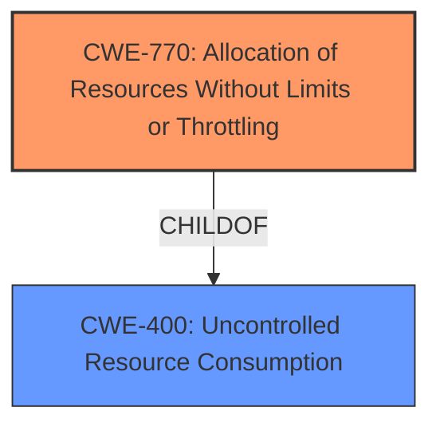

# Analysis Report for CVE-2021-0292

# Vulnerability Analysis Report: CVE-2021-0292

## Description


## Analysis (with Relationship Data)

# Summary
| CWE ID | CWE Name | Confidence | CWE Abstraction Level | CWE Vulnerability Mapping Label | CWE-Vulnerability Mapping Notes |
|---|---|---|---|---|---|
| CWE-770 | Allocation of Resources Without Limits or Throttling | 1.0 | Base | Allowed | Primary CWE |
| CWE-400 | Uncontrolled Resource Consumption | 0.7 | Class | Discouraged | Secondary Candidate |

## Evidence and Confidence

*   **Confidence Score:** 0.85
*   **Evidence Strength:** HIGH

## Relationship Analysis
The primary relationship that influenced the decision was the parent-child relationship between CWE-400 and CWE-770. CWE-770 is a child of CWE-400, making it more specific. The vulnerability description points to the allocation of resources without limits, which aligns directly with CWE-770. The Retriever Results also listed CWE-770 with a good score.



## Vulnerability Chain
The vulnerability chain begins with the **uncontrolled resource consumption** (**WEAKNESS**) due to the **allocation of resources without limits or throttling**. This leads to memory exhaustion, ultimately resulting in a Denial of Service (DoS) (**impact**).

## Summary of Analysis
The initial assessment based on the vulnerability description and key phrases pointed towards **Uncontrolled Resource Consumption**. However, a deeper analysis of the complete CWE specifications and the relationships between CWEs revealed that **CWE-770: Allocation of Resources Without Limits or Throttling** is a more precise and accurate classification.

The vulnerability description explicitly states "**Uncontrolled Resource Consumption**" as the **weakness**. The *Retriever Results* listed CWE-400 as the top combined result. However, the MITRE mapping guidance discourages the use of CWE-400, recommending consideration of its children, such as CWE-770. The description of CWE-770, "**The product allocates a reusable resource or group of resources on behalf of an actor without imposing any restrictions on the size or number of resources that can be allocated**", aligns perfectly with the observed behavior in the Junos OS Evolved vulnerability, where the ARP daemon (arpd) and Network Discovery Protocol (ndp) process do not limit memory allocation, leading to resource exhaustion.

Therefore, the selection of CWE-770 is based on the following:

*   Explicit mention of **uncontrolled resource consumption** in the vulnerability description.
*   The *Retriever Results* listing CWE-400 and CWE-770.
*   The MITRE mapping guidance for CWE-400 which suggests considering its children, including CWE-770.
*   The precise match between the description of CWE-770 and the vulnerability's details.

Relevant CWE Information:

# Enhanced Context (25 CWEs)

## CWE-404: Improper Resource Shutdown or Release
**Abstraction Level**: Class
**Similarity Score**: 0.78
**Source**: dense

**Description**:
The product does not release or incorrectly releases a resource before it is made available for re-use.

**Mapping Guidance**:
- Usage: Allowed-with-Review
- Rationale: This CWE entry is a Class and might have Base-level children that would be more appropriate

*Not Selected:* While resource release issues can contribute to resource consumption, the primary issue here is the lack of initial limits on resource allocation, making CWE-770 a better fit.

## CWE-367: Time-of-check Time-of-use (TOCTOU) Race Condition
**Abstraction Level**: Base
**Similarity Score**: 0.78
**Source**: dense

**Description**:
The product checks the state of a resource before using that resource, but the resource's state can change between the check and the use in a way that invalidates the results of the check. This can cause the product to perform invalid actions when the resource is in an unexpected state.

**Mapping Guidance**:
- Usage: Allowed
- Rationale: This CWE entry is at the Base level of abstraction, which is a preferred level of abstraction for mapping to the root causes of vulnerabilities.

*Not Selected:* A race condition is not evident in the vulnerability description. The issue is with resource allocation and limits, not concurrent access or modification.

## CWE-667: Improper Locking
**Abstraction Level**: Class
**Similarity Score**: 0.77
**Source**: dense

**Description**:
The product does not properly acquire or release a lock on a resource, leading to unexpected resource state changes and behaviors.

**Mapping Guidance**:
- Usage: Allowed-with-Review
- Rationale: This CWE entry is a Class and might have Base-level children that would be more appropriate

*Not Selected:* Locking issues are not mentioned in the vulnerability description.

## CWE-362: Concurrent Execution using Shared Resource with Improper Synchronization ('Race Condition')
**Abstraction Level**: Class
**Similarity Score**: 0.76
**Source**: dense

**Description**:
The product contains a concurrent code sequence that requires temporary, exclusive access to a shared resource, but a timing window exists in which the shared resource can be modified by another code sequence operating concurrently.

**Mapping Guidance**:
- Usage: Allowed-with-Review
- Rationale: This CWE entry is a Class and might have Base-level children that would be more appropriate

*Not Selected:* Similar to CWE-367, concurrency and race conditions are not the core issues described.

## CWE-664: Improper Control of a Resource Through its Lifetime
**Abstraction Level**: Pillar
**Similarity Score**: 0.76
**Source**: dense

**Description**:
The product does not maintain or incorrectly maintains control over a resource throughout its lifetime of creation, use, and release.

**Mapping Guidance**:
- Usage: Discouraged
- Rationale: This CWE entry is high-level when lower-level children are available.

*Not Selected:* Too general. The specific issue is the lack of allocation limits, making CWE-770 more appropriate.

## CWE-754: Improper Check for Unusual or Exceptional Conditions
**Abstraction Level**: Class
**Similarity Score**: 0.75
**Source**: dense

**Description**:
The product does not check or incorrectly checks for unusual or exceptional conditions that are not expected to occur frequently during day to day operation of the product.

**Mapping Guidance**:
- Usage: Allowed-with-Review
- Rationale: This CWE entry is a Class and might have Base-level children that would be more appropriate

*Not Selected:* Exception handling is not the primary concern. The vulnerability stems from the lack of initial resource allocation limits.

## CWE-226: Sensitive Information in Resource Not Removed Before Reuse
**Abstraction Level**: Base
**Similarity Score**: 0.75
**Source**: dense

**Description**:
The product releases a resource such as memory or a file so that it can be made available for reuse, but it does not clear or "zeroize" the information contained in the resource before the product performs a critical state transition or makes the resource available for reuse by other entities.

*Not Selected:* This CWE is not relevant as it deals with the release of sensitive information.

## CWE-405: Asymmetric Resource Consumption (Amplification)
**Abstraction Level**: Class
**Similarity Score**: 0.75
**Source**: dense

**Description**:
The product does not properly control situations in which an adversary can cause the product to consume or produce excessive resources without requiring the adversary to invest equivalent work or otherwise prove authorization, i.e., the adversary's influence is "asymmetric."

*Not Selected:* While amplification could be a factor, the root cause is the initial lack of resource limits during allocation.

## CWE-366: Race Condition within a Thread
**Abstraction Level**: Base
**Similarity Score**: 0.75
**Source**: dense

**Description**:
If two threads of execution use a resource simultaneously, there exists the possibility that resources may be used while invalid, in turn making the state of execution undefined.

*Not Selected:* Not relevant because it is not about threads.

## CWE-662: Improper Synchronization
**Abstraction Level**: Class
**Similarity Score**: 0.74
**Source**: dense

**Description**:
The product utilizes multiple threads or processes to allow temporary access to a shared resource that can only be exclusive to one process at a time, but it does not properly synchronize these actions, which might cause simultaneous accesses of this resource by multiple threads or processes.

*Not Selected:* Synchronization is not the core issue.

## CWE-770: Allocation of Resources Without Limits or Throttling
**Abstraction Level**: Base
**Similarity Score**: 6750.06
**Source**: sparse

**Description**:
The product allocates a reusable resource or group of resources on behalf of an actor without imposing any restrictions


## CWE Relationship Analysis

Current CWEs represent these abstraction levels: .


### Vulnerability Chain Analysis

**Chain starting from CWE-667:**
- 667 (Improper Locking) - ROOT


**Chain starting from CWE-754:**
- 754 (Improper Check for Unusual or Exceptional Conditions) - ROOT


### CWE Relationship Diagram

```mermaid
graph TD
    classDef primary fill:#f96,stroke:#333,stroke-width:2px
    classDef secondary fill:#69f,stroke:#333
    classDef tertiary fill:#9e9,stroke:#333
```


*Report generated on 2025-04-01 18:27:02*
