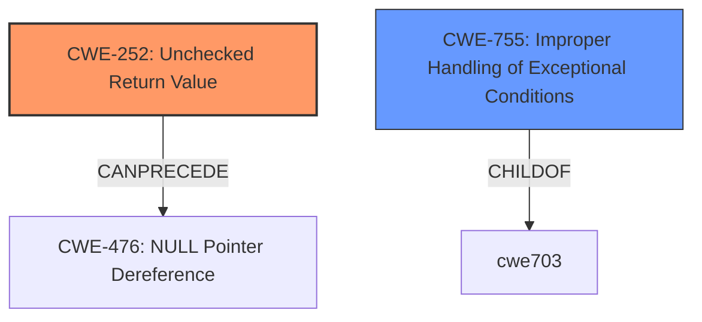

# Analysis for CVE-2021-0297

# Summary
| CWE ID | CWE Name | Confidence | CWE Abstraction Level | CWE Vulnerability Mapping Label | CWE-Vulnerability Mapping Notes |
|---|---|---|---|---|---|
| CWE-252 | Unchecked Return Value | 0.75 | Base | Allowed | Primary CWE |
| CWE-755 | Improper Handling of Exceptional Conditions | 0.5 | Class | Discouraged | Secondary Candidate |

## Evidence and Confidence

*   **Confidence Score:** 0.75
*   **Evidence Strength:** MEDIUM

## Relationship Analysis
The primary relationship considered was that CWE-252, the **Unchecked Return Value** CWE, can **precede** CWE-476 **NULL Pointer Dereference**. The other candidate, CWE-755 **Improper Handling of Exceptional Conditions** is a Class level CWE and therefore less preferred than a Base level CWE.

## Vulnerability Chain
The chain of the root cause and weakness is that the **improper TCP MD5 authentication** leads to **untrusted or unauthorized sessions being established**. The root cause is the unchecked return value, CWE-252, which leads to the impact of unauthorized sessions.

## Summary of Analysis
The analysis is based on the vulnerability description and the retriever results. The key phrase "**improper TCP MD5 authentication**" suggests that the authentication process is not properly handled. The retriever results show that CWE-252 **Unchecked Return Value** is a possible candidate. Since the return value is not checked, the program continues to operate as if the authentication was successful. The **rootcause** is the **improper TCP MD5 authentication**. This leads to untrusted or unauthorized sessions being established.

The retriever results show that CWE-755 **Improper Handling of Exceptional Conditions** is also a candidate. However, CWE-755 is a Class level CWE, while CWE-252 is a Base level CWE, making CWE-252 a better fit.

CWE-252 is the optimal level of specificity because it directly addresses the **root cause** of the vulnerability, which is the **lack of checking the return value** of the TCP MD5 authentication process. This lack of checking allows the program to proceed even when the authentication fails, leading to the establishment of untrusted sessions.

Relevant CWE Information:

# Enhanced Context (25 CWEs)
The following CWEs were identified as potentially relevant to this vulnerability:

## CWE-703: Improper Check or Handling of Exceptional Conditions
**Abstraction Level**: Pillar
**Similarity Score**: 0.80
**Source**: dense

**Description**:
The product does not properly anticipate or handle exceptional conditions that rarely occur during normal operation of the product.

**Mapping Guidance**:
- Usage: Discouraged
- Rationale: This CWE entry is extremely high-level, a Pillar.

## CWE-252: Unchecked Return Value
**Abstraction Level**: Base
**Similarity Score**: 4709.83
**Source**: sparse

**Description**:
The product does not check the return value from a method or function, which can prevent it from detecting unexpected states and conditions.

**Mapping Guidance**:
- Usage: Allowed
- Rationale: This CWE entry is at the Base level of abstraction, which is a preferred level of abstraction for mapping to the root causes of vulnerabilities.

## CWE-755: Improper Handling of Exceptional Conditions
**Abstraction Level**: Class
**Similarity Score**: 4379.14
**Source**: sparse

**Description**:
The product does not handle or incorrectly handles an exceptional condition.

**Mapping Guidance**:
- Usage: Discouraged
- Rationale: This CWE entry is a level-1 Class (i.e., a child of a Pillar). It might have lower-level children that would be more appropriate

# Enhanced Query for CVE-2021-0297

## Vulnerability Description
A vulnerability in the processing of TCP MD5 authentication in Juniper Networks Junos OS Evolved may allow a BGP or LDP session configured with MD5 authentication to succeed, even if the peer does not have TCP MD5 authentication enabled. This could lead to untrusted or unauthorized sessions being established, resulting in an impact on confidentiality or stability of the network. This issue affects Juniper Networks Junos OS Evolved All versions prior to 20.3R2-S1-EVO 20.4 versions prior to 20.4R2-EVO 21.1 versions prior to 21.1R2-EVO. Juniper Networks Junos OS is not affected by this issue.

### Vulnerability Description Key Phrases
- **rootcause:** **improper TCP MD5 authentication**
- **impact:** untrusted or unauthorized sessions being established
- **product:** Juniper Networks Junos OS Evolved
- **version:** All versions prior to 20.3R2-S1-EVO and 20.4 versions prior to 20.4R2-EVO and 21.1 versions prior to 21.1R2-EVO
- **component:** BGP or LDP session

## Retriever Results

### Top Combined Results

| Rank | CWE ID | Name | Abstraction | Usage  | Retrievers | Individual Scores |
|------|--------|------|-------------|-------|------------|-------------------|
| 1 | 755 | Improper Handling of Exceptional Conditions | Class | Discouraged | sparse | 0.925 |
| 2 | 1286 | Improper Validation of Syntactic Correctness of Input | Base | Allowed | sparse | 0.812 |
| 3 | 775 | Missing Release of File Descriptor or Handle after Effective Lifetime | Variant | Allowed | sparse | 0.775 |
| 4 | 252 | Unchecked Return Value | Base | Allowed | sparse | 0.753 |
| 5 | 664 | Improper Control of a Resource Through its Lifetime | Pillar | Discouraged | sparse | 0.750 |
| 6 | 696 | Incorrect Behavior Order | Class | Allowed-with-Review | dense | 0.514 |
| 7 | 390 | Detection of Error Condition Without Action | Base | Allowed | graph | 0.003 |
| 8 | 497 | Exposure of Sensitive System Information to an Unauthorized Control Sphere | Base | Allowed | sparse | 0.729 |
| 9 | 362 | Concurrent Execution using Shared Resource with Improper Synchronization ('Race Condition') | Class | Allowed-with-Review | sparse | 0.725 |
| 10 | 703 | Improper Check or Handling of Exceptional Conditions | Pillar | Discouraged | sparse | 0.717 |

# Complete CWE Specifications

## CWE-755: Improper Handling of Exceptional Conditions
**Abstraction:** Class
**Status:** Incomplete

### Description
The product does not handle or incorrectly handles an exceptional condition.

### Extended Description
Not provided

### Alternative Terms
None

### Relationships
ChildOf -> CWE-703

### Mapping Guidance
**Usage:** Discouraged
**Rationale:** This CWE entry is a level-1 Class (i.e., a child of a Pillar). It might have lower-level children that would be more appropriate
**Comments:** Examine children of this entry to see if there is a better fit
**Reasons:**
- Abstraction

### Observed Examples
- **CVE-2023-41151:** SDK for OPC Unified Architecture (OPC UA) server has uncaught exception when a socket is blocked for writing but the server tries to send an error
- **[REF-1374]:** Chain: JavaScript-based cryptocurrency library can fall back to the insecure Math.random() function instead of reporting a failure (CWE-392), thus reducing the entropy (CWE-332) and leading to generation of non-unique cryptographic keys for Bitcoin wallets (CWE-1391)
- **CVE-2021-3011:** virtual interrupt controller in a virtualization product allows crash of host by writing a certain invalid value to a register, which triggers a fatal error instead of returning an error code

## CWE-1286: Improper Validation of Syntactic Correctness of Input
**Abstraction:** Base
**Status:** Incomplete

### Description
The product receives input that is expected to be well-formed - i.e., to comply with a certain syntax - but it does not validate or incorrectly validates that the input complies with the syntax.

### Extended Description

Often, complex inputs are expected to follow a particular syntax, which is either assumed by the input itself, or declared within metadata such as headers. The syntax could be for data exchange formats, markup languages, or even programming languages. When untrusted input is not properly validated for the expected syntax, attackers could cause parsing failures, trigger unexpected errors, or expose latent vulnerabilities that might not be directly exploitable if the input had conformed to the syntax.

### Alternative Terms
None

### Relationships
ChildOf -> CWE-20

### Mapping Guidance
**Usage:** Allowed
**Rationale:** This CWE entry is at the Base level of abstraction, which is a preferred level of abstraction for mapping to the root causes of vulnerabilities.
**Comments:** Carefully read both the name and description to ensure that this mapping is an appropriate fit. Do not try to 'force' a mapping to a lower-level Base/Variant simply to comply with this preferred level of abstraction.
**Reasons:**
- Acceptable-Use

### Additional Notes
**[Maintenance]** This entry is still under development and will continue to see updates and content improvements.

### Observed Examples
- **CVE-2016-4029:** Chain: incorrect validation of intended decimal-based IP address format (CWE-1286) enables parsing of octal or hexadecimal formats (CWE-1389), allowing bypass of an SSRF protection mechanism (CWE-918).
- **CVE-2007-5893:** HTTP request with missing protocol version number leads to crash

## CWE-775: Missing Release of File Descriptor or Handle after Effective Lifetime
**Abstraction:** Variant
**Status:** Incomplete

### Description
The product does not release a file descriptor or handle after its effective lifetime has ended, i.e., after the file descriptor/handle is no longer needed.

### Extended Description
When a file descriptor or handle is not released after use (typically by explicitly closing it), attackers can cause a denial of service by consuming all available file descriptors/handles, or otherwise preventing other system processes from obtaining their own file descriptors/handles.

### Alternative Terms
None

### Relationships
ChildOf -> CWE-772
ChildOf -> CWE-404
ChildOf -> CWE-404

### Mapping Guidance
**Usage:** Allowed
**Rationale:** This CWE entry is at the Variant level of abstraction, which is a preferred level of abstraction for mapping to the root causes of vulnerabilities.
**Comments:** Carefully read both the name and description to ensure that this mapping is an appropriate fit. Do not try to 'force' a mapping to a lower-level Base/Variant simply to comply with this preferred level of abstraction.
**Reasons:**
- Acceptable-Use

### Observed Examples
- **CVE-2007-0897:** Chain: anti-virus product encounters a malformed file but returns from a function without closing a file descriptor (CWE-775) leading to file descriptor consumption (CWE-400) and failed scans.

## CWE-252: Unchecked Return Value
**Abstraction:** Base
**Status:** Draft

### Description
The product does not check the return value from a method or function, which can prevent it from detecting unexpected states and conditions.

### Extended Description
Two common programmer assumptions are "this function call can never fail" and "it doesn't matter if this function call fails". If an attacker can force the function to fail or otherwise return a value that is not expected, then the subsequent program logic could lead to a vulnerability, because the product is not in a state that the programmer assumes. For example, if the program calls a function to drop privileges but does not check the return code to ensure that privileges were successfully dropped, then the program will continue to operate with the higher privileges.

### Alternative Terms
None

### Relationships
ChildOf -> CWE-754
ChildOf -> CWE-754
CanPrecede -> CWE-476

### Mapping Guidance
**Usage:** Allowed
**Rationale:** This CWE entry is at the Base level of abstraction, which is a preferred level of abstraction for mapping to the root causes of vulnerabilities.
**Comments:** Carefully read both the name and description to ensure that this mapping is an appropriate fit. Do not try to 'force' a mapping to a lower-level Base/Variant simply to comply with this preferred level of abstraction.
**Reasons:**
- Acceptable-Use

### Observed Examples
- **CVE-2020-17533:** Chain: unchecked return value (CWE-252) of some functions for policy enforcement leads to authorization bypass (CWE-862)
- **CVE-2020-6078:** Chain: The return value of a function returning a pointer is not checked for success (CWE-252) resulting in the later use of an uninitialized variable (CWE-456) and a null pointer dereference (CWE-476)
- **CVE-2019-15900:** Chain: sscanf() call is used to check if a username and group exists, but the return value of sscanf() call is not checked (CWE-252), causing an uninitialized variable to be checked (CWE-457), returning success to allow authorization bypass for executing a privileged (CWE-863).

## CWE-664: Improper Control of a Resource Through its Lifetime
**Abstraction:** Pillar
**Status:** Draft

### Description
The product does not maintain or incorrectly maintains control over a resource throughout its lifetime of creation, use, and release.

### Extended Description

Resources often have explicit instructions on how to be created, used and destroyed. When code does not follow these instructions, it can lead to unexpected behaviors and potentially exploitable states.

Even without explicit instructions, various principles are expected to be adhered to, such as "Do not use an object until after its creation is complete," or "do not use an object after it has been slated for destruction."

### Alternative Terms
None

### Relationships
None

### Mapping Guidance
**Usage:** Discouraged
**Rationale:** This CWE entry is high-level when lower-level children are available.
**Comments:** Consider children or descendants of this entry instead.
**Reasons:**
- Abstraction

### Additional Notes
**[Maintenance]** More work is needed on this entry and its children. There are perspective/layering issues; for example, one breakdown is based on lifecycle phase (CWE-404, CWE-665), while other children are independent of lifecycle, such as CWE-400. Others do not specify as many bases or variants, such as CWE-704, which primarily covers numbers at this stage.

### Observed Examples
- **CVE-2018-1000613:** Cryptography API uses unsafe reflection when deserializing a private key
- **CVE-2022-21668:** Chain: Python library does not limit the resources used to process images that specify a very large number of bands (CWE-1284), leading to excessive memory consumption (CWE-789) or an integer overflow (CWE-190).

## CWE-696: Incorrect Behavior Order
**Abstraction:** Class
**Status:** Incomplete

### Description
The product performs multiple related behaviors, but the behaviors are performed in the wrong order in ways which may produce resultant weaknesses.

### Extended Description
Not provided

### Alternative Terms
None

### Relationships
ChildOf -> CWE-691

### Mapping Guidance
**Usage:** Allowed-with-Review
**Rationale:** This CWE entry is a Class and might have Base-level children that would be more appropriate
**Comments:** Examine children of this entry to see if there is a better fit
**Reasons:**
- Abstraction

### Observed Examples
- **CVE-2019-9805:** Chain: Creation of the packet client occurs before initialization is complete (CWE-696) resulting in a read from uninitialized memory (CWE-908), causing memory corruption.
- **CVE-2007-5191:** file-system management programs call the setuid and setgid functions in the wrong order and do not check the return values, allowing attackers to gain unintended privileges
- **CVE-2007-1588:** C++ web server program calls Process::setuid before calling Process::setgid, preventing it from dropping privileges, potentially allowing CGI programs to be called with higher privileges than intended

## CWE-390: Detection of Error Condition Without Action
**Abstraction:** Base
**Status:** Draft

### Description
The product detects a specific error, but takes no actions to handle the error.

### Extended Description
Not provided

### Alternative Terms
None

### Relationships
ChildOf -> CWE-755
CanPrecede -> CWE-401

### Mapping Guidance
**Usage:** Allowed
**Rationale:** This CWE entry is at the Base level of abstraction, which is a preferred level of abstraction for mapping to the root causes of vulnerabilities.
**Comments:** Carefully read both the name and description to ensure that this mapping is an appropriate fit. Do not try to 'force' a mapping to a lower-level Base/Variant simply to comply with this preferred level of abstraction.
**Reasons:**
- Acceptable-Use

### Observed Examples
- **CVE-2022-21820:** A GPU data center manager detects an error due to a malformed request but does not act on it, leading to memory corruption.

## CWE-497: Exposure of Sensitive System Information to an Unauthorized Control Sphere
**Abstraction:** Base
**Status:** Incomplete

### Description
The product does not properly prevent sensitive system-level information from being accessed by unauthorized actors who do not have the same level of access to the underlying system as the product does.

### Extended Description

Network-based products, such as web applications, often run on top of an operating system or similar environment. When the product communicates with outside parties, details about the underlying system are expected to remain hidden, such as path names for data files, other OS users, installed packages, the application environment, etc. This system information may be provided by the product itself, or buried within diagnostic or debugging messages. Debugging information helps an adversary learn about the system and form an attack plan.

An information exposure occurs when system data or debugging information leaves the program through an output stream or logging function that makes it accessible to unauthorized parties. Using other weaknesses, an attacker could cause errors to occur; the response to these errors can reveal detailed system information, along with other impacts. An attacker can use messages that reveal technologies, operating systems, and product versions to tune the attack against known vulnerabilities in these technologies. A product may use diagnostic methods that provide significant implementation details such as stack traces as part of its error handling mechanism.

### Alternative Terms
None

### Relationships
ChildOf -> CWE-200

### Mapping Guidance
**Usage:** Allowed
**Rationale:** This CWE entry is at the Base level of abstraction, which is a preferred level of abstraction for mapping to the root causes of vulnerabilities.
**Comments:** Carefully read both the name and description to ensure that this mapping is an appropriate fit. Do not try to 'force' a mapping to a lower-level Base/Variant simply to comply with this preferred level of abstraction.
**Reasons:**
- Acceptable-Use

### Observed Examples
- **CVE-2021-32638:** Code analysis product passes access tokens as a command-line parameter or through an environment variable, making them visible to other processes via the ps command.

## CWE-362: Concurrent Execution using Shared Resource with Improper Synchronization ('Race Condition')
**Abstraction:** Class
**Status:** Draft

### Description
The product contains a concurrent code sequence that requires temporary, exclusive access to a shared resource, but a timing window exists in which the shared resource can be modified by another code sequence operating concurrently.

### Extended Description

A race condition occurs within concurrent environments, and it is effectively a property of a code sequence. Depending on the context, a code sequence may be in the form of a function call, a small number of instructions, a series of program invocations, etc.

A race condition violates these properties, which are closely related:

  - Exclusivity - the code sequence is given exclusive access to the shared resource, i.e., no other code sequence can modify properties of the shared resource before the original sequence has completed execution.

  - Atomicity - the code sequence is behaviorally atomic, i.e., no other thread or process can concurrently execute the same sequence of instructions (or a subset) against the same resource.

A race condition exists when an "interfering code sequence" can still access the shared resource, violating exclusivity.

The interfering code sequence could be "trusted" or "untrusted." A trusted interfering code sequence occurs within the product; it cannot be modified by the attacker, and it can only be invoked indirectly. An untrusted interfering code sequence can be authored directly by the attacker, and typically it is external to the vulnerable product.

### Alternative Terms
Race Condition

### Relationships
ChildOf -> CWE-691
CanPrecede -> CWE-416
CanPrecede -> CWE-476

### Mapping Guidance
**Usage:** Allowed-with-Review
**Rationale:** This CWE entry is a Class and might have Base-level children that would be more appropriate
**Comments:** Examine children of this entry to see if there is a better fit
**Reasons:**
- Abstraction

### Additional Notes
**[Maintenance]** The relationship between race conditions and synchronization problems (CWE-662) needs to be further developed. They are not necessarily two perspectives of the same core concept, since synchronization is only one technique for avoiding race conditions, and synchronization can be used for other purposes besides race condition prevention.

**[Research Gap]** Race conditions in web applications are under-studied and probably under-reported. However, in 2008 there has been growing interest in this area.

**[Research Gap]** Much of the focus of race condition research has been in Time-of-check Time-of-use (TOCTOU) variants (CWE-367), but many race conditions are related to synchronization problems that do not necessarily require a time-of-check.

**[Research Gap]** From a classification/taxonomy perspective, the relationships between concurrency and program state need closer investigation and may be useful in organizing related issues.

### Observed Examples
- **CVE-2022-29527:** Go application for cloud management creates a world-writable sudoers file that allows local attackers to inject sudo rules and escalate privileges to root by winning a race condition.
- **CVE-2021-1782:** Chain: improper locking (CWE-667) leads to race condition (CWE-362), as exploited in the wild per CISA KEV.
- **CVE-2021-0920:** Chain: mobile platform race condition (CWE-362) leading to use-after-free (CWE-416), as exploited in the wild per CISA KEV.

## CWE-703: Improper Check or Handling of Exceptional Conditions
**Abstraction:** Pillar
**Status:** Incomplete

### Description
The product does not properly anticipate or handle exceptional conditions that rarely occur during normal operation of the product.

### Extended Description
Not provided

### Alternative Terms
None

### Relationships
None

### Mapping Guidance
**Usage:** Discouraged
**Rationale:** This CWE entry is extremely high-level, a Pillar.
**Comments:** Consider children or descendants of this entry instead.
**Reasons:**
- Abstraction

### Additional Notes
**[Relationship]** This is a high-level class that might have some overlap with other classes. It could be argued that even "normal" weaknesses such as buffer overflows involve unusual or exceptional conditions. In that sense, this might be an inherent aspect of most other weaknesses within CWE, similar to API Abuse (CWE-227) and Indicator of Poor Code Quality (CWE-398). However, this entry is currently intended to unify disparate concepts that do not have other places within the Research Concepts view (CWE-1000).

### Observed Examples
- **[REF-1374]:** Chain: JavaScript-based cryptocurrency library can fall back to the insecure Math.random() function instead of reporting a failure (CWE-392), thus reducing the entropy (CWE-332) and leading to generation of non-unique cryptographic keys for Bitcoin wallets (CWE-1391)
- **CVE-2022-22224:** Chain: an operating system does not properly process malformed Open Shortest Path First (OSPF) Type/Length/Value Identifiers (TLV) (CWE-703), which can cause the process to enter an infinite loop (CWE-835)

