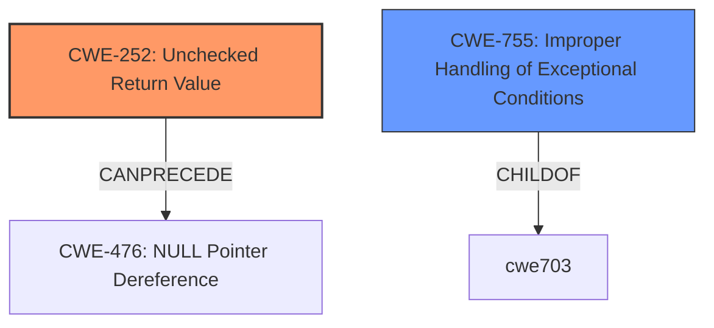

# Analysis Report for CVE-2021-0297

# Vulnerability Analysis Report: CVE-2021-0297

## Description


## Analysis (with Relationship Data)

# Summary
| CWE ID | CWE Name | Confidence | CWE Abstraction Level | CWE Vulnerability Mapping Label | CWE-Vulnerability Mapping Notes |
|---|---|---|---|---|---|
| CWE-252 | Unchecked Return Value | 0.75 | Base | Allowed | Primary CWE |
| CWE-755 | Improper Handling of Exceptional Conditions | 0.5 | Class | Discouraged | Secondary Candidate |

## Evidence and Confidence

*   **Confidence Score:** 0.75
*   **Evidence Strength:** MEDIUM

## Relationship Analysis
The primary relationship considered was that CWE-252, the **Unchecked Return Value** CWE, can **precede** CWE-476 **NULL Pointer Dereference**. The other candidate, CWE-755 **Improper Handling of Exceptional Conditions** is a Class level CWE and therefore less preferred than a Base level CWE.



## Vulnerability Chain
The chain of the root cause and weakness is that the **improper TCP MD5 authentication** leads to **untrusted or unauthorized sessions being established**. The root cause is the unchecked return value, CWE-252, which leads to the impact of unauthorized sessions.

## Summary of Analysis
The analysis is based on the vulnerability description and the retriever results. The key phrase "**improper TCP MD5 authentication**" suggests that the authentication process is not properly handled. The retriever results show that CWE-252 **Unchecked Return Value** is a possible candidate. Since the return value is not checked, the program continues to operate as if the authentication was successful. The **rootcause** is the **improper TCP MD5 authentication**. This leads to untrusted or unauthorized sessions being established.

The retriever results show that CWE-755 **Improper Handling of Exceptional Conditions** is also a candidate. However, CWE-755 is a Class level CWE, while CWE-252 is a Base level CWE, making CWE-252 a better fit.

CWE-252 is the optimal level of specificity because it directly addresses the **root cause** of the vulnerability, which is the **lack of checking the return value** of the TCP MD5 authentication process. This lack of checking allows the program to proceed even when the authentication fails, leading to the establishment of untrusted sessions.

Relevant CWE Information:

# Enhanced Context (25 CWEs)
The following CWEs were identified as potentially relevant to this vulnerability:

## CWE-703: Improper Check or Handling of Exceptional Conditions
**Abstraction Level**: Pillar
**Similarity Score**: 0.80
**Source**: dense

**Description**:
The product does not properly anticipate or handle exceptional conditions that rarely occur during normal operation of the product.

**Mapping Guidance**:
- Usage: Discouraged
- Rationale: This CWE entry is extremely high-level, a Pillar.

## CWE-252: Unchecked Return Value
**Abstraction Level**: Base
**Similarity Score**: 4709.83
**Source**: sparse

**Description**:
The product does not check the return value from a method or function, which can prevent it from detecting unexpected states and conditions.

**Mapping Guidance**:
- Usage: Allowed
- Rationale: This CWE entry is at the Base level of abstraction, which is a preferred level of abstraction for mapping to the root causes of vulnerabilities.

## CWE-755: Improper Handling of Exceptional Conditions
**Abstraction Level**: Class
**Similarity Score**: 4379.14
**Source**: sparse

**Description**:
The product does not handle or incorrectly handles an exceptional condition.

**Mapping Guidance**:
- Usage: Discouraged
- Rationale: This CWE entry is a level-1 Class (i.e., a child of a Pillar). It might have lower-level children that would be more appropriate


## CWE Relationship Analysis

Current CWEs represent these abstraction levels: .


### Vulnerability Chain Analysis

**Chain starting from CWE-252:**
- 252 (Unchecked Return Value) - ROOT


**Chain starting from CWE-755:**
- 755 (Improper Handling of Exceptional Conditions) - ROOT


### CWE Relationship Diagram

```mermaid
graph TD
    classDef primary fill:#f96,stroke:#333,stroke-width:2px
    classDef secondary fill:#69f,stroke:#333
    classDef tertiary fill:#9e9,stroke:#333
```


*Report generated on 2025-04-02 06:30:28*
