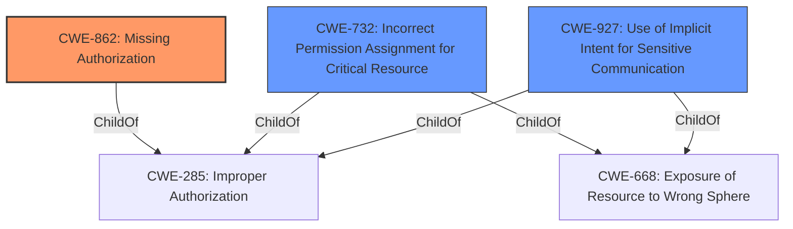

# Raw Analyzer Response for CVE-2021-0306

# Summary
| CWE ID | CWE Name | Confidence | CWE Abstraction Level | CWE Vulnerability Mapping Label | CWE-Vulnerability Mapping Notes |
|---|---|---|---|---|---|
| CWE-862 | Missing Authorization | 0.9 | Class | Allowed-with-Review | Primary CWE |
| CWE-732 | Incorrect Permission Assignment for Critical Resource | 0.7 | Class | Allowed-with-Review | Secondary CWE |
| CWE-927 | Use of Implicit Intent for Sensitive Communication | 0.5 | Variant | Allowed | Secondary CWE |

## Evidence and Confidence

*   **Confidence Score:** 0.9
*   **Evidence Strength:** HIGH

## Relationship Analysis
The primary relationship is between CWE-862 **Missing Authorization** and its parent CWEs. The vulnerability involves a **permissions bypass**, indicating that an authorization check is either missing or **incorrect**. While CWE-732 **Incorrect Permission Assignment for Critical Resource** is related, the core issue is the lack of proper authorization during the Android version upgrade. CWE-927 **Use of Implicit Intent for Sensitive Communication** is considered but not the primary cause. The abstraction level influenced the choice of CWE-862 because it captures the general authorization problem, while lower-level CWEs would be too specific without more detailed evidence.

## Vulnerability Chain
The vulnerability chain involves:
1.  **Root Cause:** **Permissions bypass** during Android version upgrades due to **improper permission revocation**.
2.  **Weakness:** The system **fails to properly authorize** the granting of `android.permission.ACTIVITY_RECOGNITION`
3.  **Impact:** An app gains the `android.permission.ACTIVITY_RECOGNITION` permission without user confirmation, leading to local escalation of privilege.

## Summary of Analysis
The analysis indicates that the root cause of the vulnerability is a **permissions bypass** during Android version upgrades. The system **fails to properly authorize** the granting of `android.permission.ACTIVITY_RECOGNITION` permission. This is supported by the **Vulnerability Description Key Phrases**: "**rootcause:** **Permissions bypass** in addAllPermissions of PermissionManagerService.java". The CVE Reference Links Content Summary states: "The vulnerability stems from how permissions are handled during non-runtime to runtime upgrades. Specifically, permissions were not being properly revoked when their owners changed or when permission levels were upgraded during the transition from non-runtime to runtime."

The initial retriever results pointed to CWE-862 **Missing Authorization** (Class), CWE-732 **Incorrect Permission Assignment for Critical Resource** (Class), and CWE-927 **Use of Implicit Intent for Sensitive Communication** (Variant) as potential candidates.

CWE-862 **Missing Authorization** is the primary CWE because the core issue is that the system **fails to perform the necessary authorization checks** during the upgrade process. The permissions are granted without proper validation, leading to the bypass. The mapping guidance for CWE-862 advises to examine child entries for a better fit, but none of the children are as appropriate as the parent.

CWE-732 **Incorrect Permission Assignment for Critical Resource** is a secondary consideration because it describes the scenario where permissions are assigned incorrectly, but the **root cause** is the missing authorization check.

CWE-927 **Use of Implicit Intent for Sensitive Communication** is less relevant because the vulnerability doesn't involve implicit intents.

The final decision is to map the vulnerability to CWE-862 **Missing Authorization** as the primary CWE, with CWE-732 **Incorrect Permission Assignment for Critical Resource** and CWE-927 **Use of Implicit Intent for Sensitive Communication** as secondary considerations. The chosen CWEs are at the appropriate level of specificity, capturing the essence of the vulnerability without being overly granular.

Relevant CWE Information:

# Enhanced Context (25 CWEs)

## CWE-941: Incorrectly Specified Destination in a Communication Channel
**Abstraction Level**: Base
**Similarity Score**: 0.77
**Source**: dense

**Description**:
The product creates a communication channel to initiate an outgoing request to an actor, but it does not correctly specify the intended destination for that actor.

**Mapping Guidance**:
- Usage: Allowed
- Rationale: This CWE entry is at the Base level of abstraction, which is a preferred level of abstraction for mapping to the root causes of vulnerabilities.

## CWE-754: Improper Check for Unusual or Exceptional Conditions
**Abstraction Level**: Class
**Similarity Score**: 0.76
**Source**: dense

**Description**:
The product does not check or incorrectly checks for unusual or exceptional conditions that are not expected to occur frequently during day to day operation of the product.

**Mapping Guidance**:
- Usage: Allowed-with-Review
- Rationale: This CWE entry is a Class and might have Base-level children that would be more appropriate

## CWE-668: Exposure of Resource to Wrong Sphere
**Abstraction Level**: Class
**Similarity Score**: 0.76
**Source**: dense

**Description**:
The product exposes a resource to the wrong control sphere, providing unintended actors with inappropriate access to the resource.

**Mapping Guidance**:
- Usage: Discouraged
- Rationale: CWE-668 is high-level and is often misused as a catch-all when lower-level CWE IDs might be applicable. It is sometimes used for low-information vulnerability reports [REF-1287]. It is a level-1 Class (i.e., a child of a Pillar). It is not useful for trend analysis.

## CWE-203: Observable Discrepancy
**Abstraction Level**: Base
**Similarity Score**: 0.76
**Source**: dense

**Description**:
The product behaves differently or sends different responses under different circumstances in a way that is observable to an unauthorized actor, which exposes security-relevant information about the state of the product, such as whether a particular operation was successful or not.

**Mapping Guidance**:
- Usage: Allowed
- Rationale: This CWE entry is at the Base level of abstraction, which is a preferred level of abstraction for mapping to the root causes of vulnerabilities.

## CWE-404: Improper Resource Shutdown or Release
**Abstraction Level**: Class
**Similarity Score**: 0.75
**Source**: dense

**Description**:
The product does not release or incorrectly releases a resource before it is made available for re-use.

**Mapping Guidance**:
- Usage: Allowed-with-Review
- Rationale: This CWE entry is a Class and might have Base-level children that would be more appropriate

## CWE-451: User Interface (UI) Misrepresentation of Critical Information
**Abstraction Level**: Class
**Similarity Score**: 0.75
**Source**: dense

**Description**:
The user interface (UI) does not properly represent critical information to the user, allowing the information - or its source - to be obscured or spoofed. This is often a component in phishing attacks.

**Mapping Guidance**:
- Usage: Allowed-with-Review
- Rationale: This CWE entry is a Class and might have Base-level children that would be more appropriate

## CWE-667: Improper Locking
**Abstraction Level**: Class
**Similarity Score**: 0.75
**Source**: dense

**Description**:
The product does not properly acquire or release a lock on a resource, leading to unexpected resource state changes and behaviors.

**Mapping Guidance**:
- Usage: Allowed-with-Review
- Rationale: This CWE entry is a Class and might have Base-level children that would be more appropriate

## CWE-41: Improper Resolution of Path Equivalence
**Abstraction Level**: Base
**Similarity Score**: 0.74
**Source**: dense

**Description**:
The product is vulnerable to file system contents disclosure through path equivalence. Path equivalence involves the use of special characters in file and directory names. The associated manipulations are intended to generate multiple names for the same object.

**Mapping Guidance**:
- Usage: Allowed
- Rationale: This CWE entry is at the Base level of abstraction, which is a preferred level of abstraction for mapping to the root causes of vulnerabilities.

## CWE-226: Sensitive Information in Resource Not Removed Before Reuse
**Abstraction Level**: Base
**Similarity Score**: 0.74
**Source