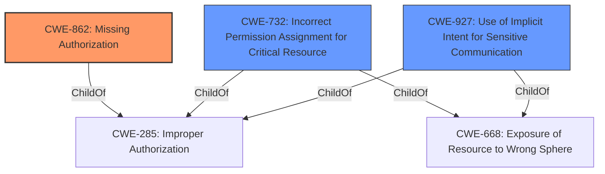

# Analysis for CVE-2021-0306

# Summary
| CWE ID | CWE Name | Confidence | CWE Abstraction Level | CWE Vulnerability Mapping Label | CWE-Vulnerability Mapping Notes |
|---|---|---|---|---|---|
| CWE-862 | Missing Authorization | 0.9 | Class | Allowed-with-Review | Primary CWE |
| CWE-732 | Incorrect Permission Assignment for Critical Resource | 0.7 | Class | Allowed-with-Review | Secondary CWE |
| CWE-927 | Use of Implicit Intent for Sensitive Communication | 0.5 | Variant | Allowed | Secondary CWE |

## Evidence and Confidence

*   **Confidence Score:** 0.9
*   **Evidence Strength:** HIGH

## Relationship Analysis
The primary relationship is between CWE-862 **Missing Authorization** and its parent CWEs. The vulnerability involves a **permissions bypass**, indicating that an authorization check is either missing or **incorrect**. While CWE-732 **Incorrect Permission Assignment for Critical Resource** is related, the core issue is the lack of proper authorization during the Android version upgrade. CWE-927 **Use of Implicit Intent for Sensitive Communication** is considered but not the primary cause. The abstraction level influenced the choice of CWE-862 because it captures the general authorization problem, while lower-level CWEs would be too specific without more detailed evidence.

## Vulnerability Chain
The vulnerability chain involves:
1.  **Root Cause:** **Permissions bypass** during Android version upgrades due to **improper permission revocation**.
2.  **Weakness:** The system **fails to properly authorize** the granting of `android.permission.ACTIVITY_RECOGNITION`
3.  **Impact:** An app gains the `android.permission.ACTIVITY_RECOGNITION` permission without user confirmation, leading to local escalation of privilege.

## Summary of Analysis
The analysis indicates that the root cause of the vulnerability is a **permissions bypass** during Android version upgrades. The system **fails to properly authorize** the granting of `android.permission.ACTIVITY_RECOGNITION` permission. This is supported by the **Vulnerability Description Key Phrases**: "**rootcause:** **Permissions bypass** in addAllPermissions of PermissionManagerService.java". The CVE Reference Links Content Summary states: "The vulnerability stems from how permissions are handled during non-runtime to runtime upgrades. Specifically, permissions were not being properly revoked when their owners changed or when permission levels were upgraded during the transition from non-runtime to runtime."

The initial retriever results pointed to CWE-862 **Missing Authorization** (Class), CWE-732 **Incorrect Permission Assignment for Critical Resource** (Class), and CWE-927 **Use of Implicit Intent for Sensitive Communication** (Variant) as potential candidates.

CWE-862 **Missing Authorization** is the primary CWE because the core issue is that the system **fails to perform the necessary authorization checks** during the upgrade process. The permissions are granted without proper validation, leading to the bypass. The mapping guidance for CWE-862 advises to examine child entries for a better fit, but none of the children are as appropriate as the parent.

CWE-732 **Incorrect Permission Assignment for Critical Resource** is a secondary consideration because it describes the scenario where permissions are assigned incorrectly, but the **root cause** is the missing authorization check.

CWE-927 **Use of Implicit Intent for Sensitive Communication** is less relevant because the vulnerability doesn't involve implicit intents.

The final decision is to map the vulnerability to CWE-862 **Missing Authorization** as the primary CWE, with CWE-732 **Incorrect Permission Assignment for Critical Resource** and CWE-927 **Use of Implicit Intent for Sensitive Communication** as secondary considerations. The chosen CWEs are at the appropriate level of specificity, capturing the essence of the vulnerability without being overly granular.

Relevant CWE Information:

# Enhanced Context (25 CWEs)

## CWE-941: Incorrectly Specified Destination in a Communication Channel
**Abstraction Level**: Base
**Similarity Score**: 0.77
**Source**: dense

**Description**:
The product creates a communication channel to initiate an outgoing request to an actor, but it does not correctly specify the intended destination for that actor.

**Mapping Guidance**:
- Usage: Allowed
- Rationale: This CWE entry is at the Base level of abstraction, which is a preferred level of abstraction for mapping to the root causes of vulnerabilities.

## CWE-754: Improper Check for Unusual or Exceptional Conditions
**Abstraction Level**: Class
**Similarity Score**: 0.76
**Source**: dense

**Description**:
The product does not check or incorrectly checks for unusual or exceptional conditions that are not expected to occur frequently during day to day operation of the product.

**Mapping Guidance**:
- Usage: Allowed-with-Review
- Rationale: This CWE entry is a Class and might have Base-level children that would be more appropriate

## CWE-668: Exposure of Resource to Wrong Sphere
**Abstraction Level**: Class
**Similarity Score**: 0.76
**Source**: dense

**Description**:
The product exposes a resource to the wrong control sphere, providing unintended actors with inappropriate access to the resource.

**Mapping Guidance**:
- Usage: Discouraged
- Rationale: CWE-668 is high-level and is often misused as a catch-all when lower-level CWE IDs might be applicable. It is sometimes used for low-information vulnerability reports [REF-1287]. It is a level-1 Class (i.e., a child of a Pillar). It is not useful for trend analysis.

## CWE-203: Observable Discrepancy
**Abstraction Level**: Base
**Similarity Score**: 0.76
**Source**: dense

**Description**:
The product behaves differently or sends different responses under different circumstances in a way that is observable to an unauthorized actor, which exposes security-relevant information about the state of the product, such as whether a particular operation was successful or not.

**Mapping Guidance**:
- Usage: Allowed
- Rationale: This CWE entry is at the Base level of abstraction, which is a preferred level of abstraction for mapping to the root causes of vulnerabilities.

## CWE-404: Improper Resource Shutdown or Release
**Abstraction Level**: Class
**Similarity Score**: 0.75
**Source**: dense

**Description**:
The product does not release or incorrectly releases a resource before it is made available for re-use.

**Mapping Guidance**:
- Usage: Allowed-with-Review
- Rationale: This CWE entry is a Class and might have Base-level children that would be more appropriate

## CWE-451: User Interface (UI) Misrepresentation of Critical Information
**Abstraction Level**: Class
**Similarity Score**: 0.75
**Source**: dense

**Description**:
The user interface (UI) does not properly represent critical information to the user, allowing the information - or its source - to be obscured or spoofed. This is often a component in phishing attacks.

**Mapping Guidance**:
- Usage: Allowed-with-Review
- Rationale: This CWE entry is a Class and might have Base-level children that would be more appropriate

## CWE-667: Improper Locking
**Abstraction Level**: Class
**Similarity Score**: 0.75
**Source**: dense

**Description**:
The product does not properly acquire or release a lock on a resource, leading to unexpected resource state changes and behaviors.

**Mapping Guidance**:
- Usage: Allowed-with-Review
- Rationale: This CWE entry is a Class and might have Base-level children that would be more appropriate

## CWE-41: Improper Resolution of Path Equivalence
**Abstraction Level**: Base
**Similarity Score**: 0.74
**Source**: dense

**Description**:
The product is vulnerable to file system contents disclosure through path equivalence. Path equivalence involves the use of special characters in file and directory names. The associated manipulations are intended to generate multiple names for the same object.

**Mapping Guidance**:
- Usage: Allowed
- Rationale: This CWE entry is at the Base level of abstraction, which is a preferred level of abstraction for mapping to the root causes of vulnerabilities.

## CWE-226: Sensitive Information in Resource Not Removed Before Reuse
**Abstraction Level**: Base
**Similarity Score**: 0.74
**Source

# Enhanced Query for CVE-2021-0306

## Vulnerability Description
In addAllPermissions of PermissionManagerService.java, there is a possible permissions bypass when upgrading major Android versions which allows an app to gain the android.permission.ACTIVITY_RECOGNITION permission without user confirmation. This could lead to local escalation of privilege with no additional execution privileges needed. User interaction is not needed for exploitation. Product Android Versions Android-11, Android-8.0, Android-8.1, Android-9, Android-10 Android ID A-154505240.

### Vulnerability Description Key Phrases
- **rootcause:** **Permissions bypass in addAllPermissions of PermissionManagerService.java**
- **impact:** gain the android.permission.ACTIVITY_RECOGNITION permission
- **attacker:** app
- **product:** Android
- **version:** Android-11 and Android-8.0 and Android-8.1 and Android-9 and Android-10
- **component:** addAllPermissions of PermissionManagerService.java

## CVE Reference Links Content Summary
Based on the provided content, here's an analysis of CVE-2021-0306:

**Root Cause of Vulnerability:**

The vulnerability stems from how permissions are handled during non-runtime to runtime upgrades. Specifically, permissions were not being properly revoked when their owners changed or when permission levels were upgraded during the transition from non-runtime to runtime.

**Weaknesses/Vulnerabilities Present:**

*   **Improper Permission Revocation:** Permissions granted in a non-runtime context were not being revoked when the system transitioned to runtime, or when the owning entity of those permissions changed.
*   **Permission Escalation:** An attacker could potentially leverage this to bypass permission checks by exploiting the permission handling differences between non-runtime and runtime.

**Impact of Exploitation:**

*   **Elevation of Privilege (EoP):** An attacker could potentially gain higher-level access or permissions than intended by exploiting this vulnerability. The Android Security Bulletin classifies this as a "High" severity EoP.

**Attack Vectors:**

*   The attack vector involves a transition from a non-runtime state to runtime, specifically related to permission handling during such upgrades. This could potentially be triggered by system updates or changes in app ownership.

**Required Attacker Capabilities/Position:**

*   The attacker would need to be able to influence the system's state during the non-runtime to runtime transition. Specifically, the attacker needs to change permission owners or trigger permission level upgrades to exploit the lack of revocation of permissions.

**Additional Notes from the Provided Content:**

*   The fix involves revoking permissions when permission ownership changes or when a permission level is upgraded during the transition from non-runtime to runtime.
*   The vulnerability is present in Android versions 8.0, 8.1, 9, 10, and 11.
*   The provided code commits show the fixes are related to revoking permissions on state changes.

The CVE description is a placeholder, but the provided content provides more details and context to this vulnerability.

## Retriever Results

### Top Combined Results

| Rank | CWE ID | Name | Abstraction | Usage  | Retrievers | Individual Scores |
|------|--------|------|-------------|-------|------------|-------------------|
| 1 | 862 | Missing Authorization | Class | Allowed-with-Review | sparse | 0.597 |
| 2 | 1021 | Improper Restriction of Rendered UI Layers or Frames | Base | Allowed | sparse | 0.573 |
| 3 | 732 | Incorrect Permission Assignment for Critical Resource | Class | Allowed-with-Review | sparse | 0.538 |
| 4 | 248 | Uncaught Exception | Base | Allowed | sparse | 0.534 |
| 5 | 223 | Omission of Security-relevant Information | Base | Allowed | sparse | 0.527 |
| 6 | 927 | Use of Implicit Intent for Sensitive Communication | Variant | Allowed | dense | 0.553 |
| 7 | 386 | Symbolic Name not Mapping to Correct Object | Base | Allowed | graph | 0.002 |
| 8 | 770 | Allocation of Resources Without Limits or Throttling | Base | Allowed | sparse | 0.503 |
| 9 | 941 | Incorrectly Specified Destination in a Communication Channel | Base | Allowed | sparse | 0.496 |
| 10 | 514 | Covert Channel | Class | Allowed-with-Review | sparse | 0.496 |

# Complete CWE Specifications

## CWE-862: Missing Authorization
**Abstraction:** Class
**Status:** Incomplete

### Description
The product does not perform an authorization check when an actor attempts to access a resource or perform an action.

### Extended Description
Not provided

### Alternative Terms
AuthZ: "AuthZ" is typically used as an abbreviation of "authorization" within the web application security community. It is distinct from "AuthN" (or, sometimes, "AuthC") which is an abbreviation of "authentication." The use of "Auth" as an abbreviation is discouraged, since it could be used for either authentication or authorization.

### Relationships
ChildOf -> CWE-285
ChildOf -> CWE-284

### Mapping Guidance
**Usage:** Allowed-with-Review
**Rationale:** This CWE entry is a Class and might have Base-level children that would be more appropriate
**Comments:** Examine children of this entry to see if there is a better fit
**Reasons:**
- Abstraction

### Additional Notes
**[Terminology]** Assuming a user with a given identity, authorization is the process of determining whether that user can access a given resource, based on the user's privileges and any permissions or other access-control specifications that apply to the resource.

### Observed Examples
- **CVE-2022-24730:** Go-based continuous deployment product does not check that a user has certain privileges to update or create an app, allowing adversaries to read sensitive repository information
- **CVE-2009-3168:** Web application does not restrict access to admin scripts, allowing authenticated users to reset administrative passwords.
- **CVE-2009-3597:** Web application stores database file under the web root with insufficient access control (CWE-219), allowing direct request.

## CWE-1021: Improper Restriction of Rendered UI Layers or Frames
**Abstraction:** Base
**Status:** Incomplete

### Description
The web application does not restrict or incorrectly restricts frame objects or UI layers that belong to another application or domain, which can lead to user confusion about which interface the user is interacting with.

### Extended Description
A web application is expected to place restrictions on whether it is allowed to be rendered within frames, iframes, objects, embed or applet elements. Without the restrictions, users can be tricked into interacting with the application when they were not intending to.

### Alternative Terms
Clickjacking
UI Redress Attack
Tapjacking: "Tapjacking" is similar to clickjacking, except it is used for mobile applications in which the user "taps" the application instead of performing a mouse click.

### Relationships
ChildOf -> CWE-441
ChildOf -> CWE-610
ChildOf -> CWE-451

### Mapping Guidance
**Usage:** Allowed
**Rationale:** This CWE entry is at the Base level of abstraction, which is a preferred level of abstraction for mapping to the root causes of vulnerabilities.
**Comments:** Carefully read both the name and description to ensure that this mapping is an appropriate fit. Do not try to 'force' a mapping to a lower-level Base/Variant simply to comply with this preferred level of abstraction.
**Reasons:**
- Acceptable-Use

### Observed Examples
- **CVE-2017-7440:** E-mail preview feature in a desktop application allows clickjacking attacks via a crafted e-mail message
- **CVE-2017-5697:** Hardware/firmware product has insufficient clickjacking protection in its web user interface
- **CVE-2017-4015:** Clickjacking in data-loss prevention product via HTTP response header.

## CWE-732: Incorrect Permission Assignment for Critical Resource
**Abstraction:** Class
**Status:** Draft

### Description
The product specifies permissions for a security-critical resource in a way that allows that resource to be read or modified by unintended actors.

### Extended Description
When a resource is given a permission setting that provides access to a wider range of actors than required, it could lead to the exposure of sensitive information, or the modification of that resource by unintended parties. This is especially dangerous when the resource is related to program configuration, execution, or sensitive user data. For example, consider a misconfigured storage account for the cloud that can be read or written by a public or anonymous user.

### Alternative Terms
None

### Relationships
ChildOf -> CWE-285
ChildOf -> CWE-668

### Mapping Guidance
**Usage:** Allowed-with-Review
**Rationale:** While the name itself indicates an assignment of permissions for resources, this is often misused for vulnerabilities in which "permissions" are not checked, which is an "authorization" weakness (CWE-285 or descendants) within CWE's model [REF-1287].
**Comments:** Closely analyze the specific mistake that is allowing the resource to be exposed, and perform a CWE mapping for that mistake.
**Reasons:**
- Frequent Misuse

### Additional Notes
**[Maintenance]** The relationships between privileges, permissions, and actors (e.g. users and groups) need further refinement within the Research view. One complication is that these concepts apply to two different pillars, related to control of resources (CWE-664) and protection mechanism failures (CWE-693).

### Observed Examples
- **CVE-2022-29527:** Go application for cloud management creates a world-writable sudoers file that allows local attackers to inject sudo rules and escalate privileges to root by winning a race condition.
- **CVE-2009-3482:** Anti-virus product sets insecure "Everyone: Full Control" permissions for files under the "Program Files" folder, allowing attackers to replace executables with Trojan horses.
- **CVE-2009-3897:** Product creates directories with 0777 permissions at installation, allowing users to gain privileges and access a socket used for authentication.

## CWE-248: Uncaught Exception
**Abstraction:** Base
**Status:** Draft

### Description
An exception is thrown from a function, but it is not caught.

### Extended Description
When an exception is not caught, it may cause the program to crash or expose sensitive information.

### Alternative Terms
None

### Relationships
ChildOf -> CWE-705
ChildOf -> CWE-755
ChildOf -> CWE-703
ChildOf -> CWE-703

### Mapping Guidance
**Usage:** Allowed
**Rationale:** This CWE entry is at the Base level of abstraction, which is a preferred level of abstraction for mapping to the root causes of vulnerabilities.
**Comments:** Carefully read both the name and description to ensure that this mapping is an appropriate fit. Do not try to 'force' a mapping to a lower-level Base/Variant simply to comply with this preferred level of abstraction.
**Reasons:**
- Acceptable-Use

### Observed Examples
- **CVE-2023-41151:** SDK for OPC Unified Architecture (OPC UA) server has uncaught exception when a socket is blocked for writing but the server tries to send an error
- **CVE-2023-21087:** Java code in a smartphone OS can encounter a "boot loop" due to an uncaught exception

## CWE-223: Omission of Security-relevant Information
**Abstraction:** Base
**Status:** Draft

### Description
The product does not record or display information that would be important for identifying the source or nature of an attack, or determining if an action is safe.

### Extended Description
Not provided

### Alternative Terms
None

### Relationships
ChildOf -> CWE-221

### Mapping Guidance
**Usage:** Allowed
**Rationale:** This CWE entry is at the Base level of abstraction, which is a preferred level of abstraction for mapping to the root causes of vulnerabilities.
**Comments:** Carefully read both the name and description to ensure that this mapping is an appropriate fit. Do not try to 'force' a mapping to a lower-level Base/Variant simply to comply with this preferred level of abstraction.
**Reasons:**
- Acceptable-Use

### Observed Examples
- **CVE-1999-1029:** Login attempts are not recorded if the user disconnects before the maximum number of tries.
- **CVE-2002-1839:** Sender's IP address not recorded in outgoing e-mail.
- **CVE-2000-0542:** Failed authentication attempts are not recorded if later attempt succeeds.

## CWE-927: Use of Implicit Intent for Sensitive Communication
**Abstraction:** Variant
**Status:** Incomplete

### Description
The Android application uses an implicit intent for transmitting sensitive data to other applications.

### Extended Description

Since an implicit intent does not specify a particular application to receive the data, any application can process the intent by using an Intent Filter for that intent. This can allow untrusted applications to obtain sensitive data. There are two variations on the standard broadcast intent, ordered and sticky.

Ordered broadcast intents are delivered to a series of registered receivers in order of priority as declared by the Receivers. A malicious receiver can give itself a high priority and cause a denial of service by stopping the broadcast from propagating further down the chain. There is also the possibility of malicious data modification, as a receiver may also alter the data within the Intent before passing it on to the next receiver. The downstream components have no way of asserting that the data has not been altered earlier in the chain.

Sticky broadcast intents remain accessible after the initial broadcast. An old sticky intent will be broadcast again to any new receivers that register for it in the future, greatly increasing the chances of information exposure over time. Also, sticky broadcasts cannot be protected by permissions that may apply to other kinds of intents.

In addition, any broadcast intent may include a URI that references data that the receiving component does not normally have the privileges to access. The sender of the intent can include special privileges that grant the receiver read or write access to the specific URI included in the intent. A malicious receiver that intercepts this intent will also gain those privileges and be able to read or write the resource at the specified URI.

### Alternative Terms
None

### Relationships
ChildOf -> CWE-285
ChildOf -> CWE-668

### Mapping Guidance
**Usage:** Allowed
**Rationale:** This CWE entry is at the Variant level of abstraction, which is a preferred level of abstraction for mapping to the root causes of vulnerabilities.
**Comments:** Carefully read both the name and description to ensure that this mapping is an appropriate fit. Do not try to 'force' a mapping to a lower-level Base/Variant simply to comply with this preferred level of abstraction.
**Reasons:**
- Acceptable-Use

### Observed Examples
- **CVE-2022-4903:** An Android application does not use FLAG_IMMUTABLE when creating a PendingIntent.

## CWE-386: Symbolic Name not Mapping to Correct Object
**Abstraction:** Base
**Status:** Draft

### Description
A constant symbolic reference to an object is used, even though the reference can resolve to a different object over time.

### Extended Description
Not provided

### Alternative Terms
None

### Relationships
ChildOf -> CWE-706
PeerOf -> CWE-367
PeerOf -> CWE-610
PeerOf -> CWE-486

### Mapping Guidance
**Usage:** Allowed
**Rationale:** This CWE entry is at the Base level of abstraction, which is a preferred level of abstraction for mapping to the root causes of vulnerabilities.
**Comments:** Carefully read both the name and description to ensure that this mapping is an appropriate fit. Do not try to 'force' a mapping to a lower-level Base/Variant simply to comply with this preferred level of abstraction.
**Reasons:**
- Acceptable-Use

## CWE-770: Allocation of Resources Without Limits or Throttling
**Abstraction:** Base
**Status:** Incomplete

### Description
The product allocates a reusable resource or group of resources on behalf of an actor without imposing any restrictions on the size or number of resources that can be allocated, in violation of the intended security policy for that actor.

### Extended Description

Code frequently has to work with limited resources, so programmers must be careful to ensure that resources are not consumed too quickly, or too easily. Without use of quotas, resource limits, or other protection mechanisms, it can be easy for an attacker to consume many resources by rapidly making many requests, or causing larger resources to be used than is needed. When too many resources are allocated, or if a single resource is too large, then it can prevent the code from working correctly, possibly leading to a denial of service.

### Alternative Terms
None

### Relationships
ChildOf -> CWE-400
ChildOf -> CWE-665
ChildOf -> CWE-400

### Mapping Guidance
**Usage:** Allowed
**Rationale:** This CWE entry is at the Base level of abstraction, which is a preferred level of abstraction for mapping to the root causes of vulnerabilities.
**Comments:** Carefully read both the name and description to ensure that this mapping is an appropriate fit. Do not try to 'force' a mapping to a lower-level Base/Variant simply to comply with this preferred level of abstraction.
**Reasons:**
- Acceptable-Use

### Additional Notes
**[Relationship]** This entry is different from uncontrolled resource consumption (CWE-400) in that there are other weaknesses that are related to inability to control resource consumption, such as holding on to a resource too long after use, or not correctly keeping track of active resources so that they can be managed and released when they are finished (CWE-771).

**[Theoretical]** Vulnerability theory is largely about how behaviors and resources interact. "Resource exhaustion" can be regarded as either a consequence or an attack, depending on the perspective. This entry is an attempt to reflect one of the underlying weaknesses that enable these attacks (or consequences) to take place.

### Observed Examples
- **CVE-2022-21668:** Chain: Python library does not limit the resources used to process images that specify a very large number of bands (CWE-1284), leading to excessive memory consumption (CWE-789) or an integer overflow (CWE-190).
- **CVE-2009-4017:** Language interpreter does not restrict the number of temporary files being created when handling a MIME request with a large number of parts..
- **CVE-2009-2726:** Driver does not use a maximum width when invoking sscanf style functions, causing stack consumption.

## CWE-941: Incorrectly Specified Destination in a Communication Channel
**Abstraction:** Base
**Status:** Incomplete

### Description
The product creates a communication channel to initiate an outgoing request to an actor, but it does not correctly specify the intended destination for that actor.

### Extended Description

Attackers at the destination may be able to spoof trusted servers to steal data or cause a denial of service.

There are at least two distinct weaknesses that can cause the product to communicate with an unintended destination:

  - If the product allows an attacker to control which destination is specified, then the attacker can cause it to connect to an untrusted or malicious destination. For example, because UDP is a connectionless protocol, UDP packets can be spoofed by specifying a false source address in the packet; when the server receives the packet and sends a reply, it will specify a destination by using the source of the incoming packet - i.e., the false source. The server can then be tricked into sending traffic to the wrong host, which is effective for hiding the real source of an attack and for conducting a distributed denial of service (DDoS). As another example, server-side request forgery (SSRF) and XML External Entity (XXE) can be used to trick a server into making outgoing requests to hosts that cannot be directly accessed by the attacker due to firewall restrictions.

  - If the product incorrectly specifies the destination, then an attacker who can control this destination might be able to spoof trusted servers. While the most common occurrence is likely due to misconfiguration by an administrator, this can be resultant from other weaknesses. For example, the product might incorrectly parse an e-mail or IP address and send sensitive data to an unintended destination. As another example, an Android application may use a "sticky broadcast" to communicate with a receiver for a particular application, but since sticky broadcasts can be processed by *any* receiver, this can allow a malicious application to access restricted data that was only intended for a different application.

### Alternative Terms
None

### Relationships
ChildOf -> CWE-923
CanPrecede -> CWE-406

### Mapping Guidance
**Usage:** Allowed
**Rationale:** This CWE entry is at the Base level of abstraction, which is a preferred level of abstraction for mapping to the root causes of vulnerabilities.
**Comments:** Carefully read both the name and description to ensure that this mapping is an appropriate fit. Do not try to 'force' a mapping to a lower-level Base/Variant simply to comply with this preferred level of abstraction.
**Reasons:**
- Acceptable-Use

### Observed Examples
- **CVE-2013-5211:** composite: NTP feature generates large responses (high amplification factor) with spoofed UDP source addresses.
- **CVE-1999-0513:** Classic "Smurf" attack, using spoofed ICMP packets to broadcast addresses.
- **CVE-1999-1379:** DNS query with spoofed source address causes more traffic to be returned to spoofed address than was sent by the attacker.

## CWE-514: Covert Channel
**Abstraction:** Class
**Status:** Incomplete

### Description
A covert channel is a path that can be used to transfer information in a way not intended by the system's designers.

### Extended Description
Typically the system has not given authorization for the transmission and has no knowledge of its occurrence.

### Alternative Terms
None

### Relationships
ChildOf -> CWE-1229

### Mapping Guidance
**Usage:** Allowed-with-Review
**Rationale:** This CWE entry is a Class and might have Base-level children that would be more appropriate
**Comments:** Examine children of this entry to see if there is a better fit
**Reasons:**
- Abstraction

### Additional Notes
**[Theoretical]** A covert channel can be thought of as an emergent resource, meaning that it was not an originally intended resource, however it exists due the application's behaviors.

**[Maintenance]** As of CWE 4.9, members of the CWE Hardware SIG are working to improve CWE's coverage of transient execution weaknesses, which include issues related to Spectre, Meltdown, and other attacks that create or exploit covert channels. As a result of that work, this entry might change in CWE 4.10.

