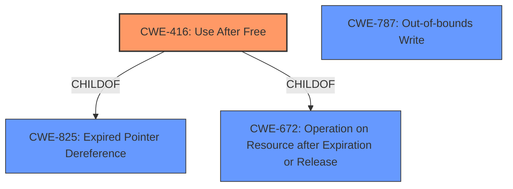

# Raw Analyzer Response for CVE-2021-0310

# Summary
| CWE ID | CWE Name | Confidence | CWE Abstraction Level | CWE Vulnerability Mapping Label | CWE-Vulnerability Mapping Notes |
|---|---|---|---|---|---|
| CWE-416 | Use After Free | 1.0 | Variant | Allowed | Primary CWE |
| CWE-825 | Expired Pointer Dereference | 0.7 | Base | Allowed | Secondary Candidate |
| CWE-672 | Operation on Resource after Expiration or Release | 0.6 | Class | Allowed-with-Review | Secondary Candidate |
| CWE-787 | Out-of-bounds Write | 0.5 | Base | Allowed | Secondary Candidate |

## Evidence and Confidence

*   **Confidence Score:** 1.0
*   **Evidence Strength:** HIGH

## Relationship Analysis
The primary CWE is CWE-416, **Use After Free**, which is a Variant of CWE-825, **Expired Pointer Dereference**, and CWE-672, **Operation on Resource after Expiration or Release**. CWE-416 can be caused by improper resource management. CWE-787, **Out-of-bounds Write**, was also considered due to the **memory corruption** aspect but ultimately deemed less accurate.

## Vulnerability Chain
The vulnerability chain starts with a shared pointer ownership issue between `LazyServiceRegistrar` and `ServiceManager`, leading to a **use-after-free** condition. This **use-after-free** results in **memory corruption** and potential escalation of privileges.

## Summary of Analysis
The primary weakness is a **use-after-free** vulnerability, as explicitly stated in the vulnerability description: "there is a possible **memory corruption** due to a **use after free**." The CVE Reference Links Content Summary further reinforces this, stating that the root cause is an issue related to shared pointer ownership between `LazyServiceRegistrar` and `ServiceManager`, leading to potential double frees or **use-after-free** scenarios. The fix involved adding a layer of indirection to manage the lifecycle of the callback object, preventing the **use-after-free**.

CWE-416, **Use After Free**, is the most appropriate CWE because it accurately describes the vulnerability where memory is reused or referenced after it has been freed. This directly matches the vulnerability description and the CVE reference details. The abstraction level of Variant is also appropriate as it's a specific type of memory management error.

CWE-825, **Expired Pointer Dereference**, was considered as a parent of CWE-416, but since the specific condition is **use-after-free**, the child CWE is more accurate.

CWE-672, **Operation on Resource after Expiration or Release**, was considered as another parent of CWE-416, but again the specific condition is **use-after-free**, the child CWE is more accurate.

CWE-787, **Out-of-bounds Write**, was considered because the vulnerability description mentions "**memory corruption**". However, the root cause is the **use-after-free**, not an out-of-bounds write directly. The **memory corruption** is a consequence of the **use-after-free**. Therefore, CWE-416 is more directly related to the root cause.