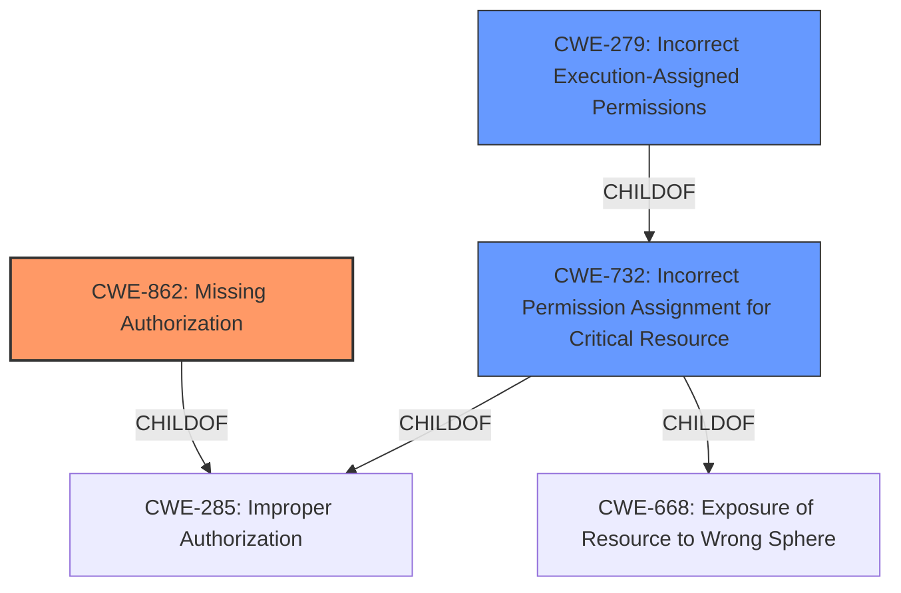

# Enhanced Analysis for CVE-2021-0317

# Summary
| CWE ID  | CWE Name                                                                     | Confidence | CWE Abstraction Level | CWE Vulnerability Mapping Label | CWE-Vulnerability Mapping Notes |
| :-------- | :--------------------------------------------------------------------------- | :---------- | :---------------------- | :------------------------------ | :------------------------------ |
| CWE-862   | Missing Authorization                                                        | 0.85       | Class                  | Primary                          | Allowed-with-Review              |
| CWE-732   | Incorrect Permission Assignment for Critical Resource                      | 0.65       | Class                  | Secondary                         | Allowed-with-Review              |
| CWE-279   | Incorrect Execution-Assigned Permissions                                   | 0.55       | Variant                  | Secondary                         | Allowed              |

## Evidence and Confidence

*   **Confidence Score:** 0.75
*   **Evidence Strength:** MEDIUM

## Relationship Analysis
The primary selection is CWE-862 [Missing Authorization], which is a class-level CWE. This is related to CWE-285 [Improper Authorization], but is more specific. CWE-732 [Incorrect Permission Assignment for Critical Resource] is another class-level CWE that is potentially relevant, especially since the vulnerability description mentions "permission escalation". However, since the root cause is a "**logic error**" leading to the missing authorization check, CWE-862 is more appropriate. CWE-279 [Incorrect Execution-Assigned Permissions] is a variant of CWE-732 and is more specific, but lacks sufficient evidence and is only weakly supported.



## Vulnerability Chain
The vulnerability chain starts with a "**logic error**" in the `createOrUpdate` function of `Permission.java`, which leads to **missing authorization** and subsequently **permission escalation**.

## Summary of Analysis
Initially, the vulnerability was analyzed with a focus on permission escalation, which led to considering CWE-732 [Incorrect Permission Assignment for Critical Resource]. However, the key phrase "**logic error**" combined with the CVE Reference Link's mention of "Improper permission handling" indicates that the core issue is a **missing authorization** check. CWE-862 [Missing Authorization] aligns better with the root cause of the vulnerability as it directly addresses the absence of an authorization mechanism.

The evidence supporting this decision includes:
- Vulnerability Description Key Phrases: "**logic error**"
- CVE Reference Links Content Summary: "**Improper permission handling**"

Therefore, CWE-862 is selected as the primary CWE, and CWE-732 is considered as a secondary CWE due to the impact of permission escalation. CWE-279 could be a potential option if there was more evidence to support that the permissions were set incorrectly during execution, but the information is insufficient.

CWE-908 [Use of Uninitialized Resource], CWE-223 [Omission of Security-relevant Information], and CWE-1021 [Improper Restriction of Rendered UI Layers or Frames] were considered but deemed not applicable because they did not accurately reflect the core issue of **missing authorization** due to a **logic error**.


## CWE Relationship Analysis

Current CWEs represent these abstraction levels: .


### Vulnerability Chain Analysis

**Chain starting from CWE-732:**
- 732 (Incorrect Permission Assignment for Critical Resource) - ROOT


**Chain starting from CWE-862:**
- 862 (Missing Authorization) - ROOT


### CWE Relationship Diagram

```mermaid
graph TD
    classDef primary fill:#f96,stroke:#333,stroke-width:2px
    classDef secondary fill:#69f,stroke:#333
    classDef tertiary fill:#9e9,stroke:#333
```