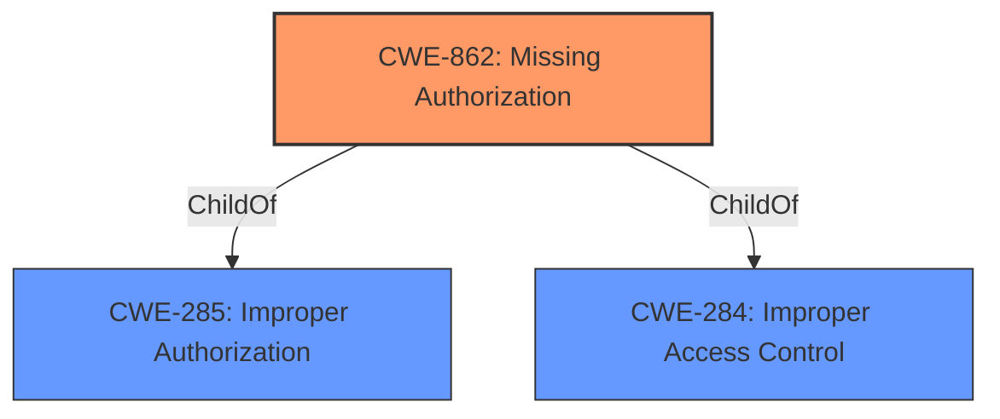

# Analysis Report for CVE-2021-0319

# Vulnerability Analysis Report: CVE-2021-0319

## Description


## Analysis (with Relationship Data)

# Summary
| CWE ID | CWE Name | Confidence | CWE Abstraction Level | CWE Vulnerability Mapping Label | CWE-Vulnerability Mapping Notes |
|---|---|---|---|---|---|
| CWE-862 | Missing Authorization | 0.9 | Class | Allowed-with-Review | Primary CWE |

## Evidence and Confidence

*   **Confidence Score:** 0.9
*   **Evidence Strength:** HIGH

## Relationship Analysis
The primary relationship influencing the CWE selection is the parent-child relationship between CWE-862 (Missing Authorization) and its potential base-level children. The analysis focuses on identifying whether a more specific child CWE would be a better fit, but the provided information is limited, so the class level is used.



## Vulnerability Chain
The chain of events is as follows:
1.  **Root Cause:** **Permissions bypass** in `checkCallerIsSystemOr` function.
2.  **Weakness:** Missing authorization check, allowing unauthorized access to functionality.
3.  **Impact:** Ability to get nearby Bluetooth devices' MAC address without appropriate permissions.
This represents a direct cause-and-effect relationship: the **permissions bypass** directly leads to unauthorized access and the ability to obtain sensitive information.

## Summary of Analysis
The analysis centers around identifying the core weakness that allows an attacker to get nearby Bluetooth devices' MAC address without proper permissions. The vulnerability description explicitly mentions a "**permissions bypass**" in the `checkCallerIsSystemOr` function. This directly points to a failure in authorization.

The Retriever Results strongly suggest CWE-862 (Missing Authorization) as a potential candidate. The description of CWE-862, "The product does not perform an authorization check when an actor attempts to access a resource or perform an action," aligns directly with the **permissions bypass** described in the vulnerability. The vulnerability allows an attacker to perform an action (getting MAC addresses) without the necessary authorization checks being performed.

Other CWEs were considered but ultimately deemed less suitable:

*   CWE-1021 (Improper Restriction of Rendered UI Layers or Frames): This CWE is related to UI-based vulnerabilities like clickjacking, which is not relevant to the described **permissions bypass**.
*   CWE-755 (Improper Handling of Exceptional Conditions): While a **permissions bypass** could be considered an exceptional condition, the root cause is more specifically related to missing authorization checks.
*   CWE-732 (Incorrect Permission Assignment for Critical Resource): While related to permissions, this CWE focuses on misconfigured permissions rather than a complete lack of authorization checks. The description notes: "While the name itself indicates an assignment of permissions for resources, this is often misused for vulnerabilities in which "permissions" are not checked, which is an "authorization" weakness (CWE-285 or descendants) within CWE's model [REF-1287]."
*   CWE-223 (Omission of Security-relevant Information): This CWE is about missing logging or display of security-relevant information, not a **permissions bypass**.
*   CWE-927 (Use of Implicit Intent for Sensitive Communication): This CWE is specific to Android applications using implicit intents, which is not described in the vulnerability.
*   CWE-386 (Symbolic Name not Mapping to Correct Object): This CWE does not fit the vulnerability description, so it is not relevant.
*   CWE-667 (Improper Locking): This CWE is for concurrency issues which is unrelated to the vulnerability description.
*   CWE-941 (Incorrectly Specified Destination in a Communication Channel): This CWE does not fit the vulnerability description, so it is not relevant.
*   CWE-362 (Concurrent Execution using Shared Resource with Improper Synchronization ('Race Condition')) - This CWE is related to concurrency issues, which is not indicated in the vulnerability description.

The MITRE mapping guidance for CWE-862 suggests reviewing its children for a better fit. However, without more specific details about how the authorization check is missing, the class-level CWE-862 remains the most appropriate choice.

The decision is based on the direct evidence of a "**permissions bypass**" and the strong alignment of this concept with the definition of CWE-862. The confidence level is high (0.9) due to the clear connection between the vulnerability description and the CWE definition.


## CWE Relationship Analysis

Current CWEs represent these abstraction levels: .


### Vulnerability Chain Analysis

**Chain starting from CWE-732:**
- 732 (Incorrect Permission Assignment for Critical Resource) - ROOT


**Chain starting from CWE-667:**
- 667 (Improper Locking) - ROOT


### CWE Relationship Diagram

```mermaid
graph TD
    classDef primary fill:#f96,stroke:#333,stroke-width:2px
    classDef secondary fill:#69f,stroke:#333
    classDef tertiary fill:#9e9,stroke:#333
```


*Report generated on 2025-04-02 07:14:53*
