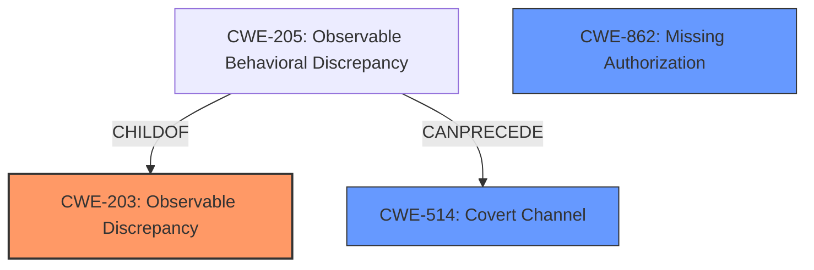

# Analysis for CVE-2021-0321

# Summary
| CWE ID | CWE Name | Confidence | CWE Abstraction Level | CWE Vulnerability Mapping Label | CWE-Vulnerability Mapping Notes |
|---|---|---|---|---|---|
| CWE-203 | Observable Discrepancy | 0.9 | Base | Allowed | Primary CWE |
| CWE-862 | Missing Authorization | 0.7 | Class | Allowed-with-Review | Secondary Candidate |
| CWE-514 | Covert Channel | 0.6 | Class | Allowed-with-Review | Secondary Candidate |

## Evidence and Confidence

*   **Confidence Score:** 0.9
*   **Evidence Strength:** HIGH

## Relationship Analysis
The primary CWE selected is CWE-203, which describes a vulnerability where the product's behavior or responses differ in observable ways, revealing security-relevant information. This CWE is a Base level, which is preferred. It is related to CWE-205 which is a child of CWE-203 and describes "Observable Behavioral Discrepancy". The vulnerability description explicitly mentions "side channel information disclosure", making CWE-203 a strong fit.

CWE-862, "Missing Authorization", and CWE-514, "Covert Channel" were considered as they both relate to information disclosure via unintended means. However, they are both class level CWEs which are less specific. CWE-862 implies a direct lack of authorization which isn't explicitly described, and CWE-514 describes a broader category of unintended information transfer.

## Vulnerability Chain
The vulnerability chain starts with the **IMPROPER** implementation in `enforceDumpPermissionForPackage` which leads to **SIDE CHANNEL INFORMATION DISCLOSURE**.

## Summary of Analysis
The initial analysis focused on identifying the root cause and the mechanism of information disclosure. The key phrase "side channel information disclosure" strongly suggests CWE-203. The evidence from "CVE Reference Links Content Summary" highlights the **IMPROPER** authorization checks when accessing application exit reasons, which could also suggest CWE-862. However, the primary issue is the observable discrepancy that reveals information about package installation, making CWE-203 the most appropriate primary mapping.

The final decision is based on the fact that the vulnerability enables an attacker to "determine if a package is installed" due to "side channel information disclosure." This aligns directly with the description of CWE-203: "The product behaves differently or sends different responses under different circumstances in a way that is observable to an unauthorized actor, which exposes security-relevant information about the state of the product." CWE-203 is also a Base level CWE, which is the preferred level of abstraction.

CWE-514 and CWE-862 were considered but ultimately deemed less specific.

Relevant CWE Information:
- CWE-203: Observable Discrepancy
- CWE-862: Missing Authorization
- CWE-514: Covert Channel