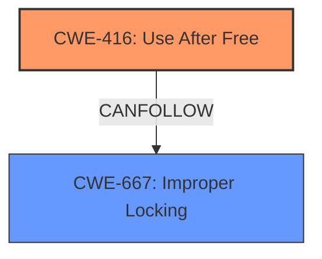

# Raw Analyzer Response for CVE-2021-0330

# Summary
| CWE ID  | CWE Name                                                                                                 | Confidence | CWE Abstraction Level | CWE Vulnerability Mapping Label | CWE-Vulnerability Mapping Notes |
| :-------- | :--------------------------------------------------------------------------------------------------------- | :---------- | :---------------------- | :------------------------------ | :-------------------------------- |
| CWE-416   | Use After Free                                                                                           | 1          | Variant               | Allowed                        | Primary CWE                          |
| CWE-667   | Improper Locking                                                                                           | 0.9         | Class                 | Allowed-with-Review           | Secondary CWE                         |

## Evidence and Confidence

*   **Confidence Score:** 0.95
*   **Evidence Strength:** HIGH

## Relationship Analysis

The primary relationship is that **improper locking** (CWE-667) can lead to a **use-after-free** vulnerability (CWE-416). CWE-416 is a variant, offering a more specific description of the memory corruption issue. CWE-667 is a class and might have more specific children.

## Vulnerability Chain

The chain of events is as follows:
1.  **ROOT CAUSE:** **Improper locking** (CWE-667) in `add_user_ce` and `remove_user_ce` functions.
2.  **WEAKNESS:** This leads to a **use-after-free** condition (CWE-416).
3.  **IMPACT:** Local escalation of privilege.

## Summary of Analysis

The vulnerability description clearly indicates a **use-after-free** condition resulting from **improper locking**. The **Vulnerability Description Key Phrases** section explicitly identifies these as the **weakness** and **rootcause**, respectively. The CVE Reference Links Content Summary supports this by stating that the root cause is a lack of thread safety.

The Retriever Results also list CWE-416 and CWE-667 as highly relevant. CWE-416 is at the Variant level, while CWE-667 is at the Class level. Given the available evidence, CWE-416 is the most specific and appropriate choice for the primary CWE.

CWE-667 (Improper Locking) is included as a secondary CWE because the vulnerability description explicitly mentions it as the root cause. The relationship analysis confirms that improper locking can lead to race conditions and subsequent memory corruption issues like use-after-free.

I am overriding the general mapping guidance to select a Class level CWE as a secondary CWE because the description explicitly mentions it.

Relevant CWE Information:

# Enhanced Context (25 CWEs)

## CWE-667: Improper Locking
**Abstraction Level**: Class
**Similarity Score**: 0.78
**Source**: dense

**Description**:
The product does not properly acquire or release a lock on a resource, leading to unexpected resource state changes and behaviors.

**Mapping Guidance**:
- Usage: Allowed-with-Review
- Rationale: This CWE entry is a Class and might have Base-level children that would be more appropriate

## CWE-416: Use After Free
**Abstraction Level**: variant
**Similarity Score**: 4.53
**Source**: graph

**Description**:
CWE-416: Use After Free

**Mapping Guidance**:
- Usage: Allowed
- Rationale: This CWE entry is at the Variant level of abstraction, which is a preferred level of abstraction for mapping to the root causes of vulnerabilities.