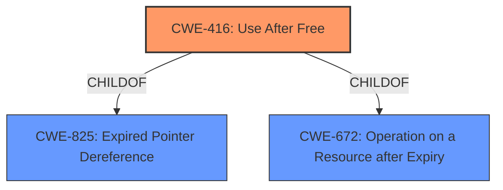

# Enhanced Analysis for CVE-2021-0335

# Summary
| CWE ID | CWE Name | Confidence | CWE Abstraction Level | CWE Vulnerability Mapping Label | CWE-Vulnerability Mapping Notes |
|---|---|---|---|---|---|
| CWE-416 | Use After Free | 1.0 | Variant | Allowed | Primary CWE |

## Evidence and Confidence

*   **Confidence Score:** 1.0
*   **Evidence Strength:** HIGH

## Relationship Analysis
The primary relationship that impacted my decision was the ChildOf relationship between CWE-416 (Use After Free) and CWE-825 (Expired Pointer Dereference). CWE-416 being a variant of CWE-825 further validates the selection of CWE-416 as the more specific and appropriate classification in this instance. No chain relationships were relevant to this particular vulnerability.



## Vulnerability Chain
The vulnerability chain for the Description is `Use After Free` leading to `Out-of-bounds Write` and finally `remote information disclosure`.

## Summary of Analysis
My analysis concludes that **CWE-416 (Use After Free)** is the most appropriate classification for the vulnerability described. This determination is strongly supported by the explicit mention of "**use after free**" in the Vulnerability Description Key Phrases section. The CVE Reference Links Content Summary further reinforces this by detailing the vulnerability's root cause as improper handling of surface propagation which leads to memory being accessed after it has been freed.

The selection of **CWE-416 (Use After Free)** is also supported by its Variant level of abstraction, which is a preferred level for mapping vulnerabilities according to MITRE's guidelines. The retriever results list **CWE-416 (Use After Free)** as a possible candidate with a score of 0.363. The primary deciding factor was the explicit mention of the root cause "**use after free**".

The other CWEs listed in the Retriever Results were considered but ultimately deemed less suitable because they represent different aspects of memory management and concurrent execution. For example, CWE-362 (Concurrent Execution using Shared Resource with Improper Synchronization) and CWE-667 (Improper Locking) focus on concurrency issues, which are not explicitly described in the vulnerability. Similarly, CWE-908 (Use of Uninitialized Resource) and CWE-665 (Improper Initialization) relate to initialization problems, whereas the vulnerability explicitly involves a "**use after free**" condition, indicating that the memory was indeed initialized at some point.

The evidence for this selection is the Vulnerability Description Key Phrases which states "**rootcause: use after free**" as well as the CVE Reference Links Content Summary which states "The vulnerability lies in how the Media Framework component handles surface propagation between an original and a released surface."

Relevant CWE Information:

# Enhanced Context (25 CWEs)

## CWE-416: Use After Free
**Abstraction:** Variant
**Status:** Stable

### Description
The product reuses or references memory after it has been freed. At some point afterward, the memory may be allocated again and saved in another pointer, while the original pointer references a location somewhere within the new allocation. Any operations using the original pointer are no longer valid because the memory "belongs" to the code that operates on the new pointer.

### Extended Description
Not provided

### Alternative Terms
Dangling pointer: a pointer that no longer points to valid memory, often after it has been freed
UAF: commonly used acronym for Use After Free
Use-After-Free

### Relationships
ChildOf -> CWE-825
ChildOf -> CWE-672
ChildOf -> CWE-672
ChildOf -> CWE-672
CanPrecede -> CWE-120
CanPrecede -> CWE-123

### Mapping Guidance
**Usage:** Allowed
**Rationale:** This CWE entry is at the Variant level of abstraction, which is a preferred level of abstraction for mapping to the root causes of vulnerabilities.
**Comments:** Carefully read both the name and description to ensure that this mapping is an appropriate fit. Do not try to 'force' a mapping to a lower-level Base/Variant simply to comply with this preferred level of abstraction.
**Reasons:**
- Acceptable-Use

### Observed Examples
- **CVE-2022-20141:** Chain: an operating system kernel has insufficent resource locking (CWE-413) leading to a use after free (CWE-416).
- **CVE-2022-2621:** Chain: two threads in a web browser use the same resource (CWE-366), but one of those threads can destroy the resource before the other has completed (CWE-416).
- **CVE-2021-0920:** Chain: mobile platform race condition (CWE-362) leading to use-after-free (CWE-416), as exploited in the wild per CISA KEV.


## CWE Relationship Analysis

Current CWEs represent these abstraction levels: .


### Vulnerability Chain Analysis

**Chain starting from CWE-667:**
- 667 (Improper Locking) - ROOT


**Chain starting from CWE-123:**
- 123 (Write-what-where Condition) - ROOT


### CWE Relationship Diagram

```mermaid
graph TD
    classDef primary fill:#f96,stroke:#333,stroke-width:2px
    classDef secondary fill:#69f,stroke:#333
    classDef tertiary fill:#9e9,stroke:#333
```