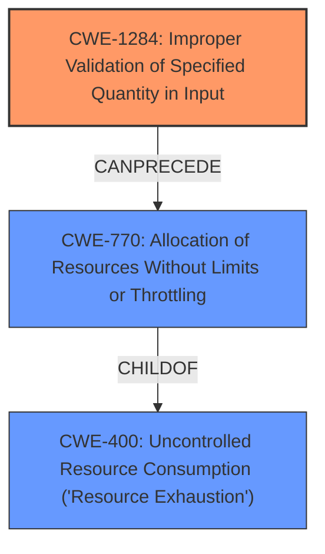

# Raw Analyzer Response for CVE-2021-0338

# Summary
| CWE ID  | CWE Name   | Confidence | CWE Abstraction Level | CWE Vulnerability Mapping Label | CWE-Vulnerability Mapping Notes |
| ----------- | ----------- | ----------- | ----------- | ----------- | ----------- |
| CWE-1284 | Improper Validation of Specified Quantity in Input  | 0.9 | Base | Allowed | Primary CWE |
| CWE-770 | Allocation of Resources Without Limits or Throttling   | 0.7 | Base | Allowed | Secondary Candidate |
| CWE-400  | Uncontrolled Resource Consumption ('Resource Exhaustion') | 0.6 | Class | Allowed-with-Review | Secondary Candidate |

## Evidence and Confidence

*   **Confidence Score:** 0.9
*   **Evidence Strength:** HIGH

## Relationship Analysis
The primary CWE selected is CWE-1284, which represents the **improper validation of a specified quantity in input**. This is a base-level CWE, indicating a specific weakness. It can **precede** CWE-789 (Memory Allocation with Excessive Size Value). The vulnerability involves **missing bounds checks**, which directly relates to failing to validate a quantity.

CWE-770 is a child of CWE-400, indicating that allocating resources without limits can lead to resource exhaustion. Although the vulnerability description mentions a denial-of-service, which is often a result of resource exhaustion, the root cause is the **missing bounds checks**. Therefore, CWE-1284 precedes CWE-770 which leads to CWE-400.

## Vulnerability Chain
The vulnerability chain starts with the **missing bounds checks** (CWE-1284), which allows for an excessive quantity to be specified. This leads to allocating resources without limits or throttling (CWE-770), eventually resulting in uncontrolled resource consumption and denial of service (CWE-400).

## Summary of Analysis
The analysis is based on the provided evidence, specifically the vulnerability description highlighting the **missing bounds checks** on UI settings, which can lead to a permanent denial of service. The commit message `[SettingsProvider] fix font size scale validator` and the bug ID `BUG: 156260178` further supports the notion of **improper input validation** related to a quantity (font size scale).

The graph relationships influenced the final selection by emphasizing the progression from improper input validation to resource exhaustion. CWE-1284 is the most specific and accurate representation of the root cause, as it directly addresses the **missing validation of the specified quantity**. The other CWE candidates, such as CWE-770 and CWE-400, represent the consequences of this root cause.

# Relevant CWE Information:

## CWE-1289: Improper Validation of Unsafe Equivalence in Input
**Abstraction Level**: Base
**Similarity Score**: 0.78
**Source**: dense

**Description**:
The product receives an input value that is used as a resource identifier or other type of reference, but it does not validate or incorrectly validates that the input is equivalent to a potentially-unsafe value.

**Mapping Guidance**:
- Usage: Allowed
- Rationale: This CWE entry is at the Base level of abstraction, which is a preferred level of abstraction for mapping to the root causes of vulnerabilities.

This CWE was considered, but it is more relevant when the input is used as a resource identifier and compared to an unsafe value. The provided vulnerability is a **missing bounds check** on UI settings which is better described by CWE-1284.

## CWE-754: Improper Check for Unusual or Exceptional Conditions
**Abstraction Level**: Class
**Similarity Score**: 0.75
**Source**: dense

**Description**:
The product does not check or incorrectly checks for unusual or exceptional conditions that are not expected to occur frequently during day to day operation of the product.

**Mapping Guidance**:
- Usage: Allowed-with-Review
- Rationale: This CWE entry is a Class and might have Base-level children that would be more appropriate

CWE-754 is too general. The vulnerability is about **missing bounds checks** on input, which is more specific than just unusual or exceptional conditions.

## CWE-404: Improper Resource Shutdown or Release
**Abstraction Level**: Class
**Similarity Score**: 0.74
**Source**: dense

**Description**:
The product does not release or incorrectly releases a resource before it is made available for re-use.

**Mapping Guidance**:
- Usage: Allowed-with-Review
- Rationale: This CWE entry is a Class and might have Base-level children that would be more appropriate

This CWE is about releasing resources, which is not relevant to the **missing bounds checks** vulnerability.

## CWE-606: Unchecked Input for Loop Condition
**Abstraction Level**: Base
**Similarity Score**: 0.74
**Source**: dense

**Description**:
The product does not properly check inputs that are used for loop conditions, potentially leading to a denial of service or other consequences because of excessive looping.

**Mapping Guidance**:
- Usage: Allowed
- Rationale: This CWE entry is at the Base level of abstraction, which is a preferred level of abstraction for mapping to the root causes of vulnerabilities.

This CWE is similar to CWE-1284, but it's specific to loop conditions. The vulnerability isn't explicitly about loop conditions, so CWE-1284 is a better fit.

## CWE-703: Improper Check or Handling of Exceptional Conditions
**Abstraction Level**: Pillar
**Similarity Score**: 0.74
**Source**: dense

**Description**:
The product does not properly anticipate or handle exceptional conditions that rarely occur during normal operation of the product.

**Mapping Guidance**:
- Usage: Discouraged
- Rationale: This CWE entry is extremely high-level, a Pillar.

This CWE is too abstract and doesn't capture the specific nature of the **missing bounds checks** vulnerability.

## CWE-667: Improper Locking
**Abstraction Level**: Class
**Similarity Score**: 0.74
**Source**: dense

**Description**:
The product does not properly acquire or release a lock on a resource, leading to unexpected resource state changes and behaviors.

**Mapping Guidance**:
- Usage: Allowed-with-Review
- Rationale: This CWE entry is a Class and might have Base-level children that would be more appropriate

This CWE is about improper locking, which is not related to the **missing bounds checks** vulnerability.

## CWE-807: Reliance on Untrusted Inputs in a Security Decision
**Abstraction Level**: Base
**Similarity Score**: 0.74
**Source**: dense

**Description**:
The product uses a protection mechanism that relies on the existence or values of an input, but the input can be modified by an untrusted actor in a way that bypasses the protection mechanism.

**Mapping Guidance**:
- Usage: Allowed
- Rationale: This CWE entry is at the Base level of abstraction, which is a preferred level of abstraction for mapping to the root causes of vulnerabilities.

This CWE is about relying on untrusted inputs for security decisions. The **missing bounds checks** vulnerability doesn't fit this description.

## CWE-183: Permissive List of Allowed Inputs
**Abstraction Level**: Base
**Similarity Score**: 0.73
**Source**: dense

**Description**:
The product implements a protection mechanism that relies on a list of inputs (or properties of inputs) that are explicitly allowed by policy because the inputs are assumed to be safe, but the list is too permissive - that is, it allows an input that is unsafe, leading to resultant weaknesses.

**Mapping Guidance**:
- Usage: Allowed
- Rationale: This CWE entry is at the Base level of abstraction, which is a preferred level of abstraction for mapping to the root causes of vulnerabilities.

This CWE is about a permissive list of allowed inputs, which is not relevant to the **missing bounds checks** vulnerability.

## CWE-226: Sensitive Information in Resource Not Removed Before Reuse
**Abstraction Level**: Base
**Similarity Score**: 0.73
**Source**: dense

**Description**:
The product releases a resource such as memory or a file so that it can be made available for reuse, but it does not clear or "zeroize" the information contained in the resource before the product performs a critical state transition or makes the resource available for reuse by other entities.

**Mapping Guidance**:
- Usage: Allowed
- Rationale: This CWE entry is at the Base level of abstraction, which is a preferred level of abstraction for