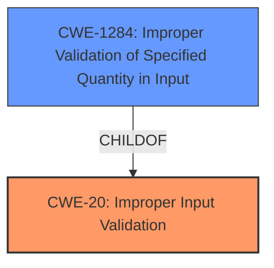

# Raw Analyzer Response for CVE-2021-0340

# Summary
| CWE ID | CWE Name | Confidence | CWE Abstraction Level | CWE Vulnerability Mapping Label | CWE-Vulnerability Mapping Notes |
|---|---|---|---|---|---|
| CWE-20 | Improper Input Validation | 0.7 | Class | Primary | Discouraged |
| CWE-1284 | Improper Validation of Specified Quantity in Input | 0.6 | Base | Secondary | Allowed |

## Evidence and Confidence

*   **Confidence Score:** 0.7
*   **Evidence Strength:** MEDIUM

## Relationship Analysis
The primary CWE is CWE-20 **Improper Input Validation**, which is a class-level CWE. CWE-1284 **Improper Validation of Specified Quantity in Input** is a more specific base-level CWE and a child of CWE-20.

## Vulnerability Chain
The vulnerability chain starts with **improper input validation** (CWE-20) in the `parseNextBox` function, leading to a potential leak of unredacted location information. The **improper input validation** could involve a quantity, leading to the more specific CWE-1284.

## Summary of Analysis
The initial analysis identified **improper input validation** as the root cause, which maps to CWE-20. The retriever results also included CWE-20, but it is marked as "Discouraged" with a suggestion to consider lower-level children. The vulnerability description mentions parsing box lengths, which suggests a quantity. Therefore, CWE-1284 **Improper Validation of Specified Quantity in Input** is considered as a more specific candidate.

The evidence from the vulnerability description and CVE reference links content summary supports this analysis:

*   **Vulnerability Description Key Phrases:** "**improper input validation**"
*   **CVE Reference Links Content Summary:** "The vulnerability lies in how the `IsoInterface` handles box lengths in video files, specifically for lengths of 0 and 1. The previous code didn't recognize these special cases, leading to incorrect parsing of video files."

Based on the evidence, the code **does not validate or incorrectly validates** the input related to box lengths in video files. This aligns with the description of CWE-1284, which states: "The product receives input that is expected to specify a quantity (such as size or length), but it **does not validate or incorrectly validates** that the quantity has the required properties."

While CWE-20 is a valid high-level classification, CWE-1284 provides a more specific and accurate representation of the vulnerability related to **improper validation** of box lengths. Although the primary identified weakness is **improper input validation**, which is CWE-20, the details point to the length of the box.

Relevant CWE Information:

# Enhanced Context (25 CWEs)
The following CWEs were identified as potentially relevant to this vulnerability:

## CWE-1289: Improper Validation of Unsafe Equivalence in Input
**Abstraction Level**: Base
**Similarity Score**: 0.75
**Source**: dense

**Description**:
The product receives an input value that is used as a resource identifier or other type of reference, but it does not validate or incorrectly validates that the input is equivalent to a potentially-unsafe value.

**Mapping Guidance**:
- Usage: Allowed
- Rationale: This CWE entry is at the Base level of abstraction, which is a preferred level of abstraction for mapping to the root causes of vulnerabilities.

I am not using this CWE because it involves equivalence, which is not mentioned in the description.

## CWE-226: Sensitive Information in Resource Not Removed Before Reuse
**Abstraction Level**: Base
**Similarity Score**: 0.75
**Source**: dense

**Description**:
The product releases a resource such as memory or a file so that it can be made available for reuse, but it does not clear or "zeroize" the information contained in the resource before the product performs a critical state transition or makes the resource available for reuse by other entities.

**Mapping Guidance**:
- Usage: Allowed
- Rationale: This CWE entry is at the Base level of abstraction, which is a preferred level of abstraction for mapping to the root causes of vulnerabilities.

I am not using this CWE because it involves resource reuse, which is not mentioned in the description.

## CWE-807: Reliance on Untrusted Inputs in a Security Decision
**Abstraction Level**: Base
**Similarity Score**: 0.75
**Source**: dense

**Description**:
The product uses a protection mechanism that relies on the existence or values of an input, but the input can be modified by an untrusted actor in a way that bypasses the protection mechanism.

**Mapping Guidance**:
- Usage: Allowed
- Rationale: This CWE entry is at the Base level of abstraction, which is a preferred level of abstraction for mapping to the root causes of vulnerabilities.

I am not using this CWE because it focuses on bypass of protection mechanisms which is not discussed in the summary.

## CWE-404: Improper Resource Shutdown or Release
**Abstraction Level**: Class
**Similarity Score**: 0.75
**Source**: dense

**Description**:
The product does not release or incorrectly releases a resource before it is made available for re-use.

**Mapping Guidance**:
- Usage: Allowed-with-Review
- Rationale: This CWE entry is a Class and might have Base-level children that would be more appropriate

I am not using this CWE because it focuses on resources not being released, which is not discussed in the summary.

## CWE-668: Exposure of Resource to Wrong Sphere
**Abstraction Level**: Class
**Similarity Score**: 0.73
**Source**: dense

**Description**:
The product exposes a resource to the wrong control sphere, providing unintended actors with inappropriate access to the resource.

**Mapping Guidance**:
- Usage: Discouraged
- Rationale: CWE-668 is high-level and is often misused as a catch-all when lower-level CWE IDs might be applicable. It is sometimes used for low-information vulnerability reports [REF-1287]. It is a level-1 Class (i.e., a child of a Pillar). It is not useful for trend analysis.

I am not using this CWE because it focuses on exposing a resource, which is not discussed in the summary.

## CWE-665: Improper Initialization
**Abstraction Level**: Class
**Similarity Score**: 0.73
**Source**: dense

**Description**:
The product does not initialize or incorrectly initializes a resource, which might leave the resource in an unexpected state when it is accessed or used.

**Mapping Guidance**:
- Usage: Discouraged
- Rationale: This CWE entry is a level-1 Class (i.e., a child of a Pillar). It might have lower-level children that would be more appropriate

I am not using this CWE because it focuses on resources not being initialized, which is not the main weakness discussed in the summary.

## CWE-754: Improper Check for Unusual or Exceptional Conditions
**Abstraction Level**: Class
**Similarity Score**: 0.73
**Source**: dense

**Description**:
The product does not check or incorrectly checks for unusual or exceptional conditions that are not expected to occur frequently during day to day operation of the product.

**Mapping Guidance**:
- Usage: Allowed-with-Review
- Rationale: This CWE entry is a Class and might have Base-level children that would be more appropriate

I am not using this CWE because it focuses on checking for unusual conditions, which is a broader topic than the **improper input validation** being discussed.

## CWE-664: Improper Control of a Resource Through its Lifetime
**Abstraction Level**: Pillar
**Similarity Score**: 0.73
**Source**: dense

**Description**:
The product does not maintain or incorrectly maintains control over a resource throughout its lifetime of creation, use, and release.

**Mapping Guidance**:
- Usage: Discouraged
- Rationale: This CWE entry is high-level when lower-level children are available.

I am not using this CWE because it is too high-level and doesn't directly address the **improper input validation**.

## CWE-345: Insufficient Verification of Data Authenticity
**Abstraction Level**: Class
**Similarity Score**: 0.73
**Source**: dense

**Description**:
The product does not sufficiently verify the origin or authenticity of data, in a way that causes it to accept invalid data.

**Mapping Guidance**:
- Usage: Discouraged
- Rationale: This CWE entry is a level-1 Class (i.e., a child of a Pillar). It might have lower-level children that would be more appropriate

I am not using this CWE because it focuses on data authenticity, which is not the primary weakness.

## CWE-667: Improper Locking
**Abstraction Level**: Class
**Similarity Score**: 0.7