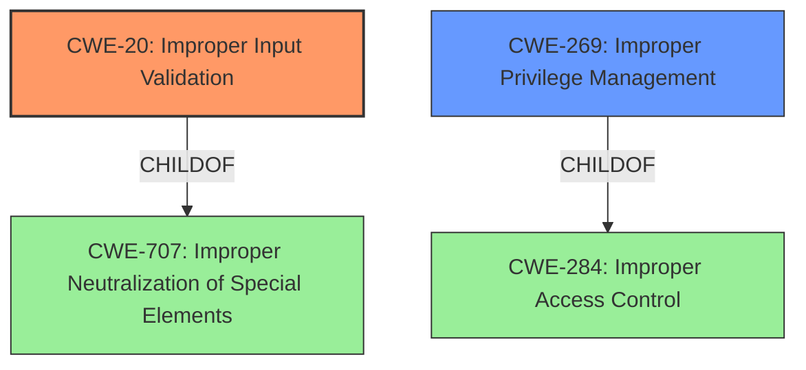

# Raw Analyzer Response for CVE-2021-0345

# Summary
| CWE ID | CWE Name | Confidence | CWE Abstraction Level | CWE Vulnerability Mapping Label | CWE-Vulnerability Mapping Notes |
|---|---|---|---|---|---|
| CWE-20 | Improper Input Validation | 0.8 | Class | Primary | Discouraged |
| CWE-269 | Improper Privilege Management | 0.6 | Class | Secondary | Discouraged |

## Evidence and Confidence

*   **Confidence Score:** 0.7
*   **Evidence Strength:** MEDIUM

## Relationship Analysis
The primary relationship influencing the decision is the hierarchical structure with CWE-20 as a Class, and the guidance to consider more specific children. However, without further information, selecting a more specific child is not possible. CWE-269 is also a Class level CWE, and is a child of CWE-284.

## Vulnerability Chain
The vulnerability chain starts with **improper input validation** (CWE-20), which leads to a local escalation of privilege. The role of **improper privilege management** (CWE-269) could occur because the **improper input validation** led to a privilege being improperly assigned or checked.

## Summary of Analysis
The initial analysis focused on identifying the root cause of the vulnerability, which is described as **improper input validation**. This aligns directly with CWE-20. The vulnerability description mentions a possible escalation of privilege, which suggests **improper privilege management** (CWE-269) as a secondary weakness.

The analysis is primarily based on the provided evidence, specifically the "Vulnerability Description Key Phrases" section, which explicitly states "**rootcause:** **improper input validation**" and "**impact:** local escalation of privilege". The CVE Reference Links Content Summary also points to the root cause being related to a vulnerability.

CWE-20 is a Class-level CWE, and the mapping guidance discourages its use when more specific children are available. However, the provided information is insufficient to determine a more specific child of CWE-20. The retriever results also list CWE-20.

CWE-269 is included as a secondary candidate because the **improper input validation** may have allowed an attacker to perform actions with elevated privileges that should have been restricted. However, it is a less direct cause than CWE-20.

The selected CWEs are at the optimal level of specificity given the available information. While more specific CWEs might exist, there is not enough evidence to justify their selection.

Relevant CWE Information:

# Enhanced Context (25 CWEs)
The following CWEs were identified as potentially relevant to this vulnerability:

## CWE-807: Reliance on Untrusted Inputs in a Security Decision
**Abstraction Level**: Base
**Similarity Score**: 0.76
**Source**: dense

**Description**:
The product uses a protection mechanism that relies on the existence or values of an input, but the input can be modified by an untrusted actor in a way that bypasses the protection mechanism.

**Mapping Guidance**:
- Usage: Allowed
- Rationale: This CWE entry is at the Base level of abstraction, which is a preferred level of abstraction for mapping to the root causes of vulnerabilities.

## CWE-667: Improper Locking
**Abstraction Level**: Class
The product does not properly acquire or release a lock on a resource, leading to unexpected resource state changes and behaviors.
This was not selected because the vulnerability description has nothing to do with locking.

## CWE-1289: Improper Validation of Unsafe Equivalence in Input
**Abstraction Level**: Base
The product receives an input value that is used as a resource identifier or other type of reference, but it does not validate or incorrectly validates that the input is equivalent to a potentially-unsafe value.
This was not selected because the type of **improper input validation** is not known.

## CWE-404: Improper Resource Shutdown or Release
**Abstraction Level**: Class
The product does not release or incorrectly releases a resource before it is made available for re-use.
This was not selected because the vulnerability description has nothing to do with resource shutdown.

## CWE-226: Sensitive Information in Resource Not Removed Before Reuse
**Abstraction Level**: Base
The product releases a resource such as memory or a file so that it can be made available for reuse, but it does not clear or "zeroize" the information contained in the resource before the product performs a critical state transition or makes the resource available for reuse by other entities.
This was not selected because the vulnerability description has nothing to do with clearing sensitive information.

## CWE-754: Improper Check for Unusual or Exceptional Conditions
**Abstraction Level**: Class
The product does not check or incorrectly checks for unusual or exceptional conditions that are not expected to occur frequently during day to day operation of the product.
This was not selected because the vulnerability description has nothing to do with checking unusual conditions.

## CWE-668: Exposure of Resource to Wrong Sphere
**Abstraction Level**: Class
The product exposes a resource to the wrong control sphere, providing unintended actors with inappropriate access to the resource.
This was not selected because the vulnerability description has nothing to do with exposing resources.

## CWE-653: Improper Isolation or Compartmentalization
**Abstraction Level**: Class
The product does not properly compartmentalize or isolate functionality, processes, or resources that require different privilege levels, rights, or permissions.
This was not selected because the vulnerability description has nothing to do with isolation.

## CWE-664: Improper Control of a Resource Through its Lifetime
**Abstraction Level**: Pillar
The product does not maintain or incorrectly maintains control over a resource throughout its lifetime of creation, use, and release.
This was not selected because it is too high-level and the description has nothing to do with resources through its lifetime.

## CWE-665: Improper Initialization
**Abstraction Level**: Class
The product does not initialize or incorrectly initializes a resource, which might leave the resource in an unexpected state when it is accessed or used.
This was not selected because the vulnerability description has nothing to do with initialization.

## CWE-362: Concurrent Execution using Shared Resource with Improper Synchronization ('Race Condition')
**Abstraction Level**: Class
The product contains a concurrent code sequence that requires temporary, exclusive access to a shared resource, but a timing window exists in which the shared resource can be modified by another code sequence operating concurrently.
This was not selected because the vulnerability description has nothing to do with concurrency.

## CWE-367: Time-of-check Time-of-use (TOCTOU) Race Condition
**Abstraction Level**: Base
The product checks the state of a resource before using that resource, but the resource's state can change between the check and the use in a way that invalidates the results of the check. This can cause the product to perform invalid actions when the resource is in an unexpected state.
This was not selected because the vulnerability description has nothing to do with TOCTOU.

## CWE-22: Improper Limitation of a Pathname to a Restricted Directory ('Path Traversal')
**Abstraction Level**: Base
The product uses external input to construct a pathname that is intended to identify a file or directory that is located underneath a restricted parent directory, but the product does not properly neutralize special elements within the pathname that can cause the pathname to resolve to a location that is outside of the restricted directory.
This was not selected because the vulnerability description has nothing to do with path traversal.

## CWE-1284: Improper Validation of Specified Quantity in Input
**Abstraction Level**: Base
The product receives input that is expected to specify a quantity (such as size or length), but it does not validate or incorrectly validates that the quantity has the required properties.
This was not selected because the type of **improper input validation** is not known.

## CWE-73: External Control of File Name or Path
**Abstraction Level**: base
The product allows user input to control or influence paths or file names that are used in filesystem operations.
This was not selected because the vulnerability description has nothing to do with file name control.

## CWE-59: Improper Link Resolution Before File Access ('Link Following')
**Abstraction Level**: base
The product uses external input to construct a pathname that is intended to identify a file or directory that is located underneath a restricted parent directory, but the product does not properly neutralize special elements within the pathname that can cause the pathname to resolve to a location that is outside of the restricted directory.
This was not selected because the vulnerability description has nothing to do with link following.

## CWE-190: Integer Overflow or Wraparound
**Abstraction Level**: base