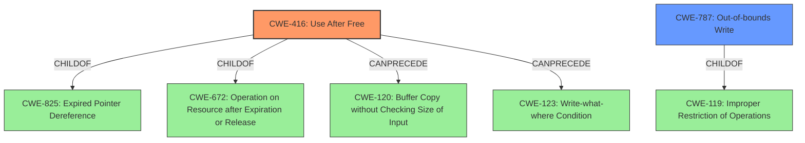

# Enhanced Analysis for CVE-2021-0349

# Summary
| CWE ID | CWE Name | Confidence | CWE Abstraction Level | CWE Vulnerability Mapping Label | CWE-Vulnerability Mapping Notes |
|---|---|---|---|---|---|
| CWE-416 | Use After Free | 1.0 | Variant | Primary | Allowed |
| CWE-787 | Out-of-bounds Write | 0.5 | Base | Secondary | Allowed |

## Evidence and Confidence

*   **Confidence Score:** 0.8
*   **Evidence Strength:** MEDIUM

## Relationship Analysis
The primary CWE is CWE-416, which is a variant of CWE-825 (Expired Pointer Dereference) and CWE-672 (Operation on Resource after Expiration or Release). It can precede CWE-120 (Buffer Copy without Checking Size of Input ('Classic Buffer Overflow')) and CWE-123 (Write-what-where Condition). CWE-787 (Out-of-bounds Write) is a base CWE and a child of CWE-119 (Improper Restriction of Operations within the Bounds of a Memory Buffer). CWE-416 and CWE-787 can be related; a use-after-free can potentially lead to an out-of-bounds write if the freed memory is reallocated and then accessed with the original, now-dangling, pointer.



## Vulnerability Chain
The vulnerability chain starts with a **use after free** (CWE-416), which leads to **memory corruption** and ultimately results in local escalation of privilege.

## Summary of Analysis
Based on the vulnerability description, the primary **rootcause** is a **use after free**. The description explicitly mentions "there is a possible **memory corruption** due to a **use after free**." The primary CWE match for similar CVE descriptions is CWE-787 (Out-of-bounds Write), but CWE-416 (Use After Free) is also a top CWE. Given the explicit mention of "**use after free**" in the description, CWE-416 is the more accurate primary classification. The **memory corruption** mentioned in the description is a potential consequence of the **use after free**, suggesting that if the freed memory is reallocated and then written to, it could lead to an out-of-bounds write (CWE-787). Therefore, I'm including CWE-787 as a secondary candidate with lower confidence.

The evidence relies on the "Vulnerability Description Key Phrases" which identify "**use after free**" as the **rootcause** and "**memory corruption**" as the **weakness**, this evidence is sufficient for a classification.

*CWE Selection Rationale:*

*   **CWE-416 Use After Free:** The vulnerability description explicitly mentions a **use after free**, making this the most direct and appropriate CWE. CWE-416 is a Variant, providing a good level of specificity.
*   **CWE-787 Out-of-bounds Write:** While not explicitly mentioned, the resulting **memory corruption** could be a consequence of writing to the freed memory after it has been reallocated. Therefore, it's a plausible secondary weakness.

I considered other CWEs from the Retriever Results, but they are not as directly relevant as CWE-416 and CWE-787:

*   **CWE-667 Improper Locking, CWE-362 Concurrent Execution using Shared Resource with Improper Synchronization ('Race Condition'):** These relate to concurrency issues, which might be related to the **use after free** but are not explicitly mentioned.
*   **CWE-908 Use of Uninitialized Resource:** This is similar to **use after free**, but the vulnerability description specifically states that the memory was freed, not just uninitialized.
*   **CWE-415 Double Free:** This is a specific type of memory corruption but not directly indicated in the description.
*   **CWE-1285 Improper Validation of Specified Index, Position, or Offset in Input:** This is related to input validation, which is not mentioned in the vulnerability description.
*   **CWE-123 Write-what-where Condition:** This is a more general case of memory corruption, less specific than CWE-787.
*   **CWE-665 Improper Initialization:** Similar to CWE-908, but not directly related to the description.
*   **CWE-862 Missing Authorization:** This is not related to the **use after free** issue.


## CWE Relationship Analysis

Current CWEs represent these abstraction levels: .


### Vulnerability Chain Analysis

**Chain starting from CWE-667:**
- 667 (Improper Locking) - ROOT


**Chain starting from CWE-787:**
- 787 (Out-of-bounds Write) - ROOT


### CWE Relationship Diagram

```mermaid
graph TD
    classDef primary fill:#f96,stroke:#333,stroke-width:2px
    classDef secondary fill:#69f,stroke:#333
    classDef tertiary fill:#9e9,stroke:#333
```