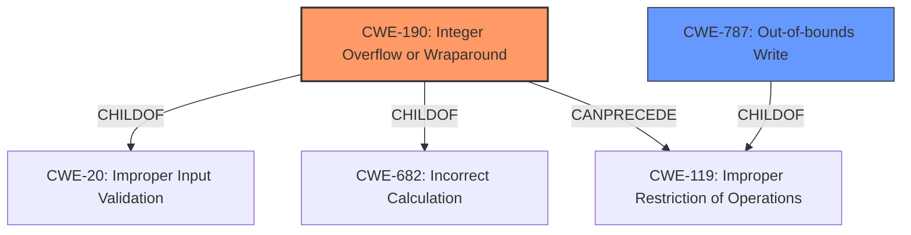

# Analysis Report for CVE-2021-0355

# Vulnerability Analysis Report: CVE-2021-0355

## Description


## Analysis (with Relationship Data)

# Summary
| CWE ID | CWE Name | Confidence | CWE Abstraction Level | CWE Vulnerability Mapping Label | CWE-Vulnerability Mapping Notes |
|---|---|---|---|---|---|
| CWE-190 | Integer Overflow or Wraparound | 1.0 | Base | Allowed | Primary CWE |
| CWE-787 | Out-of-bounds Write | 0.9 | Base | Allowed | Secondary Candidate |

## Evidence and Confidence

*   **Confidence Score:** 0.95
*   **Evidence Strength:** HIGH

## Relationship Analysis
The primary weakness is an **integer overflow** (CWE-190). This can lead to an **out-of-bounds write** (CWE-787). CWE-190 is a base-level CWE and a child of CWE-20 (Improper Input Validation) and CWE-682 (Incorrect Calculation). CWE-787 is also a base-level CWE and a child of CWE-119 (Improper Restriction of Operations Within the Bounds of a Memory Buffer). There's a CANPRECEDE relationship from CWE-190 to CWE-119, indicating the overflow can lead to buffer manipulation issues.



## Vulnerability Chain
The vulnerability chain starts with an **integer overflow** (CWE-190), which then leads to an **out-of-bounds write** (CWE-787). The initial flaw is the integer overflow. This can occur due to **improper input validation** or an **incorrect calculation**, and it results in writing data outside the intended memory region.

## Summary of Analysis
The initial analysis identified the **integer overflow** (CWE-190) as the primary root cause, leading to the **out-of-bounds write** (CWE-787). The vulnerability description key phrases explicitly state "**rootcause:** **integer overflow**" and "**weakness:** **out of bounds write**". This direct evidence strongly supports the selection of these CWEs.

The relationship analysis confirms that CWE-190 can precede CWE-119 (Improper Restriction of Operations Within the Bounds of a Memory Buffer), which is a parent of CWE-787, further solidifying the connection between the overflow and the out-of-bounds write.

The selection of CWE-190 and CWE-787 is at the optimal level of specificity because they are both base-level CWEs that accurately represent the root cause and the resulting weakness, respectively. Other CWEs were considered but not selected because they didn't directly address the root cause and weakness described in the vulnerability. For example, CWE-131 (Incorrect Calculation of Buffer Size) could be related, but the description specifically mentions an **integer overflow**, making CWE-190 a more precise fit.

Relevant CWE Information:

# Enhanced Context (25 CWEs)
The following CWEs were identified as potentially relevant to this vulnerability:

## CWE-366: Race Condition within a Thread
**Abstraction Level**: Base
**Similarity Score**: 0.79
**Source**: dense
...

## CWE-667: Improper Locking
**Abstraction Level**: Class
**Similarity Score**: 0.79
**Source**: dense
...

## CWE-662: Improper Synchronization
**Abstraction Level**: Class
**Similarity Score**: 0.78
**Source**: dense
...

## CWE-362: Concurrent Execution using Shared Resource with Improper Synchronization ('Race Condition')
**Abstraction Level**: Class
**Similarity Score**: 0.78
**Source**: dense
...

## CWE-367: Time-of-check Time-of-use (TOCTOU) Race Condition
**Abstraction Level**: Base
**Similarity Score**: 0.77
**Source**: dense
...

## CWE-404: Improper Resource Shutdown or Release
**Abstraction Level**: Class
**Similarity Score**: 0.75
**Source**: dense
...

## CWE-754: Improper Check for Unusual or Exceptional Conditions
**Abstraction Level**: Class
**Similarity Score**: 0.74
**Source**: dense
...

## CWE-191: Integer Underflow (Wrap or Wraparound)
**Abstraction Level**: Base
**Similarity Score**: 0.74
**Source**: dense
...

## CWE-131: Incorrect Calculation of Buffer Size
**Abstraction Level**: Base
**Similarity Score**: 0.74
**Source**: dense
...

## CWE-226: Sensitive Information in Resource Not Removed Before Reuse
**Abstraction Level**: Base
**Similarity Score**: 0.74
**Source**: dense
...

## CWE-190: Integer Overflow or Wraparound
**Abstraction Level**: Base
**Similarity Score**: 6353.59
**Source**: sparse
...

## CWE-191: Integer Underflow (Wrap or Wraparound)
**Abstraction Level**: Base
**Similarity Score**: 6130.93
**Source**: sparse
...

## CWE-823: Use of Out-of-range Pointer Offset
**Abstraction Level**: Base
**Similarity Score**: 5926.06
**Source**: sparse
...

## CWE-1284: Improper Validation of Specified Quantity in Input
**Abstraction Level**: Base
**Similarity Score**: 5865.00
**Source**: sparse
...

## CWE-125: Out-of-bounds Read
**Abstraction Level**: Base
**Similarity Score**: 5824.81
**Source**: sparse
...

## CWE-123: Write-what-where Condition
**Abstraction Level**: base
**Similarity Score**: 4.82
**Source**: graph
...

## CWE-190: Integer Overflow or Wraparound
**Abstraction Level**: base
**Similarity Score**: 4.33
**Source**: graph
...

## CWE-787: Out-of-bounds Write
**Abstraction Level**: base
**Similarity Score**: 4.33
**Source**: graph
...

## CWE-823: Use of Out-of-range Pointer Offset
**Abstraction Level**: base
**Similarity Score**: 4.33
**Source**: graph
...

## CWE-1284: Improper Validation of Specified Quantity in Input
**Abstraction Level**: base
**Similarity Score**: 4.33
**Source**: graph
...

## CWE-476: NULL Pointer Dereference
**Abstraction Level**: base
**Similarity Score**: 4.33
**Source**: graph
...

## CWE-416: Use After Free
**Abstraction Level**: variant
**Similarity Score**: 4.20
**Source**: graph
...

## CWE-789: Memory Allocation with Excessive Size Value
**Abstraction Level**: variant
**Similarity Score**: 3.75
**Source**: graph
...

## CWE-128: Wrap-around Error
**Abstraction Level**: base
**Similarity Score**: 3.57
**Source**: graph
...

## CWE-1339: Insufficient Precision or Accuracy of a Real Number
**Abstraction Level**: base
**Similarity Score**: 3.57
**Source**: graph
...


## CWE Relationship Analysis

Current CWEs represent these abstraction levels: .


### Vulnerability Chain Analysis

**Chain starting from CWE-754:**
- 754 (Improper Check for Unusual or Exceptional Conditions) - ROOT


**Chain starting from CWE-787:**
- 787 (Out-of-bounds Write) - ROOT


### CWE Relationship Diagram

```mermaid
graph TD
    classDef primary fill:#f96,stroke:#333,stroke-width:2px
    classDef secondary fill:#69f,stroke:#333
    classDef tertiary fill:#9e9,stroke:#333
```


*Report generated on 2025-04-01 22:41:20*
