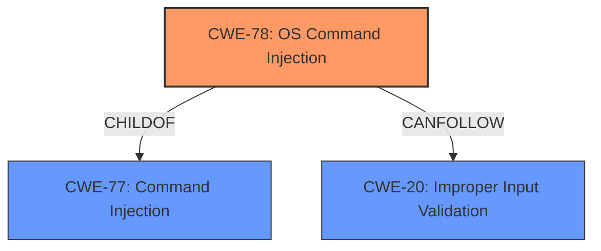

# Raw Analyzer Response for CVE-2021-0356

# Summary
| CWE ID | CWE Name | Confidence | CWE Abstraction Level | CWE Vulnerability Mapping Label | CWE-Vulnerability Mapping Notes |
|---|---|---|---|---|---|
| CWE-78 | Improper Neutralization of Special Elements used in an OS Command ('OS Command Injection') | 1.0 | Base | Allowed | Primary CWE |
| CWE-20 | Improper Input Validation | 0.7 | Class | Discouraged | Secondary Candidate |

## Evidence and Confidence

*   **Confidence Score:** 0.9
*   **Evidence Strength:** HIGH

## Relationship Analysis
The primary relationship influencing the CWE selection is the hierarchical relationship between CWE-78 and CWE-77. CWE-78 ('OS Command Injection') is a base level CWE that is a child of the class level CWE-77 ('Command Injection'). The description clearly indicates that the **command injection** is happening at the OS level. CWE-20 is a high level class that indicates **improper input validation**.

## Vulnerability Chain
The vulnerability chain starts with **improper input validation** (CWE-20), which leads to **command injection** (CWE-78). The impact is local escalation of privilege.

## Summary of Analysis
The analysis is based on the provided vulnerability description, which clearly states that there is a possible **command injection** due to **improper input validation** in netdiag. The key phrases section confirms this with "**rootcause:** **improper input validation**" and "**weakness:** **command injection**". The description also specifies that this could lead to local escalation of privilege.

The Retriever Results list CWE-77 as the top combined result, with CWE-78 as the second. Given the nature of the vulnerability as an OS Command Injection, and that CWE-78 is a base level CWE, it is more appropriate than CWE-77. CWE-20 is also listed, indicating that the root cause is **improper input validation**.

The choice of CWE-78 is at the optimal level of specificity because the vulnerability description explicitly refers to **command injection** at the OS level, which is precisely what CWE-78 describes.
The MITRE mapping guidance for CWE-78 states that it is at the Base level of abstraction, which is a preferred level of abstraction for mapping to the root causes of vulnerabilities, and the Usage is ALLOWED.
CWE-20 is added as a secondary weakness since the root cause is **improper input validation**.

CWE-77 was considered, but not chosen as the primary CWE because the description explicitly refers to an OS command injection, making CWE-78 a more specific and accurate representation of the vulnerability. Although CWE-77 is listed as a top CWE in the retriever results, the documentation for CWE-77 states that it's often misused when OS command injection (CWE-78) was intended instead [REF-1287].
CWE-787 was listed as the primary CWE match for similar CVE descriptions. However, CWE-787 is "Out-of-bounds Write" which is not an accurate description of this vulnerability, so it was not chosen.