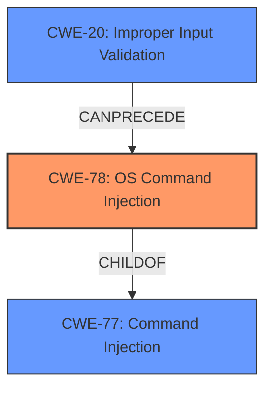

# Raw Analyzer Response for CVE-2021-0358

# Summary
| CWE ID  | CWE Name                                                                      | Confidence | CWE Abstraction Level | CWE Vulnerability Mapping Label | CWE-Vulnerability Mapping Notes |
| ------- | ----------------------------------------------------------------------------- | ---------- | ----------------------- | ------------------------------- | ------------------------------- |
| CWE-78  | Improper Neutralization of Special Elements used in an OS Command ('OS Command Injection') | 0.9        | Base                    | Primary                         | Allowed                       |
| CWE-20  | Improper Input Validation                                                      | 0.7        | Class                    | Secondary                       | Discouraged                     |

## Evidence and Confidence

*   **Confidence Score:** 0.8
*   **Evidence Strength:** HIGH

## Relationship Analysis
The primary relationship that influenced the choice was the ChildOf relationship between CWE-78 and CWE-77, with CWE-78 being a more specific Base case of Command Injection. The CANFOLLOW relationship from CWE-20 to CWE-78 was also considered, as **improper input validation** can lead to command injection.

## Vulnerability Chain
The vulnerability chain starts with **improper input validation** (CWE-20), which allows an attacker to inject malicious commands into the OS command string, leading to OS command injection (CWE-78).

## Summary of Analysis
The initial analysis focused on the **command injection** (**weakness**) due to **improper input validation** (**rootcause**) from the vulnerability description. The primary CWE match from similar CVE descriptions suggested CWE-787 (Out-of-bounds Write), however, the vulnerability description indicates a **command injection** (**weakness**), pointing towards CWE-78 (Improper Neutralization of Special Elements used in an OS Command ('OS Command Injection')).

The **rootcause** is **improper input validation**, which is CWE-20.

The description states: "In netdiag, there is a possible **command injection** due to **improper input validation**. This could lead to local escalation of privilege with System execution privileges needed. User interaction is not needed for exploitation."

The Retriever Results listed CWE-77 (Improper Neutralization of Special Elements used in a Command ('Command Injection')) as the top result and CWE-78 (Improper Neutralization of Special Elements used in an OS Command ('OS Command Injection')) as the second result.

CWE-77 is a Class, and the mapping guidance suggests reviewing for a more specific Base-level entry. CWE-78 is a ChildOf CWE-77. Since the vulnerability involves OS commands, CWE-78 is more appropriate.

CWE-20 (Improper Input Validation) is a Class-level CWE and is often misused. However, it accurately describes the **rootcause** of the vulnerability. It is included as a secondary CWE because the **improper input validation** is the reason for the **command injection**.

The selected CWEs are at the optimal level of specificity because CWE-78 accurately reflects the nature of the **command injection** vulnerability, while CWE-20 reflects the **rootcause** of the injection.

Relevant CWE Information:

# Enhanced Context (25 CWEs)
The following CWEs were identified as potentially relevant to this vulnerability:

## CWE-451: User Interface (UI) Misrepresentation of Critical Information
**Abstraction Level**: Class
**Similarity Score**: 0.77
**Source**: dense

**Description**:
The user interface (UI) does not properly represent critical information to the user, allowing the information - or its source - to be obscured or spoofed. This is often a component in phishing attacks.

**Mapping Guidance**:
- Usage: Allowed-with-Review
- Rationale: This CWE entry is a Class and might have Base-level children that would be more appropriate

## CWE-1021: Improper Restriction of Rendered UI Layers or Frames
**Abstraction Level**: Base
**Similarity Score**: 0.77
**Source**: dense

**Description**:
The web application does not restrict or incorrectly restricts frame objects or UI layers that belong to another application or domain, which can lead to user confusion about which interface the user is interacting with.

**Mapping Guidance**:
- Usage: Allowed
- Rationale: This CWE entry is at the Base level of abstraction, which is a preferred level of abstraction for mapping to the root causes of vulnerabilities.

## CWE-1289: Improper Validation of Unsafe Equivalence in Input
**Abstraction Level**: Base
**Similarity Score**: 0.77
**Source**: dense

**Description**:
The product receives an input value that is used as a resource identifier or other type of reference, but it does not validate or incorrectly validates that the input is equivalent to a potentially-unsafe value.

**Mapping Guidance**:
- Usage: Allowed
- Rationale: This CWE entry is at the Base level of abstraction, which is a preferred level of abstraction for mapping to the root causes of vulnerabilities.

## CWE-404: Improper Resource Shutdown or Release
**Abstraction Level**: Class
**Similarity Score**: 0.77
**Source**: dense

**Description**:
The product does not release or incorrectly releases a resource before it is made available for re-use.

**Mapping Guidance**:
- Usage: Allowed-with-Review
- Rationale: This CWE entry is a Class and might have Base-level children that would be more appropriate

## CWE-667: Improper Locking
**Abstraction Level**: Class
**Similarity Score**: 0.77
**Source**: dense

**Description**:
The product does not properly acquire or release a lock on a resource, leading to unexpected resource state changes and behaviors.

**Mapping Guidance**:
- Usage: Allowed-with-Review
- Rationale: This CWE entry is a Class and might have Base-level children that would be more appropriate

## CWE-807: Reliance on Untrusted Inputs in a Security Decision
**Abstraction Level**: Base
**Similarity Score**: 0.76
**Source**: dense

**Description**:
The product uses a protection mechanism that relies on the existence or values of an input, but the input can be modified by an untrusted actor in a way that bypasses the protection mechanism.

**Mapping Guidance**:
- Usage: Allowed
- Rationale: This CWE entry is at the Base level of abstraction, which is a preferred level of abstraction for mapping to the root causes of vulnerabilities.

## CWE-668: Exposure of Resource to Wrong Sphere
**Abstraction Level**: Class
**Similarity Score**: 0.76
**Source**: dense

**Description**:
The product exposes a resource to the wrong control sphere, providing unintended actors with inappropriate access to the resource.

**Mapping Guidance**:
- Usage: Discouraged
- Rationale: CWE-668 is high-level and is often misused as a catch-all when lower-level CWE IDs might be applicable. It is sometimes used for low-information vulnerability reports [REF-1287]. It is a level-1 Class (i.e., a child of a Pillar). It is not useful for trend analysis.

## CWE-184: Incomplete List of Disallowed Inputs
**Abstraction Level**: Base
**Similarity Score**: 0.76
**Source**: dense

**Description**:
The product implements a protection mechanism that relies on a list of inputs (or properties of inputs) that are not allowed by policy or otherwise require other action to neutralize before additional processing takes place, but the list is incomplete.

**Mapping Guidance**:
- Usage: Allowed
- Rationale: This CWE entry is at the Base level of abstraction, which is a preferred level of abstraction for mapping to the root causes of vulnerabilities.

## CWE-653: Improper Isolation or Compartmentalization
**Abstraction Level**: Class
**Similarity Score**: 0.76
**Source**: dense

**Description**:
The product does not properly compartmentalize or isolate functionality, processes, or resources that require different privilege levels, rights, or permissions.

**Mapping Guidance**:
- Usage: Allowed
- Rationale: This CWE entry is at the Base level of abstraction, which is a preferred level of abstraction for mapping to the root causes of vulnerabilities.

## CWE-41: Improper Resolution of Path Equivalence
**Abstraction Level**: Base
**Similarity Score**: 0.76
**Source**: dense

**Description**:
The product is vulnerable to file system contents disclosure through path equivalence. Path equivalence involves the use of special characters in file and directory names. The associated manipulations are intended to generate multiple names for the same object.

**Mapping Guidance**:
- Usage: Allowed
- Rationale: This CWE entry is at the Base level of abstraction, which is a preferred level of abstraction for mapping to the root causes of vulnerabilities.

## CWE-88: Improper Neutralization of Argument Delimiters in a Command