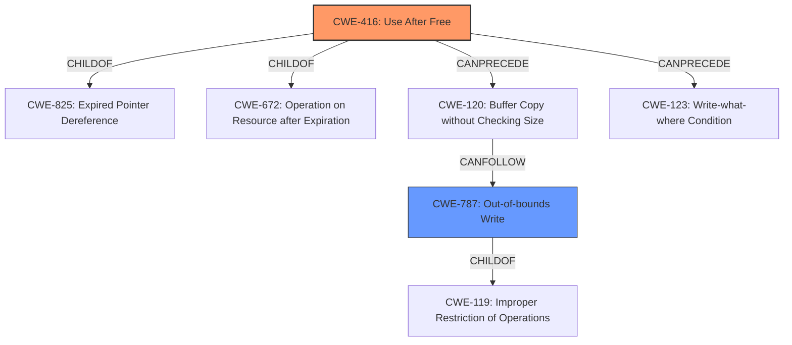

# Enhanced Analysis for CVE-2021-0365

# Summary
| CWE ID | CWE Name | Confidence | CWE Abstraction Level | CWE Vulnerability Mapping Label | CWE-Vulnerability Mapping Notes |
|---|---|---|---|---|---|
| CWE-416 | Use After Free | 1.0 | Variant | Primary | Allowed |
| CWE-787 | Out-of-bounds Write | 0.6 | Base | Secondary | Allowed |

## Evidence and Confidence

*   **Confidence Score:** 0.8
*   **Evidence Strength:** MEDIUM

## Relationship Analysis
The primary CWE is CWE-416 (Use After Free), which is a variant-level CWE. It has a hierarchical relationship as a ChildOf CWE-825 (Expired Pointer Dereference) and CWE-672 (Operation on Resource after Expiration). It can also precede CWE-120 (Buffer Copy without Checking Size) or CWE-123 (Write-what-where Condition). CWE-787 (Out-of-bounds Write) is a Base level CWE and a ChildOf CWE-119 (Improper Restriction of Operations Within the Bounds of a Memory Buffer). CWE-787 can follow CWE-120 (Buffer Copy without Checking Size).



## Vulnerability Chain
The vulnerability chain starts with a **use after free** (CWE-416), which leads to **memory corruption**. This **memory corruption** could potentially result in an out-of-bounds write (CWE-787) if the freed memory is reallocated and then improperly written to. The final impact is a local escalation of privilege.

## Summary of Analysis
The initial analysis identified CWE-416 (Use After Free) as the primary weakness, based on the vulnerability description explicitly stating "**use after free**". The **memory corruption** cited in the description is a symptom of that **use after free**.

The provided evidence from the "Vulnerability Description Key Phrases" section contains "**rootcause: use after free**" and "**weakness: memory corruption**". This explicitly points to CWE-416 as the root cause.

CWE-787 (Out-of-bounds Write) was considered as a secondary CWE, as the "Top CWEs" section of the provided document lists it as the primary match for similar vulnerabilities. However, the description only speaks of a general **memory corruption**, without explicitly stating that this corruption is due to a write outside of the allocated buffer. CWE-787 is a possible consequence of CWE-416, but it is not explicitly stated in the description.

The selected CWEs are at the optimal level of specificity. CWE-416 is a Variant, which is a preferred level of abstraction. CWE-787 is a Base CWE, also a preferred level of abstraction.

Other CWEs considered but not used:

*   CWE-667 (Improper Locking), CWE-908 (Use of Uninitialized Resource), CWE-362 (Concurrent Execution using Shared Resource with Improper Synchronization ('Race Condition')), CWE-909 (Missing Initialization of Resource), CWE-123 (Write-what-where Condition), CWE-665 (Improper Initialization), CWE-415 (Double Free), and CWE-413 (Improper Resource Locking): These CWEs were not selected because they are not directly supported by the vulnerability description. The description explicitly mentions a **use after free**, which directly corresponds to CWE-416. The other CWEs don't have direct evidence.


## CWE Relationship Analysis

Current CWEs represent these abstraction levels: .


### Vulnerability Chain Analysis

**Chain starting from CWE-667:**
- 667 (Improper Locking) - ROOT


**Chain starting from CWE-787:**
- 787 (Out-of-bounds Write) - ROOT


### CWE Relationship Diagram

```mermaid
graph TD
    classDef primary fill:#f96,stroke:#333,stroke-width:2px
    classDef secondary fill:#69f,stroke:#333
    classDef tertiary fill:#9e9,stroke:#333
```