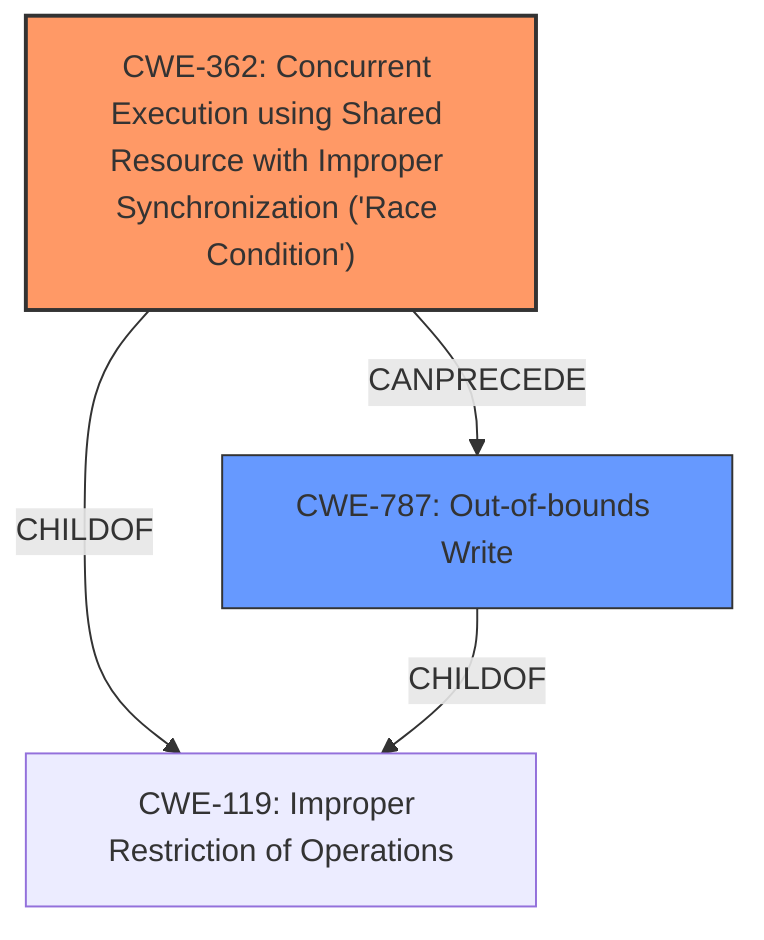

# Analysis for CVE-2021-0367

# Summary
| CWE ID  | CWE Name                                                                                                         | Confidence | CWE Abstraction Level | CWE Vulnerability Mapping Label | CWE-Vulnerability Mapping Notes |
| :-------- | :----------------------------------------------------------------------------------------------------------------- | :---------- | :----------------------- | :------------------------------ | :------------------------------ |
| CWE-362   | Concurrent Execution using Shared Resource with Improper Synchronization ('Race Condition')                           | 0.9         | Class                    | Primary                         | Allowed-with-Review             |
| CWE-787   | Out-of-bounds Write                                                                                               | 0.7         | Base                     | Secondary                       | Allowed                         |

## Evidence and Confidence

*   **Confidence Score:** 0.8
*   **Evidence Strength:** MEDIUM

## Relationship Analysis
The primary relationship influencing the CWE selection is that CWE-362 is a Class, and while it directly reflects the **race condition** described, it can lead to other issues. CWE-787, **Out-of-bounds Write**, is a potential consequence of a **race condition**, where data is written to an incorrect memory location due to unsynchronized access. The relationship is that CWE-362 can precede CWE-787. Both CWE-362 and CWE-787 are child of CWE-119.

## Vulnerability Chain
The vulnerability chain starts with a **race condition** (CWE-362), leading to **memory corruption** which is represented as an **out-of-bounds write** (CWE-787). This ultimately leads to a local escalation of privilege.

## Summary of Analysis
The initial assessment identified CWE-362 as the primary cause, stemming from the explicit mention of a **race condition** in the vulnerability description. This is further supported by the Retriever results, where CWE-362 is the top combined result. The vulnerability description also mentions **memory corruption**, which is often a consequence of **race conditions**, leading to out-of-bounds writes (CWE-787).

The evidence for CWE-362 is strong due to the direct mention of a **race condition**: "In vpu, there is a possible **memory corruption** due to a **race condition**."

The relationship between CWE-362 and CWE-787 is that the former can lead to the latter. The mapping guidance for CWE-362 suggests examining its children for a better fit, but none of the children directly address the **race condition** itself. Therefore, CWE-362 is the most appropriate primary CWE.

CWE-787 is included as a secondary CWE because the vulnerability description indicates **memory corruption** which could be a result of **out-of-bounds write**. The confidence in this mapping is lower as it is a consequence of the **race condition** rather than the root cause itself.

The selected CWEs are at the optimal level of specificity because they accurately represent both the root cause (**race condition**) and a potential consequence (**memory corruption**/**out-of-bounds write**) of the vulnerability.

Relevant CWE Information:

# Enhanced Context (25 CWEs)

## CWE-667: Improper Locking
**Abstraction Level**: Class
**Similarity Score**: 0.81
**Source**: dense

**Description**:
The product does not properly acquire or release a lock on a resource, leading to unexpected resource state changes and behaviors.

**Mapping Guidance**:
- Usage: Allowed-with-Review
- Rationale: This CWE entry is a Class and might have Base-level children that would be more appropriate

## CWE-366: Race Condition within a Thread
**Abstraction Level**: Base
**Similarity Score**: 0.80
**Source**: dense

**Description**:
If two threads of execution use a resource simultaneously, there exists the possibility that resources may be used while invalid, in turn making the state of execution undefined.

**Mapping Guidance**:
- Usage: Allowed
- Rationale: This CWE entry is at the Base level of abstraction, which is a preferred level of abstraction for mapping to the root causes of vulnerabilities.

## CWE-404: Improper Resource Shutdown or Release
**Abstraction Level**: Class
**Similarity Score**: 0.79
**Source**: dense

**Description**:
The product does not release or incorrectly releases a resource before it is made available for re-use.

**Mapping Guidance**:
- Usage: Allowed-with-Review
- Rationale: This CWE entry is a Class and might have Base-level children that would be more appropriate

## CWE-362: Concurrent Execution using Shared Resource with Improper Synchronization ('Race Condition')
**Abstraction Level**: Class
**Similarity Score**: 0.79
**Source**: dense

**Description**:
The product contains a concurrent code sequence that requires temporary, exclusive access to a shared resource, but a timing window exists in which the shared resource can be modified by another code sequence operating concurrently.

**Mapping Guidance**:
- Usage: Allowed-with-Review
- Rationale: This CWE entry is a Class and might have Base-level children that would be more appropriate

## CWE-367: Time-of-check Time-of-use (TOCTOU) Race Condition
**Abstraction Level**: Base
**Similarity Score**: 0.79
**Source**: dense

**Description**:
The product checks the state of a resource before using that resource, but the resource's state can change between the check and the use in a way that invalidates the results of the check. This can cause the product to perform invalid actions when the resource is in an unexpected state.

**Mapping Guidance**:
- Usage: Allowed
- Rationale: This CWE entry is at the Base level of abstraction, which is a preferred level of abstraction for mapping to the root causes of vulnerabilities.

## CWE-662: Improper Synchronization
**Abstraction Level**: Class
**Similarity Score**: 0.78
**Source**: dense

**Description**:
The product utilizes multiple threads or processes to allow temporary access to a shared resource that can only be exclusive to one process at a time, but it does not properly synchronize these actions, which might cause simultaneous accesses of this resource by multiple threads or processes.

**Mapping Guidance**:
- Usage: Discouraged
- Rationale: This CWE entry is a level-1 Class (i.e., a child of a Pillar). It might have lower-level children that would be more appropriate

## CWE-1021: Improper Restriction of Rendered UI Layers or Frames
**Abstraction Level**: Base
**Similarity Score**: 0.78
**Source**: dense

**Description**:
The web application does not restrict or incorrectly restricts frame objects or UI layers that belong to another application or domain, which can lead to user confusion about which interface the user is interacting with.

**Mapping Guidance**:
- Usage: Allowed
- Rationale: This CWE entry is at the Base level of abstraction, which is a preferred level of abstraction for mapping to the root causes of vulnerabilities.

## CWE-754: Improper Check for Unusual or Exceptional Conditions
**Abstraction Level**: Class
**Similarity Score**: 0.78
**Source**: dense

**Description**:
The product does not check or incorrectly checks for unusual or exceptional conditions that are not expected to occur frequently during day to day operation of the product.

**Mapping Guidance**:
- Usage: Allowed-with-Review
- Rationale: This CWE entry is a Class and might have Base-level children that would be more appropriate

## CWE-226: Sensitive Information in Resource Not Removed Before Reuse
**Abstraction Level**: Base
**Similarity Score**: 0.77
**Source**: dense

**Description**:
The product releases a resource such as memory or a file so that it can be made available for reuse, but it does not clear or "zeroize" the information contained in the resource before the product performs a critical state transition or makes the resource available for reuse by other entities.

**Mapping Guidance**:
- Usage: Allowed
- Rationale: This CWE entry is at the Base level of abstraction, which is a preferred level of abstraction for mapping to the root causes of vulnerabilities.

## CWE-665: Improper Initialization
**Abstraction Level**: Class
**Similarity Score**: 0.77
**Source**: dense

**Description**:
The product does not initialize or incorrectly initializes a resource, which might leave the resource in an unexpected state when it is accessed or used.

**Mapping Guidance**:
- Usage: Discouraged
- Rationale: This CWE entry is a level-1 Class (