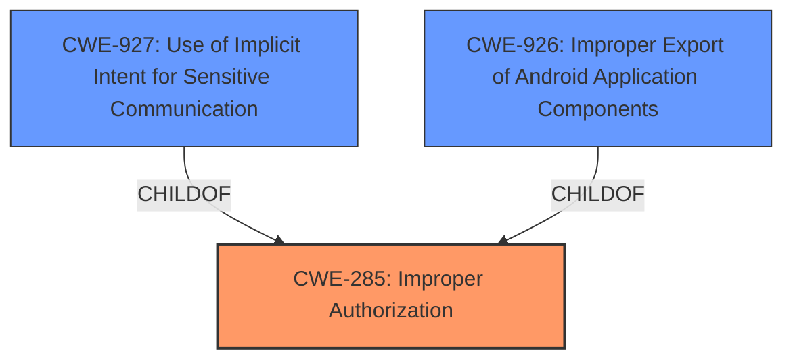

# Analysis for CVE-2021-0372

# Summary
| CWE ID | CWE Name | Confidence | CWE Abstraction Level | CWE Vulnerability Mapping Label | CWE-Vulnerability Mapping Notes |
|---|---|---|---|---|---|
| CWE-285 | Improper Authorization | 0.8 | Class | Primary | Allowed-with-Review |
| CWE-927 | Use of Implicit Intent for Sensitive Communication | 0.7 | Variant | Secondary | Allowed |
| CWE-926 | Improper Export of Android Application Components | 0.6 | Variant | Secondary | Allowed |

## Evidence and Confidence

*   **Confidence Score:** 0.8
*   **Evidence Strength:** HIGH

## Relationship Analysis
The primary relationship influencing the decision is that CWE-285 is a Class that can encompass authorization issues and has child CWEs that provide more specific details. CWE-927 (Use of Implicit Intent for Sensitive Communication) and CWE-926 (Improper Export of Android Application Components) are more specific variants that relate to the improper authorization of Android application components, particularly intents. The vulnerability description and CVE details point to a permission bypass issue related to how PendingIntents are handled.

## Vulnerability Chain
The chain of events is as follows:
1.  **Root Cause:** An **unsafe PendingIntent** is created without proper authorization checks.
2.  **Weakness:** This leads to a permission bypass.
3.  **Impact:** Resulting in a local escalation of privilege.

The initial flaw is the improper creation of the PendingIntent, and the final impact is the escalation of privilege.

## Summary of Analysis
Initially, the presence of an **unsafe PendingIntent** strongly suggested issues around authorization and access control. The CVE reference summary confirmed the root cause related to the lack of setting the mutable flag when creating a PendingIntent, which enables potential privilege escalation.

The selection of CWE-285 as the primary CWE is based on its broad coverage of authorization issues. Both CWE-927 and CWE-926 capture the specifics of the vulnerability related to Android intents and component exporting.

The vulnerability description states: "In getMediaOutputSliceAction of RemoteMediaSlice.java, there is a possible permission bypass due to an **unsafe PendingIntent**. This could lead to local escalation of privilege with User execution privileges needed."

The evidence from the "CVE Reference Links Content Summary" states: "The vulnerability stems from the lack of explicitly setting the mutable flag when creating a PendingIntent... The core issue is an improper handling of PendingIntents within the Android Settings application. Specifically, the absence of the `FLAG_MUTABLE` when creating PendingIntents can be exploited if the application that receives the Intent is not properly protected... An attacker could potentially elevate privileges by modifying the intent received by the target application, leading to the execution of unauthorized actions or access to sensitive data."

The graph relationships influenced the final selection by highlighting how the more specific CWEs (CWE-927 and CWE-926) are children of the more general CWE-285. This guided the decision to include both the general authorization issue and the specific Android component exposure.

The selected CWEs are at the optimal level of specificity because they address both the general authorization problem and the particular context of Android intents.

Relevant CWE Information:

# Enhanced Context (25 CWEs)

## CWE-667: Improper Locking
**Abstraction Level**: Class
**Similarity Score**: 0.77
**Source**: dense

**Description**:
The product does not properly acquire or release a lock on a resource, leading to unexpected resource state changes and behaviors.

**Mapping Guidance**:
- Usage: Allowed-with-Review
- Rationale: This CWE entry is a Class and might have Base-level children that would be more appropriate

*Not Selected:* Although locking issues can lead to security problems, the described vulnerability does not appear to involve improper locking mechanisms. It is more directly related to incorrect authorization, so this CWE is not selected.

## CWE-451: User Interface (UI) Misrepresentation of Critical Information
**Abstraction Level**: Class
**Similarity Score**: 0.77
**Source**: dense

**Description**:
The user interface (UI) does not properly represent critical information to the user, allowing the information - or its source - to be obscured or spoofed. This is often a component in phishing attacks.

**Mapping Guidance**:
- Usage: Allowed-with-Review
- Rationale: This CWE entry is a Class and might have Base-level children that would be more appropriate

*Not Selected:* The vulnerability does not primarily involve UI misrepresentation.

## CWE-754: Improper Check for Unusual or Exceptional Conditions
**Abstraction Level**: Class
**Similarity Score**: 0.77
**Source**: dense

**Description**:
The product does not check or incorrectly checks for unusual or exceptional conditions that are not expected to occur frequently during day to day operation of the product.

**Mapping Guidance**:
- Usage: Allowed-with-Review
- Rationale: This CWE entry is a Class and might have Base-level children that would be more appropriate

*Not Selected:* While related to improper checks, the described vulnerability is more directly tied to authorization failures, making this CWE less appropriate.

## CWE-404: Improper Resource Shutdown or Release
**Abstraction Level**: Class
**Similarity Score**: 0.77
**Source**: dense

**Description**:
The product does not release or incorrectly releases a resource before it is made available for re-use.

**Mapping Guidance**:
- Usage: Allowed-with-Review
- Rationale: This CWE entry is a Class and might have Base-level children that would be more appropriate

*Not Selected:* This CWE is not relevant as the vulnerability is not due to improper resource handling.

## CWE-203: Observable Discrepancy
**Abstraction Level**: Base
**Similarity Score**: 0.77
**Source**: dense

**Description**:
The product behaves differently or sends different responses under different circumstances in a way that is observable to an unauthorized actor, which exposes security-relevant information about the state of the product, such as whether a particular operation was successful or not.

**Mapping Guidance**:
- Usage: Allowed
- Rationale: This CWE entry is at the Base level of abstraction, which is a preferred level of abstraction for mapping to the root causes of vulnerabilities.

*Not Selected:* Not relevant. The vulnerability is not due to observable discrepancies in behavior.

## CWE-668: Exposure of Resource to Wrong Sphere
**Abstraction Level**: Class
**Similarity Score**: 0.76
**Source**: dense

**Description**:
The product exposes a resource to the wrong control sphere, providing unintended actors with inappropriate access to the resource.

**Mapping Guidance**:
- Usage: Discouraged
- Rationale: CWE-668 is high-level and is often misused as a catch-all when lower-level CWE IDs might be applicable. It is sometimes used for low-information vulnerability reports [REF-1287]. It is a level-1 Class (i.e., a child of a Pillar). It is not useful for trend analysis.

*Not Selected:* This is a high-level CWE, and more specific CWEs are applicable (CWE-926, CWE-927).

## CWE-941: Incorrectly Specified Destination in a Communication Channel
**Abstraction Level**: Base
**Similarity Score**: 0.76
**Source**: dense

**Description**:
The product creates a communication channel to initiate an outgoing request to an actor, but it does not correctly specify the intended destination for that actor.

**Mapping Guidance**:
- Usage: Allowed
- Rationale: This CWE entry is at the Base level of abstraction, which is a preferred level of abstraction for mapping to the root causes of vulnerabilities.

*Not Selected:* The vulnerability does not involve incorrect destination specification in a communication channel.

## CWE-226: Sensitive Information in Resource Not Removed Before Reuse
**Abstraction Level**: Base
**Similarity Score**: 0.75
**Source**: dense

**Description**:
The product releases a resource such as memory or a file so that it can be made available for reuse, but it does not clear or "zeroize" the information contained in the resource before the product performs a critical state transition or makes the resource available for reuse by other entities.

**Mapping Guidance**:
- Usage: Allowed
- Rationale: This CWE entry is at the Base level of abstraction, which is a preferred level of abstraction for mapping to the root causes of vulnerabilities.

*Not Selected:* The vulnerability is not related to sensitive information not being removed before resource reuse.

## CWE-345: Insufficient Verification of Data Authenticity
**Abstraction Level**: Class
**Similarity Score**: 0.75