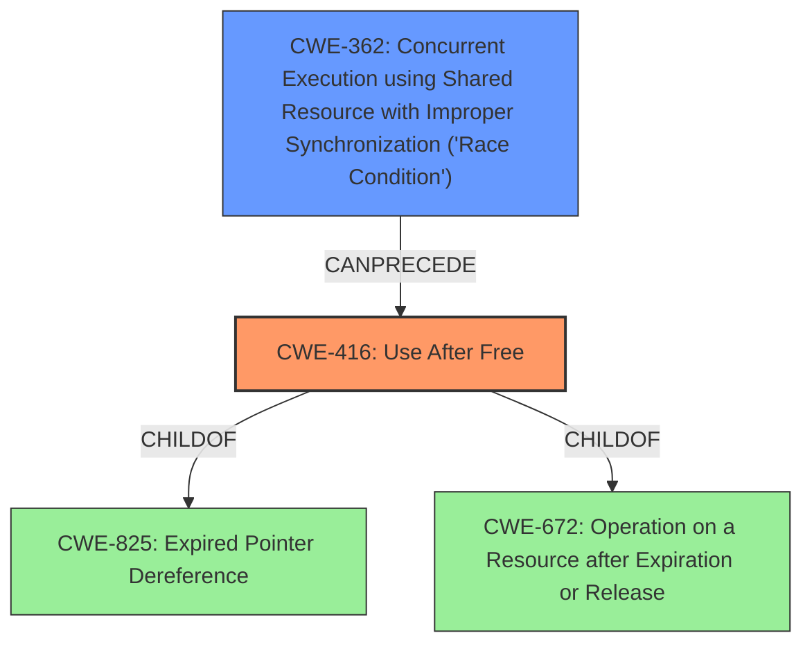

# Analysis Report for CVE-2021-0387

# Vulnerability Analysis Report: CVE-2021-0387

## Description


## Analysis (with Relationship Data)

# Summary
| CWE ID | CWE Name | Confidence | CWE Abstraction Level | CWE Vulnerability Mapping Label | CWE-Vulnerability Mapping Notes |
|---|---|---|---|---|---|
| CWE-416 | Use After Free | 1.0 | Variant | Allowed | Primary CWE |
| CWE-362 | Concurrent Execution using Shared Resource with Improper Synchronization ('Race Condition') | 0.9 | Class | Allowed-with-Review | Secondary Candidate |

## Evidence and Confidence

*   **Confidence Score:** 0.95
*   **Evidence Strength:** HIGH

## Relationship Analysis
The primary weakness is a **use-after-free** (CWE-416), which is a type of memory corruption that occurs when a program attempts to access memory that has already been freed. The vulnerability description explicitly mentions "**use-after-free** due to a **race condition**". CWE-416 is a Variant-level CWE, providing a specific description of the vulnerability. The **race condition** is classified as CWE-362, which is a Class-level CWE, meaning it's a more general category. CWE-362 **Concurrent Execution using Shared Resource with Improper Synchronization ('Race Condition')** can precede CWE-416. This relationship shows how the **race condition** sets the stage for the **use-after-free**.



## Vulnerability Chain
The vulnerability chain starts with a **race condition** (CWE-362), where multiple threads or processes access a shared resource without proper synchronization. This leads to a scenario where memory is freed by one thread while another thread is still using it, resulting in a **use-after-free** vulnerability (CWE-416). The final impact is local escalation of privilege.

## Summary of Analysis
The vulnerability is a **use-after-free** caused by a **race condition** in `FindQuotaDeviceForUuid` of QuotaUtils.cpp in Android. The CVE description explicitly states "**use-after-free** due to a **race condition**".
The root cause is the **race condition** (CWE-362), but the more specific vulnerability that is exploited is the **use-after-free** (CWE-416).
The retriever results also listed CWE-416 as a top result.
CWE-416 is a Variant, which is the most specific and appropriate level of abstraction.
CWE-362 is a Class, which is less specific, but it accurately describes the **race condition** that triggers the **use-after-free**.

**CWEs Considered But Not Used:**

*   CWE-667: Improper Locking - While locking issues can contribute to race conditions, the description specifies a race condition and use-after-free explicitly, making CWE-362 and CWE-416 more accurate.
*   CWE-413: Improper Resource Locking - Similar to CWE-667, this is less specific than the identified race condition and use-after-free.
*   CWE-662: Improper Synchronization - This is a more general class of weakness, and CWE-362 describes the race condition more accurately.
*   CWE-909: Missing Initialization of Resource - This does not apply as the issue is not a missing initialization, but rather a use of memory after it has been freed due to concurrency issues.
*   CWE-364: Signal Handler Race Condition - This is specific to signal handlers, which is not mentioned in the description.
*   CWE-1021: Improper Restriction of Rendered UI Layers or Frames - This is specific to UI rendering and clickjacking, which is irrelevant to the described vulnerability.
*   CWE-366: Race Condition within a Thread - While this could be applicable, CWE-362 is a more general description of the race condition and also a top retriever result.
*   CWE-908: Use of Uninitialized Resource - This is not the case because it's use-after-free and not use of an uninitialized resource.
*   CWE-367: Time-of-check Time-of-use (TOCTOU) Race Condition - The vulnerability description doesn't have any details to suggest it's a TOCTOU.
*   CWE-754: Improper Check for Unusual or Exceptional Conditions - There is no evidence in the description.
*   CWE-226: Sensitive Information in Resource Not Removed Before Reuse - There is no evidence in the description.
*   CWE-404: Improper Resource Shutdown or Release - There is no evidence in the description.
*   CWE-123: Write-what-where Condition - The vulnerability description doesn't have any details to suggest it's a write-what-where condition.
*   CWE-415: Double Free - The vulnerability description doesn't have any details to suggest it's a double free.
*   CWE-476: NULL Pointer Dereference - The vulnerability description doesn't have any details to suggest it's a null pointer dereference.
*   CWE-120: Buffer Copy without Checking Size of Input ('Classic Buffer Overflow') - There is no evidence in the description.
*   CWE-825: Expired Pointer Dereference - There is no evidence in the description.
*   CWE-386: Symbolic Name not Mapping to Correct Object - There is no evidence in the description.
*   CWE-609: Double-Checked Locking - There is no evidence in the description.


## CWE Relationship Analysis

Current CWEs represent these abstraction levels: .


### Vulnerability Chain Analysis

**Chain starting from CWE-754:**
- 754 (Improper Check for Unusual or Exceptional Conditions) - ROOT


**Chain starting from CWE-123:**
- 123 (Write-what-where Condition) - ROOT


### CWE Relationship Diagram

```mermaid
graph TD
    classDef primary fill:#f96,stroke:#333,stroke-width:2px
    classDef secondary fill:#69f,stroke:#333
    classDef tertiary fill:#9e9,stroke:#333
```


*Report generated on 2025-04-02 02:21:32*
