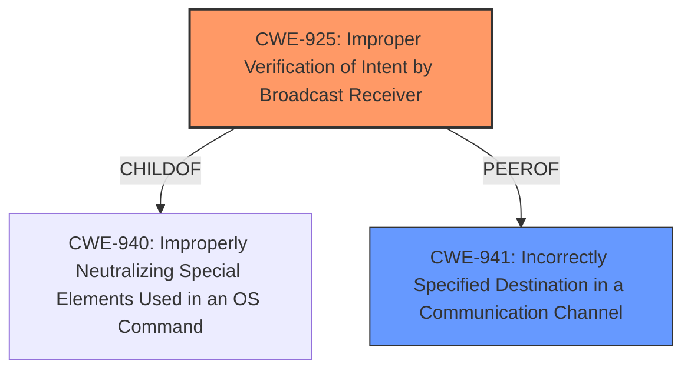

# Analysis Report for CVE-2021-0388

# Vulnerability Analysis Report: CVE-2021-0388

## Description


## Analysis (with Relationship Data)

# Summary
| CWE ID | CWE Name | Confidence | CWE Abstraction Level | CWE Vulnerability Mapping Label | CWE-Vulnerability Mapping Notes |
|---|---|---|---|---|---|
| CWE-925 | Improper Verification of Intent by Broadcast Receiver | 0.9 | Variant | Allowed | Primary CWE |
| CWE-941 | Incorrectly Specified Destination in a Communication Channel | 0.7 | Base | Allowed | Secondary Candidate |

## Evidence and Confidence

*   **Confidence Score:** 0.8
*   **Evidence Strength:** HIGH

## Relationship Analysis
The primary CWE, CWE-925 (Improper Verification of Intent by Broadcast Receiver), is a variant of CWE-940, indicating a more specific case of improper handling of intents. CWE-941 (Incorrectly Specified Destination in a Communication Channel) is a base CWE related to communication channels, and while relevant, is less specific than CWE-925. The choice of CWE-925 reflects the specific vulnerability related to broadcast receivers in Android applications.



## Vulnerability Chain
The vulnerability chain starts with an **incorrect broadcast handler** in `ImsPhoneCallTracker.java`. This leads to the possibility of misattributing data usage because the system is listening to the wrong broadcast (`ACTION_CHANGE_DEFAULT_DIALER` instead of `ACTION_DEFAULT_DIALER_CHANGED`). This ultimately results in a local escalation of privilege, where video call data can be attributed to the wrong app. The root cause is the **incorrect** broadcast handler, and the impact is the misattribution of data usage.

## Summary of Analysis
The analysis indicates a vulnerability in `ImsPhoneCallTracker.java` within Android 11. The root cause is an **incorrect broadcast handler**, specifically the component listening to `ACTION_CHANGE_DEFAULT_DIALER` instead of `ACTION_DEFAULT_DIALER_CHANGED`. This can be directly mapped to CWE-925 (Improper Verification of Intent by Broadcast Receiver) because the receiver is not properly verifying the source or validity of the intent. The evidence from the "CVE Reference Links Content Summary" explicitly states that the vulnerability stems from `ImsPhoneCallTracker` listening to the wrong broadcast action. The mapping guidance for CWE-925 suggests it's an appropriate fit because it is a variant level of abstraction for mapping to the root causes of vulnerabilities.

CWE-941 (Incorrectly Specified Destination in a Communication Channel) was considered because the vulnerability involves misdirection of data. However, CWE-925 is more specific to the Android broadcast receiver context, making it a better fit.

Relevant CWE Information:

# Enhanced Context (25 CWEs)
The following CWEs were identified as potentially relevant to this vulnerability:

## CWE-941: Incorrectly Specified Destination in a Communication Channel
**Abstraction Level**: Base
**Similarity Score**: 0.77
**Source**: dense

**Description**:
The product creates a communication channel to initiate an outgoing request to an actor, but it does not correctly specify the intended destination for that actor.

**Mapping Guidance**:
- Usage: Allowed
- Rationale: This CWE entry is at the Base level of abstraction, which is a preferred level of abstraction for mapping to the root causes of vulnerabilities.

## CWE-925: Improper Verification of Intent by Broadcast Receiver
**Abstraction Level**: Variant
**Status**: Incomplete

**Description**:
The Android application uses a Broadcast Receiver that receives an Intent but does not properly verify that the Intent came from an authorized source.

**Mapping Guidance**:
- Usage: Allowed
- Rationale: This CWE entry is at the Variant level of abstraction, which is a preferred level of abstraction for mapping to the root causes of vulnerabilities.

**Explanation of CWE Choices:**

*   **CWE-925: Improper Verification of Intent by Broadcast Receiver**
    *   This is the primary CWE. The vulnerability description and the CVE reference both highlight that the `ImsPhoneCallTracker` is listening to the wrong broadcast action (`ACTION_CHANGE_DEFAULT_DIALER` instead of `ACTION_DEFAULT_DIALER_CHANGED`). This means the application is not properly verifying the intent it is receiving, which aligns directly with CWE-925.
    *   The security implication is that an untrusted app can potentially manipulate the `mDefaultDialerUid` setting, leading to misattribution of data usage.
    *   CWE-925 is a variant of CWE-940, making it a more specific classification than its parent.
    *   The mapping guidance allows for the use of CWE-925.
*   **CWE-941: Incorrectly Specified Destination in a Communication Channel**
    *   This CWE was considered because the vulnerability involves a misdirection of communication, specifically the broadcast intent.
    *   However, it's less specific than CWE-925 as it broadly applies to communication channels. The primary issue isn't that the destination is incorrectly specified in a general sense, but rather that the intent itself is not properly verified.
    *   While relevant, CWE-941 does not capture the specific nuances of the Android broadcast receiver context as accurately as CWE-925.


## CWE Relationship Analysis

Current CWEs represent these abstraction levels: .


### Vulnerability Chain Analysis

**Chain starting from CWE-925:**
- 925 (Improper Verification of Intent by Broadcast Receiver) - ROOT


**Chain starting from CWE-940:**
- 940 (Improper Verification of Source of a Communication Channel) - ROOT


### CWE Relationship Diagram

```mermaid
graph TD
    classDef primary fill:#f96,stroke:#333,stroke-width:2px
    classDef secondary fill:#69f,stroke:#333
    classDef tertiary fill:#9e9,stroke:#333
```


*Report generated on 2025-04-01 23:40:17*
