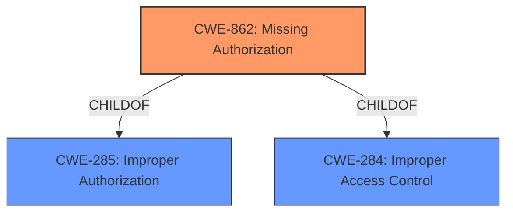

# Analysis for CVE-2021-0389

# Summary
| CWE ID | CWE Name | Confidence | CWE Abstraction Level | CWE Vulnerability Mapping Label | CWE-Vulnerability Mapping Notes |
|---|---|---|---|---|---|
| CWE-862 | Missing Authorization | 1.0 | Class | Primary | Allowed-with-Review |
| CWE-284 | Improper Access Control | 0.7 | Class | Secondary | Allowed-with-Review |

## Evidence and Confidence

*   **Confidence Score:** 1.0
*   **Evidence Strength:** HIGH

## Relationship Analysis
The primary CWE is CWE-862 **Missing Authorization**, which is a Class-level CWE. It is a child of both CWE-285 **Improper Authorization** and CWE-284 **Improper Access Control**.



## Vulnerability Chain
The chain of events starts with a **missing permission check** which leads to a local escalation of privilege.

## Summary of Analysis
The vulnerability description clearly states a **missing permission check** in `setNightModeActivated` of `UiModeManagerService.java`. This **missing permission check** allows a local escalation of privilege. The CVE Reference Links Content Summary provides additional confirmation, although the root cause described in the summary pertains to a different vulnerability (CVE-2021-0389) but provides insight into the mechanisms.

The primary CWE mapping is CWE-862 **Missing Authorization** (Class). The description of CWE-862, "The product does not perform an authorization check when an actor attempts to access a resource or perform an action," directly matches the **missing permission check** described in the vulnerability. The impact of this vulnerability is local privilege escalation, consistent with the potential consequences of missing authorization.

CWE-284 **Improper Access Control** is a parent of CWE-862 and represents a broader class of access control issues. While accurate, CWE-862 is preferred due to its greater specificity.

The Retriever Results listed CWE-862 **Missing Authorization** as the top candidate.

I am very confident in this assessment, as the evidence directly supports the selected CWE.

Relevant CWE Information:

# Enhanced Context (25 CWEs)
The following CWEs were identified as potentially relevant to this vulnerability:

## CWE-366: Race Condition within a Thread
**Abstraction Level**: Base
**Similarity Score**: 0.75
**Source**: dense

**Description**:
If two threads of execution use a resource simultaneously, there exists the possibility that resources may be used while invalid, in turn making the state of execution undefined.

**Mapping Guidance**:
- Usage: Allowed
- Rationale: This CWE entry is at the Base level of abstraction, which is a preferred level of abstraction for mapping to the root causes of vulnerabilities.

## CWE-362: Concurrent Execution using Shared Resource with Improper Synchronization ('Race Condition')
**Abstraction Level**: Class
**Similarity Score**: 0.75
**Source**: dense

**Description**:
The product contains a concurrent code sequence that requires temporary, exclusive access to a shared resource, but a timing window exists in which the shared resource can be modified by another code sequence operating concurrently.

**Mapping Guidance**:
- Usage: Allowed-with-Review
- Rationale: This CWE entry is a Class and might have Base-level children that would be more appropriate

## CWE-667: Improper Locking
**Abstraction Level**: Class
**Similarity Score**: 0.74
**Source**: dense

**Description**:
The product does not properly acquire or release a lock on a resource, leading to unexpected resource state changes and behaviors.

**Mapping Guidance**:
- Usage: Allowed-with-Review
- Rationale: This CWE entry is a Class and might have Base-level children that would be more appropriate

## CWE-662: Improper Synchronization
**Abstraction Level**: Class
**Similarity Score**: 0.74
**Source**: dense

**Description**:
The product utilizes multiple threads or processes to allow temporary access to a shared resource that can only be exclusive to one process at a time, but it does not properly synchronize these actions, which might cause simultaneous accesses of this resource by multiple threads or processes.

**Mapping Guidance**:
- Usage: Discouraged
- Rationale: This CWE entry is a level-1 Class (i.e., a child of a Pillar). It might have lower-level children that would be more appropriate

## CWE-367: Time-of-check Time-of-use (TOCTOU) Race Condition
**Abstraction Level**: Base
**Similarity Score**: 0.73
**Source**: dense

**Description**:
The product checks the state of a resource before using that resource, but the resource's state can change between the check and the use in a way that invalidates the results of the check. This can cause the product to perform invalid actions when the resource is in an unexpected state.

**Mapping Guidance**:
- Usage: Allowed
- Rationale: This CWE entry is at the Base level of abstraction, which is a preferred level of abstraction for mapping to the root causes of vulnerabilities.

## CWE-404: Improper Resource Shutdown or Release
**Abstraction Level**: Class
**Similarity Score**: 0.73
**Source**: dense

**Description**:
The product does not release or incorrectly releases a resource before it is made available for re-use.

**Mapping Guidance**:
- Usage: Allowed-with-Review
- Rationale: This CWE entry is a Class and might have Base-level children that would be more appropriate

## CWE-754: Improper Check for Unusual or Exceptional Conditions
**Abstraction Level**: Class
**Similarity Score**: 0.72
**Source**: dense

**Description**:
The product does not check or incorrectly checks for unusual or exceptional conditions that are not expected to occur frequently during day to day operation of the product.

**Mapping Guidance**:
- Usage: Allowed-with-Review
- Rationale: This CWE entry is a Class and might have Base-level children that would be more appropriate

## CWE-653: Improper Isolation or Compartmentalization
**Abstraction Level**: Class
**Similarity Score**: 0.71
**Source**: dense

**Description**:
The product does not properly compartmentalize or isolate functionality, processes, or resources that require different privilege levels, rights, or permissions.

**Mapping Guidance**:
- Usage: Allowed
- Rationale: This CWE entry is at the Base level of abstraction, which is a preferred level of abstraction for mapping to the root causes of vulnerabilities.

## CWE-909: Missing Initialization of Resource
**Abstraction Level**: Class
**Similarity Score**: 0.71
**Source**: dense

**Description**:
The product does not initialize a critical resource.

**Mapping Guidance**:
- Usage: Allowed-with-Review
- Rationale: This CWE entry is a Class and might have Base-level children that would be more appropriate

## CWE-226: Sensitive Information in Resource Not Removed Before Reuse
**Abstraction Level**: Base
**Similarity Score**: 0.71
**Source**: dense

**Description**:
The product releases a resource such as memory or a file so that it can be made available for reuse, but it does not clear or "zeroize" the information contained in the resource before the product performs a critical state transition or makes the resource available for reuse by other entities.

**Mapping Guidance**:
- Usage: Allowed
- Rationale: This CWE entry is at the Base level of abstraction, which is a preferred level of abstraction for mapping to the root causes of vulnerabilities.

## CWE-667: Improper Locking
**Abstraction Level**: Class
**Similarity Score**: 6943.22
**Source**: sparse

**Description**:
The product does not properly acquire or release a lock on a resource, leading to unexpected resource state changes and behaviors.

**Mapping Guidance**:
- Usage: Allowed-with-Review
- Rationale: This CWE entry is a Class and might have Base-level children that would be more appropriate

## CWE-362: Concurrent Execution using Shared Resource with Improper Synchronization ('Race Condition')
**Abstraction Level**: Class
**Similarity Score**: 6918.31
**Source**: sparse

**Description**:
The product contains a concurrent code sequence that requires temporary, exclusive access to a shared resource, but a timing window exists in which the shared resource can be modified by another code sequence operating concurrently.

**Mapping Guidance**:
- Usage: Allowed-with-Review
- Rationale: This CWE entry is a Class and might have Base-level children that would be more appropriate

## CWE-863: Incorrect Authorization
**Abstraction Level**: Class
**Similarity Score**: 6880.63
**Source**: sparse

# Enhanced Query for CVE-2021-0389

## Vulnerability Description
In setNightModeActivated of UiModeManagerService.java, there is a **missing permission check**. This could lead to local escalation of privilege with no additional execution privileges needed. User interaction is not needed for exploitation.Product AndroidVersions Android-11Android ID A-168039904

### Vulnerability Description Key Phrases
- **rootcause:** **missing permission check**
- **impact:** local escalation of privilege
- **product:** Android
- **version:** 11
- **component:** setNightModeActivated of UiModeManagerService.java

## CVE Reference Links Content Summary
```
{
  "vulnerability_details": [
    {
      "cve": "CVE-2021-0389",
      "root_cause": "Improper broadcast receiver registration for default dialer changes.",
      "weaknesses": [
        "The `ImsPhoneCallTracker` was listening to the `ACTION_CHANGE_DEFAULT_DIALER` broadcast, instead of `ACTION_DEFAULT_DIALER_CHANGED`.",
		"This allowed untrusted apps to potentially set `mDefaultDialerUid` via the incorrect broadcast."
      ],
      "impact": "Elevation of Privilege.",
      "attack_vectors": "An untrusted application could potentially set `mDefaultDialerUid` by listening for the protected `ACTION_CHANGE_DEFAULT_DIALER` broadcast, which would normally require elevated privileges.",
      "required_capabilities": "An attacker would need to have an app installed on the device that could listen for system broadcasts. The app does not need any special privileges."
    }
  ],
   "unaassociated_content" : [
        {
            "text": "dHJlZSA5MTBjZDJmMWYxMjk0YWZiMzdmZDYxMzJlMWY1NTVkMWJjMjI1NGMyCnBhcmVudCAyMDNlMDBjZGE0ZDY1ZGNhM2EzMGE4MjhkZWQxYmU5YzdiYzc2NmQ1CmF1dGhvciBHcmFjZSBKaWEgPHhpYW90b25qQGdvb2dsZS5jb20+IDE2MDAxMjA2MjcgLTA3MDAKY29tbWl0dGVyIEdyYWNlIEppYSA8eGlhb3RvbmpAZ29vZ2xlLmNvbT4gMTYwMjA4OTA5OSArMDAwMAoKQ2hhbmdlIEltc1Bob25lQ2FsbFRyYWNrZXIgdG8gbGlzdGVuIHRvIHRoZSBjb3JyZWN0IGJyb2FkY2FzdCB3aGVuCmRlZmF1bHQgZGlhbGVyIGNoYW5nZWQuCgpJbXNQaG9uZUNhbGxUcmFja2VyIHVzZWQgdG8gbGlzdGVuIHRvIHByb3RlY3RlZCBicm9hZGNhc3QgQUNUSU9OX0NIQU5HRV9ERUZBVUxUX0RJQUxFUgppbnN0ZWFkIG9mIEFDVElPTl9ERUZBVUxUX0RJQUxFUl9DSEFOR0VELiBGaXhlZCB0aGlzIHRvIG1ha2UKSW1zUGhvbmVDYWxsVHJhY2tlciBrbm93IHRoZSBjaGFuZ2Ugb2YgZGVmYXVsdCBkaWFsZXIgYW5kIHByZXZlbnQKdW50cnVzdGVkIGFwcCBmcm9tIHNldHRpbmcgbURlZmF1bHREaWFsZXJVaWQuCgpCdWc6IDE2Mjc0MTQ4OQpUZXN0OiBNYW51YWxseSBzZXQgZGVmYXVsdCBkaWFsZXIgdG8gYW5vdGhlciBhcHAgYW5kIGNoZWNrIGlmCm1EZWZhdWx0RGlhbGVyVWlkIGNoYW5nZWQgY29ycmVzcG9uZGluZ2x5IGJ5IGR1bXBzeXMuCgpDaGFuZ2UtSWQ6IEkyMzM1ZWI3N2IzMzc0NTQwODJmOGM5ZGIxOTVmZDhlY2M0YjJjNzJjCg==",
            "type": "commit"
        },
        {
            "text": "dHJlZSBkZDQ2MmI0ZGM4NWFjNmU3Yzk1NGI3NDgxYWNmYzRmNWJjYWE3ZmEyCnBhcmVudCAwMWMwMDBlZmYxODFjZDY5NTkwYzY1NjU4Y2Q5NmIwZTRlY2VmY2JiCmF1dGhvciBKYXkgQWxpb21lciA8YWFsaW9tZXJAZ29vZ2xlLmNvbT4gMTU5MDc4MzMyMiAtMDQwMApjb21taXR0ZXIgSmF5IEFsaW9tZXIgPGFhbGlvbWVyQGdvb2dsZS5jb20+IDE2MDA4ODQxOTYgKzAwMDAKCkRhcmtNb2RlIFRpbGUgYWZmZWN0cyBhbGwgdXNlcnMgKyBzZWN1cml0eSBidWcKCldoZW4gc2V0TmlnaHRNb2RlQWN0aXZhdGVkIGlzIGNhbGxlZCwgdGhlIGNoYW5nZSBhZmZlY3RzIHRoZSBjdXJyZW50IGxvZ2dlZCBpbiB1c2VyCkFsc28sIHBlcm1pc3Npb24gY2hlY2tzIGFyZSBtYWRlIGJlZm9yZSBjaGFuZ2luZyBkYXJrIHRoZW1lClRlc3Q6IG1hbnVhbApCdWc6IDE2ODAzOTkwNApNZXJnZWQtSW46IEk3Nzg2ZDlkZGUxMGY3NTQ3ZjVkZDlmYjAwNjYxZmI4OWZkZTlmMDVjCkNoYW5nZS1JZDogSTc3ODZkOWRkZTEwZjc1NDdmNWRkOWZiMDA2NjFmYjg5ZmRlOWYwNWMKKGNoZXJyeSBwaWNrZWQgZnJvbSBjb21taXQgZjE2ZTg3YTk5MmQ3ZDZjMWQzNjc3NzBiZDU2OTcwN2EyOWNiMTViNCkK",
            "type": "commit"
        },
        {
            "text": "Android Open Source Project Documentation What's New? Getting Started Security Core Topics Compatibility Android Devices Automotive Reference  /   English Deutsch Español Français Indonesia Italiano Polski Português Tiếng Việt Türkçe Русский עברית العربيّة فارسی हिंदी বাংলা ภาษาไทย 中文 – 简体 中文 – 繁體 日本語 한국어 Android Code Search Sign in  Documentation What's New? Getting Started Security Core Topics Compatibility Android Devices Automotive Reference  Docs  More  What's New? Getting Started Security Core Topics Compatibility Android Devices Automotive Reference Android Code Search  Overview Security overview  Secure an Android device Kernel security App security Implement security Updates and resources ASPIRE Reports Enhancements Acknowledgements Android Security Bulletins  Bulletins home Overview 2025 bulletins  January 2024 bulletins  December November October September August July June May April March February January Android 15 2023 bulletins  December November October September August July June May April March February January Android 14 2022 bulletins  December November October September August July June May April March Android 12L February January Android 13 Index 2021 bulletins  December November October September August July June May April March February January Android 12 Index 2020 bulletins  December November October September August July June May April March February January Android 11 Index 2019 bulletins  December November October September August July June May April March February January Android 10 Index 2018 bulletins  December November October September August July June May April March February January Index 2017 bulletins  December November October September August July June May April March February January Index 2016 bulletins  December November October September August July June May April March February January Index 2015 bulletins  December November October September August Index Pixel/Nexus bulletins  Overview 2025 bulletins  January 2024 bulletins  December November October September August July June May April March February January 2023 bulletins  December November October September August July June May April March February January 2022 bulletins  December November October September August July June May April March February January 2021 bulletins  December November October September August July June May April March February January Index 2020 bulletins  December November October September August July June May April March February January Index 2019 bulletins  December November October September August July June May April March February January Index 2018 bulletins  December November October September August July June May April March February January Index 2017 bulletins  December November October Index Android Automotive  Overview 2025 bulletins  January 2024 bulletins  December November October September August July June May April March February January 2023 bulletins  December November October September August July June May April March February January 2022 bulletins  December November October September August July June May April March February January 2021 bulletins  December November October September August July June May April March February January Chromecast  Overview 2024 bulletins  December September July March 2023 bulletins  December September June April 2022 bulletins  December October July Wear  Overview 2025 bulletins  January 2024 bulletins  December November October September August July June May April March February January 2023 bulletins  December November October September August Pixel Watch  Overview 2024 bulletins  December August July June May April March February January 2023 bulletins  December September June Advisories  Overview  March 2016 Features  Overview Application Sandbox OMAPI vendor stable interface App signing  Overview APK signature scheme v2 APK signature scheme v3 APK signature scheme v3.1 APK signature scheme v4 Authentication  Overview Gatekeeper Biometrics  Overview Measure biometric security Fingerprint HIDL Face authentication HIDL Protected confirmation  Overview Implementation Design guidelines Accessibility DICE  Overview Applications of DICE Encryption  Overview File-based encryption Full-disk encryption Metadata encryption Enable Adiantum Hardware-wrapped keys Keystore  Overview Features Key and ID attestation Version binding Authorization tags Functions Identity credential  Overview SELinux  Overview Concepts Implementation Customization Build sepolicy Compatibility Validation Write policy Vendor init Trusty TEE  Overview Download and build Trusty API reference Verified Boot  Overview Device state Verify Boot Boot flow Implement dm-verity Verify system_other partition Reference implementation Safety Center  Overview Customize Safety Center Customize Safety Center UI Interact with Safety Center Testing and validation Cellular security  Overview Disable 2G Private space Testing  Overview Memory safety Arm Memory Tagging Extension  Overview Bootloader support Understand MTE reports MTE configuration Sanitizers  Overview AddressSanitizer Kernel AddressSanitizer Hardware-assisted AddressSanitizer Understand HWASan reports UndefinedBehaviorSanitizer Other topics Control flow integrity Kernel control flow integrity Execute-only memory Fuzz with libFuzzer GWP-ASan and KFENCE Security Test Suite development kit Scudo ShadowCallStack Tagged pointers Zero initialized memory Best practices  Overview Operational security System security App security Network security Hardware security Privacy security  What's new? Release notes Latest security bulletins Latest Compatibility Definition Document (CDD) Site updates Getting Started About Start Download Build Test Create Contribute Community Tools, build, and related reference Security Overview Bulletins Features Testing Best Practices Core Topics Architecture Audio Camera Connectivity Data Display Fonts Graphics Interaction Media Performance Permissions Power Runtime Settings Storage Tests Updates Virtualization Compatibility Compatibility Definition Document (CDD) Compatibility Test Suite (CTS) Android Devices Cuttlefish Enterprise TV Automotive Get Started Guidelines for Development Development Tools Testing Tools and Infrastructure Release Details Reference HIDL HAL Trade Federation Security Test Suite  AOSP Security  Pixel Update Bulletin—March 2021 Stay organized with collections Save and categorize content based on your preferences. Published March 1, 2021 | Updated March 3, 2021 The Pixel Update Bulletin contains details of security vulnerabilities and functional improvements affecting supported Pixel devices (Google devices). For Google devices, security patch levels of 2021-03-05 or later address all issues in this bulletin and all issues in the March 2021 Android Security Bulletin. To learn how to check a device's security patch level, see Check and update your Android version. All supported Google devices will receive an update to the 2021-03-05 patch level. We encourage all customers to accept these updates to their devices. Note: The Google device firmware images are available on the Google Developer site. Announcements  In addition to the security vulnerabilities described in the March 2021 Android Security Bulletin, Google devices also contain patches for the security vulnerabilities described below. When applicable, partners were notified that these issues are being addressed, and may choose to incorporate them as part of their device updates. Security patches Vulnerabilities are grouped under the component that they affect. There is a description of the issue and a table with the CVE, associated references, type of vulnerability, severity, and updated Android Open Source Project (AOSP) versions (where applicable). When available, we link the public change that addressed the issue to the bug ID, like the AOSP change list. When multiple changes relate to a single bug, additional references are linked to numbers following the bug ID. Framework  CVE References Type Severity Updated AOSP versions  CVE-2021-0376 A-115619667  2 EoP High 11 CVE-2021-0375 A-167261484 EoP Moderate 11 CVE-2021-0387 A-169421939 EoP Moderate 11 CVE-2021-0369 A-166561076 ID Moderate 11 CVE-2021-0381 A-153466381 ID Moderate 11 CVE-2021-0382 A-140727941 ID Moderate 11 Media framework  CVE References Type Severity Updated AOSP versions  CVE-2021-0368 A-169829774* ID Moderate 11 CVE-2021-0374 A-169572641 ID Moderate 11 CVE-2021-0378 A-154076193 ID Moderate 11 CVE-2021-0379 A-154075955 ID Moderate 11 System  CVE References Type Severity Updated AOSP versions  CVE-2020-0025 A-135604684 EoP High 11 CVE-2021-0370 A-169259605 EoP Moderate 11 CVE-2021-0372 A-174047735 EoP Moderate 11 CVE-2021-0377 A-160800689 EoP Moderate 11 CVE-2021-0380 A-172459128  2  3 EoP Moderate 11 CVE-2021-0383 A-160871056 EoP Moderate 11 CVE-2021-0385 A-172584372 EoP Moderate 11 CVE-2021-0386 A-173421110 EoP Moderate 11 CVE-2021-0388 A-162741489 EoP Moderate 11 CVE-2021-0389 A-168039904 EoP Moderate 11 CVE-2021-0371 A-164440989 ID Moderate 11 Kernel components  CVE References Type Severity Component CVE-2021-0454 A-175117047* EoP High Titan M CVE-2021-0455 A-175116439* EoP High Titan M CVE-2021-0456 A-174769927* EoP High Titan M CVE-2021-0464 A-167663878* EoP High Audio Server CVE-2021-0465 A-172005755* EoP High Camera CVE-2021-0463 A-154867068* ID High Camera CVE-2021-0457 A-157155375* EoP Moderate Touch CVE-2021-0458 A-157156744* EoP Moderate Touch CVE-2021-0461 A-175124074* EoP Moderate Neural Core CVE-2021-0462 A-168799695* EoP Moderate NFC CVE-2020-25211 A-161151152 Upstream kernel ID Moderate netfilter CVE-2021-0449 A-175117965* ID Moderate Titan M CVE-2021-0450 A-175117880* ID Moderate Titan M CVE-2021-0451 A-175117871* ID Moderate Titan M CVE-2021-0452 A-175117261* ID Moderate Titan M CVE-2021-0453 A-175117199* ID Moderate Titan M CVE-2021-0459 A-157154534* ID Moderate Touch CVE-2021-0460 A-156739245* ID Moderate Touch Qualcomm components  CVE References Type Severity Component CVE-2020-11230 A-168052057 QC-CR#2486632  2 N/A Moderate Kernel Qualcomm closed-source components  CVE References Type Severity Component CVE-2020-3664 A-162843453* N/A Moderate Closed-source component Functional patches For details on the new bug fixes and functional patches included in this release, refer to the Pixel Community forum. Common questions and answers This section answers common questions that may occur after reading this bulletin. 1. How do I determine if my device is updated to address these issues? Security patch levels of 2021-03-05 or later address all issues associated with the 2021-03-05 security patch level and all previous patch levels. To learn how to check a device's security patch level, read the instructions on the Google device update schedule. 2. What do the entries in the Type column mean? Entries in the Type column of the vulnerability details table reference the classification of the security vulnerability.  Abbreviation Definition RCE Remote code execution EoP Elevation of privilege ID Information disclosure DoS Denial of service N/A Classification not available 3. What do the entries in the References column mean? Entries under the References column of the vulnerability details table may contain a prefix identifying the organization to which the reference value belongs.  Prefix Reference A- Android bug ID QC- Qualcomm reference number M- MediaTek reference number N- NVIDIA reference number B- Broadcom reference number 4. What does an * next to the Android bug ID in the References column mean? Issues that are not publicly available have an * next to the Android bug ID in the References column. The update for that issue is generally contained in the latest binary drivers for Pixel devices available from the Google Developer site. 5. Why are security vulnerabilities split between this bulletin and the Android Security Bulletins? Security vulnerabilities that are documented in the Android Security Bulletins are required to declare the latest security patch level on Android devices. Additional security vulnerabilities, such as those documented in this bulletin are not required for declaring a security patch level. Versions  Version Date Notes 1.0 March 1, 2021 Bulletin released 1.1 March 3, 2021 Bulletin revised to include AOSP links Content and code samples on this page are subject to the licenses described in the Content License. Java and OpenJDK are trademarks or registered trademarks of Oracle and/or its affiliates. Last updated 2024-08-26 UTC. [[[\"Easy to understand\",\"easyToUnderstand\",\"thumb-up\"],[\"Solved my problem\",\"solvedMyProblem\",\"thumb-up\"],[\"Other\",\"otherUp\",\"thumb-up\"]],[[\"Missing the information I need\",\"missingTheInformationINeed\",\"thumb-down\"],[\"Too complicated / too many steps\",\"tooComplicatedTooManySteps\",\"thumb-down\"],[\"Out of date\",\"outOfDate\",\"thumb-down\"],[\"Samples / code issue\",\"samplesCodeIssue\",\"thumb-down\"],[\"Other\",\"otherDown\",\"thumb-down\"]],[\"Last updated 2024-08-26 UTC.\"],[],[]]  Build  Android repository Requirements Downloading Preview binaries Factory images Driver binaries Connect  @Android on Twitter @AndroidDev on Twitter Android Blog Google Security Blog Platform on Google Groups Building on Google Groups Porting on Google Groups Get help  Android Help Center Pixel Help Center www.android.com Google Mobile Services Stack Overflow Issue Tracker  About Android Community Legal License Privacy Site feedback Manage cookies  English Deutsch Español Français Indonesia Italiano Polski Português Tiếng Việt Türkçe Русский עברית العربيّة فارسی हिंदी বাংলা ภาษาไทย 中文 – 简体 中文 – 繁體 日本語 한국어",
            "type": "bulletin"
        }
    ]
}
```

## Retriever Results

### Top Combined Results

| Rank | CWE ID | Name | Abstraction | Usage  | Retrievers | Individual Scores |
|------|--------|------|-------------|-------|------------|-------------------|
| 1 | 862 | Missing Authorization | Class | Allowed-with-Review | sparse | 0.396 |
| 2 | 1021 | Improper Restriction of Rendered UI Layers or Frames | Base | Allowed | sparse | 0.351 |
| 3 | 223 | Omission of Security-relevant Information | Base | Allowed | sparse | 0.318 |
| 4 | 927 | Use of Implicit Intent for Sensitive Communication | Variant | Allowed | sparse | 0.313 |
| 5 | 667 | Improper Locking | Class | Allowed-with-Review | sparse | 0.306 |
| 6 | 925 | Improper Verification of Intent by Broadcast Receiver | Variant | Allowed | dense | 0.508 |
| 7 | 425 | Direct Request ('Forced Browsing') | Base | Allowed | graph | 0.001 |
| 8 | 908 | Use of Uninitialized Resource | Base | Allowed | sparse | 0.297 |
| 9 | 362 | Concurrent Execution using Shared Resource with Improper Synchronization ('Race Condition') | Class | Allowed-with-Review | sparse | 0.296 |
| 10 | 732 | Incorrect Permission Assignment for Critical Resource | Class | Allowed-with-Review | sparse | 0.296 |


# Complete CWE Specifications


## CWE-862: Missing Authorization
**Abstraction:** Class
**Status:** Incomplete

### Description
The product does not perform an authorization check when an actor attempts to access a resource or perform an action.

### Extended Description
Not provided

### Alternative Terms
AuthZ: "AuthZ" is typically used as an abbreviation of "authorization" within the web application security community. It is distinct from "AuthN" (or, sometimes, "AuthC") which is an abbreviation of "authentication." The use of "Auth" as an abbreviation is discouraged, since it could be used for either authentication or authorization.

### Relationships
ChildOf -> CWE-285
ChildOf -> CWE-284

### Mapping Guidance
**Usage:** Allowed-with-Review
**Rationale:** This CWE entry is a Class and might have Base-level children that would be more appropriate
**Comments:** Examine children of this entry to see if there is a better fit
**Reasons:**
- Abstraction


### Additional Notes
**[Terminology]** Assuming a user with a given identity, authorization is the process of determining whether that user can access a given resource, based on the user's privileges and any permissions or other access-control specifications that apply to the resource.


### Observed Examples
- **CVE-2022-24730:** Go-based continuous deployment product does not check that a user has certain privileges to update or create an app, allowing adversaries to read sensitive repository information
- **CVE-2009-3168:** Web application does not restrict access to admin scripts, allowing authenticated users to reset administrative passwords.
- **CVE-2009-3597:** Web application stores database file under the web root with insufficient access control (CWE-219), allowing direct request.


## CWE-1021: Improper Restriction of Rendered UI Layers or Frames
**Abstraction:** Base
**Status:** Incomplete

### Description
The web application does not restrict or incorrectly restricts frame objects or UI layers that belong to another application or domain, which can lead to user confusion about which interface the user is interacting with.

### Extended Description
A web application is expected to place restrictions on whether it is allowed to be rendered within frames, iframes, objects, embed or applet elements. Without the restrictions, users can be tricked into interacting with the application when they were not intending to.

### Alternative Terms
Clickjacking
UI Redress Attack
Tapjacking: "Tapjacking" is similar to clickjacking, except it is used for mobile applications in which the user "taps" the application instead of performing a mouse click.

### Relationships
ChildOf -> CWE-441
ChildOf -> CWE-610
ChildOf -> CWE-451

### Mapping Guidance
**Usage:** Allowed
**Rationale:** This CWE entry is at the Base level of abstraction, which is a preferred level of abstraction for mapping to the root causes of vulnerabilities.
**Comments:** Carefully read both the name and description to ensure that this mapping is an appropriate fit. Do not try to 'force' a mapping to a lower-level Base/Variant simply to comply with this preferred level of abstraction.
**Reasons:**
- Acceptable-Use


### Observed Examples
- **CVE-2017-7440:** E-mail preview feature in a desktop application allows clickjacking attacks via a crafted e-mail message
- **CVE-2017-5697:** Hardware/firmware product has insufficient clickjacking protection in its web user interface
- **CVE-2017-4015:** Clickjacking in data-loss prevention product via HTTP response header.


## CWE-223: Omission of Security-relevant Information
**Abstraction:** Base
**Status:** Draft

### Description
The product does not record or display information that would be important for identifying the source or nature of an attack, or determining if an action is safe.

### Extended Description
Not provided

### Alternative Terms
None

### Relationships
ChildOf -> CWE-221

### Mapping Guidance
**Usage:** Allowed
**Rationale:** This CWE entry is at the Base level of abstraction, which is a preferred level of abstraction for mapping to the root causes of vulnerabilities.
**Comments:** Carefully read both the name and description to ensure that this mapping is an appropriate fit. Do not try to 'force' a mapping to a lower-level Base/Variant simply to comply with this preferred level of abstraction.
**Reasons:**
- Acceptable-Use


### Observed Examples
- **CVE-1999-1029:** Login attempts are not recorded if the user disconnects before the maximum number of tries.
- **CVE-2002-1839:** Sender's IP address not recorded in outgoing e-mail.
- **CVE-2000-0542:** Failed authentication attempts are not recorded if later attempt succeeds.


## CWE-927: Use of Implicit Intent for Sensitive Communication
**Abstraction:** Variant
**Status:** Incomplete

### Description
The Android application uses an implicit intent for transmitting sensitive data to other applications.

### Extended Description


Since an implicit intent does not specify a particular application to receive the data, any application can process the intent by using an Intent Filter for that intent. This can allow untrusted applications to obtain sensitive data. There are two variations on the standard broadcast intent, ordered and sticky.


Ordered broadcast intents are delivered to a series of registered receivers in order of priority as declared by the Receivers. A malicious receiver can give itself a high priority and cause a denial of service by stopping the broadcast from propagating further down the chain. There is also the possibility of malicious data modification, as a receiver may also alter the data within the Intent before passing it on to the next receiver. The downstream components have no way of asserting that the data has not been altered earlier in the chain.


Sticky broadcast intents remain accessible after the initial broadcast. An old sticky intent will be broadcast again to any new receivers that register for it in the future, greatly increasing the chances of information exposure over time. Also, sticky broadcasts cannot be protected by permissions that may apply to other kinds of intents.


In addition, any broadcast intent may include a URI that references data that the receiving component does not normally have the privileges to access. The sender of the intent can include special privileges that grant the receiver read or write access to the specific URI included in the intent. A malicious receiver that intercepts this intent will also gain those privileges and be able to read or write the resource at the specified URI.


### Alternative Terms
None

### Relationships
ChildOf -> CWE-285
ChildOf -> CWE-668

### Mapping Guidance
**Usage:** Allowed
**Rationale:** This CWE entry is at the Variant level of abstraction, which is a preferred level of abstraction for mapping to the root causes of vulnerabilities.
**Comments:** Carefully read both the name and description to ensure that this mapping is an appropriate fit. Do not try to 'force' a mapping to a lower-level Base/Variant simply to comply with this preferred level of abstraction.
**Reasons:**
- Acceptable-Use


### Observed Examples
- **CVE-2022-4903:** An Android application does not use FLAG_IMMUTABLE when creating a PendingIntent.


## CWE-667: Improper Locking
**Abstraction:** Class
**Status:** Draft

### Description
The product does not properly acquire or release a lock on a resource, leading to unexpected resource state changes and behaviors.

### Extended Description


Locking is a type of synchronization behavior that ensures that multiple independently-operating processes or threads do not interfere with each other when accessing the same resource. All processes/threads are expected to follow the same steps for locking. If these steps are not followed precisely - or if no locking is done at all - then another process/thread could modify the shared resource in a way that is not visible or predictable to the original process. This can lead to data or memory corruption, denial of service, etc.


### Alternative Terms
None

### Relationships
ChildOf -> CWE-662
ChildOf -> CWE-662
ChildOf -> CWE-662
ChildOf -> CWE-662

### Mapping Guidance
**Usage:** Allowed-with-Review
**Rationale:** This CWE entry is a Class and might have Base-level children that would be more appropriate
**Comments:** Examine children of this entry to see if there is a better fit
**Reasons:**
- Abstraction


### Additional Notes
**[Maintenance]** Deeper research is necessary for synchronization and related mechanisms, including locks, mutexes, semaphores, and other mechanisms. Multiple entries are dependent on this research, which includes relationships to concurrency, race conditions, reentrant functions, etc. CWE-662 and its children - including CWE-667, CWE-820, CWE-821, and others - may need to be modified significantly, along with their relationships.


### Observed Examples
- **CVE-2021-1782:** Chain: improper locking (CWE-667) leads to race condition (CWE-362), as exploited in the wild per CISA KEV.
- **CVE-2009-0935:** Attacker provides invalid address to a memory-reading function, causing a mutex to be unlocked twice
- **CVE-2010-4210:** function in OS kernel unlocks a mutex that was not previously locked, causing a panic or overwrite of arbitrary memory.


## CWE-925: Improper Verification of Intent by Broadcast Receiver
**Abstraction:** Variant
**Status:** Incomplete

### Description
The Android application uses a Broadcast Receiver that receives an Intent but does not properly verify that the Intent came from an authorized source.

### Extended Description
Certain types of Intents, identified by action string, can only be broadcast by the operating system itself, not by third-party applications. However, when an application registers to receive these implicit system intents, it is also registered to receive any explicit intents. While a malicious application cannot send an implicit system intent, it can send an explicit intent to the target application, which may assume that any received intent is a valid implicit system intent and not an explicit intent from another application. This may lead to unintended behavior.

### Alternative Terms
Intent Spoofing

### Relationships
ChildOf -> CWE-940

### Mapping Guidance
**Usage:** Allowed
**Rationale:** This CWE entry is at the Variant level of abstraction, which is a preferred level of abstraction for mapping to the root causes of vulnerabilities.
**Comments:** Carefully read both the name and description to ensure that this mapping is an appropriate fit. Do not try to 'force' a mapping to a lower-level Base/Variant simply to comply with this preferred level of abstraction.
**Reasons:**
- Acceptable-Use


### Additional Notes
**[Maintenance]** This entry will be made more comprehensive in later CWE versions.


## CWE-425: Direct Request ('Forced Browsing')
**Abstraction:** Base
**Status:** Incomplete

### Description
The web application does not adequately enforce appropriate authorization on all restricted URLs, scripts, or files.

### Extended Description
Web applications susceptible to direct request attacks often make the false assumption that such resources can only be reached through a given navigation path and so only apply authorization at certain points in the path.

### Alternative Terms
forced browsing: The "forced browsing" term could be misinterpreted to include weaknesses such as CSRF or XSS, so its use is discouraged.

### Relationships
ChildOf -> CWE-862
ChildOf -> CWE-862
ChildOf -> CWE-288
ChildOf -> CWE-424
CanPrecede -> CWE-471
CanPrecede -> CWE-98

### Mapping Guidance
**Usage:** Allowed
**Rationale:** This CWE entry is at the Base level of abstraction, which is a preferred level of abstraction for mapping to the root causes of vulnerabilities.
**Comments:** Carefully read both the name and description to ensure that this mapping is an appropriate fit. Do not try to 'force' a mapping to a lower-level Base/Variant simply to comply with this preferred level of abstraction.
**Reasons:**
- Acceptable-Use


### Additional Notes
**[Relationship]** Overlaps Modification of Assumed-Immutable Data (MAID), authorization errors, container errors; often primary to other weaknesses such as XSS and SQL injection.

**[Theoretical]** "Forced browsing" is a step-based manipulation involving the omission of one or more steps, whose order is assumed to be immutable. The application does not verify that the first step was performed successfully before the second step. The consequence is typically "authentication bypass" or "path disclosure," although it can be primary to all kinds of weaknesses, especially in languages such as PHP, which allow external modification of assumed-immutable variables.


### Observed Examples
- **CVE-2022-29238:** Access-control setting in web-based document collaboration tool is not properly implemented by the code, which prevents listing hidden directories but does not prevent direct requests to files in those directories.
- **CVE-2022-23607:** Python-based HTTP library did not scope cookies to a particular domain such that "supercookies" could be sent to any domain on redirect.
- **CVE-2004-2144:** Bypass authentication via direct request.


## CWE-908: Use of Uninitialized Resource
**Abstraction:** Base
**Status:** Incomplete

### Description
The product uses or accesses a resource that has not been initialized.

### Extended Description
When a resource has not been properly initialized, the product may behave unexpectedly. This may lead to a crash or invalid memory access, but the consequences vary depending on the type of resource and how it is used within the product.

### Alternative Terms
None

### Relationships
ChildOf -> CWE-665
ChildOf -> CWE-665

### Mapping Guidance
**Usage:** Allowed
**Rationale:** This CWE entry is at the Base level of abstraction, which is a preferred level of abstraction for mapping to the root causes of vulnerabilities.
**Comments:** Carefully read both the name and description to ensure that this mapping is an appropriate fit. Do not try to 'force' a mapping to a lower-level Base/Variant simply to comply with this preferred level of abstraction.
**Reasons:**
- Acceptable-Use


### Observed Examples
- **CVE-2019-9805:** Chain: Creation of the packet client occurs before initialization is complete (CWE-696) resulting in a read from uninitialized memory (CWE-908), causing memory corruption.
- **CVE-2008-4197:** Use of uninitialized memory may allow code execution.
- **CVE-2008-2934:** Free of an uninitialized pointer leads to crash and possible code execution.


## CWE-362: Concurrent Execution using Shared Resource with Improper Synchronization ('Race Condition')
**Abstraction:** Class
**Status:** Draft

### Description
The product contains a concurrent code sequence that requires temporary, exclusive access to a shared resource, but a timing window exists in which the shared resource can be modified by another code sequence operating concurrently.

### Extended Description


A race condition occurs within concurrent environments, and it is effectively a property of a code sequence. Depending on the context, a code sequence may be in the form of a function call, a small number of instructions, a series of program invocations, etc.


A race condition violates these properties, which are closely related:


  - Exclusivity - the code sequence is given exclusive access to the shared resource, i.e., no other code sequence can modify properties of the shared resource before the original sequence has completed execution.

  - Atomicity - the code sequence is behaviorally atomic, i.e., no other thread or process can concurrently execute the same sequence of instructions (or a subset) against the same resource.

A race condition exists when an "interfering code sequence" can still access the shared resource, violating exclusivity.

The interfering code sequence could be "trusted" or "untrusted." A trusted interfering code sequence occurs within the product; it cannot be modified by the attacker, and it can only be invoked indirectly. An untrusted interfering code sequence can be authored directly by the attacker, and typically it is external to the vulnerable product.


### Alternative Terms
Race Condition

### Relationships
ChildOf -> CWE-691
CanPrecede -> CWE-416
CanPrecede -> CWE-476

### Mapping Guidance
**Usage:** Allowed-with-Review
**Rationale:** This CWE entry is a Class and might have Base-level children that would be more appropriate
**Comments:** Examine children of this entry to see if there is a better fit
**Reasons:**
- Abstraction


### Additional Notes
**[Maintenance]** The relationship between race conditions and synchronization problems (CWE-662) needs to be further developed. They are not necessarily two perspectives of the same core concept, since synchronization is only one technique for avoiding race conditions, and synchronization can be used for other purposes besides race condition prevention.

**[Research Gap]** Race conditions in web applications are under-studied and probably under-reported. However, in 2008 there has been growing interest in this area.

**[Research Gap]** Much of the focus of race condition research has been in Time-of-check Time-of-use (TOCTOU) variants (CWE-367), but many race conditions are related to synchronization problems that do not necessarily require a time-of-check.

**[Research Gap]** From a classification/taxonomy perspective, the relationships between concurrency and program state need closer investigation and may be useful in organizing related issues.


### Observed Examples
- **CVE-2022-29527:** Go application for cloud management creates a world-writable sudoers file that allows local attackers to inject sudo rules and escalate privileges to root by winning a race condition.
- **CVE-2021-1782:** Chain: improper locking (CWE-667) leads to race condition (CWE-362), as exploited in the wild per CISA KEV.
- **CVE-2021-0920:** Chain: mobile platform race condition (CWE-362) leading to use-after-free (CWE-416), as exploited in the wild per CISA KEV.


## CWE-732: Incorrect Permission Assignment for Critical Resource
**Abstraction:** Class
**Status:** Draft

### Description
The product specifies permissions for a security-critical resource in a way that allows that resource to be read or modified by unintended actors.

### Extended Description
When a resource is given a permission setting that provides access to a wider range of actors than required, it could lead to the exposure of sensitive information, or the modification of that resource by unintended parties. This is especially dangerous when the resource is related to program configuration, execution, or sensitive user data. For example, consider a misconfigured storage account for the cloud that can be read or written by a public or anonymous user.

### Alternative Terms
None

### Relationships
ChildOf -> CWE-285
ChildOf -> CWE-668

### Mapping Guidance
**Usage:** Allowed-with-Review
**Rationale:** While the name itself indicates an assignment of permissions for resources, this is often misused for vulnerabilities in which "permissions" are not checked, which is an "authorization" weakness (CWE-285 or descendants) within CWE's model [REF-1287].
**Comments:** Closely analyze the specific mistake that is allowing the resource to be exposed, and perform a CWE mapping for that mistake.
**Reasons:**
- Frequent Misuse


### Additional Notes
**[Maintenance]** The relationships between privileges, permissions, and actors (e.g. users and groups) need further refinement within the Research view. One complication is that these concepts apply to two different pillars, related to control of resources (CWE-664) and protection mechanism failures (CWE-693).


### Observed Examples
- **CVE-2022-29527:** Go application for cloud management creates a world-writable sudoers file that allows local attackers to inject sudo rules and escalate privileges to root by winning a race condition.
- **CVE-2009-3482:** Anti-virus product sets insecure "Everyone: Full Control" permissions for files under the "Program Files" folder, allowing attackers to replace executables with Trojan horses.
- **CVE-2009-3897:** Product creates directories with 0777 permissions at installation, allowing users to gain privileges and access a socket used for authentication.

