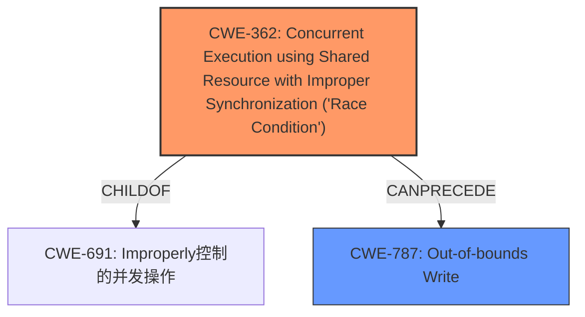

# Enhanced Analysis for CVE-2021-0401

# Summary
| CWE ID | CWE Name | Confidence | CWE Abstraction Level | CWE Vulnerability Mapping Label | CWE-Vulnerability Mapping Notes |
|---|---|---|---|---|---|
| CWE-362 | Concurrent Execution using Shared Resource with Improper Synchronization ('Race Condition') | 0.8 | Class | Allowed-with-Review | Primary CWE |
| CWE-787 | Out-of-bounds Write | 0.7 | Base | Allowed | Secondary Candidate |

## Evidence and Confidence

*   **Confidence Score:** 0.75
*   **Evidence Strength:** MEDIUM

## Relationship Analysis
The primary relationship that influenced the decision was the direct match of "**race condition**" to CWE-362. The secondary CWE, CWE-787, was chosen because the **race condition** leads to "**memory corruption**" via an out-of-bounds write.



## Vulnerability Chain
The vulnerability chain starts with a **race condition** (CWE-362), which leads to **memory corruption** (CWE-787).

## Summary of Analysis
The initial assessment identified CWE-362 as the primary weakness due to the explicit mention of "**race condition**" in the vulnerability description. The description also mentioned "**memory corruption**", which is a likely consequence of the race condition. Based on the retriever results and the relationships between the identified CWEs, CWE-787 (Out-of-bounds Write) was chosen as a secondary CWE, representing the **memory corruption** issue.

The selection of CWE-362 is directly supported by the vulnerability description, which states, "In vow, there is a possible **memory corruption** due to a **race condition**."

The graph relationships show that CWE-362 can precede CWE-787, meaning a race condition can lead to an out-of-bounds write.

The selected CWEs are at an appropriate level of specificity. CWE-362 is a Class, but a more specific Base CWE isn't available for the root cause. CWE-787 is a Base CWE, which is the preferred level of abstraction.

Relevant CWE Information:
- CWE-362: Concurrent Execution using Shared Resource with Improper Synchronization ('Race Condition'): The product contains a concurrent code sequence that requires temporary, exclusive access to a shared resource, but a timing window exists in which the shared resource can be modified by another code sequence operating concurrently.
- CWE-787: Out-of-bounds Write: The product writes data past the end, or before the beginning, of the intended buffer.

CWEs considered but not used:
- CWE-667: Improper Locking: While locking issues could contribute to a race condition, the description focuses on the race condition itself.
- CWE-662: Improper Synchronization: Similar to CWE-667, this is a broader category, and CWE-362 is more specific to the race condition.
- CWE-413: Improper Resource Locking: This is a potential cause of race conditions, but the description focuses on the existence of a race condition
- CWE-909: Missing Initialization of Resource: There is no evidence that the resource wasn't initialised.
- CWE-908: Use of Uninitialized Resource: There is no evidence that the resource is uninitialized.
- CWE-665: Improper Initialization: There is no evidence that the resource is improperly initialized.
- CWE-366: Race Condition within a Thread: This is a more specific type of race condition, but the description doesn't provide enough information to confirm it.
- CWE-1021: Improper Restriction of Rendered UI Layers or Frames: This is not related to the vulnerability description.


## CWE Relationship Analysis

Current CWEs represent these abstraction levels: .


### Vulnerability Chain Analysis

**Chain starting from CWE-691:**
- 691 (Insufficient Control Flow Management) - ROOT


**Chain starting from CWE-787:**
- 787 (Out-of-bounds Write) - ROOT


### CWE Relationship Diagram

```mermaid
graph TD
    classDef primary fill:#f96,stroke:#333,stroke-width:2px
    classDef secondary fill:#69f,stroke:#333
    classDef tertiary fill:#9e9,stroke:#333
```