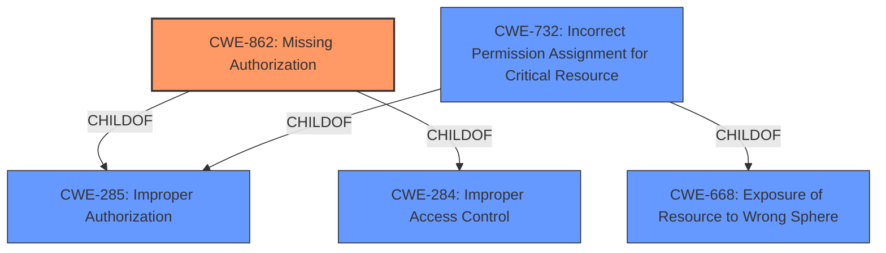

# Analysis for CVE-2021-0403

# Summary
| CWE ID | CWE Name | Confidence | CWE Abstraction Level | CWE Vulnerability Mapping Label | CWE-Vulnerability Mapping Notes |
|---|---|---|---|---|---|
| **CWE-862** | **Missing Authorization** | 0.9 | Class | Allowed-with-Review | Primary CWE: The vulnerability is due to a **missing permission check**. |
| CWE-732 | Incorrect Permission Assignment for Critical Resource | 0.6 | Class | Allowed-with-Review | Secondary CWE: This could be related since the **missing permission check** could result in incorrect permissions. |

## Evidence and Confidence

*   **Confidence Score:** 0.9
*   **Evidence Strength:** HIGH

## Relationship Analysis
The primary CWE, CWE-862 **Missing Authorization**, is a class-level CWE. It has a hierarchical relationship with CWE-285 Improper Authorization and CWE-284 Improper Access Control. CWE-732 Incorrect Permission Assignment for Critical Resource is a class-level CWE with parent relationships to CWE-285 and CWE-668 Exposure of Resource to Wrong Sphere. The vulnerability involves a **missing permission check**, which directly aligns with CWE-862. Since there's no base or variant level with the words 'missing permission check', CWE-862 is the best match.

## Vulnerability Chain
The vulnerability chain starts with the **missing permission check** (CWE-862), leading to potential information disclosure.
Missing Permission Check (CWE-862) -> Information Disclosure

## Summary of Analysis
The primary weakness is a **missing permission check**, which directly leads to information disclosure.
The analysis is based on the following evidence from the vulnerability description: "In netdiag, there is a possible information disclosure due to a **missing permission check**."
CWE-862 is the most appropriate because the description explicitly states a **missing permission check**.
CWE-732 was considered because the **missing permission check** might result in incorrect permission assignments, but CWE-862 is the more direct cause.

Relevant CWE Information:
- CWE-862: Directly reflects the **missing permission check**.
- CWE-732: Could be related to incorrect permissions being set due to the **missing permission check**.
- Other CWEs considered were not directly related to the root cause described.