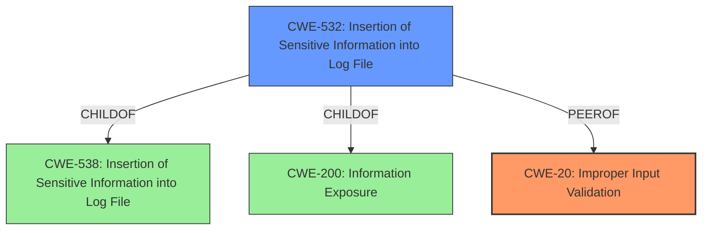

# Enhanced Analysis for CVE-2021-0404

# Summary

| CWE ID | CWE Name | Confidence | CWE Abstraction Level | CWE Vulnerability Mapping Label | CWE-Vulnerability Mapping Notes |
|---|---|---|---|---|---|
| CWE-20 | Improper Input Validation | 0.75 | Class | Primary | Discouraged |
| CWE-532 | Insertion of Sensitive Information into Log File | 0.5 | Base | Secondary | Allowed |

## Evidence and Confidence

*   **Confidence Score:** 0.7
*   **Evidence Strength:** MEDIUM

## Relationship Analysis
The primary CWE is CWE-20, which is a class-level CWE. While more specific CWEs are preferred, the evidence is not strong enough to support a more specific CWE. CWE-20 can precede several other CWEs such as CWE-22, CWE-41, CWE-74, CWE-119, and CWE-770. The secondary CWE considered is CWE-532, which is a base-level CWE, and child of CWE-538 and CWE-200.



## Vulnerability Chain
The vulnerability chain starts with **improper input validation** (CWE-20), which leads to information disclosure. The information disclosure may be due to insertion of sensitive information into log files (CWE-532).
`Improper Input Validation -> Information Disclosure (Insertion of Sensitive Information into Log File)`

## Summary of Analysis
The vulnerability description states that there is a possible information disclosure due to **improper input validation**. The key phrase "improper input validation" strongly suggests CWE-20. The description also indicates that this leads to local information disclosure. While there are many ways an information disclosure can occur from **improper input validation**, CWE-532 is a possible consequence.

CWE-20 is a class-level CWE, and the mapping guidance discourages its use when lower-level CWEs are available. However, the vulnerability description lacks the specificity required to select a more precise CWE. Therefore, while it's not ideal, CWE-20 is the most appropriate choice based on the available information.

CWE-532 (Insertion of Sensitive Information into Log File) is being considered because of the phrase "information disclosure", and although the type of the information disclosure is unknown, it is possible it is due to the insertion of sensitive information into a log file. This is not certain, so the confidence is low.

Other CWEs Considered but Not Used:
*   CWE-665: Improper Initialization - The vulnerability description doesn't explicitly mention initialization issues.
*   CWE-862: Missing Authorization - While possible, the description focuses on input validation rather than authorization.
*   CWE-908: Use of Uninitialized Resource - Similar to CWE-665, there's no explicit mention of using uninitialized resources.
*   CWE-514: Covert Channel - This is less likely given the information disclosure is described as local.
*   CWE-770: Allocation of Resources Without Limits or Throttling - This doesn't fit the description's focus on input validation and information disclosure.
*   CWE-1284: Improper Validation of Specified Quantity in Input - This is a more specific type of input validation, but the description doesn't provide enough detail to confirm if it applies.
*   CWE-362: Concurrent Execution using Shared Resource with Improper Synchronization ('Race Condition') - This is not related to the vulnerability description.
*   CWE-667: Improper Locking - This is not related to the vulnerability description.

Relevant CWE Information:

# Enhanced Context (25 CWEs)
The following CWEs were identified as potentially relevant to this vulnerability:

## CWE-667: Improper Locking
**Abstraction Level**: Class
**Similarity Score**: 0.78
**Source**: dense

**Description**:
The product does not properly acquire or release a lock on a resource, leading to unexpected resource state changes and behaviors.

**Mapping Guidance**:
- Usage: Allowed-with-Review
- Rationale: This CWE entry is a Class and might have Base-level children that would be more appropriate

## CWE-662: Improper Synchronization
**Abstraction Level**: Class
**Similarity Score**: 0.78
**Source**: dense

**Description**:
The product utilizes multiple threads or processes to allow temporary access to a shared resource that can only be exclusive to one process at a time, but it does not properly synchronize these actions, which might cause simultaneous accesses of this resource by multiple threads or processes.

**Mapping Guidance**:
- Usage: Discouraged
- Rationale: This CWE entry is a level-1 Class (i.e., a child of a Pillar). It might have lower-level children that would be more appropriate

## CWE-404: Improper Resource Shutdown or Release
**Abstraction Level**: Class
**Similarity Score**: 0.76
**Source**: dense

**Description**:
The product does not release or incorrectly releases a resource before it is made available for re-use.

**Mapping Guidance**:
- Usage: Allowed-with-Review
- Rationale: This CWE entry is a Class and might have Base-level children that would be more appropriate

## CWE-226: Sensitive Information in Resource Not Removed Before Reuse
**Abstraction Level**: Base
**Similarity Score**: 0.75
**Source**: dense

**Description**:
The product releases a resource such as memory or a file so that it can be made available for reuse, but it does not clear or "zeroize" the information contained in the resource before the product performs a critical state transition or makes the resource available for reuse by other entities.

**Mapping Guidance**:
- Usage: Allowed
- Rationale: This CWE entry is at the Base level of abstraction, which is a preferred level of abstraction for mapping to the root causes of vulnerabilities.

## CWE-1289: Improper Validation of Unsafe Equivalence in Input
**Abstraction Level**: Base
**Similarity Score**: 0.75
**Source**: dense

**Description**:
The product receives an input value that is used as a resource identifier or other type of reference, but it does not validate or incorrectly validates that the input is equivalent to a potentially-unsafe value.

**Mapping Guidance**:
- Usage: Allowed
- Rationale: This CWE entry is at the Base level of abstraction, which is a preferred level of abstraction for mapping to the root causes of vulnerabilities.

## CWE-366: Race Condition within a Thread
**Abstraction Level**: Base
**Similarity Score**: 0.75
**Source**: dense

**Description**:
If two threads of execution use a resource simultaneously, there exists the possibility that resources may be used while invalid, in turn making the state of execution undefined.

**Mapping Guidance**:
- Usage: Allowed
- Rationale: This CWE entry is at the Base level of abstraction, which is a preferred level of abstraction for mapping to the root causes of vulnerabilities.

## CWE-362: Concurrent Execution using Shared Resource with Improper Synchronization ('Race Condition')
**Abstraction Level**: Class
**Similarity Score**: 0.74
**Source**: dense

**Description**:
The product contains a concurrent code sequence that requires temporary, exclusive access to a shared resource, but a timing window exists in which the shared resource can be modified by another code sequence operating concurrently.

**Mapping Guidance**:
- Usage: Allowed-with-Review
- Rationale: This CWE entry is a Class and might have Base-level children that would be more appropriate

## CWE-413: Improper Resource Locking
**Abstraction Level**: Base
**Similarity Score**: 0.74
**Source**: dense

**Description**:
The product does not lock or does not correctly lock a resource when the product must have exclusive access to the resource.

**Mapping Guidance**:
- Usage: Allowed
- Rationale: This CWE entry is at the Base level of abstraction, which is a preferred level of abstraction for mapping to the root causes of vulnerabilities.

## CWE-664: Improper Control of a Resource Through its Lifetime
**Abstraction Level**: Pillar
**Similarity Score**: 0.74
**Source**: dense

**Description**:
The product does not maintain or incorrectly maintains control over a resource throughout its lifetime of creation, use, and release.

**Mapping Guidance**:
- Usage: Discouraged
- Rationale: This CWE entry is high-level


## CWE Relationship Analysis

Current CWEs represent these abstraction levels: .


### Vulnerability Chain Analysis

**Chain starting from CWE-404:**
- 404 (Improper Resource Shutdown or Release) - ROOT


**Chain starting from CWE-862:**
- 862 (Missing Authorization) - ROOT


### CWE Relationship Diagram

```mermaid
graph TD
    classDef primary fill:#f96,stroke:#333,stroke-width:2px
    classDef secondary fill:#69f,stroke:#333
    classDef tertiary fill:#9e9,stroke:#333
```