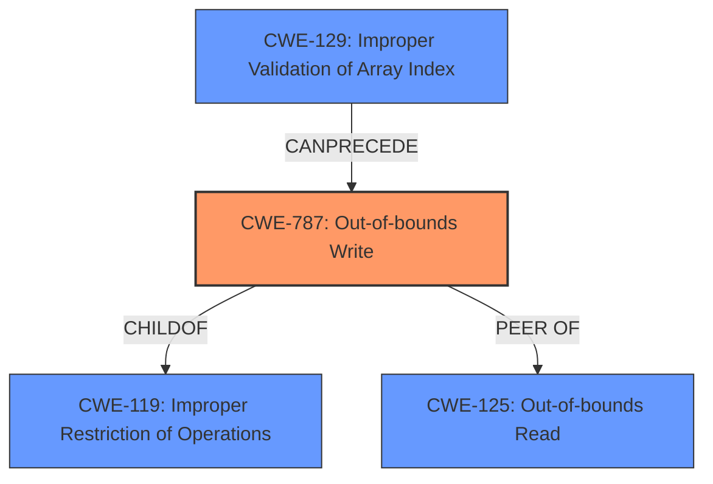

# Enhanced Analysis for CVE-2021-0424

# Summary
| CWE ID  | CWE Name                                                        | Confidence | CWE Abstraction Level | CWE Vulnerability Mapping Label | CWE-Vulnerability Mapping Notes |
| :-------- | :-------------------------------------------------------------- | :--------- | :---------------------- | :------------------------------ | :------------------------------ |
| CWE-787 | Out-of-bounds Write                                             | 0.9        | Base                    | Primary                         | Allowed                       |
| CWE-125  | Out-of-bounds Read                                             | 0.7        | Base                    | Secondary                       | Allowed                       |
| CWE-1284 | Improper Validation of Specified Quantity in Input             | 0.6        | Base                    | Secondary                       | Allowed                       |
| CWE-770 | Allocation of Resources Without Limits or Throttling | 0.5        | Base                    | Secondary                       | Allowed                       |

## Evidence and Confidence

*   **Confidence Score:** 0.8
*   **Evidence Strength:** HIGH

## Relationship Analysis
The primary CWE is CWE-787 **Out-of-bounds Write**, which stems from a **missing bounds check**. This is a common cause of out-of-bounds writes. CWE-787 is a child of CWE-119 **Improper Restriction of Operations within the Bounds of a Memory Buffer**. CWE-125 **Out-of-bounds Read** is related as a peer, since a missing bounds check could also lead to reading out of bounds. CWE-129 **Improper Validation of Array Index** can precede CWE-787, if an invalid index is not checked, it can result in out of bounds write.



## Vulnerability Chain
The vulnerability chain starts with a **missing bounds check** in the memory management driver, leading to a potential out-of-bounds write and a system crash.

Missing Bounds Check -> Out-of-Bounds Write -> System Crash (Denial of Service)

## Summary of Analysis
The vulnerability is due to a **missing bounds check** in the memory management driver, potentially leading to an out-of-bounds write. The primary CWE is CWE-787 **Out-of-bounds Write**, as it directly reflects the **root cause** and the potential for memory corruption. The evidence supporting this is the "Vulnerability Description Key Phrases" section which has "**rootcause:** **missing bounds check**" and the "CVE Reference Links Content Summary" which states "**Root cause of vulnerability:** Missing bounds check in the memory management driver."

CWE-125 **Out-of-bounds Read** and CWE-129 **Improper Validation of Array Index** were considered as secondary CWEs, given their relationship with out-of-bounds access and the importance of validating array indices, but the description leans more towards writing out of bounds.

CWE-1284 **Improper Validation of Specified Quantity in Input** and CWE-770 **Allocation of Resources Without Limits or Throttling** are included as the **missing bounds check** relates to the size of the memory that is being written to.

The final selection is based on the provided evidence and the relationships between the different CWEs, ensuring that the chosen CWEs are at the optimal level of specificity.

Relevant CWE Information:
CWE-787 **Out-of-bounds Write** is the most specific and appropriate choice, as it directly addresses the **root cause** (**missing bounds check**) and the resulting vulnerability.


## CWE Relationship Analysis

Current CWEs represent these abstraction levels: .


### Vulnerability Chain Analysis

**Chain starting from CWE-787:**
- 787 (Out-of-bounds Write) - ROOT


**Chain starting from CWE-125:**
- 125 (Out-of-bounds Read) - ROOT


### CWE Relationship Diagram

```mermaid
graph TD
    classDef primary fill:#f96,stroke:#333,stroke-width:2px
    classDef secondary fill:#69f,stroke:#333
    classDef tertiary fill:#9e9,stroke:#333
```