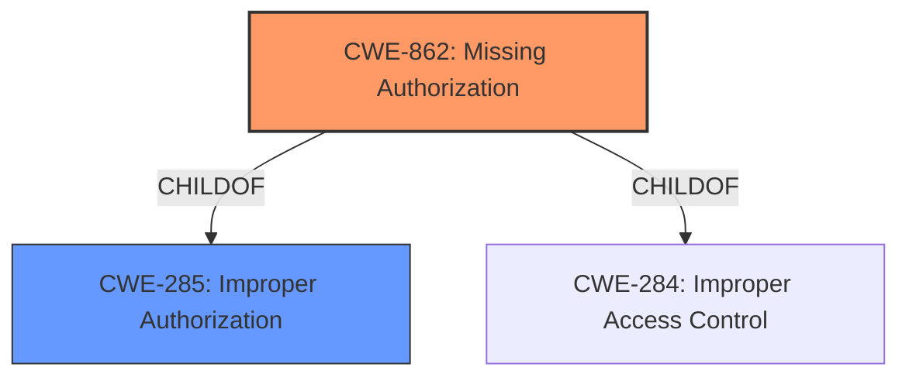

# Raw Analyzer Response for CVE-2021-0428

# Summary
| CWE ID | CWE Name | Confidence | CWE Abstraction Level | CWE Vulnerability Mapping Label | CWE-Vulnerability Mapping Notes |
|---|---|---|---|---|---|
| CWE-862 | Missing Authorization | 1.0 | Class | Allowed-with-Review | Primary CWE |
| CWE-285 | Improper Authorization | 0.7 | Class | Discouraged | Secondary Candidate |

## Evidence and Confidence

*   **Confidence Score:** 1.0
*   **Evidence Strength:** HIGH

## Relationship Analysis
The primary relationship that influenced the CWE selection is the ChildOf relationship between CWE-862 **[Missing Authorization]** and CWE-285 **[Improper Authorization]**. While CWE-285 is a more general class, CWE-862 is a more specific type of authorization issue, making it a better fit for the vulnerability described. Both CWEs fall under the broader category of authorization-related weaknesses, but CWE-862 directly addresses the **missing permission check** root cause.

## Vulnerability Chain
The vulnerability chain starts with a **missing permission check** in the `getSimSerialNumber` function. This **missing** check allows a user with User execution privileges to read a trackable identifier, leading to local information disclosure.

Root Cause: **Missing permission check** (CWE-862) -> Impact: Information Disclosure

## Summary of Analysis
The initial analysis and resulting conclusion is based on the evidence provided in the "Vulnerability Description Key Phrases" and "CVE Reference Links Content Summary". The key phrase "missing permission check" strongly indicates an authorization issue. The CVE summary confirms this by stating that the root cause is an "inconsistent application of access restrictions for device identifiers".

The graph relationships influenced the final selection by guiding the choice of the more specific CWE, CWE-862, over its parent, CWE-285.

The selected CWE, CWE-862, is at the optimal level of specificity because it directly represents the root cause, which is the **missing authorization**.

Relevant CWE Information:

# Enhanced Context (25 CWEs)
The following CWEs were identified as potentially relevant to this vulnerability:

## CWE-754: Improper Check for Unusual or Exceptional Conditions
**Abstraction Level**: Class

## CWE-203: Observable Discrepancy
**Abstraction Level**: Base

## CWE-941: Incorrectly Specified Destination in a Communication Channel
**Abstraction Level**: Base

## CWE-909: Missing Initialization of Resource
**Abstraction Level**: Class

## CWE-226: Sensitive Information in Resource Not Removed Before Reuse
**Abstraction Level**: Base

## CWE-345: Insufficient Verification of Data Authenticity
**Abstraction Level**: Class

## CWE-667: Improper Locking
**Abstraction Level**: Class

## CWE-665: Improper Initialization
**Abstraction Level**: Class

## CWE-668: Exposure of Resource to Wrong Sphere
**Abstraction Level**: Class

## CWE-908: Use of Uninitialized Resource
**Abstraction Level**: Base

## CWE-941: Incorrectly Specified Destination in a Communication Channel
**Abstraction Level**: Base

## CWE-927: Use of Implicit Intent for Sensitive Communication
**Abstraction Level**: Variant

## CWE-863: Incorrect Authorization
**Abstraction Level**: Class

## CWE-285: Improper Authorization
**Abstraction Level**: Class

## CWE-923: Improper Restriction of Communication Channel to Intended Endpoints
**Abstraction Level**: Class

## CWE-205: Observable Behavioral Discrepancy
**Abstraction Level**: base

## CWE-941: Incorrectly Specified Destination in a Communication Channel
**Abstraction Level**: Base

## CWE-908: Use of Uninitialized Resource
**Abstraction Level**: Base

## CWE-201: Insertion of Sensitive Information Into Sent Data
**Abstraction Level**: base

## CWE-942: Permissive Cross-domain Policy with Untrusted Domains
**Abstraction Level**: variant

## CWE-441: Unintended Proxy or Intermediary ('Confused Deputy')
**Abstraction Level**: class

## CWE-406: Insufficient Control of Network Message Volume (Network Amplification)
**Abstraction Level**: class

## CWE-514: Covert Channel
**Abstraction Level**: class

## CWE-940: Improper Verification of Source of a Communication Channel
**Abstraction Level**: base

## CWE-1021: Improper Restriction of Rendered UI Layers or Frames
**Abstraction Level**: base

### CWE-862: Missing Authorization
*   **How the vulnerability's details match the CWE's characteristics:** The vulnerability description explicitly states a "**missing permission check**" in `getSimSerialNumber`. This directly aligns with CWE-862's description: "The product does not perform an authorization check when an actor attempts to access a resource or perform an action."
*   **The security implications and potential impact:** The **missing authorization** allows unauthorized access to a trackable identifier, leading to information disclosure.
*   **Any parent-child relationships or chain patterns that influenced your mapping:** CWE-862 is a child of CWE-285 (Improper Authorization). The choice of CWE-862 was influenced by its specificity in addressing **missing** authorization, rather than simply an "improper" one.
*   **Whether the weakness is primary or secondary in the vulnerability:** The **missing permission check** is the primary weakness and root cause of the vulnerability.
*   **How the official MITRE mapping guidance influenced your decision:** The MITRE mapping guidance for CWE-862 suggests reviewing its children for a better fit, which was considered in this case, but no child CWE provided a better fit.

### CWE-285: Improper Authorization
*   **Why it was considered but not used:** While CWE-285 is related, it is more general. The vulnerability is specifically due to a **missing** authorization check, making CWE-862 a more precise fit. The MITRE mapping guidance for CWE-285 discourages its use when lower-level CWEs are applicable, reinforcing the choice of CWE-862.

Other CWEs Considered:

*   CWE-1021: Improper Restriction of Rendered UI Layers or Frames - While this CWE was in the retriever results, it is specific to UI rendering issues, which is not the case here.
*   CWE-927: Use of Implicit Intent for Sensitive Communication - This CWE is specific to Android intents, which are not mentioned in the vulnerability description.
*   CWE-665: Improper Initialization - This CWE relates to resources not being properly initialized, which is not the root cause of this vulnerability.
*   CWE-514: Covert Channel - This CWE relates to unintended channels for information transfer, which is not relevant to this vulnerability.
*   CWE-925: Improper Verification of Intent by Broadcast Receiver - Similar to CWE-927, this is specific to Android intents and not relevant.
*   CWE-205: Observable Behavioral Discrepancy - This CWE is about observable differences in behavior, which is not the primary issue here.
*   CWE-941: Incorrectly Specified Destination in a Communication Channel - This CWE relates to communication channels having incorrect destinations, which doesn't align with the **missing authorization** issue.
*   CWE-223: Omission of Security-relevant Information - This is more about the omission of logging or display of information and not authorization.
*   CWE-908: Use of Uninitialized Resource - Similar to CWE-665, this relates to using uninitialized resources and is not the root cause.