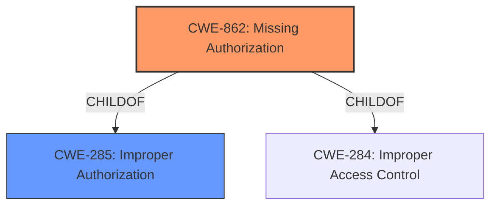

# Analysis for CVE-2021-0428

# Summary
| CWE ID | CWE Name | Confidence | CWE Abstraction Level | CWE Vulnerability Mapping Label | CWE-Vulnerability Mapping Notes |
|---|---|---|---|---|---|
| CWE-862 | Missing Authorization | 1.0 | Class | Allowed-with-Review | Primary CWE |
| CWE-285 | Improper Authorization | 0.7 | Class | Discouraged | Secondary Candidate |

## Evidence and Confidence

*   **Confidence Score:** 1.0
*   **Evidence Strength:** HIGH

## Relationship Analysis
The primary relationship that influenced the CWE selection is the ChildOf relationship between CWE-862 **[Missing Authorization]** and CWE-285 **[Improper Authorization]**. While CWE-285 is a more general class, CWE-862 is a more specific type of authorization issue, making it a better fit for the vulnerability described. Both CWEs fall under the broader category of authorization-related weaknesses, but CWE-862 directly addresses the **missing permission check** root cause.

## Vulnerability Chain
The vulnerability chain starts with a **missing permission check** in the `getSimSerialNumber` function. This **missing** check allows a user with User execution privileges to read a trackable identifier, leading to local information disclosure.

Root Cause: **Missing permission check** (CWE-862) -> Impact: Information Disclosure

## Summary of Analysis
The initial analysis and resulting conclusion is based on the evidence provided in the "Vulnerability Description Key Phrases" and "CVE Reference Links Content Summary". The key phrase "missing permission check" strongly indicates an authorization issue. The CVE summary confirms this by stating that the root cause is an "inconsistent application of access restrictions for device identifiers".

The graph relationships influenced the final selection by guiding the choice of the more specific CWE, CWE-862, over its parent, CWE-285.

The selected CWE, CWE-862, is at the optimal level of specificity because it directly represents the root cause, which is the **missing authorization**.

Relevant CWE Information:

# Enhanced Context (25 CWEs)
The following CWEs were identified as potentially relevant to this vulnerability:

## CWE-754: Improper Check for Unusual or Exceptional Conditions
**Abstraction Level**: Class

## CWE-203: Observable Discrepancy
**Abstraction Level**: Base

## CWE-941: Incorrectly Specified Destination in a Communication Channel
**Abstraction Level**: Base

## CWE-909: Missing Initialization of Resource
**Abstraction Level**: Class

## CWE-226: Sensitive Information in Resource Not Removed Before Reuse
**Abstraction Level**: Base

## CWE-345: Insufficient Verification of Data Authenticity
**Abstraction Level**: Class

## CWE-667: Improper Locking
**Abstraction Level**: Class

## CWE-665: Improper Initialization
**Abstraction Level**: Class

## CWE-668: Exposure of Resource to Wrong Sphere
**Abstraction Level**: Class

## CWE-908: Use of Uninitialized Resource
**Abstraction Level**: Base

## CWE-941: Incorrectly Specified Destination in a Communication Channel
**Abstraction Level**: Base

## CWE-927: Use of Implicit Intent for Sensitive Communication
**Abstraction Level**: Variant

## CWE-863: Incorrect Authorization
**Abstraction Level**: Class

## CWE-285: Improper Authorization
**Abstraction Level**: Class

## CWE-923: Improper Restriction of Communication Channel to Intended Endpoints
**Abstraction Level**: Class

## CWE-205: Observable Behavioral Discrepancy
**Abstraction Level**: base

## CWE-941: Incorrectly Specified Destination in a Communication Channel
**Abstraction Level**: Base

## CWE-908: Use of Uninitialized Resource
**Abstraction Level**: Base

## CWE-201: Insertion of Sensitive Information Into Sent Data
**Abstraction Level**: base

## CWE-942: Permissive Cross-domain Policy with Untrusted Domains
**Abstraction Level**: variant

## CWE-441: Unintended Proxy or Intermediary ('Confused Deputy')
**Abstraction Level**: class

## CWE-406: Insufficient Control of Network Message Volume (Network Amplification)
**Abstraction Level**: class

## CWE-514: Covert Channel
**Abstraction Level**: class

## CWE-940: Improper Verification of Source of a Communication Channel
**Abstraction Level**: base

## CWE-1021: Improper Restriction of Rendered UI Layers or Frames
**Abstraction Level**: base

### CWE-862: Missing Authorization
*   **How the vulnerability's details match the CWE's characteristics:** The vulnerability description explicitly states a "**missing permission check**" in `getSimSerialNumber`. This directly aligns with CWE-862's description: "The product does not perform an authorization check when an actor attempts to access a resource or perform an action."
*   **The security implications and potential impact:** The **missing authorization** allows unauthorized access to a trackable identifier, leading to information disclosure.
*   **Any parent-child relationships or chain patterns that influenced your mapping:** CWE-862 is a child of CWE-285 (Improper Authorization). The choice of CWE-862 was influenced by its specificity in addressing **missing** authorization, rather than simply an "improper" one.
*   **Whether the weakness is primary or secondary in the vulnerability:** The **missing permission check** is the primary weakness and root cause of the vulnerability.
*   **How the official MITRE mapping guidance influenced your decision:** The MITRE mapping guidance for CWE-862 suggests reviewing its children for a better fit, which was considered in this case, but no child CWE provided a better fit.

### CWE-285: Improper Authorization
*   **Why it was considered but not used:** While CWE-285 is related, it is more general. The vulnerability is specifically due to a **missing** authorization check, making CWE-862 a more precise fit. The MITRE mapping guidance for CWE-285 discourages its use when lower-level CWEs are applicable, reinforcing the choice of CWE-862.

Other CWEs Considered:

*   CWE-1021: Improper Restriction of Rendered UI Layers or Frames - While this CWE was in the retriever results, it is specific to UI rendering issues, which is not the case here.
*   CWE-927: Use of Implicit Intent for Sensitive Communication - This CWE is specific to Android intents, which are not mentioned in the vulnerability description.
*   CWE-665: Improper Initialization - This CWE relates to resources not being properly initialized, which is not the root cause of this vulnerability.
*   CWE-514: Covert Channel - This CWE relates to unintended channels for information transfer, which is not relevant to this vulnerability.
*   CWE-925: Improper Verification of Intent by Broadcast Receiver - Similar to CWE-927, this is specific to Android intents and not relevant.
*   CWE-205: Observable Behavioral Discrepancy - This CWE is about observable differences in behavior, which is not the primary issue here.
*   CWE-941: Incorrectly Specified Destination in a Communication Channel - This CWE relates to communication channels having incorrect destinations, which doesn't align with the **missing authorization** issue.
*   CWE-223: Omission of Security-relevant Information - This is more about the omission of logging or display of information and not authorization.
*   CWE-908: Use of Uninitialized Resource - Similar to CWE-665, this relates to using uninitialized resources and is not the root cause.

# Enhanced Query for CVE-2021-0428

## Vulnerability Description
In getSimSerialNumber of TelephonyManager.java, there is a possible way to read a trackable identifier due to a **missing permission check**. This could lead to local information disclosure with User execution privileges needed. User interaction is not needed for exploitation.Product AndroidVersions Android-10Android ID A-173421434

### Vulnerability Description Key Phrases
- **rootcause:** **missing permission check**
- **impact:** read a trackable identifier
- **attacker:** User with User execution privileges
- **product:** Android
- **version:** Android-10
- **component:** getSimSerialNumber of TelephonyManager.java

## CVE Reference Links Content Summary
Based on the provided information, here's an analysis of CVE-2021-0428:

**Summary:**
CVE-2021-0428 is an information disclosure vulnerability affecting Android 10, stemming from insufficient protection of device identifiers. Specifically, the `SubscriptionInfo` API exposed sensitive information (ICC ID and card string) that should have been restricted by the new identifier access requirements introduced in Android 10.

**Root cause of vulnerability:**

The root cause lies in the inconsistent application of access restrictions for device identifiers. While `TelephonyManager#getSimSerialNumber` was correctly guarded behind the new access requirements (`READ_PRIVILEGED_PHONE_STATE` permission, carrier privileges, or device/profile owner check),  `SubscriptionInfo#getIccId` and `SubscriptionInfo#getCardString` were not properly protected. This allowed apps without the necessary permissions to access these identifiers.

**Weaknesses/vulnerabilities present:**

-   **Information Disclosure:** The primary vulnerability is the exposure of sensitive device identifiers (ICC ID and card string) through `SubscriptionInfo#getIccId` and `SubscriptionInfo#getCardString` to apps lacking proper authorization.
-   **Inconsistent Access Control:** The vulnerability stems from an inconsistency in how access controls were applied to different APIs providing similar information. `TelephonyManager#getSimSerialNumber` was properly guarded, while the `SubscriptionInfo` counterparts were not.

**Impact of exploitation:**

-   **Privacy violation:** Exploitation allows malicious apps to obtain device identifiers without proper permissions, potentially leading to tracking, profiling, and other privacy violations.
-   **Circumvention of Security Measures:** By bypassing intended access controls, attackers can gain access to identifiers designed to be protected.

**Attack vectors:**

-   A malicious app could call the `SubscriptionInfo#getIccId` or `SubscriptionInfo#getCardString` API to obtain sensitive information without holding the `READ_PRIVILEGED_PHONE_STATE` permission, carrier privileges, or device/profile owner status.

**Required attacker capabilities/position:**

-   **Malicious Application:** The attacker needs to install a malicious application on the device.
-   **No special permissions required:** The malicious application does not require the `READ_PRIVILEGED_PHONE_STATE` permission or other privileged access to exploit this vulnerability as it circumvents existing protections.

**Additional details from the provided content:**

-   Several commits address this issue, including changes to:
    -   Clear out card strings from `SubscriptionInfo` objects if the caller doesn't meet identifier access requirements.
    -   Clear out ICC IDs from `SubscriptionInfo` objects when access requirements are not met.
    -   Move permission checks out of synchronized blocks for performance improvement.
    -   Whitelist `READ_PRIVILEGED_PHONE_STATE` for the contacts provider to prevent issues with database upgrades, while still addressing the core vulnerability by correctly guarding access to the identifiers.
    -   Update documentation for `getIccId` to reflect access restrictions.
    -   Fix a bug that could disable grouped CBRS during a profile switch on a primary SIM.
    -   Remove unnecessary locking to avoid potential deadlocks.

-   The fix ensures that the `SubscriptionInfo` object does not return sensitive information if the caller does not have the required permissions.

This information provides more detail than the description in the CVE record by specifying the vulnerable APIs, the specific information exposed, and the steps taken to remediate the issue.

## Retriever Results

### Top Combined Results

| Rank | CWE ID | Name | Abstraction | Usage  | Retrievers | Individual Scores |
|------|--------|------|-------------|-------|------------|-------------------|
| 1 | 862 | Missing Authorization | Class | Allowed-with-Review | sparse | 0.435 |
| 2 | 1021 | Improper Restriction of Rendered UI Layers or Frames | Base | Allowed | sparse | 0.373 |
| 3 | 927 | Use of Implicit Intent for Sensitive Communication | Variant | Allowed | sparse | 0.356 |
| 4 | 665 | Improper Initialization | Class | Discouraged | sparse | 0.347 |
| 5 | 514 | Covert Channel | Class | Allowed-with-Review | sparse | 0.343 |
| 6 | 925 | Improper Verification of Intent by Broadcast Receiver | Variant | Allowed | dense | 0.547 |
| 7 | 205 | Observable Behavioral Discrepancy | Base | Allowed | graph | 0.003 |
| 8 | 941 | Incorrectly Specified Destination in a Communication Channel | Base | Allowed | sparse | 0.337 |
| 9 | 223 | Omission of Security-relevant Information | Base | Allowed | sparse | 0.329 |
| 10 | 908 | Use of Uninitialized Resource | Base | Allowed | sparse | 0.325 |

# Complete CWE Specifications

## CWE-862: Missing Authorization
**Abstraction:** Class
**Status:** Incomplete

### Description
The product does not perform an authorization check when an actor attempts to access a resource or perform an action.

### Extended Description
Not provided

### Alternative Terms
AuthZ: "AuthZ" is typically used as an abbreviation of "authorization" within the web application security community. It is distinct from "AuthN" (or, sometimes, "AuthC") which is an abbreviation of "authentication." The use of "Auth" as an abbreviation is discouraged, since it could be used for either authentication or authorization.

### Relationships
ChildOf -> CWE-285
ChildOf -> CWE-284

### Mapping Guidance
**Usage:** Allowed-with-Review
**Rationale:** This CWE entry is a Class and might have Base-level children that would be more appropriate
**Comments:** Examine children of this entry to see if there is a better fit
**Reasons:**
- Abstraction

### Additional Notes
**[Terminology]** Assuming a user with a given identity, authorization is the process of determining whether that user can access a given resource, based on the user's privileges and any permissions or other access-control specifications that apply to the resource.

### Observed Examples
- **CVE-2022-24730:** Go-based continuous deployment product does not check that a user has certain privileges to update or create an app, allowing adversaries to read sensitive repository information
- **CVE-2009-3168:** Web application does not restrict access to admin scripts, allowing authenticated users to reset administrative passwords.
- **CVE-2009-3597:** Web application stores database file under the web root with insufficient access control (CWE-219), allowing direct request.

## CWE-1021: Improper Restriction of Rendered UI Layers or Frames
**Abstraction:** Base
**Status:** Incomplete

### Description
The web application does not restrict or incorrectly restricts frame objects or UI layers that belong to another application or domain, which can lead to user confusion about which interface the user is interacting with.

### Extended Description
A web application is expected to place restrictions on whether it is allowed to be rendered within frames, iframes, objects, embed or applet elements. Without the restrictions, users can be tricked into interacting with the application when they were not intending to.

### Alternative Terms
Clickjacking
UI Redress Attack
Tapjacking: "Tapjacking" is similar to clickjacking, except it is used for mobile applications in which the user "taps" the application instead of performing a mouse click.

### Relationships
ChildOf -> CWE-441
ChildOf -> CWE-610
ChildOf -> CWE-451

### Mapping Guidance
**Usage:** Allowed
**Rationale:** This CWE entry is at the Base level of abstraction, which is a preferred level of abstraction for mapping to the root causes of vulnerabilities.
**Comments:** Carefully read both the name and description to ensure that this mapping is an appropriate fit. Do not try to 'force' a mapping to a lower-level Base/Variant simply to comply with this preferred level of abstraction.
**Reasons:**
- Acceptable-Use

### Observed Examples
- **CVE-2017-7440:** E-mail preview feature in a desktop application allows clickjacking attacks via a crafted e-mail message
- **CVE-2017-5697:** Hardware/firmware product has insufficient clickjacking protection in its web user interface
- **CVE-2017-4015:** Clickjacking in data-loss prevention product via HTTP response header.

## CWE-927: Use of Implicit Intent for Sensitive Communication
**Abstraction:** Variant
**Status:** Incomplete

### Description
The Android application uses an implicit intent for transmitting sensitive data to other applications.

### Extended Description

Since an implicit intent does not specify a particular application to receive the data, any application can process the intent by using an Intent Filter for that intent. This can allow untrusted applications to obtain sensitive data. There are two variations on the standard broadcast intent, ordered and sticky.

Ordered broadcast intents are delivered to a series of registered receivers in order of priority as declared by the Receivers. A malicious receiver can give itself a high priority and cause a denial of service by stopping the broadcast from propagating further down the chain. There is also the possibility of malicious data modification, as a receiver may also alter the data within the Intent before passing it on to the next receiver. The downstream components have no way of asserting that the data has not been altered earlier in the chain.

Sticky broadcast intents remain accessible after the initial broadcast. An old sticky intent will be broadcast again to any new receivers that register for it in the future, greatly increasing the chances of information exposure over time. Also, sticky broadcasts cannot be protected by permissions that may apply to other kinds of intents.

In addition, any broadcast intent may include a URI that references data that the receiving component does not normally have the privileges to access. The sender of the intent can include special privileges that grant the receiver read or write access to the specific URI included in the intent. A malicious receiver that intercepts this intent will also gain those privileges and be able to read or write the resource at the specified URI.

### Alternative Terms
None

### Relationships
ChildOf -> CWE-285
ChildOf -> CWE-668

### Mapping Guidance
**Usage:** Allowed
**Rationale:** This CWE entry is at the Variant level of abstraction, which is a preferred level of abstraction for mapping to the root causes of vulnerabilities.
**Comments:** Carefully read both the name and description to ensure that this mapping is an appropriate fit. Do not try to 'force' a mapping to a lower-level Base/Variant simply to comply with this preferred level of abstraction.
**Reasons:**
- Acceptable-Use

### Observed Examples
- **CVE-2022-4903:** An Android application does not use FLAG_IMMUTABLE when creating a PendingIntent.

## CWE-665: Improper Initialization
**Abstraction:** Class
**Status:** Draft

### Description
The product does not initialize or incorrectly initializes a resource, which might leave the resource in an unexpected state when it is accessed or used.

### Extended Description
This can have security implications when the associated resource is expected to have certain properties or values, such as a variable that determines whether a user has been authenticated or not.

### Alternative Terms
None

### Relationships
ChildOf -> CWE-664

### Mapping Guidance
**Usage:** Discouraged
**Rationale:** This CWE entry is a level-1 Class (i.e., a child of a Pillar). It might have lower-level children that would be more appropriate
**Comments:** Examine children of this entry to see if there is a better fit
**Reasons:**
- Abstraction

### Observed Examples
- **CVE-2001-1471:** chain: an invalid value prevents a library file from being included, skipping initialization of key variables, leading to resultant eval injection.
- **CVE-2008-3637:** Improper error checking in protection mechanism produces an uninitialized variable, allowing security bypass and code execution.
- **CVE-2008-4197:** Use of uninitialized memory may allow code execution.

## CWE-514: Covert Channel
**Abstraction:** Class
**Status:** Incomplete

### Description
A covert channel is a path that can be used to transfer information in a way not intended by the system's designers.

### Extended Description
Typically the system has not given authorization for the transmission and has no knowledge of its occurrence.

### Alternative Terms
None

### Relationships
ChildOf -> CWE-1229

### Mapping Guidance
**Usage:** Allowed-with-Review
**Rationale:** This CWE entry is a Class and might have Base-level children that would be more appropriate
**Comments:** Examine children of this entry to see if there is a better fit
**Reasons:**
- Abstraction

### Additional Notes
**[Theoretical]** A covert channel can be thought of as an emergent resource, meaning that it was not an originally intended resource, however it exists due the application's behaviors.

**[Maintenance]** As of CWE 4.9, members of the CWE Hardware SIG are working to improve CWE's coverage of transient execution weaknesses, which include issues related to Spectre, Meltdown, and other attacks that create or exploit covert channels. As a result of that work, this entry might change in CWE 4.10.

## CWE-925: Improper Verification of Intent by Broadcast Receiver
**Abstraction:** Variant
**Status:** Incomplete

### Description
The Android application uses a Broadcast Receiver that receives an Intent but does not properly verify that the Intent came from an authorized source.

### Extended Description
Certain types of Intents, identified by action string, can only be broadcast by the operating system itself, not by third-party applications. However, when an application registers to receive these implicit system intents, it is also registered to receive any explicit intents. While a malicious application cannot send an implicit system intent, it can send an explicit intent to the target application, which may assume that any received intent is a valid implicit system intent and not an explicit intent from another application. This may lead to unintended behavior.

### Alternative Terms
Intent Spoofing

### Relationships
ChildOf -> CWE-940

### Mapping Guidance
**Usage:** Allowed
**Rationale:** This CWE entry is at the Variant level of abstraction, which is a preferred level of abstraction for mapping to the root causes of vulnerabilities.
**Comments:** Carefully read both the name and description to ensure that this mapping is an appropriate fit. Do not try to 'force' a mapping to a lower-level Base/Variant simply to comply with this preferred level of abstraction.
**Reasons:**
- Acceptable-Use

### Additional Notes
**[Maintenance]** This entry will be made more comprehensive in later CWE versions.

## CWE-205: Observable Behavioral Discrepancy
**Abstraction:** Base
**Status:** Incomplete

### Description
The product's behaviors indicate important differences that may be observed by unauthorized actors in a way that reveals (1) its internal state or decision process, or (2) differences from other products with equivalent functionality.

### Extended Description
Ideally, a product should provide as little information about its internal operations as possible. Otherwise, attackers could use knowledge of these internal operations to simplify or optimize their attack. In some cases, behavioral discrepancies can be used by attackers to form a side channel.

### Alternative Terms
None

### Relationships
ChildOf -> CWE-203
CanPrecede -> CWE-514

### Mapping Guidance
**Usage:** Allowed
**Rationale:** This CWE entry is at the Base level of abstraction, which is a preferred level of abstraction for mapping to the root causes of vulnerabilities.
**Comments:** Carefully read both the name and description to ensure that this mapping is an appropriate fit. Do not try to 'force' a mapping to a lower-level Base/Variant simply to comply with this preferred level of abstraction.
**Reasons:**
- Acceptable-Use

### Observed Examples
- **CVE-2002-0208:** Product modifies TCP/IP stack and ICMP error messages in unusual ways that show the product is in use.
- **CVE-2004-2252:** Behavioral infoleak by responding to SYN-FIN packets.

## CWE-941: Incorrectly Specified Destination in a Communication Channel
**Abstraction:** Base
**Status:** Incomplete

### Description
The product creates a communication channel to initiate an outgoing request to an actor, but it does not correctly specify the intended destination for that actor.

### Extended Description

Attackers at the destination may be able to spoof trusted servers to steal data or cause a denial of service.

There are at least two distinct weaknesses that can cause the product to communicate with an unintended destination:

  - If the product allows an attacker to control which destination is specified, then the attacker can cause it to connect to an untrusted or malicious destination. For example, because UDP is a connectionless protocol, UDP packets can be spoofed by specifying a false source address in the packet; when the server receives the packet and sends a reply, it will specify a destination by using the source of the incoming packet - i.e., the false source. The server can then be tricked into sending traffic to the wrong host, which is effective for hiding the real source of an attack and for conducting a distributed denial of service (DDoS). As another example, server-side request forgery (SSRF) and XML External Entity (XXE) can be used to trick a server into making outgoing requests to hosts that cannot be directly accessed by the attacker due to firewall restrictions.

  - If the product incorrectly specifies the destination, then an attacker who can control this destination might be able to spoof trusted servers. While the most common occurrence is likely due to misconfiguration by an administrator, this can be resultant from other weaknesses. For example, the product might incorrectly parse an e-mail or IP address and send sensitive data to an unintended destination. As another example, an Android application may use a "sticky broadcast" to communicate with a receiver for a particular application, but since sticky broadcasts can be processed by *any* receiver, this can allow a malicious application to access restricted data that was only intended for a different application.

### Alternative Terms
None

### Relationships
ChildOf -> CWE-923
CanPrecede -> CWE-406

### Mapping Guidance
**Usage:** Allowed
**Rationale:** This CWE entry is at the Base level of abstraction, which is a preferred level of abstraction for mapping to the root causes of vulnerabilities.
**Comments:** Carefully read both the name and description to ensure that this mapping is an appropriate fit. Do not try to 'force' a mapping to a lower-level Base/Variant simply to comply with this preferred level of abstraction.
**Reasons:**
- Acceptable-Use

### Observed Examples
- **CVE-2013-5211:** composite: NTP feature generates large responses (high amplification factor) with spoofed UDP source addresses.
- **CVE-1999-0513:** Classic "Smurf" attack, using spoofed ICMP packets to broadcast addresses.
- **CVE-1999-1379:** DNS query with spoofed source address causes more traffic to be returned to spoofed address than was sent by the attacker.

## CWE-223: Omission of Security-relevant Information
**Abstraction:** Base
**Status:** Draft

### Description
The product does not record or display information that would be important for identifying the source or nature of an attack, or determining if an action is safe.

### Extended Description
Not provided

### Alternative Terms
None

### Relationships
ChildOf -> CWE-221

### Mapping Guidance
**Usage:** Allowed
**Rationale:** This CWE entry is at the Base level of abstraction, which is a preferred level of abstraction for mapping to the root causes of vulnerabilities.
**Comments:** Carefully read both the name and description to ensure that this mapping is an appropriate fit. Do not try to 'force' a mapping to a lower-level Base/Variant simply to comply with this preferred level of abstraction.
**Reasons:**
- Acceptable-Use

### Observed Examples
- **CVE-1999-1029:** Login attempts are not recorded if the user disconnects before the maximum number of tries.
- **CVE-2002-1839:** Sender's IP address not recorded in outgoing e-mail.
- **CVE-2000-0542:** Failed authentication attempts are not recorded if later attempt succeeds.

## CWE-908: Use of Uninitialized Resource
**Abstraction:** Base
**Status:** Incomplete

### Description
The product uses or accesses a resource that has not been initialized.

### Extended Description
When a resource has not been properly initialized, the product may behave unexpectedly. This may lead to a crash or invalid memory access, but the consequences vary depending on the type of resource and how it is used within the product.

### Alternative Terms
None

### Relationships
ChildOf -> CWE-665
ChildOf -> CWE-665

### Mapping Guidance
**Usage:** Allowed
**Rationale:** This CWE entry is at the Base level of abstraction, which is a preferred level of abstraction for mapping to the root causes of vulnerabilities.
**Comments:** Carefully read both the name and description to ensure that this mapping is an appropriate fit. Do not try to 'force' a mapping to a lower-level Base/Variant simply to comply with this preferred level of abstraction.
**Reasons:**
- Acceptable-Use

### Observed Examples
- **CVE-2019-9805:** Chain: Creation of the packet client occurs before initialization is complete (CWE-696) resulting in a read from uninitialized memory (CWE-908), causing memory corruption.
- **CVE-2008-4197:** Use of uninitialized memory may allow code execution.
- **CVE-2008-2934:** Free of an uninitialized pointer leads to crash and possible code execution.

