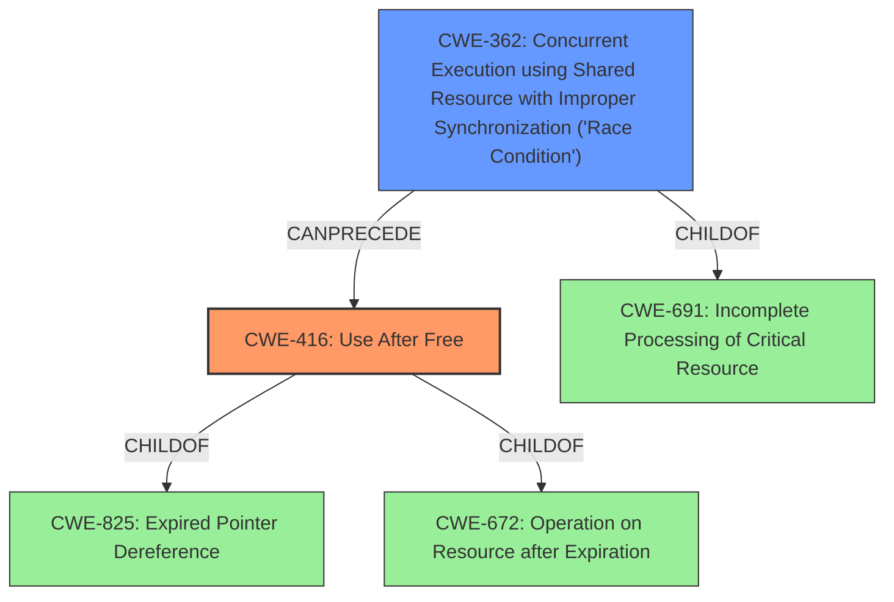

# Raw Analyzer Response for CVE-2021-0432

# Summary
| CWE ID | CWE Name | Confidence | CWE Abstraction Level | CWE Vulnerability Mapping Label | CWE-Vulnerability Mapping Notes |
|---|---|---|---|---|---|
| CWE-416 | Use After Free | 1.0 | Variant | Allowed | Primary CWE |
| CWE-362 | Concurrent Execution using Shared Resource with Improper Synchronization ('Race Condition') | 1.0 | Class | Allowed-with-Review | Secondary CWE |

## Evidence and Confidence

*   **Confidence Score:** 1.0
*   **Evidence Strength:** HIGH

## Relationship Analysis
The primary weakness is CWE-416 Use After Free, which is a variant. It is related to a higher level class CWE-362 Concurrent Execution using Shared Resource with Improper Synchronization ('Race Condition'). CWE-416 is a child of CWE-825 (Expired Pointer Dereference) and CWE-672 (Operation on Resource after Expiration). CWE-362 can precede CWE-416. The selection of CWE-416 is based on the vulnerability description indicating a use-after-free condition caused by a race condition.

## Vulnerability Chain
The vulnerability chain starts with a **race condition** (CWE-362), leading to a **use-after-free** (CWE-416). The initial flaw is the concurrent access to a shared resource without proper synchronization, and the result is that memory is accessed after it has been freed.

## Summary of Analysis
The analysis is based on the provided evidence from the vulnerability description and the CVE reference links. The key phrases are "**race condition**" and "**use-after-free**", which align with CWE-362 and CWE-416, respectively. The CVE reference links confirm that the root cause is a thread safety issue related to clearing cache, leading to a **use-after-free** condition.

The relationship graph shows that CWE-362 can precede CWE-416, which supports the conclusion that the race condition leads to the use-after-free vulnerability.

The selection of CWE-416 as the primary CWE is based on the vulnerability description explicitly stating a **use-after-free**. CWE-362 is a secondary CWE because it describes the root cause of the vulnerability. Both CWEs are at the appropriate level of specificity, with CWE-416 being a Variant and CWE-362 being a Class.

Relevant CWE Information:

# Enhanced Context (25 CWEs)
The following CWEs were identified as potentially relevant to this vulnerability:

## CWE-366: Race Condition within a Thread
**Abstraction Level**: Base
**Similarity Score**: 0.80
**Source**: dense

**Description**:
If two threads of execution use a resource simultaneously, there exists the possibility that resources may be used while invalid, in turn making the state of execution undefined.

**Mapping Guidance**:
- Usage: Allowed
- Rationale: This CWE entry is at the Base level of abstraction, which is a preferred level of abstraction for mapping to the root causes of vulnerabilities.

CWE-366 was considered, but CWE-362 is a more general class that fits better with the evidence.

## CWE-667: Improper Locking
**Abstraction Level**: Class
**Similarity Score**: 0.78
**Source**: dense

**Description**:
The product does not properly acquire or release a lock on a resource, leading to unexpected resource state changes and behaviors.

**Mapping Guidance**:
- Usage: Allowed-with-Review
- Rationale: This CWE entry is a Class and might have Base-level children that would be more appropriate

CWE-667 was considered because the CVE description mentions a lack of thread safety. However, CWE-362 is a better fit because it specifically addresses the race condition.

## CWE-362: Concurrent Execution using Shared Resource with Improper Synchronization ('Race Condition')
**Abstraction Level**: Class
**Similarity Score**: 0.77
**Source**: dense

**Description**:
The product contains a concurrent code sequence that requires temporary, exclusive access to a shared resource, but a timing window exists in which the shared resource can be modified by another code sequence operating concurrently.

**Mapping Guidance**:
- Usage: Allowed-with-Review
- Rationale: This CWE entry is a Class and might have Base-level children that would be more appropriate

## CWE-404: Improper Resource Shutdown or Release
**Abstraction Level**: Class
**Similarity Score**: 0.77
**Source**: dense

**Description**:
The product does not release or incorrectly releases a resource before it is made available for re-use.

**Mapping Guidance**:
- Usage: Allowed-with-Review
- Rationale: This CWE entry is a Class and might have Base-level children that would be more appropriate

CWE-404 was not selected as there is no information about improper release, but more so a release and then a subsequent use.

## CWE-226: Sensitive Information in Resource Not Removed Before Reuse
**Abstraction Level**: Base
**Similarity Score**: 0.77
**Source**: dense

**Description**:
The product releases a resource such as memory or a file so that it can be made available for reuse, but it does not clear or "zeroize" the information contained in the resource before the product performs a critical state transition or makes the resource available for reuse by other entities.

**Mapping Guidance**:
- Usage: Allowed
- Rationale: This CWE entry is at the Base level of abstraction, which is a preferred level of abstraction for mapping to the root causes of vulnerabilities.

CWE-226 was not selected, as the vulnerability isn't about sensitive information remaining in the resource, but rather using the resource after it has been freed.

## CWE-415: Double Free
**Abstraction Level**: Variant
**Similarity Score**: 0.77
**Source**: dense

**Description**:
The product calls free() twice on the same memory address, potentially leading to modification of unexpected memory locations.

**Mapping Guidance**:
- Usage: Allowed
- Rationale: This CWE entry is at the Variant level of abstraction, which is a preferred level of abstraction for mapping to the root causes of vulnerabilities.

CWE-415 was not selected, as the vulnerability isn't about freeing the same memory twice, but rather using the memory after it has been freed.

## CWE-662: Improper Synchronization
**Abstraction Level**: Class
**Similarity Score**: 0.75
**Source**: dense

**Description**:
The product utilizes multiple threads or processes to allow temporary access to a shared resource that can only be exclusive to one process at a time, but it does not properly synchronize these actions, which might cause simultaneous accesses of this resource by multiple threads or processes.

**Mapping Guidance**:
- Usage: Discouraged
- Rationale: This CWE entry is a level-1 Class (i.e., a child of a Pillar). It might have lower-level children that would be more appropriate

CWE-662 was considered, but CWE-362 is more specific to race conditions, which is the root cause mentioned in the vulnerability description.

## CWE-367: Time-of-check Time-of-use (TOCTOU) Race Condition
**Abstraction Level**: Base
**Similarity Score**: 0.75
**Source**: dense

**Description**:
The product checks the state of a resource before using that resource, but the resource's state can change between the check and the use in a way that invalidates the results of the check. This can cause the product to perform invalid actions when the resource is in an unexpected state.

**Mapping Guidance**:
- Usage: Allowed
- Rationale: This CWE entry is at the Base level of abstraction, which is a preferred level of abstraction for mapping to the root causes of vulnerabilities.

CWE-367 was not selected, as there is no evidence that a check occurs before the use. It's a general race condition that results in use-after-free.

## CWE-754: Improper Check for Unusual or Exceptional Conditions