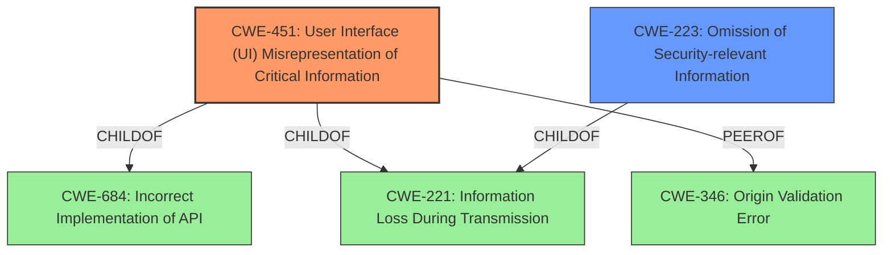

# Raw Analyzer Response for CVE-2021-0434

# Summary
| CWE ID | CWE Name | Confidence | CWE Abstraction Level | CWE Vulnerability Mapping Label | CWE-Vulnerability Mapping Notes |
|---|---|---|---|---|---|
| CWE-451 | User Interface (UI) Misrepresentation of Critical Information | 0.9 | Class | Primary CWE | Allowed-with-Review |
| CWE-223 | Omission of Security-relevant Information | 0.7 | Base | Secondary Candidate | Allowed |

## Evidence and Confidence

*   **Confidence Score:** 0.9
*   **Evidence Strength:** HIGH

## Relationship Analysis
The primary CWE selected is CWE-451, which is a Class-level CWE. Its relationships include ChildOf links to CWE-684 and CWE-221, and a PeerOf link to CWE-346. The ChildOf relationship to CWE-221 is relevant because CWE-221 deals with the omission of security-relevant information, which is closely related to the **insufficient information presented to the user**. The secondary CWE is CWE-223, a Base-level CWE, and a child of CWE-221. Selecting CWE-451 as the primary CWE and CWE-223 as a secondary CWE provides both a general classification of the UI misrepresentation and a more specific classification of the **omission of security-relevant information**.

## Vulnerability Chain
The chain of events starts with the **insufficient information presented to the user** in the consent dialog (CWE-451 and CWE-223). This leads to the user potentially granting permissions to a malicious Bluetooth device, resulting in a local escalation of privilege.

## Summary of Analysis
The primary assessment is based on the evidence provided in the vulnerability description and CVE reference. The key phrase "insufficient information presented to the user in the consent dialog" directly aligns with CWE-451, User Interface (UI) Misrepresentation of Critical Information, and its related CWE-223, Omission of Security-relevant Information.

The vulnerability description states: "In onReceive of BluetoothPermissionRequest.java, there is a possible phishing attack allowing a malicious Bluetooth device to acquire permissions based on **insufficient information presented to the user in the consent dialog**." The CVE reference summary supports this, stating that the root cause is an "unclear warning message presented to users when pairing with Bluetooth devices, potentially leading to phishing attacks," and that the primary weakness is "**Insufficient User Prompts**: The primary weakness is that the initial warning message displayed during Bluetooth pairing is not clear enough for users to avoid phishing attacks."

The graph relationships helped refine the selection by highlighting the connection between CWE-451 and CWE-223, where CWE-223 is a child of CWE-221, emphasizing the information omission aspect.

The selected CWEs are at the optimal level of specificity. CWE-451 captures the general problem of UI misrepresentation, while CWE-223 highlights the specific issue of omitting security-relevant information. Both are relevant and supported by the evidence.

Relevant CWE Information:

# Enhanced Context (25 CWEs)
The following CWEs were identified as potentially relevant to this vulnerability:

## CWE-667: Improper Locking
**Abstraction Level**: Class
**Similarity Score**: 0.79
**Source**: dense

**Description**:
The product does not properly acquire or release a lock on a resource, leading to unexpected resource state changes and behaviors.

**Mapping Guidance**:
- Usage: Allowed-with-Review
- Rationale: This CWE entry is a Class and might have Base-level children that would be more appropriate

## CWE-662: Improper Synchronization
**Abstraction Level**: Class
**Similarity Score**: 0.79
**Source**: dense

**Description**:
The product utilizes multiple threads or processes to allow temporary access to a shared resource that can only be exclusive to one process at a time, but it does not properly synchronize these actions, which might cause simultaneous accesses of this resource by multiple threads or processes.

**Mapping Guidance**:
- Usage: Discouraged
- Rationale: This CWE entry is a level-1 Class (i.e., a child of a Pillar). It might have lower-level children that would be more appropriate

## CWE-362: Concurrent Execution using Shared Resource with Improper Synchronization ('Race Condition')
**Abstraction Level**: Class
**Similarity Score**: 0.77
**Source**: dense

**Description**:
The product contains a concurrent code sequence that requires temporary, exclusive access to a shared resource, but a timing window exists in which the shared resource can be modified by another code sequence operating concurrently.

**Mapping Guidance**:
- Usage: Allowed-with-Review
- Rationale: This CWE entry is a Class and might have Base-level children that would be more appropriate

## CWE-404: Improper Resource Shutdown or Release
**Abstraction Level**: Class
**Similarity Score**: 0.76
**Source**: dense

**Description**:
The product does not release or incorrectly releases a resource before it is made available for re-use.

**Mapping Guidance**:
- Usage: Allowed-with-Review
- Rationale: This CWE entry is a Class and might have Base-level children that would be more appropriate

## CWE-366: Race Condition within a Thread
**Abstraction Level**: Base
**Similarity Score**: 0.76
**Source**: dense

**Description**:
If two threads of execution use a resource simultaneously, there exists the possibility that resources may be used while invalid, in turn making the state of execution undefined.

**Mapping Guidance**:
- Usage: Allowed
- Rationale: This CWE entry is at the Base level of abstraction, which is a preferred level of abstraction for mapping to the root causes of vulnerabilities.

## CWE-754: Improper Check for Unusual or Exceptional Conditions
**Abstraction Level**: Class
**Similarity Score**: 0.75
**Source**: dense

**Description**:
The product does not check or incorrectly checks for unusual or exceptional conditions that are not expected to occur frequently during day to day operation of the product.

**Mapping Guidance**:
- Usage: Allowed-with-Review
- Rationale: This CWE entry is a Class and might have Base-level children that would be more appropriate

## CWE-367: Time-of-check Time-of-use (TOCTOU) Race Condition
**Abstraction Level**: Base
**Similarity Score**: 0.75
**Source**: dense

**Description**:
The product checks the state of a resource before using that resource, but the resource's state can change between the check and the use in a way that invalidates the results of the check. This can cause the product to perform invalid actions when the resource is in an unexpected state.

**Mapping Guidance**:
- Usage: Allowed
- Rationale: This CWE entry is at the Base level of abstraction, which is a preferred level of abstraction for mapping to the root causes of vulnerabilities.

## CWE-451: User Interface (UI) Misrepresentation of Critical Information
**Abstraction Level**: Class
**Similarity Score**: 0.75
**Source**: dense

**Description**:
The user interface (UI) does not properly represent critical information to the user, allowing the information - or its source - to be obscured or spoofed. This is often a component in phishing attacks.

**Mapping Guidance**:
- Usage: Allowed-with-Review
- Rationale: This CWE entry is a Class and might have Base-level children that would be more appropriate

## CWE-226: Sensitive Information in Resource Not Removed Before Reuse
**Abstraction Level**: Base
**Similarity Score**: 0.74
**Source**: dense

**Description**:
The product releases a resource such as memory or a file so that it can be made available for reuse, but it does not clear or "zeroize" the information contained in the resource before the product performs a critical state transition or makes the resource available for reuse by other entities.

**Mapping Guidance**:
- Usage: Allowed
- Rationale: This CWE entry is at the Base level of abstraction, which is a preferred level of abstraction for mapping to the root causes of vulnerabilities.

## CWE-653: Improper