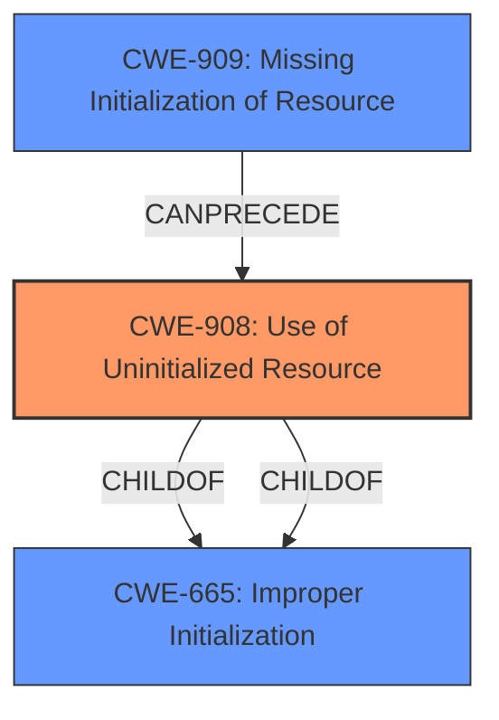

# Enhanced Analysis for CVE-2021-0435

# Summary
| CWE ID | CWE Name | Confidence | CWE Abstraction Level | CWE Vulnerability Mapping Label | CWE-Vulnerability Mapping Notes |
|---|---|---|---|---|---|
| CWE-908 | Use of Uninitialized Resource | 0.9 | Base | Allowed | Primary CWE |
| CWE-665 | Improper Initialization | 0.7 | Class | Discouraged | Secondary Candidate |
| CWE-909 | Missing Initialization of Resource | 0.6 | Class | Allowed-with-Review | Secondary Candidate |

## Evidence and Confidence

*   **Confidence Score:** 0.9
*   **Evidence Strength:** HIGH

## Relationship Analysis
The primary relationship influencing the CWE selection is the ChildOf relationship. CWE-908 (Use of Uninitialized Resource) is a child of CWE-665 (Improper Initialization) and CWE-909 (Missing Initialization of Resource). This indicates that CWE-908 is a more specific type of initialization issue. Additionally, CWE-909 can precede CWE-908, suggesting that a missing initialization can lead to the use of an uninitialized resource. The decision was to choose the most specific CWE, which is CWE-908.



## Vulnerability Chain
The vulnerability chain starts with the **uninitialized data** (**ROOT CAUSE**), leading to the **use of an uninitialized resource**, and ultimately resulting in **remote information disclosure** (IMPACT).
  - **Root Cause**: Uninitialized data in `avrc_proc_vendor_command`
  - **Weakness**: CWE-908: Use of Uninitialized Resource
  - **Impact**: Remote Information Disclosure

## Summary of Analysis
The initial analysis focused on identifying the root cause of the vulnerability, which was identified as **uninitialized data**. The vulnerability description key phrases and the CVE Reference Links Content Summary both point to the use of uninitialized memory as the root cause. The retriever results also highlight CWE-665, CWE-908 and CWE-909 as potential candidates.

The decision to map this vulnerability to CWE-908 (Use of Uninitialized Resource) is based on the following evidence:
1.  The vulnerability description explicitly mentions **"uninitialized data"** as the cause of the issue.
2.  The CVE Reference Links Content Summary confirms that the code was using uninitialized memory when copying packets, which aligns directly with the description of CWE-908.
3.  CWE-908 is at the Base level of abstraction, which is preferred according to the mapping guidance.
4.  The fix mentioned in the CVE summary involves using `calloc` to initialize the memory, further reinforcing the uninitialized memory as the core issue.

CWE-665 (Improper Initialization) and CWE-909 (Missing Initialization of Resource) were considered but not chosen as the primary CWE because CWE-908 is more specific and accurately reflects the actual vulnerability: the resource is *used* without being initialized. CWE-665 and CWE-909 are more general categories.

The confidence in this mapping is high (0.9) due to the clear and consistent evidence from the vulnerability description, CVE summary, and retriever results. The choice of CWE-908 is at the optimal level of specificity, providing a clear and accurate representation of the underlying weakness.

Relevant CWE Information:

# Enhanced Context (25 CWEs)
The following CWEs were identified as potentially relevant to this vulnerability:

## CWE-667: Improper Locking
**Abstraction Level**: Class
**Similarity Score**: 0.78
**Source**: dense

**Description**:
The product does not properly acquire or release a lock on a resource, leading to unexpected resource state changes and behaviors.

**Mapping Guidance**:
- Usage: Allowed-with-Review
- Rationale: This CWE entry is a Class and might have Base-level children that would be more appropriate

## CWE-404: Improper Resource Shutdown or Release
**Abstraction Level**: Class
**Similarity Score**: 0.77
**Source**: dense

**Description**:
The product does not release or incorrectly releases a resource before it is made available for re-use.

**Mapping Guidance**:
- Usage: Allowed-with-Review
- Rationale: This CWE entry is a Class and might have Base-level children that would be more appropriate

## CWE-226: Sensitive Information in Resource Not Removed Before Reuse
**Abstraction Level**: Base
**Similarity Score**: 0.77
**Source**: dense

**Description**:
The product releases a resource such as memory or a file so that it can be made available for reuse, but it does not clear or "zeroize" the information contained in the resource before the product performs a critical state transition or makes the resource available for reuse by other entities.

**Mapping Guidance**:
- Usage: Allowed
- Rationale: This CWE entry is at the Base level of abstraction, which is a preferred level of abstraction for mapping to the root causes of vulnerabilities.

## CWE-754: Improper Check for Unusual or Exceptional Conditions
**Abstraction Level**: Class
**Similarity Score**: 0.76
**Source**: dense

**Description**:
The product does not check or incorrectly checks for unusual or exceptional conditions that are not expected to occur frequently during day to day operation of the product.

**Mapping Guidance**:
- Usage: Allowed-with-Review
- Rationale: This CWE entry is a Class and might have Base-level children that would be more appropriate

## CWE-362: Concurrent Execution using Shared Resource with Improper Synchronization ('Race Condition')
**Abstraction Level**: Class
**Similarity Score**: 0.76
**Source**: dense

**Description**:
The product contains a concurrent code sequence that requires temporary, exclusive access to a shared resource, but a timing window exists in which the shared resource can be modified by another code sequence operating concurrently.

**Mapping Guidance**:
- Usage: Allowed-with-Review
- Rationale: This CWE entry is a Class and might have Base-level children that would be more appropriate

## CWE-909: Missing Initialization of Resource
**Abstraction Level**: Class
**Similarity Score**: 0.76
**Source**: dense

**Description**:
The product does not initialize a critical resource.

**Mapping Guidance**:
- Usage: Allowed-with-Review
- Rationale: This CWE entry is a Class and might have Base-level children that would be more appropriate

## CWE-366: Race Condition within a Thread
**Abstraction Level**: Base
**Similarity Score**: 0.76
**Source**: dense

**Description**:
If two threads of execution use a resource simultaneously, there exists the possibility that resources may be used while invalid, in turn making the state of execution undefined.

**Mapping Guidance**:
- Usage: Allowed
- Rationale: This CWE entry is at the Base level of abstraction, which is a preferred level of abstraction for mapping to the root causes of vulnerabilities.

## CWE-665: Improper Initialization
**Abstraction Level**: Class
**Similarity Score**: 0.75
**Source**: dense

**Description**:
The product does not initialize or incorrectly initializes a resource, which might leave the resource in an unexpected state when it is accessed or used.

**Mapping Guidance**:
- Usage: Discouraged
- Rationale: This CWE entry is a level-1 Class (i.e., a child of a Pillar). It might have lower-level children that would be more appropriate

## CWE-908: Use of Uninitialized Resource
**Abstraction Level**: Base
**Similarity Score**: 0.75
**Source**: dense

**Description**:
The product uses or accesses a resource that has not been initialized.

**Mapping Guidance**:
- Usage: Allowed
- Rationale: This CWE entry is at the Base level of abstraction, which is a preferred level of abstraction for mapping to the root causes of vulnerabilities.

## CWE-203: Observable Discrepancy
**Abstraction Level**: Base
**Similarity Score**: 0.75
**Source**: dense

**Description**:
The product behaves differently or sends different responses under different circumstances in a way that is observable to an unauthorized actor, which exposes security-relevant information about the state of the product, such as whether a particular operation was successful or not.

**Mapping Guidance**:
- Usage: Allowed
- Rationale: This CWE entry is at the Base level of abstraction, which is a preferred level of abstraction for mapping to the root causes of vulnerabilities.

## CWE-362: Concurrent


## CWE Relationship Analysis

Current CWEs represent these abstraction levels: .


### Vulnerability Chain Analysis

**Chain starting from CWE-667:**
- 667 (Improper Locking) - ROOT


**Chain starting from CWE-754:**
- 754 (Improper Check for Unusual or Exceptional Conditions) - ROOT


### CWE Relationship Diagram

```mermaid
graph TD
    classDef primary fill:#f96,stroke:#333,stroke-width:2px
    classDef secondary fill:#69f,stroke:#333
    classDef tertiary fill:#9e9,stroke:#333
```