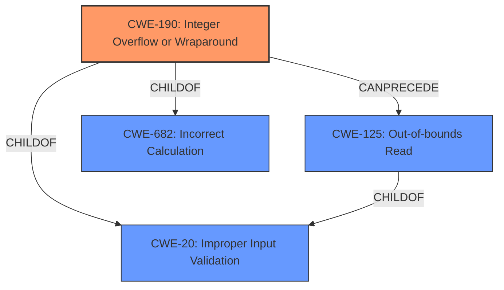

# Raw Analyzer Response for CVE-2021-0436

# Summary
| CWE ID  | CWE Name                                                                                  | Confidence | CWE Abstraction Level | CWE Vulnerability Mapping Label | CWE-Vulnerability Mapping Notes |
| :-------- | :------------------------------------------------------------------------------------------ | :--------- | :---------------------- | :------------------------------ | :------------------------------ |
| CWE-190   | Integer Overflow or Wraparound                                                            | 1.0        | Base                    | Primary                         | Allowed                       |
| CWE-125   | Out-of-bounds Read                                                                        | 0.8        | Base                    | Secondary                       | Allowed                       |

## Evidence and Confidence

*   **Confidence Score:** 0.9
*   **Evidence Strength:** HIGH

## Relationship Analysis

The primary weakness is an **integer overflow** (CWE-190), which can lead to an **out-of-bounds read** (CWE-125). CWE-190 is a base-level CWE, providing a good level of specificity.

## Vulnerability Chain

The vulnerability chain starts with an **integer overflow** (CWE-190) when calculating a buffer size or offset. This leads to an **out-of-bounds read** (CWE-125) because the calculated size is smaller than the actual data being read.

## Summary of Analysis

The primary weakness is an **integer overflow** (CWE-190) in the `decrypt` function of `CryptoPlugin.cpp`, which results in an **out-of-bounds read** (CWE-125). The vulnerability description and the CVE Reference Links Content Summary explicitly mention both the integer overflow and the out-of-bounds read.

The selection of CWE-190 as the primary CWE is based on the vulnerability description key phrases indicating a **rootcause** of "**integer overflow**" and the CVE reference links content summary stating that a "**potential integer overflow can occur when calculating the source pointer**".

The selection of CWE-125 as a secondary CWE is based on the vulnerability description key phrases indicating a "**weakness**" of "**out of bounds read**" and the CVE reference links content summary stating that "**the source pointer can be made to point outside of the allocated source buffer**".

These CWEs are at the base level of abstraction, which is the preferred level.

Relevant CWE Information:

# Enhanced Context (25 CWEs)

## CWE-366: Race Condition within a Thread
**Abstraction Level**: Base
**Similarity Score**: 0.79
**Source**: dense

This CWE is not relevant because the vulnerability description does not involve race conditions. The vulnerability is caused by an integer overflow, not concurrent execution issues.

## CWE-362: Concurrent Execution using Shared Resource with Improper Synchronization ('Race Condition')
**Abstraction Level**: Class
**Similarity Score**: 0.78
**Source**: dense

This CWE is not relevant because the vulnerability description does not involve race conditions. The vulnerability is caused by an integer overflow, not concurrent execution issues.

## CWE-667: Improper Locking
**Abstraction Level**: Class
**Similarity Score**: 0.77
**Source**: dense

This CWE is not relevant because the vulnerability description does not involve locking or synchronization issues.

## CWE-367: Time-of-check Time-of-use (TOCTOU) Race Condition
**Abstraction Level**: Base
**Similarity Score**: 0.77
**Source**: dense

This CWE is not relevant because the vulnerability description does not involve race conditions. The vulnerability is caused by an integer overflow, not concurrent execution issues.

## CWE-662: Improper Synchronization
**Abstraction Level**: Class
**Similarity Score**: 0.77
**Source**: dense

This CWE is not relevant because the vulnerability description does not involve locking or synchronization issues.

## CWE-404: Improper Resource Shutdown or Release
**Abstraction Level**: Class
**Similarity Score**: 0.74
**Source**: dense

This CWE is not relevant because the vulnerability description does not involve resource shutdown or release issues.

## CWE-208: Observable Timing Discrepancy
**Abstraction Level**: Base
**Similarity Score**: 0.74
**Source**: dense

This CWE is not relevant because the vulnerability description does not involve timing discrepancies.

## CWE-368: Context Switching Race Condition
**Abstraction Level**: Base
**Similarity Score**: 0.74
**Source**: dense

This CWE is not relevant because the vulnerability description does not involve race conditions or context switching.

## CWE-754: Improper Check for Unusual or Exceptional Conditions
**Abstraction Level**: Class
**Similarity Score**: 0.73
**Source**: dense

This CWE is not relevant because the vulnerability description does not focus on missing checks for unusual conditions.

## CWE-191: Integer Underflow (Wrap or Wraparound)
**Abstraction Level**: Base
**Similarity Score**: 0.73
**Source**: dense

While related to integer issues, the vulnerability is specifically an **integer overflow**, not an underflow.

## CWE-190: Integer Overflow or Wraparound
**Abstraction Level**: Base
**Similarity Score**: 6056.45
**Source**: sparse

This CWE is highly relevant as the **rootcause** is an **integer overflow**. The description of CWE-190 perfectly matches the vulnerability description.

## CWE-191: Integer Underflow (Wrap or Wraparound)
**Abstraction Level**: Base
**Similarity Score**: 5742.31
**Source**: sparse

While related to integer issues, the vulnerability is specifically an **integer overflow**, not an underflow.

## CWE-1284: Improper Validation of Specified Quantity in Input
**Abstraction Level**: Base
**Similarity Score**: 5575.15
**Source**: sparse

This could be a contributing factor if the size value calculated via the integer overflow is then not validated, but the root cause is the overflow itself.

## CWE-125: Out-of-bounds Read
**Abstraction Level**: Base
**Similarity Score**: 5480.85
**Source**: sparse

This CWE accurately describes the **weakness** resulting from the integer overflow.

## CWE-362: Concurrent Execution using Shared Resource with Improper Synchronization ('Race Condition')
**Abstraction Level**: Class
**Similarity Score**: 5275.93
**Source**: sparse

This CWE is not relevant because the vulnerability description does not involve race conditions.

## CWE-190: Integer Overflow or Wraparound
**Abstraction Level**: base
**Similarity Score**: 5.03
**Source**: graph

This CWE is highly relevant as the **rootcause** is an **integer overflow**.

## CWE-128: Wrap-around Error
**Abstraction Level**: base
**Similarity Score**: 5.03
**Source**: graph

This is too generic. CWE-190 is a better fit for the integer overflow.

## CWE-123: Write-what-where Condition
**Abstraction Level**: base
**Similarity Score**: 4.82
**Source**: graph

This is not a direct result of the integer overflow in this case. The primary impact is an out-of-bounds read, not a write.

## CWE-170: Improper Null Termination
**Abstraction Level**: base
**Similarity Score**: 4.33
**Source**: graph

This is not relevant to the vulnerability.

## CWE-1284: Improper Validation of Specified Quantity in Input
**Abstraction Level**: base
**Similarity Score**: 4.33
**Source**: graph

This could be a contributing factor if the size value calculated via the integer overflow is then not validated, but the root cause is the overflow itself.

## CWE-681: Incorrect Conversion between Numeric Types
**Abstraction Level**: base
**Similarity Score**: 4.33
**Source**: graph

This is not specified in the description. It's not clear if type conversion is involved.

## CWE-476: NULL Pointer Dereference
**Abstraction Level**: base
**Similarity Score**: 4.33
**Source**: graph

This is not related to the described vulnerability.

## CWE-416: Use After Free
**Abstraction Level**: variant
**Similarity Score**: 4.2