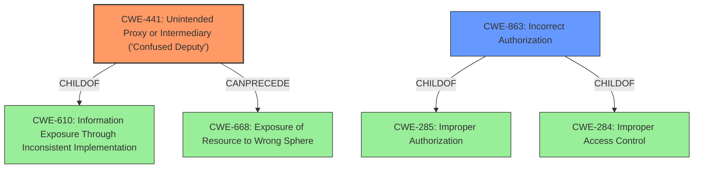

# Analysis Report for CVE-2021-0445

# Vulnerability Analysis Report: CVE-2021-0445

## Description


## Analysis (with Relationship Data)

# Summary
| CWE ID | CWE Name | Confidence | CWE Abstraction Level | CWE Vulnerability Mapping Label | CWE-Vulnerability Mapping Notes |
|---|---|---|---|---|---|
| CWE-441 | Unintended Proxy or Intermediary ('Confused Deputy') | 1.0 | Class | Allowed-with-Review | Primary CWE |
| CWE-863 | Incorrect Authorization | 0.6 | Class | Allowed-with-Review | Secondary Candidate |

## Evidence and Confidence

*   **Confidence Score:** 0.8
*   **Evidence Strength:** HIGH

## Relationship Analysis
The primary CWE is CWE-441, which is a Class-level CWE. It has a ChildOf relationship to CWE-610 (Information Exposure Through Inconsistent Implementation) and a CanPrecede relationship to CWE-668 (Exposure of Resource to Wrong Sphere). The secondary CWE, CWE-863, is also a Class-level CWE with ChildOf relationships to CWE-285 (Improper Authorization) and CWE-284 (Improper Access Control). Since the vulnerability description explicitly mentions "confused deputy," CWE-441 is a strong candidate. The relationship to CWE-668 indicates a potential for resource exposure if the "deputy" is tricked into granting access it shouldn't.



## Vulnerability Chain
The vulnerability chain starts with a **confused deputy** (CWE-441) leading to a potential local escalation of privilege.
  - The initial flaw is the **confused deputy**, where the application acts on behalf of another entity without proper validation of the request's origin or authorization.
  - This leads to the impact of local escalation of privilege.

## Summary of Analysis
The initial assessment strongly points to CWE-441 due to the explicit mention of "**confused deputy**" in the vulnerability description. The vulnerability description key phrases also highlight this as the root cause. The CVE Reference Links Content Summary reinforces the "Elevation of Privilege (EoP)" impact, which is consistent with a **confused deputy** scenario.

The Retriever Results also list CWE-441 as the top combined result with a score of 1.0, further supporting this choice.

CWE-863 (Incorrect Authorization) was considered as a secondary CWE because a **confused deputy** often results in **incorrect authorization**, but since the **confused deputy** condition is the more precise root cause, CWE-441 is chosen as the primary.

The selection of CWE-441 is at the optimal level of specificity because it directly addresses the **root cause** described in the vulnerability. While CWE-610 is a parent, CWE-441 is more specific and descriptive.
# Relevant CWE Information:

## Vulnerability Description
In start of WelcomeActivity.java, there is a possible residual profile due to a **confused deputy**. This could lead to local escalation of privilege with no additional execution privileges needed. User interaction is not needed for exploitation.Product AndroidVersions Android-11 Android-9Android ID A-172322502

### Vulnerability Description Key Phrases
- **rootcause:** **confused deputy**
- **impact:** local escalation of privilege
- **product:** Android
- **version:** Android-11 Android-9
- **component:** WelcomeActivity.java

## CVE Reference Links Content Summary
Based on the provided document, here's the information regarding CVE-2021-0445:

**Root cause of vulnerability:**
- The document indicates that the vulnerability lies within the System component.

**Weaknesses/vulnerabilities present:**
- The vulnerability is classified as an Elevation of Privilege (EoP).

**Impact of exploitation:**
- A local malicious application could bypass user interaction requirements in order to gain access to additional permissions.

**Attack vectors:**
- The attack vector is local, meaning a malicious application must be installed on the device.

**Required attacker capabilities/position:**
- The attacker needs to have the ability to install a malicious application on the target device.

**Additional Details:**

- This CVE is addressed with the 2021-04-05 security patch level.
- The vulnerability affects Android versions 9 and 11.
- The AOSP reference is A-172322502.

## Retriever Results

### Top Combined Results

| Rank | CWE ID | Name | Abstraction | Usage  | Retrievers | Individual Scores |
|------|--------|------|-------------|-------|------------|-------------------|
| 1 | 441 | Unintended Proxy or Intermediary ('Confused Deputy') | Class | Allowed-with-Review | alternate_terms | 1.000 |
| 2 | 862 | Missing Authorization | Class | Allowed-with-Review | sparse | 0.372 |

**CWE-441: Unintended Proxy or Intermediary ('Confused Deputy')**

*   **Technical Explanation:** The `WelcomeActivity.java` component in Android acts as an intermediary that performs actions based on some assumed authority. However, due to the vulnerability, it is possible for a malicious application to trick the `WelcomeActivity.java` component into performing actions that it should not, leading to a local escalation of privilege. This matches the description of CWE-441, where the product (Android OS) acts as an unintended proxy, forwarding requests from a malicious application.
*   **Security Implications:** This vulnerability allows a local attacker to escalate privileges without requiring user interaction. The malicious application can bypass security checks and gain unauthorized access to system resources.
*   **Relationships:** CWE-441 is a Class-level weakness and a child of CWE-610 (Information Exposure Through Inconsistent Implementation). It can also precede CWE-668 (Exposure of Resource to Wrong Sphere).
*   **MITRE Mapping Guidance:** The Usage is "Allowed-with-Review," suggesting that this CWE is a good fit, but child CWEs should be examined for a better fit if available. However, none of the children CWEs offer a more specific classification in this case.

**CWE-863: Incorrect Authorization**

*   **Technical Explanation:** The vulnerability can also be seen as a case of **incorrect authorization**. The `WelcomeActivity.java` component performs authorization checks, but it does so incorrectly, allowing the malicious application to gain unauthorized access.
*   **Security Implications:** Similar to CWE-441, this leads to an escalation of privilege, granting the malicious application elevated permissions.
*   **Relationships:** CWE-863 is a Class-level weakness and a child of CWE-285 (Improper Authorization) and CWE-284 (Improper Access Control).
*   **MITRE Mapping Guidance:** The Usage is "Allowed-with-Review," similar to CWE-441.

**CWEs Considered But Not Used:**

*   CWE-362, CWE-367, CWE-667: These relate to race conditions and improper locking, which are not directly indicated in the vulnerability description. The primary issue is the **confused deputy** situation, not concurrency issues.
*   CWE-908, CWE-665: These relate to use of uninitialized resources and improper initialization. Again, the **confused deputy** situation is the more direct cause.


## CWE Relationship Analysis

Current CWEs represent these abstraction levels: .


### Vulnerability Chain Analysis

**Chain starting from CWE-667:**
- 667 (Improper Locking) - ROOT


**Chain starting from CWE-362:**
- 362 (Concurrent Execution using Shared Resource with Improper Synchronization ('Race Condition')) - ROOT


### CWE Relationship Diagram

```mermaid
graph TD
    classDef primary fill:#f96,stroke:#333,stroke-width:2px
    classDef secondary fill:#69f,stroke:#333
    classDef tertiary fill:#9e9,stroke:#333
```


*Report generated on 2025-04-02 02:09:24*
