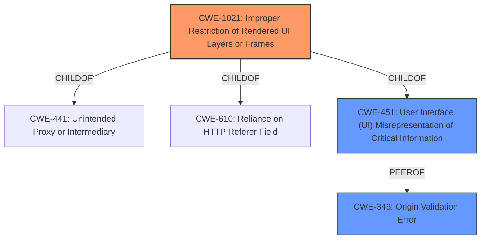

# Analysis Report for CVE-2021-0446

# Vulnerability Analysis Report: CVE-2021-0446

## Description


## Analysis (with Relationship Data)

# Summary
| CWE ID    | CWE Name                                                       | Confidence | CWE Abstraction Level | CWE Vulnerability Mapping Label | CWE-Vulnerability Mapping Notes |
| :---------- | :------------------------------------------------------------- | :--------- | :---------------------- | :------------------------------ | :------------------------------ |
| CWE-1021   | Improper Restriction of Rendered UI Layers or Frames         | 0.9        | Base                    | Allowed                         | Primary CWE                     |
| CWE-451     | User Interface (UI) Misrepresentation of Critical Information | 0.6        | Class                   | Allowed-with-Review            | Secondary Candidate              |
| CWE-346     | Origin Validation Error                                        | 0.4        | Class                   | Allowed-with-Review            | Secondary Candidate              |

## Evidence and Confidence

*   **Confidence Score:** 0.9
*   **Evidence Strength:** HIGH

## Relationship Analysis
The primary CWE selected is CWE-1021, which is a Base level CWE and is a child of CWE-441 and CWE-610, and CWE-451. CWE-451 is a Class level CWE which is a parent of CWE-1021. The relationship indicates that CWE-1021 is a more specific type of UI misrepresentation that involves improper restrictions on UI layers or frames.



## Vulnerability Chain
The vulnerability chain starts with the **tapjacking/overlay attack**, which leads to the bypass of user consent, and finally results in a local escalation of privilege.

## Summary of Analysis
Based on the provided information, the primary weakness is CWE-1021: Improper Restriction of Rendered UI Layers or Frames. This is supported by the vulnerability description which mentions a **tapjacking/overlay attack** that allows bypassing user consent. The CVE Reference Links Content Summary clearly indicates that the root cause is **Improper Overlay Handling**, where the Contacts app fails to properly validate or sanitize overlay data, allowing malicious overlays to be introduced. The commit message "Prevent overlays on vCard import flows" further confirms this.

The description of CWE-1021 directly aligns with the vulnerability: "The web application does not restrict or incorrectly restricts frame objects or UI layers that belong to another application or domain, which can lead to user confusion about which interface the user is interacting with." In this case, the Android application does not properly restrict overlays during vCard import, leading to a **tapjacking/overlay attack**.

CWE-451: User Interface (UI) Misrepresentation of Critical Information was considered as a secondary CWE because the **tapjacking/overlay attack** leads to the UI misrepresenting critical information to the user. However, CWE-1021 is more specific to the **improper restriction of UI layers or frames**, making it a more accurate primary classification.

CWE-346: Origin Validation Error was considered because the application is not properly validating the origin of the vCard file, allowing for the injection of malicious overlays. However, the core issue is the **improper restriction of UI layers**, not the origin validation itself.

The selected CWEs are at the optimal level of specificity. CWE-1021 is a Base level CWE, which is preferred for mapping to the root causes of vulnerabilities. It accurately captures the **improper restriction of rendered UI layers or frames** that allows for the **tapjacking/overlay attack**.

Relevant CWE Information:
# Enhanced Context (25 CWEs)
The following CWEs were identified as potentially relevant to this vulnerability:

## CWE-667: Improper Locking
**Abstraction Level**: Class
**Similarity Score**: 0.78
**Source**: dense

**Description**:
The product does not properly acquire or release a lock on a resource, leading to unexpected resource state changes and behaviors.

**Mapping Guidance**:
- Usage: Allowed-with-Review
- Rationale: This CWE entry is a Class and might have Base-level children that would be more appropriate

## CWE-404: Improper Resource Shutdown or Release
**Abstraction Level**: Class
**Similarity Score**: 0.78
**Source**: dense

**Description**:
The product does not release or incorrectly releases a resource before it is made available for re-use.

**Mapping Guidance**:
- Usage: Allowed-with-Review
- Rationale: This CWE entry is a Class and might have Base-level children that would be more appropriate

## CWE-754: Improper Check for Unusual or Exceptional Conditions
**Abstraction Level**: Class
**Similarity Score**: 0.78
**Source**: dense

**Description**:
The product does not check or incorrectly checks for unusual or exceptional conditions that are not expected to occur frequently during day to day operation of the product.

**Mapping Guidance**:
- Usage: Allowed-with-Review
- Rationale: This CWE entry is a Class and might have Base-level children that would be more appropriate

## CWE-226: Sensitive Information in Resource Not Removed Before Reuse
**Abstraction Level**: Base
**Similarity Score**: 0.77
**Source**: dense

**Description**:
The product releases a resource such as memory or a file so that it can be made available for reuse, but it does not clear or "zeroize" the information contained in the resource before the product performs a critical state transition or makes the resource available for reuse by other entities.

**Mapping Guidance**:
- Usage: Allowed
- Rationale: This CWE entry is at the Base level of abstraction, which is a preferred level of abstraction for mapping to the root causes of vulnerabilities.

## CWE-451: User Interface (UI) Misrepresentation of Critical Information
**Abstraction Level**: Class
**Similarity Score**: 0.77
**Source**: dense

**Description**:
The user interface (UI) does not properly represent critical information to the user, allowing the information - or its source - to be obscured or spoofed. This is often a component in phishing attacks.

**Mapping Guidance**:
- Usage: Allowed-with-Review
- Rationale: This CWE entry is a Class and might have Base-level children that would be more appropriate

## CWE-908: Use of Uninitialized Resource
**Abstraction Level**: Base
**Similarity Score**: 0.77
**Source**: dense

**Description**:
The product uses or accesses a resource that has not been initialized.

**Mapping Guidance**:
- Usage: Allowed
- Rationale: This CWE entry is at the Base level of abstraction, which is a preferred level of abstraction for mapping to the root causes of vulnerabilities.

## CWE-665: Improper Initialization
**Abstraction Level**: Class
**Similarity Score**: 0.77
**Source**: dense

**Description**:
The product does not initialize or incorrectly initializes a resource, which might leave the resource in an unexpected state when it is accessed or used.

**Mapping Guidance**:
- Usage: Discouraged
- Rationale: This CWE entry is a level-1 Class (i.e., a child of a Pillar). It might have lower-level children that would be more appropriate

## CWE-909: Missing Initialization of Resource
**Abstraction Level**: Class
**Similarity Score**: 0.77
**Source**: dense

**Description**:
The product does not initialize a critical resource.

**Mapping Guidance**:
- Usage: Allowed-with-Review
- Rationale: This CWE entry is a Class and might have Base-level children that would be more appropriate

## CWE-668: Exposure of Resource to Wrong Sphere
**Abstraction Level**: Class
**Similarity Score**: 0.76
**Source**: dense

**Description**:
The product exposes a resource to the wrong control sphere, providing unintended actors with inappropriate access to the resource.

**Mapping Guidance**:
- Usage: Discouraged
- Rationale: CWE-668 is high-level and is often misused as a catch-all when lower-level CWE IDs might be applicable. It is sometimes used for low-information vulnerability reports [REF-1287]. It is a level-1 Class (i.e., a child of a Pillar). It is not useful for trend analysis.

## CWE-362: Concurrent Execution using Shared Resource with Improper Synchronization


## CWE Relationship Analysis

Current CWEs represent these abstraction levels: .


### Vulnerability Chain Analysis

**Chain starting from CWE-667:**
- 667 (Improper Locking) - ROOT


**Chain starting from CWE-754:**
- 754 (Improper Check for Unusual or Exceptional Conditions) - ROOT


### CWE Relationship Diagram

```mermaid
graph TD
    classDef primary fill:#f96,stroke:#333,stroke-width:2px
    classDef secondary fill:#69f,stroke:#333
    classDef tertiary fill:#9e9,stroke:#333
```


*Report generated on 2025-04-02 12:36:01*
