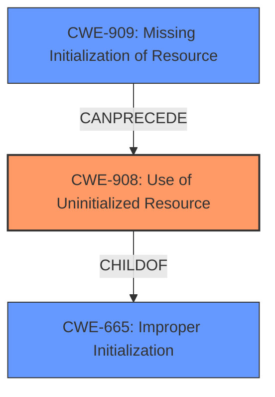

# Analysis for CVE-2021-0449

# Summary
| CWE ID  | CWE Name                         | Confidence | CWE Abstraction Level | CWE Vulnerability Mapping Label | CWE-Vulnerability Mapping Notes |
| :-------- | :--------------------------------- | :--------- | :---------------------- | :------------------------------ | :-------------------------------- |
| CWE-908   | Use of Uninitialized Resource      | 0.9        | Base                    | Allowed                       | Primary CWE                     |
| CWE-665   | Improper Initialization            | 0.7        | Class                   | Discouraged                     | Secondary Candidate             |
| CWE-909   | Missing Initialization of Resource | 0.6        | Class                   | Allowed-with-Review           | Secondary Candidate             |

## Evidence and Confidence

*   **Confidence Score:** 0.9
*   **Evidence Strength:** HIGH

## Relationship Analysis
The primary relationship that influenced the selection was the parent-child relationship between CWE-665 (Improper Initialization), CWE-908 (Use of Uninitialized Resource), and CWE-909 (Missing Initialization of Resource). CWE-908 is a child of CWE-665, indicating a more specific case of improper initialization. CWE-909 (Missing Initialization) can precede CWE-908. The base level of abstraction for CWE-908 aligns well with the provided description.

## Vulnerability Chain
The vulnerability chain starts with the **uninitialized data** (missing initialization), leading to the **disclosure of stack memory**.

## Summary of Analysis
The initial analysis focused on the presence of **uninitialized data**, which is a clear indicator of an initialization issue. The vulnerability description key phrases directly mention **uninitialized data** as the **rootcause**, which strongly suggests CWE-908 (Use of Uninitialized Resource) or related initialization CWEs.

The "CVE Reference Links Content Summary" confirms "An unspecified vulnerability exists in the Titan M component" and indicates "Information Disclosure (ID)" as the weakness.

The retriever results list CWE-665 (Improper Initialization), CWE-908 (Use of Uninitialized Resource), and CWE-909 (Missing Initialization of Resource) as top candidates.

CWE-908 (Use of Uninitialized Resource) is chosen as the primary CWE because it directly addresses the scenario where a resource is used before being initialized. The description of CWE-908, "The product uses or accesses a resource that has not been initialized," aligns precisely with the vulnerability description. This CWE is at the Base level of abstraction, which is the preferred level.

CWE-665 (Improper Initialization) is considered as a secondary CWE because it is a broader category that encompasses various initialization issues. While applicable, it is less specific than CWE-908. The Mapping Guidance for CWE-665 discourages its use because it is a Class level CWE.

CWE-909 (Missing Initialization of Resource) is also considered as a secondary CWE. CWE-909 (Missing Initialization of Resource) can precede CWE-908, but the provided description focuses more on the *use* of uninitialized data, making CWE-908 a slightly better fit.

The primary assessment is based on the following evidence:
- "Vulnerability Description Key Phrases": "**rootcause:** **uninitialized data**"
- "Vulnerability Description": "In the Titan M chip firmware, there is a possible disclosure of stack memory due to **uninitialized data**."

The graph relationships influenced the final selection by highlighting the hierarchical connection between the initialization-related CWEs, emphasizing the need to choose the most specific CWE that accurately represents the vulnerability.

The selected CWEs are at the optimal level of specificity because CWE-908 is a Base level CWE that directly describes the use of uninitialized resources, while CWE-665 and CWE-909 are Class level CWEs that are more general.

Relevant CWE Information:

# Enhanced Context (25 CWEs)

## CWE-665: Improper Initialization
**Abstraction Level**: Class
**Similarity Score**: 0.484 (sparse) , 4271.60 (sparse)
**Description**:
The product does not initialize or incorrectly initializes a resource, which might leave the resource in an unexpected state when it is accessed or used.
**Mapping Guidance**:
- Usage: Discouraged
- Rationale: This CWE entry is a level-1 Class (i.e., a child of a Pillar). It might have lower-level children that would be more appropriate
**Reasons:**
- Abstraction

## CWE-908: Use of Uninitialized Resource
**Abstraction Level**: Base
**Similarity Score**: 0.366 (sparse)
**Description**:
The product uses or accesses a resource that has not been initialized.
**Mapping Guidance**:
- Usage: Allowed
- Rationale: This CWE entry is at the Base level of abstraction, which is a preferred level of abstraction for mapping to the root causes of vulnerabilities.
**Reasons:**
- Acceptable-Use

## CWE-909: Missing Initialization of Resource
**Abstraction Level**: Class
**Similarity Score**: 0.327 (sparse), 4234.86 (sparse)
**Description**:
The product does not initialize a critical resource.
**Mapping Guidance**:
- Usage: Allowed-with-Review
- Rationale: This CWE entry is a Class and might have Base-level children that would be more appropriate
**Reasons:**
- Abstraction