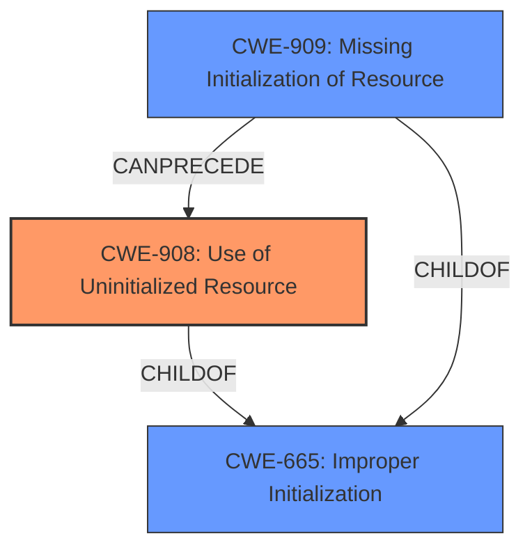

# Raw Analyzer Response for CVE-2021-0450

# Summary
| CWE ID  | CWE Name                     | Confidence | CWE Abstraction Level | CWE Vulnerability Mapping Label | CWE-Vulnerability Mapping Notes |
|---------|------------------------------|------------|-----------------------|---------------------------------|---------------------------------|
| CWE-908 | Use of Uninitialized Resource | 0.9        | Base                  | Primary CWE                     | Allowed                         |
| CWE-665 | Improper Initialization      | 0.7        | Class                 | Secondary Candidate           | Discouraged                     |
| CWE-909 | Missing Initialization of Resource | 0.6        | Class                 | Secondary Candidate           | Allowed-with-Review             |

## Evidence and Confidence

*   **Confidence Score:** 0.9
*   **Evidence Strength:** HIGH

## Relationship Analysis
The primary relationship influencing my decision is the child-parent relationship between CWE-908 (Base), CWE-665 (Class), and CWE-909 (Class). CWE-908 is a child of CWE-665, and CWE-909 is also a child of CWE-665. This indicates that CWE-908 is a more specific case of improper initialization. The "CanPrecede" relationship between CWE-909 and CWE-908 suggests that a missing initialization can lead to the use of an uninitialized resource.

## Vulnerability Chain
The vulnerability chain starts with **uninitialized data**, leading to the disclosure of stack memory.

## Summary of Analysis
The vulnerability description clearly states that the root cause is "**uninitialized data**" in the Titan M chip firmware, which leads to the disclosure of stack memory.

CWE-908 (Use of Uninitialized Resource) is the most appropriate primary CWE because it directly addresses the use of a resource that has not been initialized. The description of CWE-908, "The product uses or accesses a resource that has not been initialized," aligns perfectly with the vulnerability description. Also CWE-908 is a Base level CWE, which is preferred.

The **Vulnerability Description Key Phrases** lists:
- **rootcause:** **uninitialized data**
- **impact:** disclosure of stack memory

The CVE Reference Links Content Summary mentions:
- **Weaknesses/vulnerabilities present**: Information Disclosure

CWE-665 (Improper Initialization) is a broader class of weakness that encompasses cases where a resource is either not initialized or incorrectly initialized. While relevant, it's less specific than CWE-908. The mapping guidance for CWE-665 discourages its use because it is a class level CWE.

CWE-909 (Missing Initialization of Resource) is also relevant, as it describes the scenario where a critical resource is not initialized at all. This is a possible scenario given the "**uninitialized data**" root cause. However, CWE-908 focuses on the usage of the uninitialized resource, which leads to the information disclosure, so it's a more direct fit for describing the vulnerability.

CWE-787 (Out-of-bounds Write) was listed as the primary CWE match for similar CVE descriptions, but this CWE does not accurately describe the root cause of this vulnerability. The root cause is **uninitialized data**, not an out-of-bounds write. Therefore, I am overriding this suggestion.

The selection of CWE-908 is at the optimal level of specificity because it directly addresses the root cause (use of uninitialized resource) and is a base level CWE.