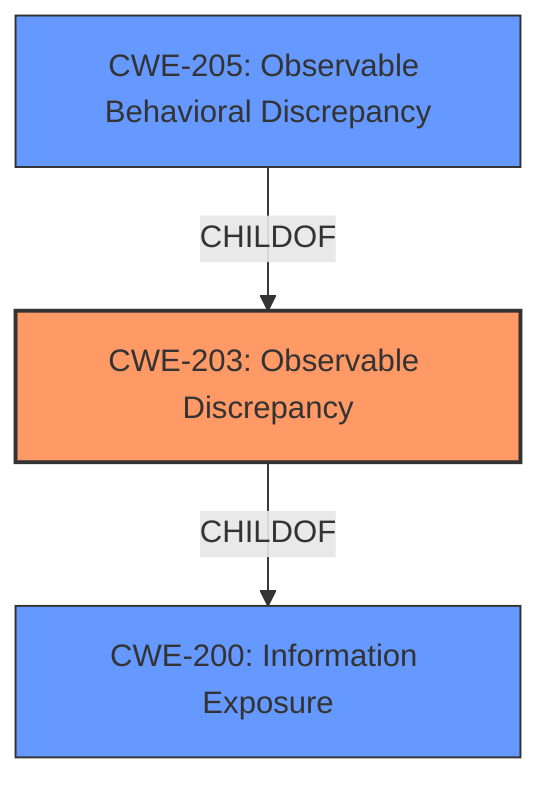

# Raw Analyzer Response for CVE-2021-0466

# Summary
| CWE ID | CWE Name | Confidence | CWE Abstraction Level | CWE Vulnerability Mapping Label | CWE-Vulnerability Mapping Notes |
|---|---|---|---|---|---|
| CWE-203 | Observable Discrepancy | 0.9 | Base | Allowed | Primary CWE |
| CWE-205 | Observable Behavioral Discrepancy | 0.7 | Base | Allowed | Secondary Candidate |

## Evidence and Confidence

*   **Confidence Score:** 0.8
*   **Evidence Strength:** HIGH

## Relationship Analysis
The primary CWE is CWE-203, with CWE-205 as a closely related peer. CWE-203 is a child of CWE-200 (Information Exposure), highlighting the information disclosure aspect. CWE-205 is a more general form of observable discrepancy, which could apply if the behavioral difference leads to broader exposure than just state information.

## Vulnerability Chain
The vulnerability chain starts with the **incorrect** generation of IPv6 link-local addresses when MAC address randomization is enabled. This leads to an **observable discrepancy** in the generated addresses, which can then be used for remote information disclosure, specifically to **track a device**.

## Summary of Analysis
Initially, the retriever results suggested CWE-927 (Use of Implicit Intent for Sensitive Communication). However, that CWE is Android specific and focuses on inter-application communication via intents, which is not relevant here. Instead, the vulnerability description points to a **flaw** in how IPv6 addresses are generated, leading to information exposure. The core issue is that the use of EUI-64 addressing when MAC randomization is enabled creates a **discrepancy** that allows tracking.

The CVE Reference Links Content Summary states, "The product behaves differently or sends different responses under different circumstances in a way that is observable to an unauthorized actor, which exposes security-relevant information about the state of the product, such as whether a particular operation was successful or not." This statement strongly supports mapping to CWE-203 (Observable Discrepancy), and also supports mapping to CWE-205 (Observable Behavioral Discrepancy).

CWE-203 is selected as the primary CWE as the description aligns with the provided evidence. The vulnerability stems from the difference in IPv6 address generation based on whether MAC randomization is enabled, leading to the exposure of device-specific information. This discrepancy is observable and reveals security-relevant information.

CWE-205 is included as a secondary CWE as it describes a broader class of observable behavioral discrepancies that reveal internal state. While CWE-203 is more specific, CWE-205 provides additional context.

The selected CWEs are at the Base level of abstraction, which is the preferred level according to the mapping guidance. They accurately represent the root cause of the vulnerability, focusing on the observable discrepancy that leads to information disclosure.

Relevant CWE Information:

# Enhanced Context (25 CWEs)
The following CWEs were identified as potentially relevant to this vulnerability:

## CWE-203: Observable Discrepancy
**Abstraction Level**: Base
**Similarity Score**: 0.78
**Source**: dense

**Description**:
The product behaves differently or sends different responses under different circumstances in a way that is observable to an unauthorized actor, which exposes security-relevant information about the state of the product, such as whether a particular operation was successful or not.

**Mapping Guidance**:
- Usage: Allowed
- Rationale: This CWE entry is at the Base level of abstraction, which is a preferred level of abstraction for mapping to the root causes of vulnerabilities.

## CWE-205: Observable Behavioral Discrepancy
**Abstraction Level**: Base
**Similarity Score**: 0.78
**Source**: dense

**Description**:
The product's behaviors indicate important differences that may be observed by unauthorized actors in a way that reveals (1) its internal state or decision process, or (2) differences from other products with equivalent functionality.

**Mapping Guidance**:
- Usage: Allowed
- Rationale: This CWE entry is at the Base level of abstraction, which is a preferred level of abstraction for mapping to the root causes of vulnerabilities.