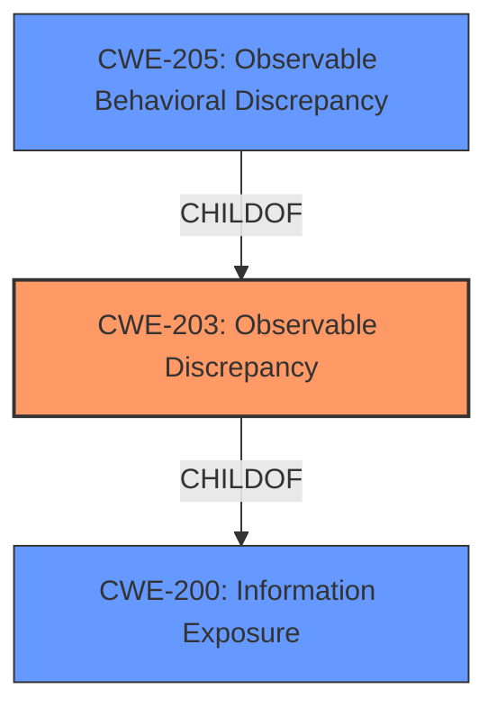

# Analysis for CVE-2021-0466

# Summary
| CWE ID | CWE Name | Confidence | CWE Abstraction Level | CWE Vulnerability Mapping Label | CWE-Vulnerability Mapping Notes |
|---|---|---|---|---|---|
| CWE-203 | Observable Discrepancy | 0.9 | Base | Allowed | Primary CWE |
| CWE-205 | Observable Behavioral Discrepancy | 0.7 | Base | Allowed | Secondary Candidate |

## Evidence and Confidence

*   **Confidence Score:** 0.8
*   **Evidence Strength:** HIGH

## Relationship Analysis
The primary CWE is CWE-203, with CWE-205 as a closely related peer. CWE-203 is a child of CWE-200 (Information Exposure), highlighting the information disclosure aspect. CWE-205 is a more general form of observable discrepancy, which could apply if the behavioral difference leads to broader exposure than just state information.

## Vulnerability Chain
The vulnerability chain starts with the **incorrect** generation of IPv6 link-local addresses when MAC address randomization is enabled. This leads to an **observable discrepancy** in the generated addresses, which can then be used for remote information disclosure, specifically to **track a device**.

## Summary of Analysis
Initially, the retriever results suggested CWE-927 (Use of Implicit Intent for Sensitive Communication). However, that CWE is Android specific and focuses on inter-application communication via intents, which is not relevant here. Instead, the vulnerability description points to a **flaw** in how IPv6 addresses are generated, leading to information exposure. The core issue is that the use of EUI-64 addressing when MAC randomization is enabled creates a **discrepancy** that allows tracking.

The CVE Reference Links Content Summary states, "The product behaves differently or sends different responses under different circumstances in a way that is observable to an unauthorized actor, which exposes security-relevant information about the state of the product, such as whether a particular operation was successful or not." This statement strongly supports mapping to CWE-203 (Observable Discrepancy), and also supports mapping to CWE-205 (Observable Behavioral Discrepancy).

CWE-203 is selected as the primary CWE as the description aligns with the provided evidence. The vulnerability stems from the difference in IPv6 address generation based on whether MAC randomization is enabled, leading to the exposure of device-specific information. This discrepancy is observable and reveals security-relevant information.

CWE-205 is included as a secondary CWE as it describes a broader class of observable behavioral discrepancies that reveal internal state. While CWE-203 is more specific, CWE-205 provides additional context.

The selected CWEs are at the Base level of abstraction, which is the preferred level according to the mapping guidance. They accurately represent the root cause of the vulnerability, focusing on the observable discrepancy that leads to information disclosure.

Relevant CWE Information:

# Enhanced Context (25 CWEs)
The following CWEs were identified as potentially relevant to this vulnerability:

## CWE-203: Observable Discrepancy
**Abstraction Level**: Base
**Similarity Score**: 0.78
**Source**: dense

**Description**:
The product behaves differently or sends different responses under different circumstances in a way that is observable to an unauthorized actor, which exposes security-relevant information about the state of the product, such as whether a particular operation was successful or not.

**Mapping Guidance**:
- Usage: Allowed
- Rationale: This CWE entry is at the Base level of abstraction, which is a preferred level of abstraction for mapping to the root causes of vulnerabilities.

## CWE-205: Observable Behavioral Discrepancy
**Abstraction Level**: Base
**Similarity Score**: 0.78
**Source**: dense

**Description**:
The product's behaviors indicate important differences that may be observed by unauthorized actors in a way that reveals (1) its internal state or decision process, or (2) differences from other products with equivalent functionality.

**Mapping Guidance**:
- Usage: Allowed
- Rationale: This CWE entry is at the Base level of abstraction, which is a preferred level of abstraction for mapping to the root causes of vulnerabilities.

# Enhanced Query for CVE-2021-0466

## Vulnerability Description
In startIpClient of ClientModeImpl.java, there is a possible identifier which could be used to track a device. This could lead to remote information disclosure to a proximal attacker, with no additional execution privileges needed. User interaction is not needed for exploitation.Product AndroidVersions Android-10Android ID A-154114734

### Vulnerability Description Key Phrases
- **impact:** remote information disclosure
- **vector:** track a device
- **attacker:** proximal attacker
- **product:** Android
- **version:** Android-10
- **component:** startIpClient of ClientModeImpl.java

## CVE Reference Links Content Summary
Based on the provided content, here's an analysis of CVE-2021-0466:

**Root Cause:**
The vulnerability lies in how IPv6 link-local addresses are generated when MAC address randomization is used for Wi-Fi connections. Specifically, the issue is in the generation of the EUI-64 identifier used for creating IPv6 link-local addresses.

**Weaknesses/Vulnerabilities:**
The vulnerability is an information disclosure issue (ID) related to the generation of IPv6 link-local addresses. The system uses different methods for generating these addresses depending on whether MAC address randomization is enabled or not. When MAC randomization is not used, RFC7217 stable privacy addresses are generated, whereas when randomization is used, EUI-64 addresses are generated, which are derived from the MAC address.

**Impact of Exploitation:**
An attacker may be able to learn device-specific information by observing the generated IPv6 link-local addresses. This could potentially enable tracking or identification of the device across different networks when MAC address randomization is enabled.

**Attack Vectors:**
An attacker can passively observe the IPv6 link-local addresses generated by a device on a Wi-Fi network. This is possible over the air whenever the device connects to a new network when MAC randomization is enabled and EUI64 addressing is used

**Required Attacker Capabilities/Position:**
The attacker needs to be in a position to monitor network traffic on a Wi-Fi network that the vulnerable device connects to. No special privileges or capabilities on the device itself are required for the attack.

**Additional Details:**
The provided content gives more detailed insight into the conditions for the vulnerability to arise compared to the basic CVE description. It specifies that when MAC address randomization is enabled, EUI64 addresses are generated based on the per-network MAC address, while stable privacy addresses as specified by RFC7217 are used when randomization is not enabled. This distinction is crucial to understand the vulnerability. It also includes references to test cases designed to verify the fix of the vulnerability, such as "Observe that IPv6 link-local address differs for two networks using randomization" and "Observe that stable-privacy link-local address is used for network when not using randomization".

## Retriever Results

### Top Combined Results

| Rank | CWE ID | Name | Abstraction | Usage  | Retrievers | Individual Scores |
|------|--------|------|-------------|-------|------------|-------------------|
| 1 | 330 | Use of Insufficiently Random Values | Class | Discouraged | sparse | 0.127 |
| 2 | 862 | Missing Authorization | Class | Allowed-with-Review | sparse | 0.125 |
| 3 | 1021 | Improper Restriction of Rendered UI Layers or Frames | Base | Allowed | sparse | 0.125 |
| 4 | 514 | Covert Channel | Class | Allowed-with-Review | sparse | 0.117 |
| 5 | 665 | Improper Initialization | Class | Discouraged | sparse | 0.114 |
| 6 | 927 | Use of Implicit Intent for Sensitive Communication | Variant | Allowed | dense | 0.539 |
| 7 | 205 | Observable Behavioral Discrepancy | Base | Allowed | graph | 0.003 |
| 8 | 362 | Concurrent Execution using Shared Resource with Improper Synchronization ('Race Condition') | Class | Allowed-with-Review | sparse | 0.112 |
| 9 | 908 | Use of Uninitialized Resource | Base | Allowed | sparse | 0.112 |
| 10 | 203 | Observable Discrepancy | Base | Allowed | sparse | 0.111 |

# Complete CWE Specifications

## CWE-330: Use of Insufficiently Random Values
**Abstraction:** Class
**Status:** Stable

### Description
The product uses insufficiently random numbers or values in a security context that depends on unpredictable numbers.

### Extended Description
When product generates predictable values in a context requiring unpredictability, it may be possible for an attacker to guess the next value that will be generated, and use this guess to impersonate another user or access sensitive information.

### Alternative Terms
None

### Relationships
ChildOf -> CWE-693
CanPrecede -> CWE-804

### Mapping Guidance
**Usage:** Discouraged
**Rationale:** This CWE entry is a level-1 Class (i.e., a child of a Pillar). It might have lower-level children that would be more appropriate
**Comments:** Examine children of this entry to see if there is a better fit
**Reasons:**
- Abstraction

### Additional Notes
**[Relationship]** This can be primary to many other weaknesses such as cryptographic errors, authentication errors, symlink following, information leaks, and others.

**[Maintenance]** As of CWE 4.3, CWE-330 and its descendants are being investigated by the CWE crypto team to identify gaps related to randomness and unpredictability, as well as the relationships between randomness and cryptographic primitives. This "subtree analysis" might result in the addition or deprecation of existing entries; the reorganization of relationships in some views, e.g. the research view (CWE-1000); more consistent use of terminology; and/or significant modifications to related entries.

**[Maintenance]** As of CWE 4.5, terminology related to randomness, entropy, and predictability can vary widely. Within the developer and other communities, "randomness" is used heavily. However, within cryptography, "entropy" is distinct, typically implied as a measurement. There are no commonly-used definitions, even within standards documents and cryptography papers. Future versions of CWE will attempt to define these terms and, if necessary, distinguish between them in ways that are appropriate for different communities but do not reduce the usability of CWE for mapping, understanding, or other scenarios.

### Observed Examples
- **CVE-2021-3692:** PHP framework uses mt_rand() function (Marsenne Twister) when generating tokens
- **CVE-2020-7010:** Cloud application on Kubernetes generates passwords using a weak random number generator based on deployment time.
- **CVE-2009-3278:** Crypto product uses rand() library function to generate a recovery key, making it easier to conduct brute force attacks.

## CWE-862: Missing Authorization
**Abstraction:** Class
**Status:** Incomplete

### Description
The product does not perform an authorization check when an actor attempts to access a resource or perform an action.

### Extended Description
Not provided

### Alternative Terms
AuthZ: "AuthZ" is typically used as an abbreviation of "authorization" within the web application security community. It is distinct from "AuthN" (or, sometimes, "AuthC") which is an abbreviation of "authentication." The use of "Auth" as an abbreviation is discouraged, since it could be used for either authentication or authorization.

### Relationships
ChildOf -> CWE-285
ChildOf -> CWE-284

### Mapping Guidance
**Usage:** Allowed-with-Review
**Rationale:** This CWE entry is a Class and might have Base-level children that would be more appropriate
**Comments:** Examine children of this entry to see if there is a better fit
**Reasons:**
- Abstraction

### Additional Notes
**[Terminology]** Assuming a user with a given identity, authorization is the process of determining whether that user can access a given resource, based on the user's privileges and any permissions or other access-control specifications that apply to the resource.

### Observed Examples
- **CVE-2022-24730:** Go-based continuous deployment product does not check that a user has certain privileges to update or create an app, allowing adversaries to read sensitive repository information
- **CVE-2009-3168:** Web application does not restrict access to admin scripts, allowing authenticated users to reset administrative passwords.
- **CVE-2009-3597:** Web application stores database file under the web root with insufficient access control (CWE-219), allowing direct request.

## CWE-1021: Improper Restriction of Rendered UI Layers or Frames
**Abstraction:** Base
**Status:** Incomplete

### Description
The web application does not restrict or incorrectly restricts frame objects or UI layers that belong to another application or domain, which can lead to user confusion about which interface the user is interacting with.

### Extended Description
A web application is expected to place restrictions on whether it is allowed to be rendered within frames, iframes, objects, embed or applet elements. Without the restrictions, users can be tricked into interacting with the application when they were not intending to.

### Alternative Terms
Clickjacking
UI Redress Attack
Tapjacking: "Tapjacking" is similar to clickjacking, except it is used for mobile applications in which the user "taps" the application instead of performing a mouse click.

### Relationships
ChildOf -> CWE-441
ChildOf -> CWE-610
ChildOf -> CWE-451

### Mapping Guidance
**Usage:** Allowed
**Rationale:** This CWE entry is at the Base level of abstraction, which is a preferred level of abstraction for mapping to the root causes of vulnerabilities.
**Comments:** Carefully read both the name and description to ensure that this mapping is an appropriate fit. Do not try to 'force' a mapping to a lower-level Base/Variant simply to comply with this preferred level of abstraction.
**Reasons:**
- Acceptable-Use

### Observed Examples
- **CVE-2017-7440:** E-mail preview feature in a desktop application allows clickjacking attacks via a crafted e-mail message
- **CVE-2017-5697:** Hardware/firmware product has insufficient clickjacking protection in its web user interface
- **CVE-2017-4015:** Clickjacking in data-loss prevention product via HTTP response header.

## CWE-514: Covert Channel
**Abstraction:** Class
**Status:** Incomplete

### Description
A covert channel is a path that can be used to transfer information in a way not intended by the system's designers.

### Extended Description
Typically the system has not given authorization for the transmission and has no knowledge of its occurrence.

### Alternative Terms
None

### Relationships
ChildOf -> CWE-1229

### Mapping Guidance
**Usage:** Allowed-with-Review
**Rationale:** This CWE entry is a Class and might have Base-level children that would be more appropriate
**Comments:** Examine children of this entry to see if there is a better fit
**Reasons:**
- Abstraction

### Additional Notes
**[Theoretical]** A covert channel can be thought of as an emergent resource, meaning that it was not an originally intended resource, however it exists due the application's behaviors.

**[Maintenance]** As of CWE 4.9, members of the CWE Hardware SIG are working to improve CWE's coverage of transient execution weaknesses, which include issues related to Spectre, Meltdown, and other attacks that create or exploit covert channels. As a result of that work, this entry might change in CWE 4.10.

## CWE-665: Improper Initialization
**Abstraction:** Class
**Status:** Draft

### Description
The product does not initialize or incorrectly initializes a resource, which might leave the resource in an unexpected state when it is accessed or used.

### Extended Description
This can have security implications when the associated resource is expected to have certain properties or values, such as a variable that determines whether a user has been authenticated or not.

### Alternative Terms
None

### Relationships
ChildOf -> CWE-664

### Mapping Guidance
**Usage:** Discouraged
**Rationale:** This CWE entry is a level-1 Class (i.e., a child of a Pillar). It might have lower-level children that would be more appropriate
**Comments:** Examine children of this entry to see if there is a better fit
**Reasons:**
- Abstraction

### Observed Examples
- **CVE-2001-1471:** chain: an invalid value prevents a library file from being included, skipping initialization of key variables, leading to resultant eval injection.
- **CVE-2008-3637:** Improper error checking in protection mechanism produces an uninitialized variable, allowing security bypass and code execution.
- **CVE-2008-4197:** Use of uninitialized memory may allow code execution.

## CWE-927: Use of Implicit Intent for Sensitive Communication
**Abstraction:** Variant
**Status:** Incomplete

### Description
The Android application uses an implicit intent for transmitting sensitive data to other applications.

### Extended Description

Since an implicit intent does not specify a particular application to receive the data, any application can process the intent by using an Intent Filter for that intent. This can allow untrusted applications to obtain sensitive data. There are two variations on the standard broadcast intent, ordered and sticky.

Ordered broadcast intents are delivered to a series of registered receivers in order of priority as declared by the Receivers. A malicious receiver can give itself a high priority and cause a denial of service by stopping the broadcast from propagating further down the chain. There is also the possibility of malicious data modification, as a receiver may also alter the data within the Intent before passing it on to the next receiver. The downstream components have no way of asserting that the data has not been altered earlier in the chain.

Sticky broadcast intents remain accessible after the initial broadcast. An old sticky intent will be broadcast again to any new receivers that register for it in the future, greatly increasing the chances of information exposure over time. Also, sticky broadcasts cannot be protected by permissions that may apply to other kinds of intents.

In addition, any broadcast intent may include a URI that references data that the receiving component does not normally have the privileges to access. The sender of the intent can include special privileges that grant the receiver read or write access to the specific URI included in the intent. A malicious receiver that intercepts this intent will also gain those privileges and be able to read or write the resource at the specified URI.

### Alternative Terms
None

### Relationships
ChildOf -> CWE-285
ChildOf -> CWE-668

### Mapping Guidance
**Usage:** Allowed
**Rationale:** This CWE entry is at the Variant level of abstraction, which is a preferred level of abstraction for mapping to the root causes of vulnerabilities.
**Comments:** Carefully read both the name and description to ensure that this mapping is an appropriate fit. Do not try to 'force' a mapping to a lower-level Base/Variant simply to comply with this preferred level of abstraction.
**Reasons:**
- Acceptable-Use

### Observed Examples
- **CVE-2022-4903:** An Android application does not use FLAG_IMMUTABLE when creating a PendingIntent.

## CWE-205: Observable Behavioral Discrepancy
**Abstraction:** Base
**Status:** Incomplete

### Description
The product's behaviors indicate important differences that may be observed by unauthorized actors in a way that reveals (1) its internal state or decision process, or (2) differences from other products with equivalent functionality.

### Extended Description
Ideally, a product should provide as little information about its internal operations as possible. Otherwise, attackers could use knowledge of these internal operations to simplify or optimize their attack. In some cases, behavioral discrepancies can be used by attackers to form a side channel.

### Alternative Terms
None

### Relationships
ChildOf -> CWE-203
CanPrecede -> CWE-514

### Mapping Guidance
**Usage:** Allowed
**Rationale:** This CWE entry is at the Base level of abstraction, which is a preferred level of abstraction for mapping to the root causes of vulnerabilities.
**Comments:** Carefully read both the name and description to ensure that this mapping is an appropriate fit. Do not try to 'force' a mapping to a lower-level Base/Variant simply to comply with this preferred level of abstraction.
**Reasons:**
- Acceptable-Use

### Observed Examples
- **CVE-2002-0208:** Product modifies TCP/IP stack and ICMP error messages in unusual ways that show the product is in use.
- **CVE-2004-2252:** Behavioral infoleak by responding to SYN-FIN packets.

## CWE-362: Concurrent Execution using Shared Resource with Improper Synchronization ('Race Condition')
**Abstraction:** Class
**Status:** Draft

### Description
The product contains a concurrent code sequence that requires temporary, exclusive access to a shared resource, but a timing window exists in which the shared resource can be modified by another code sequence operating concurrently.

### Extended Description

A race condition occurs within concurrent environments, and it is effectively a property of a code sequence. Depending on the context, a code sequence may be in the form of a function call, a small number of instructions, a series of program invocations, etc.

A race condition violates these properties, which are closely related:

  - Exclusivity - the code sequence is given exclusive access to the shared resource, i.e., no other code sequence can modify properties of the shared resource before the original sequence has completed execution.

  - Atomicity - the code sequence is behaviorally atomic, i.e., no other thread or process can concurrently execute the same sequence of instructions (or a subset) against the same resource.

A race condition exists when an "interfering code sequence" can still access the shared resource, violating exclusivity.

The interfering code sequence could be "trusted" or "untrusted." A trusted interfering code sequence occurs within the product; it cannot be modified by the attacker, and it can only be invoked indirectly. An untrusted interfering code sequence can be authored directly by the attacker, and typically it is external to the vulnerable product.

### Alternative Terms
Race Condition

### Relationships
ChildOf -> CWE-691
CanPrecede -> CWE-416
CanPrecede -> CWE-476

### Mapping Guidance
**Usage:** Allowed-with-Review
**Rationale:** This CWE entry is a Class and might have Base-level children that would be more appropriate
**Comments:** Examine children of this entry to see if there is a better fit
**Reasons:**
- Abstraction

### Additional Notes
**[Maintenance]** The relationship between race conditions and synchronization problems (CWE-662) needs to be further developed. They are not necessarily two perspectives of the same core concept, since synchronization is only one technique for avoiding race conditions, and synchronization can be used for other purposes besides race condition prevention.

**[Research Gap]** Race conditions in web applications are under-studied and probably under-reported. However, in 2008 there has been growing interest in this area.

**[Research Gap]** Much of the focus of race condition research has been in Time-of-check Time-of-use (TOCTOU) variants (CWE-367), but many race conditions are related to synchronization problems that do not necessarily require a time-of-check.

**[Research Gap]** From a classification/taxonomy perspective, the relationships between concurrency and program state need closer investigation and may be useful in organizing related issues.

### Observed Examples
- **CVE-2022-29527:** Go application for cloud management creates a world-writable sudoers file that allows local attackers to inject sudo rules and escalate privileges to root by winning a race condition.
- **CVE-2021-1782:** Chain: improper locking (CWE-667) leads to race condition (CWE-362), as exploited in the wild per CISA KEV.
- **CVE-2021-0920:** Chain: mobile platform race condition (CWE-362) leading to use-after-free (CWE-416), as exploited in the wild per CISA KEV.

## CWE-908: Use of Uninitialized Resource
**Abstraction:** Base
**Status:** Incomplete

### Description
The product uses or accesses a resource that has not been initialized.

### Extended Description
When a resource has not been properly initialized, the product may behave unexpectedly. This may lead to a crash or invalid memory access, but the consequences vary depending on the type of resource and how it is used within the product.

### Alternative Terms
None

### Relationships
ChildOf -> CWE-665
ChildOf -> CWE-665

### Mapping Guidance
**Usage:** Allowed
**Rationale:** This CWE entry is at the Base level of abstraction, which is a preferred level of abstraction for mapping to the root causes of vulnerabilities.
**Comments:** Carefully read both the name and description to ensure that this mapping is an appropriate fit. Do not try to 'force' a mapping to a lower-level Base/Variant simply to comply with this preferred level of abstraction.
**Reasons:**
- Acceptable-Use

### Observed Examples
- **CVE-2019-9805:** Chain: Creation of the packet client occurs before initialization is complete (CWE-696) resulting in a read from uninitialized memory (CWE-908), causing memory corruption.
- **CVE-2008-4197:** Use of uninitialized memory may allow code execution.
- **CVE-2008-2934:** Free of an uninitialized pointer leads to crash and possible code execution.

## CWE-203: Observable Discrepancy
**Abstraction:** Base
**Status:** Incomplete

### Description
The product behaves differently or sends different responses under different circumstances in a way that is observable to an unauthorized actor, which exposes security-relevant information about the state of the product, such as whether a particular operation was successful or not.

### Extended Description
Discrepancies can take many forms, and variations may be detectable in timing, control flow, communications such as replies or requests, or general behavior. These discrepancies can reveal information about the product's operation or internal state to an unauthorized actor. In some cases, discrepancies can be used by attackers to form a side channel.

### Alternative Terms
Side Channel Attack: Observable Discrepancies are at the root of side channel attacks.

### Relationships
ChildOf -> CWE-200
ChildOf -> CWE-200

### Mapping Guidance
**Usage:** Allowed
**Rationale:** This CWE entry is at the Base level of abstraction, which is a preferred level of abstraction for mapping to the root causes of vulnerabilities.
**Comments:** Carefully read both the name and description to ensure that this mapping is an appropriate fit. Do not try to 'force' a mapping to a lower-level Base/Variant simply to comply with this preferred level of abstraction.
**Reasons:**
- Acceptable-Use

### Observed Examples
- **CVE-2020-8695:** Observable discrepancy in the RAPL interface for some Intel processors allows information disclosure.
- **CVE-2019-14353:** Crypto hardware wallet's power consumption relates to total number of pixels illuminated, creating a side channel in the USB connection that allows attackers to determine secrets displayed such as PIN numbers and passwords
- **CVE-2019-10071:** Java-oriented framework compares HMAC signatures using String.equals() instead of a constant-time algorithm, causing timing discrepancies

