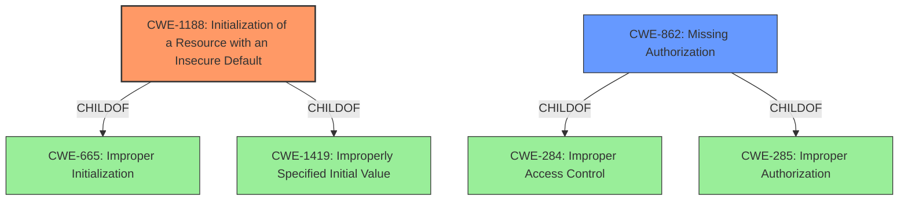

# Enhanced Analysis for CVE-2021-0468

# Summary
| CWE ID | CWE Name | Confidence | CWE Abstraction Level | CWE Vulnerability Mapping Label | CWE-Vulnerability Mapping Notes |
|---|---|---|---|---|---|
| CWE-1188 | Initialization of a Resource with an Insecure Default | 0.9 | Base | Allowed | Primary CWE |
| CWE-862 | Missing Authorization | 0.6 | Class | Allowed-with-Review | Secondary Candidate |

## Evidence and Confidence

*   **Confidence Score:** 0.9
*   **Evidence Strength:** HIGH

## Relationship Analysis
The primary CWE is CWE-1188, a Base level weakness describing the use of insecure default values. CWE-1188 is a child of CWE-665 (Improper Initialization) and CWE-1419 (Improperly Specified Initial Value). A secondary candidate, CWE-862 (Missing Authorization), is a Class level weakness and a child of CWE-284 (Improper Access Control) and CWE-285 (Improper Authorization). The relationship analysis helped confirm that CWE-1188 is a more direct match, as the vulnerability stems from the insecure default value itself, rather than a failure to authorize access.



## Vulnerability Chain
The vulnerability chain starts with an **insecure default value** (CWE-1188), which leads to a local escalation of privilege.

## Summary of Analysis
The primary assessment is based on the vulnerability description stating that the root cause is an **insecure default value**. The retriever results also lists CWE-1188 as the second best match.

The vulnerability description states: "In LK, there is a possible escalation of privilege due to an **insecure default value**." The **Vulnerability Description Key Phrases** section also highlights "**rootcause:** **insecure default value**"

CWE-1188 (Initialization of a Resource with an Insecure Default) directly addresses the **root cause** described. The CWE description states: "The product initializes or sets a resource with a default that is intended to be changed by the administrator, but the default is not secure." This aligns perfectly with the provided description.

CWE-862 (Missing Authorization) was considered because privilege escalation often involves authorization issues. However, the **root cause** here is the **insecure default value**, not a missing authorization check. Therefore, CWE-862 is a less direct match.

The final decision is to assign CWE-1188 as the primary CWE because it is a base level CWE that directly addresses the root cause of the vulnerability which is the **insecure default value**.

Relevant CWE Information:

# Enhanced Context (25 CWEs)

## CWE-1188: Initialization of a Resource with an Insecure Default
**Abstraction:** Base
**Status:** Incomplete

### Description
The product initializes or sets a resource with a default that is intended to be changed by the administrator, but the default is not secure.

### Extended Description


Developers often choose default values that leave the product as open and easy to use as possible out-of-the-box, under the assumption that the administrator can (or should) change the default value. However, this ease-of-use comes at a cost when the default is insecure and the administrator does not change it.


## CWE Relationship Analysis

Current CWEs represent these abstraction levels: .


### Vulnerability Chain Analysis

**Chain starting from CWE-862:**
- 862 (Missing Authorization) - ROOT


**Chain starting from CWE-284:**
- 284 (Improper Access Control) - ROOT


### CWE Relationship Diagram

```mermaid
graph TD
    classDef primary fill:#f96,stroke:#333,stroke-width:2px
    classDef secondary fill:#69f,stroke:#333
    classDef tertiary fill:#9e9,stroke:#333
```