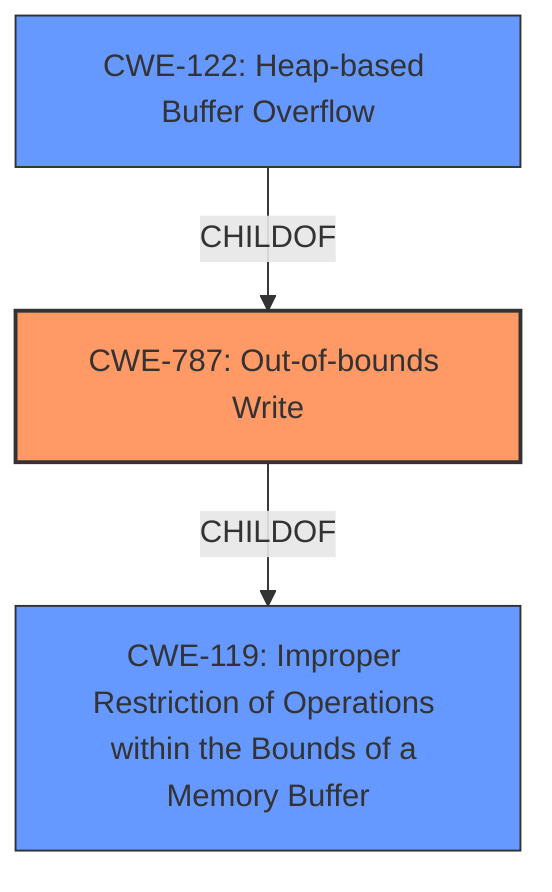

# Analysis Report for CVE-2021-0474

# Vulnerability Analysis Report: CVE-2021-0474

## Description


## Analysis (with Relationship Data)

# Summary
| CWE ID    | CWE Name                                                                  | Confidence | CWE Abstraction Level | CWE Vulnerability Mapping Label | CWE-Vulnerability Mapping Notes |
| :--------- | :------------------------------------------------------------------------ | :--------- | :---------------------- | :------------------------------ | :----------------------------- |
| CWE-787   | Out-of-bounds Write                                                     | 0.95        | Base                    | Primary                          | Allowed                        |
| CWE-122   | Heap-based Buffer Overflow                                                | 0.85       | Variant                 | Secondary                       | Allowed                        |
| CWE-119   | Improper Restriction of Operations within the Bounds of a Memory Buffer | 0.75       | Class                   | Secondary                       | Discouraged                    |

## Evidence and Confidence

*   **Confidence Score:** 0.9
*   **Evidence Strength:** HIGH

## Relationship Analysis
The primary relationship is that CWE-787 **Out-of-bounds Write** is a more specific type of CWE-119 **Improper Restriction of Operations within the Bounds of a Memory Buffer**, representing a write operation outside the intended buffer boundaries. CWE-122 **Heap-based Buffer Overflow** is a child of CWE-787 and CWE-788 and specifies the location of the buffer, in this case, the heap. Selecting CWE-787 as the primary is based on its specificity and the vulnerability description mentioning an out-of-bounds write.



## Vulnerability Chain
The vulnerability chain starts with the **heap buffer overflow** due to the **out of bounds write**, leading to remote code execution. This chain highlights the progression from a memory corruption issue to a high-impact security breach.

## Summary of Analysis
The initial assessment identified a **heap buffer overflow** due to an **out of bounds write**, which can lead to remote code execution. The supporting evidence from the vulnerability description states "In avrc_msg_cback of avrc_api.cc, there is a possible **out of bounds write** due to a **heap buffer overflow**." The CVE Reference Links Content Summary further reinforces this by noting the **root cause** as "buffer overflow vulnerability due to insufficient validation of the length of commands" leading to "Remote Code Execution".

The graph relationships confirm that CWE-787 is a more specific type of CWE-119, and CWE-122 specifies the location of the buffer.

CWE-787 **Out-of-bounds Write** is the optimal selection because it accurately represents the specific **weakness** described in the vulnerability and has the most relevant rootcause evidence. The **out of bounds write** due to the **heap buffer overflow** aligns directly with the definition of CWE-787, and its impact leads to remote code execution.

CWE-122 **Heap-based Buffer Overflow** is a valid secondary weakness since the buffer is located on the heap.

CWE-119 **Improper Restriction of Operations within the Bounds of a Memory Buffer** is too general, but is included as a secondary because out-of-bounds write is a type of memory bounds violation.

Relevant CWE Information:

# Enhanced Context (25 CWEs)
The following CWEs were identified as potentially relevant to this vulnerability:

## CWE-226: Sensitive Information in Resource Not Removed Before Reuse
**Abstraction Level**: Base
**Similarity Score**: 0.76
**Source**: dense

**Description**:
The product releases a resource such as memory or a file so that it can be made available for reuse, but it does not clear or "zeroize" the information contained in the resource before the product performs a critical state transition or makes the resource available for reuse by other entities.

**Mapping Guidance**:
- Usage: Allowed
- Rationale: This CWE entry is at the Base level of abstraction, which is a preferred level of abstraction for mapping to the root causes of vulnerabilities.

## CWE-909: Missing Initialization of Resource
**Abstraction Level**: Class
**Similarity Score**: 0.76
**Source**: dense

**Description**:
The product does not initialize a critical resource.

**Mapping Guidance**:
- Usage: Allowed-with-Review
- Rationale: This CWE entry is a Class and might have Base-level children that would be more appropriate

## CWE-404: Improper Resource Shutdown or Release
**Abstraction Level**: Class
**Similarity Score**: 0.76
**Source**: dense

**Description**:
The product does not release or incorrectly releases a resource before it is made available for re-use.

**Mapping Guidance**:
- Usage: Allowed-with-Review
- Rationale: This CWE entry is a Class and might have Base-level children that would be more appropriate

## CWE-667: Improper Locking
**Abstraction Level**: Class
**Similarity Score**: 0.76
**Source**: dense

**Description**:
The product does not properly acquire or release a lock on a resource, leading to unexpected resource state changes and behaviors.

**Mapping Guidance**:
- Usage: Allowed-with-Review
- Rationale: This CWE entry is a Class and might have Base-level children that would be more appropriate

## CWE-665: Improper Initialization
**Abstraction Level**: Class
**Similarity Score**: 0.75
**Source**: dense

**Description**:
The product does not initialize or incorrectly initializes a resource, which might leave the resource in an unexpected state when it is accessed or used.

**Mapping Guidance**:
- Usage: Discouraged
- Rationale: This CWE entry is a level-1 Class (i.e., a child of a Pillar). It might have lower-level children that would be more appropriate

## CWE-662: Improper Synchronization
**Abstraction Level**: Class
**Similarity Score**: 0.75
**Source**: dense

**Description**:
The product utilizes multiple threads or processes to allow temporary access to a shared resource that can only be exclusive to one process at a time, but it does not properly synchronize these actions, which might cause simultaneous accesses of this resource by multiple threads or processes.

**Mapping Guidance**:
- Usage: Discouraged
- Rationale: This CWE entry is a level-1 Class (i.e., a child of a Pillar). It might have lower-level children that would be more appropriate

## CWE-1419: Incorrect Initialization of Resource
**Abstraction Level**: Class
**Similarity Score**: 0.75
**Source**: dense

**Description**:
The product attempts to initialize a resource but does not correctly do so, which might leave the resource in an unexpected, incorrect, or insecure state when it is accessed.

**Mapping Guidance**:
- Usage: Allowed-with-Review
- Rationale: This CWE entry is a Class and might have Base-level children that would be more appropriate

## CWE-664: Improper Control of a Resource Through its Lifetime
**Abstraction Level**: Pillar
**Similarity Score**: 0.74
**Source**: dense

**Description**:
The product does not maintain or incorrectly maintains control over a resource throughout its lifetime of creation, use, and release.

**Mapping Guidance**:
- Usage: Discouraged
- Rationale: This CWE entry is high-level when lower-level children are available.

## CWE-908: Use of Uninitialized Resource
**Abstraction Level**: Base
**Similarity Score**: 0.74
**Source**: dense

**Description**:
The product uses or accesses a resource that has not been initialized.

**Mapping Guidance**:
- Usage: Allowed
- Rationale: This CWE entry is at the Base level of abstraction, which is a preferred level of abstraction for mapping to the root causes of vulnerabilities.

## CWE-366: Race Condition within a Thread
**Abstraction Level**: Base
**Similarity Score**: 0.74
**Source**: dense

**Description**:
If two threads of execution use a resource simultaneously, there exists the possibility that resources may be used while invalid, in turn making the state of execution undefined.

**Mapping Guidance**:
- Usage: Allowed
- Rationale: This CWE entry is at the Base level of abstraction, which is a preferred level of abstraction for mapping to the root causes of vulnerabilities.

## CWE-190: Integer Overflow or Wraparound
**Abstraction Level**: Base
**Similarity Score**: 6295.51
**Source**: sparse

**Description**:
The product performs a calculation that can
         produce an integer overflow or wraparound when the logic
         assumes that the resulting value will always be larger than


## CWE Relationship Analysis

Current CWEs represent these abstraction levels: .


### Vulnerability Chain Analysis

**Chain starting from CWE-667:**
- 667 (Improper Locking) - ROOT


**Chain starting from CWE-787:**
- 787 (Out-of-bounds Write) - ROOT


### CWE Relationship Diagram

```mermaid
graph TD
    classDef primary fill:#f96,stroke:#333,stroke-width:2px
    classDef secondary fill:#69f,stroke:#333
    classDef tertiary fill:#9e9,stroke:#333
```


*Report generated on 2025-04-02 14:15:24*
