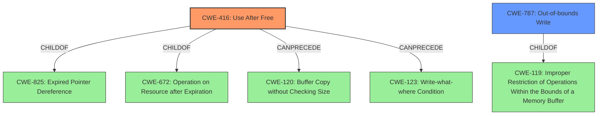

# Raw Analyzer Response for CVE-2021-0475

# Summary
| CWE ID | CWE Name | Confidence | CWE Abstraction Level | CWE Vulnerability Mapping Label | CWE-Vulnerability Mapping Notes |
|---|---|---|---|---|---|
| CWE-416 | Use After Free | 1.0 | Variant | Allowed | Primary CWE |
| CWE-787 | Out-of-bounds Write | 0.7 | Base | Allowed | Secondary Candidate |

## Evidence and Confidence

*   **Confidence Score:** 0.9
*   **Evidence Strength:** HIGH

## Relationship Analysis
The primary weakness is **CWE-416 (Use After Free)**, which is a variant-level CWE. It has a child-parent relationship with **CWE-825 (Expired Pointer Dereference)** and **CWE-672 (Operation on Resource after Expiration)**. **CWE-416** can precede **CWE-120 (Buffer Copy without Checking Size of Input)** and **CWE-123 (Write-what-where Condition)**.

**CWE-787 (Out-of-bounds Write)** is considered as a secondary candidate. It is a base-level CWE and a child of **CWE-119 (Improper Restriction of Operations Within the Bounds of a Memory Buffer)**.

## Vulnerability Chain
The vulnerability chain starts with a **use after free** (**CWE-416**), which leads to **memory corruption**. The **memory corruption** could lead to an out-of-bounds write (**CWE-787**).

## Summary of Analysis
The primary weakness is a **use after free** (**CWE-416**). The vulnerability description explicitly mentions "**memory corruption** due to a **use after free**." The CVE reference further confirms this, stating that the "socket is not properly closed after use," which can lead to a use-after-free condition. This aligns with the definition of **CWE-416**, where memory is reused or referenced after it has been freed.

**CWE-787 (Out-of-bounds Write)** is a possible secondary weakness because **memory corruption** can be the result of writing to memory outside the bounds of a buffer.

Other CWEs considered but not selected:

*   **CWE-908 (Use of Uninitialized Resource)**: This was considered, but the description explicitly mentions a **use after free**, not a use of an uninitialized resource.
*   **CWE-362 (Concurrent Execution using Shared Resource with Improper Synchronization ('Race Condition'))**: While race conditions can sometimes lead to use-after-free vulnerabilities, there is no evidence of concurrent execution or improper synchronization in the provided description.
*   **CWE-665 (Improper Initialization)**: This is related to uninitialized resources, but the primary issue is the use of memory after it has been freed.
*   **CWE-123 (Write-what-where Condition)**: This is possible, but **CWE-787 (Out-of-bounds Write)** is more specific to this case.
*   **CWE-667 (Improper Locking)**: This is not directly related to the described vulnerability.
*   **CWE-415 (Double Free)**: The description does not suggest that free() is called twice on the same memory address.

The final selection of **CWE-416** is based on the explicit mention of "**use after free**" in the vulnerability description and the CVE reference. This is the most specific and accurate representation of the root cause of the vulnerability.