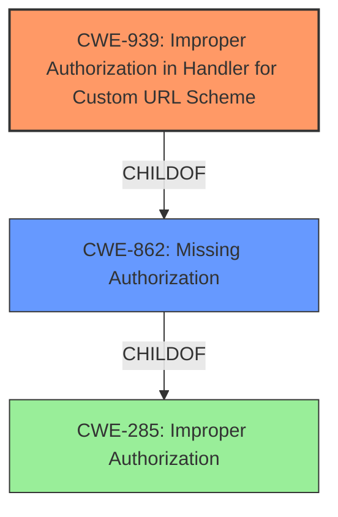

# Analysis for CVE-2021-0481

# Summary
| CWE ID | CWE Name | Confidence | CWE Abstraction Level | CWE Vulnerability Mapping Label | CWE-Vulnerability Mapping Notes |
|---|---|---|---|---|---|
| CWE-939 | Improper Authorization in Handler for Custom URL Scheme | 0.8 | Base | Allowed | Primary CWE. The **unexpected URI handler** is the rootcause. |
| CWE-862 | Missing Authorization | 0.6 | Class | Allowed-with-Review | Secondary candidate due to the authorization context.|

## Evidence and Confidence

*   **Confidence Score:** 0.7
*   **Evidence Strength:** MEDIUM

## Relationship Analysis
The primary relationship that influenced the decision was the ChildOf relationship between CWE-939 and CWE-862. CWE-939 is a more specific case of **missing authorization** related to custom URL schemes, which aligns with the vulnerability description. While CWE-862 is a broader category, CWE-939 provides a more precise classification. The relationships CANPRECEDE, CANFOLLOW, REQUIREDBY, REQUIRES, PEEROF and CANALSOBE did not appear to influence this selection.

## Vulnerability Chain
The vulnerability chain starts with the **unexpected URI handler** (CWE-939), which leads to the access of unauthorized files, resulting in a local escalation of privilege.

## Summary of Analysis
The initial analysis identified the **unexpected URI handler** as the root cause, which directly relates to **improper authorization** when handling custom URL schemes. The analysis also considered the potential for broader authorization issues (CWE-862) but determined that the more specific CWE-939 provides a more accurate representation of the vulnerability.

The decision is primarily based on the "Vulnerability Description Key Phrases" section, which identifies the **unexpected URI handler** as the root cause. Additionally, the "CVE Reference Links Content Summary" mentions the improper handling of result URIs.

The selection of CWE-939 is at the optimal level of specificity because it directly addresses the **improper authorization** in the context of custom URL schemes, which is the core issue described in the vulnerability.

Relevant CWE Information:

# Enhanced Context (25 CWEs)

## CWE-404: Improper Resource Shutdown or Release
**Abstraction Level**: Class
**Similarity Score**: 0.80
**Source**: dense

Did not select because the vulnerability is not about releasing a resource.

## CWE-667: Improper Locking
**Abstraction Level**: Class
**Similarity Score**: 0.79
**Source**: dense

Did not select because the vulnerability is not related to locking.

## CWE-226: Sensitive Information in Resource Not Removed Before Reuse
**Abstraction Level**: Base
**Similarity Score**: 0.78
**Source**: dense

Did not select because the vulnerability is not about sensitive information in resources.

## CWE-789: Memory Allocation with Excessive Size Value
**Abstraction Level**: Variant
**Similarity Score**: 0.78
**Source**: dense

Did not select because the vulnerability is not about memory allocation.

## CWE-754: Improper Check for Unusual or Exceptional Conditions
**Abstraction Level**: Class
**Similarity Score**: 0.77
**Source**: dense

Did not select because the vulnerability isn't related to checking conditions.

## CWE-405: Asymmetric Resource Consumption (Amplification)
**Abstraction Level**: Class
**Similarity Score**: 0.77
**Source**: dense

Did not select because the vulnerability is not about resource consumption.

## CWE-362: Concurrent Execution using Shared Resource with Improper Synchronization ('Race Condition')
**Abstraction Level**: Class
**Similarity Score**: 0.77
**Source**: dense

Did not select because the vulnerability is not about concurrency or race conditions.

## CWE-664: Improper Control of a Resource Through its Lifetime
**Abstraction Level**: Pillar
**Similarity Score**: 0.77
**Source**: dense

Did not select because it is a high-level CWE, and more specific options are available.

## CWE-668: Exposure of Resource to Wrong Sphere
**Abstraction Level**: Class
**Similarity Score**: 0.77
**Source**: dense

Did not select because it's a high-level CWE, and more specific options are available.

## CWE-909: Missing Initialization of Resource
**Abstraction Level**: Class
**Similarity Score**: 0.76
**Source**: dense

Did not select because the vulnerability is not about missing initialization.

## CWE-367: Time-of-check Time-of-use (TOCTOU) Race Condition
**Abstraction Level**: Base
**Similarity Score**: 5535.57
**Source**: sparse

Did not select because the vulnerability is not about TOCTOU race conditions.

## CWE-770: Allocation of Resources Without Limits or Throttling
**Abstraction Level**: Base
**Similarity Score**: 5506.32
**Source**: sparse

Did not select because the vulnerability is not about resource allocation limits.

## CWE-863: Incorrect Authorization
**Abstraction Level**: Class
**Similarity Score**: 5435.74
**Source**: sparse

Considered, but CWE-939 is more specific.

## CWE-476: NULL Pointer Dereference
**Abstraction Level**: base
**Similarity Score**: 4.33
**Source**: graph

Did not select because the vulnerability is not about null pointer dereferences.

## CWE-1284: Improper Validation of Specified Quantity in Input
**Abstraction Level**: base
**Similarity Score**: 4.33
**Source**: graph

Did not select because the vulnerability is not about validating input quantities.

## CWE-190: Integer Overflow or Wraparound
**Abstraction Level**: base
**Similarity Score**: 3.42
**Source**: graph

Did not select because the vulnerability is not about integer overflows.

## CWE-416: Use After Free
**Abstraction Level**: variant
**Similarity Score**: 3.24
**Source**: graph

Did not select because the vulnerability is not about use-after-free.

## CWE-386: Symbolic Name not Mapping to Correct Object
**Abstraction Level**: base
**Similarity Score**: 2.90
**Source**: graph

Did not select because the vulnerability is not about incorrect object mapping.

## CWE-609: Double-Checked Locking
**Abstraction Level**: base
**Similarity Score**: 2.87
**Source**: graph

Did not select because the vulnerability is not about double-checked locking.

## CWE-410: Insufficient Resource Pool
**Abstraction Level**: base
**Similarity Score**: 2.87
**Source**: graph

Did not select because the vulnerability is not about insufficient resource pools.

## CWE-364: Signal Handler Race Condition
**Abstraction Level**: base
**Similarity Score**: 2.87
**Source**: graph

Did not select because the vulnerability is not about signal handler race conditions.