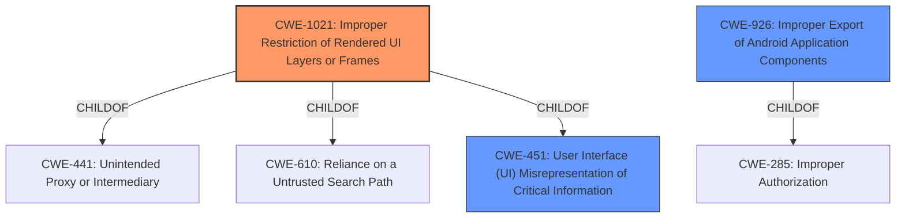

# Analysis for CVE-2021-0487

# Summary
| CWE ID    | CWE Name                                                                              | Confidence | CWE Abstraction Level | CWE Vulnerability Mapping Label | CWE-Vulnerability Mapping Notes |
| :-------- | :------------------------------------------------------------------------------------ | :--------- | :---------------------- | :------------------------------ | :------------------------------ |
| CWE-1021  | Improper Restriction of Rendered UI Layers or Frames                                | 0.9        | Base                    | Allowed                         | Primary CWE                     |
| CWE-451   | User Interface (UI) Misrepresentation of Critical Information                         | 0.7        | Class                   | Allowed-with-Review           | Secondary Candidate             |
| CWE-926   | Improper Export of Android Application Components                                     | 0.6        | Variant                 | Allowed                         | Secondary Candidate             |

## Evidence and Confidence

*   **Confidence Score:** 0.8
*   **Evidence Strength:** HIGH

## Relationship Analysis
The primary CWE selected is CWE-1021, which is a Base level weakness and a child of CWE-441 and CWE-610, and CWE-451. CWE-451 is a Class-level weakness, which encompasses UI misrepresentation issues. CWE-926 is a Variant of CWE-285, which represents improper authorization. The relationships between these CWEs highlight different aspects of the vulnerability, from the specific UI redress issue (CWE-1021) to the broader category of UI misrepresentation (CWE-451) and potential authorization issues (CWE-926). The choice of CWE-1021 as the primary CWE reflects the tapjacking/overlay attack vector described in the vulnerability.

## Vulnerability Chain
The vulnerability chain starts with a **tapjacking/overlay attack** (CWE-1021), which leads to the ability to export calendar data to the sdcard without user consent. This could potentially escalate privileges locally.

## Summary of Analysis
The initial assessment identified a potential **tapjacking/overlay attack** leading to unauthorized data export. The analysis is based on the vulnerability description and the CVE reference links content summary, which points to an improper handling of `SYSTEM_FLAG_HIDE_NON_SYSTEM_OVERLAY_WINDOWS`. This flag is related to hiding non-system overlay windows, and its improper handling allows bypassing user interaction requirements.

The selection of CWE-1021 is based on the explicit mention of "**tapjacking/overlay attack**" in the vulnerability description key phrases. The retriever results also ranked CWE-1021 as the top candidate with a score of 1.000, supporting this decision. The description of CWE-1021, "The web application does not restrict or incorrectly restricts frame objects or UI layers that belong to another application or domain, which can lead to user confusion about which interface the user is interacting with," aligns perfectly with the **tapjacking/overlay attack** scenario.

CWE-451 was considered because it broadly covers UI misrepresentation, but it is a Class level CWE, and CWE-1021 is a more specific Base level CWE that better describes the **tapjacking/overlay attack**.

CWE-926 was considered because the vulnerability allows exporting data without user consent, which could be related to improper export of application components. However, the primary issue is the **tapjacking/overlay attack**, making CWE-1021 a better fit.

The final selection of CWE-1021 is justified by the direct evidence from the vulnerability description key phrases and the retriever results, and its alignment with the technical details of the vulnerability. The selected CWE is at the optimal level of specificity, as it accurately represents the root cause of the vulnerability.

Relevant CWE Information:

# Enhanced Context (25 CWEs)
The following CWEs were identified as potentially relevant to this vulnerability:

## CWE-113: Improper Neutralization of CRLF Sequences in HTTP Headers ('HTTP Request/Response Splitting')
**Abstraction Level**: Variant
**Similarity Score**: 0.78
**Source**: dense

**Description**:
The product receives data from an HTTP agent/component (e.g., web server, proxy, browser, etc.), but it does not neutralize or incorrectly neutralizes CR and LF characters before the data is included in outgoing HTTP headers.

**Mapping Guidance**:
- Usage: Allowed
- Rationale: This CWE entry is at the Variant level of abstraction, which is a preferred level of abstraction for mapping to the root causes of vulnerabilities.

## CWE-451: User Interface (UI) Misrepresentation of Critical Information
**Abstraction Level**: Class
**Similarity Score**: 0.74
**Source**: dense

**Description**:
The user interface (UI) does not properly represent critical information to the user, allowing the information - or its source - to be obscured or spoofed. This is often a component in phishing attacks.

**Mapping Guidance**:
- Usage: Allowed-with-Review
- Rationale: This CWE entry is a Class and might have Base-level children that would be more appropriate

## CWE-93: Improper Neutralization of CRLF Sequences ('CRLF Injection')
**Abstraction Level**: Base
**Similarity Score**: 0.74
**Source**: dense

**Description**:
The product uses CRLF (carriage return line feeds) as a special element, e.g. to separate lines or records, but it does not neutralize or incorrectly neutralizes CRLF sequences from inputs.

**Mapping Guidance**:
- Usage: Allowed
- Rationale: This CWE entry is at the Base level of abstraction, which is a preferred level of abstraction for mapping to the root causes of vulnerabilities.

## CWE-667: Improper Locking
**Abstraction Level**: Class
**Similarity Score**: 0.74
**Source**: dense

**Description**:
The product does not properly acquire or release a lock on a resource, leading to unexpected resource state changes and behaviors.

**Mapping Guidance**:
- Usage: Allowed-with-Review
- Rationale: This CWE entry is a Class and might have Base-level children that would be more appropriate

## CWE-362: Concurrent Execution using Shared Resource with Improper Synchronization ('Race Condition')
**Abstraction Level**: Class
**Similarity Score**: 0.73
**Source**: dense

**Description**:
The product contains a concurrent code sequence that requires temporary, exclusive access to a shared resource, but a timing window exists in which the shared resource can be modified by another code sequence operating concurrently.

**Mapping Guidance**:
- Usage: Allowed-with-Review
- Rationale: This CWE entry is a Class and might have Base-level children that would be more appropriate

## CWE-74: Improper Neutralization of Special Elements in Output Used by a Downstream Component ('Injection')
**Abstraction Level**: Class
**Similarity Score**: 0.73
**Source**: dense

**Description**:
The product constructs all or part of a command, data structure, or record using externally-influenced input from an upstream component, but it does not neutralize or incorrectly neutralizes special elements that could modify how it is parsed or interpreted when it is sent to a downstream component.

**Mapping Guidance**:
- Usage: Discouraged
- Rationale: CWE-74 is high-level and often misused when lower-level weaknesses are more appropriate.

## CWE-41: Improper Resolution of Path Equivalence
**Abstraction Level**: Base
**Similarity Score**: 0.73
**Source**: dense

**Description**:
The product is vulnerable to file system contents disclosure through path equivalence. Path equivalence involves the use of special characters in file and directory names. The associated manipulations are intended to generate multiple names for the same object.

**Mapping Guidance**:
- Usage: Allowed
- Rationale: This CWE entry is at the Base level of abstraction, which is a preferred level of abstraction for mapping to the root causes of vulnerabilities.

## CWE-367: Time-of-check Time-of-use (TOCTOU) Race Condition
**Abstraction Level**: Base
**Similarity Score**: 0.73
**Source**: dense

**Description**:
The product checks the